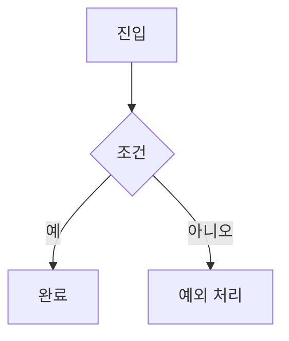

# /userflow-create

## 목적
정보구조(IA)를 입력으로 **핵심 과업별 사용자 플로우**를 설계한다. 진입 → 의사결정 → 완료까지의 경로와 분기, 예외 상태, 화면 전이를 정의해 화면설계의 직접 입력을 만든다.

## 실행 조건
- `/ia-create` 산출물(IA)이 존재한다.
- 핵심 과업(전환 목표) 목록이 식별되어 있다.

## 호출할 Subagent
- **ux-research-lead** (주담당) — 과업 분석·플로우 설계
- information-architecture-lead — IA 정합성
- ui-design-lead — 화면 전이 검토
- service-planning-lead — 비즈니스 규칙 반영

## 참조할 Gold Wiki 문서
- `../../GoldWiki/UX/UXStrategyFramework.md` — 과업/경험 원칙
- `../../GoldWiki/12_USER_FLOW.md` — 유저플로우 표기 규칙
- `../../GoldWiki/13_USER_JOURNEY.md` — 여정 연계
- `../../GoldWiki/UX/InformationArchitectureGuide.md` — IA 연결

## 입력값
- `$ARGUMENTS`: IA 산출물 경로 또는 프로젝트명
- 부가: 전환 목표, 비즈니스 규칙(권한·검증 등)

## 처리 절차
1. **과업 선정** — 가치/빈도 기준으로 핵심 과업을 선정한다.
2. **해피패스 설계** — 각 과업의 정상 흐름을 단계로 정의한다.
3. **분기/예외 설계** — 검증 실패·권한·빈 상태·오류 분기를 추가한다.
4. **상태 전이 명세** — 화면/상태 간 전이와 조건을 표로 정리한다.
5. **다이어그램화** — mermaid 플로우차트로 시각화한다.
6. **계측 포인트** — 전환 측정 이벤트(분석 트래킹)를 지정한다.

## 출력값
```markdown
# 사용자 플로우 — <프로젝트명>
## 1. 핵심 과업 목록
## 2. 과업별 플로우 (mermaid)

## 3. 상태 전이표 (화면·조건·결과)
## 4. 예외/빈/오류 처리
## 5. 전환 계측 이벤트
```

## 품질 기준
- [ ] 모든 핵심 과업에 해피패스와 예외 경로가 정의되었다.
- [ ] 모든 분기 조건이 명시적이다(암묵 분기 없음).
- [ ] 플로우가 IA의 화면/라우팅과 정합한다.
- [ ] 전환 계측 포인트가 지정되었다.
- [ ] DecisionLog가 갱신되었다.
- 통과 시 `/screenlist-create`로 인계한다.
