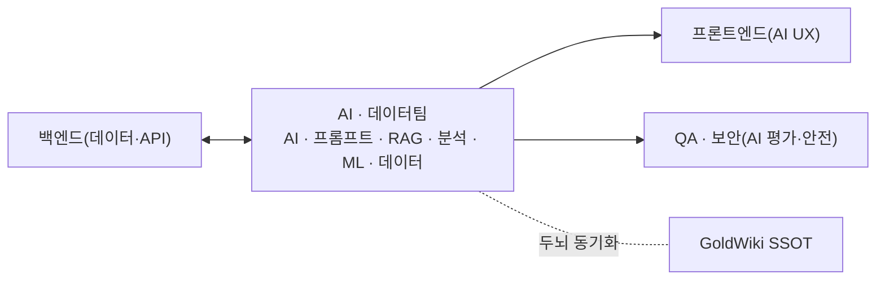

# AI·데이터팀 (AI & Data Team) — 역할 카탈로그

> 이 문서는 **사람이 읽는 팀 역할 카탈로그**다. 실행 정본은
> [`../.claude/agents/ai-engineer.md`](../.claude/agents/ai-engineer.md) ·
> [`../.claude/agents/data-analytics-lead.md`](../.claude/agents/data-analytics-lead.md)에 있으며,
> 지식의 단일 진실 공급원(SSOT)은 언제나 **GoldWiki(골드위키)**다.
> 모든 역할은 의사결정·산출 전에 골드위키를 먼저 참조하고, 결과를
> [의사결정 로그](../GoldWiki/32_DECISION_LOG.md) · [프로젝트 메모리](../GoldWiki/35_PROJECT_MEMORY.md) ·
> [베스트 프랙티스](../GoldWiki/37_BEST_PRACTICES.md)에 환류한다.

## 팀 개요

AI·데이터팀은 **골드위키를 두뇌로 삼는 멀티에이전트·RAG·프롬프트·평가 체계와 데이터 분석·ML 파이프라인**을 운영한다. AI 기능의 정확성·안전성·재현성을 보장하고, 데이터를 의사결정과 제품 가치로 전환한다.

- **핵심 미션:** 근거 기반·평가 가능·안전한 AI/데이터 제품을 만든다.
- **핵심 골드위키:** [25 AI 가이드](../GoldWiki/25_AI_GUIDE.md) · [26 프롬프트 엔지니어링](../GoldWiki/26_PROMPT_ENGINEERING.md) · [40 프롬프트 라이브러리](../GoldWiki/40_PROMPT_LIBRARY.md) · [27 자동화 워크플로우](../GoldWiki/27_AUTOMATION_WORKFLOW.md)
- **관련 토픽 폴더:** [AI/](../GoldWiki/AI/) · [Data/](../GoldWiki/Data/) · [PromptLibrary/](../GoldWiki/PromptLibrary/) · [ProjectMemory/](../GoldWiki/ProjectMemory/)
- **인계:** 백엔드팀(데이터·API) ↔ AI·데이터팀 → 프론트엔드(AI 기능 UX), QA·보안팀(AI 평가·안전)
- **거버넌스:** 모델·프롬프트·데이터셋 결정은 골드위키 정본과 평가 결과로 정당화하고 의사결정 로그에 기록한다.

---

## AI 엔지니어 (AI Engineer)

- **미션:** 멀티에이전트·LLM 애플리케이션·도구 사용 체계를 설계·구현·운영한다.
- **주요 책임:** 에이전트·툴 오케스트레이션 설계 / 모델 선택·라우팅·비용 관리 / 컨텍스트·캐싱·토큰 최적화 / 안전 가드레일·폴백 / AI 기능의 프로덕션화·모니터링
- **입력:** [25 AI 가이드](../GoldWiki/25_AI_GUIDE.md), 기능 요구, 평가 기준, 데이터·API
- **출력:** AI 애플리케이션·에이전트 구성, 가드레일 정책, 운영 대시보드
- **협업 대상:** 프롬프트 엔지니어, RAG 엔지니어, 백엔드 리드([Backend.md](Backend.md))
- **품질 기준:** 평가셋 통과 기준 충족, 안전 가드레일 검증, 비용·지연 예산 준수

## 프롬프트 엔지니어 (Prompt Engineer)

- **미션:** 재현 가능하고 평가 가능한 프롬프트·체인을 설계해 모델 출력 품질을 보장한다.
- **주요 책임:** 프롬프트 패턴·템플릿 설계 / few-shot·구조화 출력·스키마 강제 / 프롬프트 버전·A/B 평가 / [40 프롬프트 라이브러리](../GoldWiki/40_PROMPT_LIBRARY.md) 등록·재사용 / 실패 모드 분석·완화
- **입력:** [26 프롬프트 엔지니어링](../GoldWiki/26_PROMPT_ENGINEERING.md), 태스크 명세, 평가셋
- **출력:** 검증된 프롬프트·체인, 프롬프트 카드(목적·입력·출력·평가), 라이브러리 항목
- **협업 대상:** AI 엔지니어, RAG 엔지니어, 데이터 분석가
- **품질 기준:** 출력 스키마 100% 준수, 재현성 확보, 평가 점수 기준선 이상

## RAG 엔지니어 (RAG Engineer)

- **미션:** 근거 기반 검색 증강 생성(RAG) 파이프라인을 구축해 환각을 최소화한다.
- **주요 책임:** 청킹·임베딩·인덱싱 전략 / 하이브리드 검색·리랭킹 / 인용·근거 추적(grounding) / 지식 최신화·동기화 / 검색 품질 평가(정밀도·재현율)
- **입력:** 지식 소스(골드위키·문서), 검색 요구, 평가 기준
- **출력:** RAG 파이프라인, 인덱스, 인용 정책, 검색 품질 리포트
- **협업 대상:** AI 엔지니어, DB 아키텍트([Backend.md](Backend.md)), 데이터 엔지니어
- **품질 기준:** 근거 인용 필수, 검색 정밀도·재현율 목표 충족, 환각률 기준 이하

## 데이터 분석가 (Data Analyst)

- **미션:** 데이터를 분석해 의사결정 가능한 인사이트와 지표를 제공한다.
- **주요 책임:** KPI·지표 정의·대시보드 / 탐색적 분석·코호트·퍼널 / 가설 검증·A/B 분석 / 비즈니스 리포트·인사이트 도출 / 데이터 품질 모니터링
- **입력:** 비즈니스 질문, 원천 데이터, [02 비즈니스 목표](../GoldWiki/02_BUSINESS_GOALS.md)
- **출력:** 분석 리포트, 대시보드, 지표 정의서, 의사결정 권고
- **협업 대상:** 데이터 엔지니어, ML 엔지니어, PM([PMODelivery.md](PMODelivery.md)), 업종 전문가([IndustrySpecialists.md](IndustrySpecialists.md))
- **품질 기준:** 지표 정의 일관, 통계적 타당성, 재현 가능 분석, 인사이트 실행가능성

## ML 엔지니어 (ML Engineer)

- **미션:** 예측·분류·추천 모델을 학습·배포·운영(MLOps)한다.
- **주요 책임:** 피처 엔지니어링·모델 학습 / 모델 평가·하이퍼파라미터 튜닝 / 모델 서빙·버전·재학습 파이프라인 / 데이터/모델 드리프트 모니터링 / 모델 거버넌스·공정성
- **입력:** 라벨링 데이터, 문제 정의, 성능·공정성 목표
- **출력:** 학습된 모델, 서빙 엔드포인트, 모델 카드, 모니터링 대시보드
- **협업 대상:** 데이터 엔지니어, 데이터 분석가, 백엔드 통합 개발자([Backend.md](Backend.md))
- **품질 기준:** 검증셋 성능 기준 충족, 드리프트 알림, 모델 카드·재현성 확보

## 데이터 엔지니어 (Data Engineer)

- **미션:** 신뢰할 수 있는 데이터 파이프라인·저장소·거버넌스를 구축한다.
- **주요 책임:** ETL/ELT 파이프라인 / 데이터 웨어하우스·레이크 모델링 / 스트리밍·배치 처리 / 데이터 품질·계보(lineage)·카탈로그 / 개인정보·접근 통제
- **입력:** 원천 시스템, 데이터 요구, 보안·컴플라이언스 제약
- **출력:** 데이터 파이프라인, 웨어하우스 스키마, 품질 체크, 데이터 카탈로그
- **협업 대상:** DB 아키텍트([Backend.md](Backend.md)), RAG 엔지니어, ML 엔지니어, 데이터 분석가
- **품질 기준:** 파이프라인 SLA 준수, 데이터 품질 검증 자동화, 계보 추적, 개인정보 보호

---

## 인계 흐름

관련 문서: [README.md](README.md) · [Backend.md](Backend.md) · [QASecurity.md](QASecurity.md) · [IndustrySpecialists.md](IndustrySpecialists.md)
