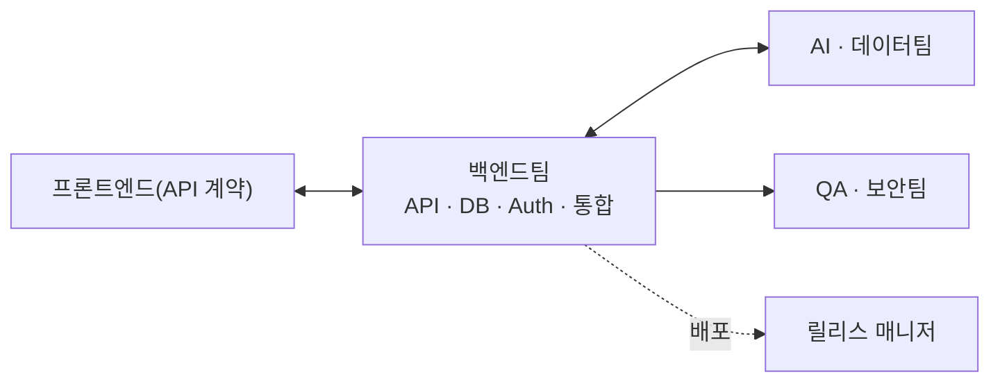

# 백엔드팀 (Backend Team) — 역할 카탈로그

> 이 문서는 **사람이 읽는 팀 역할 카탈로그**다. 실행 정본은
> [`../.claude/agents/backend-engineer.md`](../.claude/agents/backend-engineer.md) ·
> [`../.claude/agents/api-engineer.md`](../.claude/agents/api-engineer.md) ·
> [`../.claude/agents/database-architect.md`](../.claude/agents/database-architect.md)에 있으며,
> 지식의 단일 진실 공급원(SSOT)은 언제나 **GoldWiki(골드위키)**다.
> 모든 역할은 의사결정·산출 전에 골드위키를 먼저 참조하고, 결과를
> [의사결정 로그](../GoldWiki/32_DECISION_LOG.md) · [프로젝트 메모리](../GoldWiki/35_PROJECT_MEMORY.md) ·
> [베스트 프랙티스](../GoldWiki/37_BEST_PRACTICES.md)에 환류한다.

## 팀 개요

백엔드팀은 **신뢰할 수 있고 안전하며 관측 가능한 서버 사이드 시스템·API·데이터 계층**을 구축한다. 비즈니스 로직, 데이터 정합성, 인증·인가, 외부 통합, 확장성·가용성을 책임지며 프론트엔드·AI·데이터팀의 기반을 제공한다.

- **핵심 미션:** 계약 우선·보안 내재화·관측 가능한 백엔드를 구현한다.
- **핵심 골드위키:** [21 백엔드 가이드](../GoldWiki/21_BACKEND_GUIDE.md) · [22 API 표준](../GoldWiki/22_API_STANDARD.md) · [23 데이터베이스 가이드](../GoldWiki/23_DATABASE_GUIDE.md) · [24 보안 가이드](../GoldWiki/24_SECURITY_GUIDE.md)
- **관련 토픽 폴더:** [Backend/](../GoldWiki/Backend/) · [AI/](../GoldWiki/AI/) · [Data/](../GoldWiki/Data/)
- **인계:** 프론트엔드팀(API 계약) ↔ 백엔드팀 ↔ AI·데이터팀(데이터·추론), → QA·보안팀
- **거버넌스:** API 계약·스키마·보안 결정은 골드위키 정본을 따르고, 변경은 의사결정 로그에 기록한다.

---

## 백엔드 리드 (Backend Lead)

- **미션:** 백엔드 아키텍처·표준·품질·가용성을 총괄하고 핵심 기술 의사결정을 주도한다.
- **주요 책임:** 서비스 아키텍처(모놀리식/마이크로서비스) 설계 / 기술 스택·런타임·인프라 선정 / 비기능 요구(성능·가용성·확장성) 정의 / 코드·아키텍처 리뷰 / 인계·릴리스 게이트 판정
- **입력:** 비기능 요구사항, 도메인 모델, 통합 요구, 보안·컴플라이언스 제약
- **출력:** 백엔드 아키텍처 문서(ADR), 기술 표준, 용량 계획, 릴리스 판정
- **협업 대상:** 프론트엔드 리드([Frontend.md](Frontend.md)), 보안 엔지니어([QASecurity.md](QASecurity.md)), PMO([PMODelivery.md](PMODelivery.md))
- **품질 기준:** SLA/SLO 정의·충족, 아키텍처 결정 문서화, 단일 장애점 제거

## API 개발자 (API Developer)

- **미션:** 일관·안전·진화 가능한 계약 우선 API를 설계·구현한다.
- **주요 책임:** REST/GraphQL 계약 설계(OpenAPI) / 리소스·에러·페이지네이션 규약 / 버전 관리·하위 호환성 / 입력 검증·레이트리밋 / API 문서·SDK 제공
- **입력:** [22 API 표준](../GoldWiki/22_API_STANDARD.md), 도메인 모델, 프론트엔드 요구, 통합 요구
- **출력:** OpenAPI 계약, API 구현, 참조 문서, 변경 로그(SemVer)
- **협업 대상:** 프론트엔드-API 통합 개발자([Frontend.md](Frontend.md)), DB 아키텍트, 인증 개발자
- **품질 기준:** 계약-구현 일치, 하위 호환 보장, 4xx/5xx 규약 일관, 문서 최신화

## DB 아키텍트 (Database Architect)

- **미션:** 정확·고성능·진화 가능한 데이터 모델과 안전한 마이그레이션을 설계한다.
- **주요 책임:** 논리·물리 데이터 모델링 / 정규화·인덱스·파티셔닝 / 마이그레이션 전략(무중단) / 트랜잭션·정합성·동시성 / 쿼리 성능 튜닝·백업·복구
- **입력:** [23 데이터베이스 가이드](../GoldWiki/23_DATABASE_GUIDE.md), 도메인 요구, 데이터량·성능 목표
- **출력:** 데이터 모델(ERD), 마이그레이션 스크립트, 인덱스·튜닝 가이드, 백업 정책
- **협업 대상:** 백엔드 리드, API 개발자, 데이터 분석가·ML 엔지니어([AIData.md](AIData.md))
- **품질 기준:** 무손실 마이그레이션, 핵심 쿼리 응답 목표 충족, RPO/RTO 정의·검증

## 인증/인가 개발자 (AuthN/AuthZ Developer)

- **미션:** 표준 기반의 안전한 인증·인가·세션·계정 보안을 구현한다.
- **주요 책임:** OAuth2/OIDC/SAML·SSO 연동 / RBAC/ABAC 권한 모델 / 토큰·세션·MFA·비밀번호 정책 / 감사 로그·접근 통제 / 민감정보·시크릿 관리
- **입력:** [24 보안 가이드](../GoldWiki/24_SECURITY_GUIDE.md), 권한 요구, 컴플라이언스 요건
- **출력:** 인증·인가 모듈, 권한 매트릭스, 감사 로그 설계, 보안 정책 문서
- **협업 대상:** 보안 엔지니어([QASecurity.md](QASecurity.md)), API 개발자, 통합 개발자
- **품질 기준:** OWASP 인증·세션 항목 준수, 최소 권한 원칙, 감사 추적 완비, 시크릿 노출 0건

## 통합 개발자 (Integration Developer)

- **미션:** 외부 시스템·결제·메시징·레거시와의 안정적 통합을 구현한다.
- **주요 책임:** 외부 API·결제(PG)·메시징 연동 / 이벤트·큐·웹훅 아키텍처 / 멱등성·재시도·보상 트랜잭션(Saga) / 레거시 연동·ETL 인터페이스 / 통합 모니터링·서킷브레이커
- **입력:** 외부 시스템 명세, 통합 요구, SLA, 데이터 매핑
- **출력:** 통합 어댑터, 이벤트 스키마, 장애 대응 정책, 연동 테스트
- **협업 대상:** API 개발자, 데이터 엔지니어([AIData.md](AIData.md)), 업종 전문가([IndustrySpecialists.md](IndustrySpecialists.md))
- **품질 기준:** 멱등·정확히 1회 의미 보장, 외부 장애 격리, 재처리 가능, 통합 테스트 통과

## 플랫폼/DevOps 엔지니어 (Platform & DevOps Engineer)

- **미션:** 안전·반복·관측 가능한 CI/CD·인프라·운영 체계를 구축한다.
- **주요 책임:** CI/CD 파이프라인·IaC / 컨테이너·오케스트레이션·오토스케일 / 로깅·메트릭·트레이싱(관측성) / 무중단 배포·롤백 / 비용·용량·SLO 운영
- **입력:** [31 릴리스 프로세스](../GoldWiki/31_RELEASE_PROCESS.md), 인프라 요구, 가용성·비용 목표
- **출력:** CI/CD 파이프라인, IaC 코드, 대시보드·알림, 배포 런북
- **협업 대상:** 백엔드 리드, 보안 엔지니어([QASecurity.md](QASecurity.md)), 릴리스 매니저([PMODelivery.md](PMODelivery.md))
- **품질 기준:** 배포 자동화·즉시 롤백, 관측성 3종(로그·메트릭·트레이스) 완비, SLO 충족

---

## 인계 흐름

관련 문서: [README.md](README.md) · [Frontend.md](Frontend.md) · [AIData.md](AIData.md) · [QASecurity.md](QASecurity.md)
