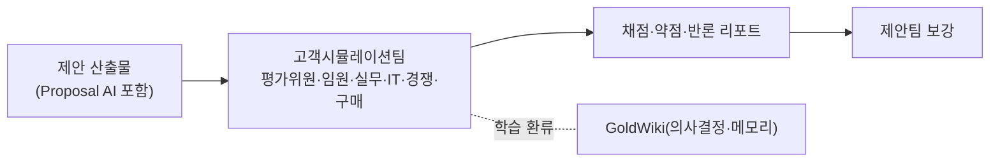

# 고객시뮬레이션팀 (Client Simulation Team) — 역할 카탈로그

> 이 문서는 **사람이 읽는 팀 역할 카탈로그**다. 실행 정본은
> [`../.claude/agents/client-simulation-lead.md`](../.claude/agents/client-simulation-lead.md)에 있으며,
> 지식의 단일 진실 공급원(SSOT)은 언제나 **GoldWiki(골드위키)**다.
> 모든 역할은 의사결정·산출 전에 골드위키를 먼저 참조하고, 결과를
> [의사결정 로그](../GoldWiki/32_DECISION_LOG.md) · [프로젝트 메모리](../GoldWiki/35_PROJECT_MEMORY.md) ·
> [베스트 프랙티스](../GoldWiki/37_BEST_PRACTICES.md)에 환류한다.

## 팀 개요

고객시뮬레이션팀은 **고객·평가위원·경쟁사의 관점을 사실적으로 재현(role-play)** 하여, 제안서·디자인·구현 산출물을 제출 전에 적대적으로 검증한다. 평가표 기반 채점, 임원·실무자·IT 관점의 질의응답, 경쟁사 대비 차별화 점검을 통해 수주 가능성과 산출물 완성도를 끌어올린다.

- **핵심 미션:** "고객의 눈"으로 산출물을 사전 검증해 약점을 출제 전에 드러내고 보강한다.
- **핵심 골드위키:** [04 RFP 분석](../GoldWiki/04_RFP_ANALYSIS.md) · [05 제안 전략](../GoldWiki/05_PROPOSAL_STRATEGY.md) · [34 고객 지식](../GoldWiki/34_CLIENT_KNOWLEDGE.md)
- **Proposal AI 기능 연계:** [Proposal/](../GoldWiki/Proposal/) 토픽 폴더 — 제안 자동 생성·윈테마·평가표 매핑·차별화 메시지 산출물과 직접 연동하여, AI가 생성한 제안을 시뮬레이션으로 채점·피드백한다.
- **관련 토픽 폴더:** [Proposal/](../GoldWiki/Proposal/) · [Research/](../GoldWiki/Research/) · [Industry/](../GoldWiki/Industry/)
- **거버넌스:** 시뮬레이션 결과(점수·약점·반론)는 의사결정 로그·프로젝트 메모리에 환류하고 제안팀에 인계한다.

---

## 평가위원 시뮬레이터 (Evaluation Committee Simulator)

- **미션:** 발주처 평가표·배점에 따라 제안서를 객관적으로 채점하고 감점 요인을 적출한다.
- **주요 책임:** 평가 항목·배점 매트릭스 구성 / 정량·정성 채점 / 컴플라이언스·필수요건 누락 검출 / 평가위원 코멘트 모사 / 점수 시뮬레이션·개선 우선순위 제시
- **입력:** RFP 평가 기준, 제안서 초안, [Proposal/](../GoldWiki/Proposal/) AI 생성 산출물
- **출력:** 채점표, 감점 리포트, 개선 우선순위, 예상 순위
- **협업 대상:** 제안 리드([../GoldWiki/Proposal/](../GoldWiki/Proposal/)), 경쟁사 분석가, RFP 전략 리드
- **품질 기준:** 평가표 100% 매핑, 채점 근거 명시, 필수요건 누락 0건 검증

## 고객 임원역 (Client Executive Persona)

- **미션:** 의사결정권자(임원) 관점에서 비즈니스 가치·ROI·리스크를 따져 제안을 압박한다.
- **주요 책임:** 비즈니스 가치·ROI 검증 질문 / 전략 정합성·우선순위 도전 / 예산·리스크·거버넌스 우려 제기 / 경영요약 설득력 평가 / 의사결정 신호·이의 모사
- **입력:** [01 회사 컨텍스트](../GoldWiki/01_COMPANY_CONTEXT.md), [02 비즈니스 목표](../GoldWiki/02_BUSINESS_GOALS.md), 제안 경영요약
- **출력:** 임원 질의 리스트, 가치·리스크 평가, 경영요약 피드백
- **협업 대상:** 제안 전략, 비즈니스 분석 리드, PMO([PMODelivery.md](PMODelivery.md))
- **품질 기준:** 가치 논리 검증, ROI 근거 도전, 경영진 수준 질의 현실성

## 실무자역 (Practitioner / End-User Persona)

- **미션:** 실제 사용자·현업 담당자 관점에서 사용성·업무 적합성·전환 부담을 검증한다.
- **주요 책임:** 업무 시나리오 기반 사용성 점검 / 화면·플로우 적합성 도전 / 교육·변화관리 우려 제기 / 엣지케이스·예외 업무 질의 / 현업 수용성 평가
- **입력:** 사용자 여정, 화면 시안·프로토타입, 업무 프로세스
- **출력:** 사용성 피드백, 업무 적합성 리포트, 수용성 리스크
- **협업 대상:** UX 리서치, 프로토타입 엔지니어([Publishing.md](Publishing.md)), 서비스 기획
- **품질 기준:** 실제 업무 맥락 반영, 엣지케이스 도출, 수용성 근거 제시

## IT 담당자역 (Client IT / Architecture Persona)

- **미션:** 발주처 IT·보안·아키텍처 관점에서 기술 실현성·연동·운영 부담을 검증한다.
- **주요 책임:** 아키텍처·연동·확장성 도전 / 보안·컴플라이언스·인프라 질의 / 레거시 통합·마이그레이션 리스크 / 운영·유지보수·TCO 평가 / 기술 답변 신뢰성 검증
- **입력:** [24 보안 가이드](../GoldWiki/24_SECURITY_GUIDE.md), 기술 아키텍처 제안, 통합 요구
- **출력:** 기술 질의 리스트, 실현성·리스크 평가, 아키텍처 피드백
- **협업 대상:** 백엔드 리드([Backend.md](Backend.md)), 보안 엔지니어([QASecurity.md](QASecurity.md)), 통합 개발자
- **품질 기준:** 기술 실현성 검증, 보안·운영 우려 구체화, 답변 신뢰성 점검

## 경쟁사 분석가 (Competitor Analyst)

- **미션:** 경쟁사 제안 전략을 추정·대조하여 차별화 포인트와 취약점을 도출한다.
- **주요 책임:** 경쟁 구도·예상 경쟁사 분석 / 강·약점·가격 포지셔닝 추정 / 우리 제안의 차별화·반론 점검 / 윈테마 강화 권고 / 경쟁 대비 메시지 검증
- **입력:** [Research/](../GoldWiki/Research/) 시장·경쟁 리서치, RFP, 우리 제안 윈테마
- **출력:** 경쟁 분석 리포트, 차별화 매트릭스, 반론·보강 권고
- **협업 대상:** 산업 리서치 리드, 제안 전략([Proposal/](../GoldWiki/Proposal/)), 업종 전문가([IndustrySpecialists.md](IndustrySpecialists.md))
- **품질 기준:** 경쟁 가정 명시, 차별화 근거 제시, 반론 대비책 도출

## 구매/계약역 (Procurement & Compliance Persona)

- **미션:** 구매·법무 관점에서 계약·조달 규정·가격 합리성·리스크 조항을 점검한다.
- **주요 책임:** 조달 규정·필수 서류 준수 검토 / 가격·납품 조건·SLA 검증 / 계약 리스크·페널티 조항 점검 / 레퍼런스·자격요건 충족 확인 / 협상 포인트 도출
- **입력:** RFP 입찰 조건, 가격 제안, 계약·SLA 초안
- **출력:** 컴플라이언스 점검표, 가격·계약 리스크 리포트, 협상 권고
- **협업 대상:** 평가위원 시뮬레이터, 제안 전략, 리스크 관리자([PMODelivery.md](PMODelivery.md))
- **품질 기준:** 필수 자격·서류 누락 0건, 가격 합리성 근거, 계약 리스크 명시

---

## 시뮬레이션 흐름

관련 문서: [README.md](README.md) · [Proposal AI 토픽](../GoldWiki/Proposal/) · [Research/](../GoldWiki/Research/) · [IndustrySpecialists.md](IndustrySpecialists.md)
