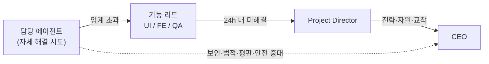
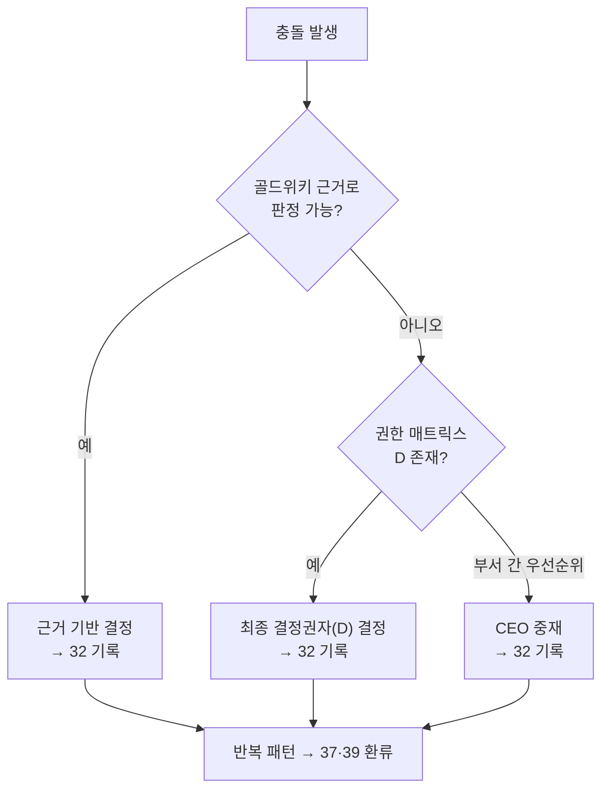

# ESCALATION_POLICY — 에스컬레이션 규칙 (ClubSchool AI OS v1.0)

> 문제·충돌·블로커를 적시에 올바른 권한자에게 올리는 규칙을 정의한다.
> 기본 경로는 **담당 에이전트 → 기능 리드 → Project Director → CEO**다.
> 권한 매트릭스는 [ORG_CHART.md](ORG_CHART.md), 게이트 정본은
> [27 자동화 워크플로우 §4](../GoldWiki/27_AUTOMATION_WORKFLOW.md)를 따른다.

## 1. 기본 원칙

1. **선(先) 자체 해결** — 담당 에이전트는 골드위키를 참조해 먼저 해결을 시도한다.
2. **빠른 가시화** — 임계치 초과 시 숨기지 않고 즉시 에스컬레이션한다.
3. **단계 건너뛰기 허용 조건** — 보안·법적·평판·안전 중대 사안은 중간 단계를 건너뛰어 CEO로 직행한다.
4. **기록 의무** — 모든 에스컬레이션과 그 해소 결과는 [의사결정 로그(32)](../GoldWiki/32_DECISION_LOG.md)에,
   롤백 사유는 [공통 오류(39)](../GoldWiki/39_COMMON_ERRORS.md)에 기록한다.

---

## 2. 에스컬레이션 트리거 조건

| 분류 | 트리거 조건 | 1차 대상 | 종점 |
|------|-------------|----------|------|
| **일정** | 단계 산출물이 계획 대비 2일 이상 지연 예상 | 기능 리드 → Project Director | CEO(과제 일정 위협 시) |
| **범위** | 합의 범위를 벗어난 요구(스코프 크립) 발견 | Project Director | CEO(계약 영향 시) |
| **품질 게이트** | 게이트 A/B/C 미통과 또는 DoD 미달 | Project Director | CEO(최종/평판 건) |
| **요구 충돌** | 요구사항 간 모순·상충 발견 | Business Analyst → Product Owner | Project Director |
| **디자인-구현 불일치** | 디자인 시스템과 구현 간 해소 불가 격차 | UI Designer(리드) → Project Director | — |
| **기술 교착** | 아키텍처·API·데이터 모델 합의 실패 | 기능 리드(FE) → Project Director | CEO(투자 필요 시) |
| **접근성** | WCAG 2.2 AA 미충족이 게이트 B를 막을 때 | Accessibility Specialist → Project Director | — |
| **보안 중대** | 심각도 High 이상 취약점·데이터 노출 위험 | Security Engineer → Project Director(+CEO 직행) | CEO |
| **법적·평판** | 계약·규정·평판 위험 | (직행) | CEO |
| **자원·우선순위 충돌** | 부서 간 에이전트·일정 경합 | Project Director | CEO |
| **거버넌스 위반** | 골드위키 미참조·지식 중복·미기록 결정 | Documentation Specialist → Project Director | CEO(재발 시) |
| **go/no-go 이견** | RFP 추격 판단 충돌 | Sales Director | CEO |

---

## 3. 단계별 에스컬레이션 경로

| 단계 | 1차(기능 리드) | 2차 | 3차(종점) |
|------|----------------|-----|-----------|
| 제안 단계(1–10) | Proposal Strategist / Sales Director | Project Director | CEO |
| 게이트 A | Project Director | CEO | CEO |
| 설계·디자인(11–17) | UI Designer(디자인 리드) | Project Director | CEO |
| 게이트 B | Project Director(+A11y) | CEO | CEO |
| 빌드(18–19) | Frontend Engineer(빌드 리드) | Project Director | CEO |
| QA·보안(20) | QA Engineer(플랫폼 리드) | Project Director | CEO |
| 게이트 C | Project Director(+QA·SEC) | CEO | CEO |
| 경영 요약·납품(21·최종) | Project Director | CEO | CEO |
| 지식·거버넌스(상시) | Documentation Specialist | Project Director | CEO |

---

## 4. SLA(응답·해소 목표)

> 영업일(working day) 기준. "응답"은 접수·분류, "해소"는 결정·조치 또는 다음 단계 에스컬레이션을 의미한다.

| 심각도 | 정의 | 응답 SLA | 해소·재에스컬레이션 SLA |
|--------|------|----------|--------------------------|
| **P1 긴급** | 보안 중대·법적·평판·납품 중단 위험 | 2시간 | 1영업일(미해소 시 즉시 CEO) |
| **P2 높음** | 게이트 차단·핵심 경로 블로커 | 4시간 | 1영업일 |
| **P3 보통** | 일정·범위·요구 충돌(우회 가능) | 1영업일 | 3영업일 |
| **P4 낮음** | 개선·문의·비차단 이슈 | 2영업일 | 5영업일 |

각 단계는 SLA 내 미해소 시 **자동으로 다음 권한자로 에스컬레이션**한다.
P1은 SLA·경로와 무관하게 발견 즉시 Project Director와 CEO에 동시 통보한다.

---

## 5. 충돌 해결 규칙

1. **데이터·근거 우선** — 의견 대립은 골드위키([36 레퍼런스](../GoldWiki/36_REFERENCE_LIBRARY.md),
   [37 베스트 프랙티스](../GoldWiki/37_BEST_PRACTICES.md))의 근거로 판정한다.
2. **권한 매트릭스 적용** — 근거로 결론이 나지 않으면 [ORG_CHART.md](ORG_CHART.md) §3의
   해당 결정 유형 **최종 결정권자(D)**가 결정한다.
3. **게이트 우선** — 품질·접근성·보안 게이트는 일정·범위보다 우선한다. 게이트 미통과 시 일정을 양보한다.
4. **부서 간 우선순위 충돌** — 자원·우선순위 경합의 최종 중재자는 **CEO**다.
5. **기록과 환류** — 모든 충돌 해결은 [의사결정 로그(32)](../GoldWiki/32_DECISION_LOG.md)에 결정·근거·반대의견을
   남기고, 반복되는 충돌 패턴은 [베스트 프랙티스(37)](../GoldWiki/37_BEST_PRACTICES.md)·
   [공통 오류(39)](../GoldWiki/39_COMMON_ERRORS.md)에 환류해 재발을 막는다.

> 모든 에스컬레이션·충돌 해결의 단일 진실 공급원은 골드위키다. 이 문서는 규칙을 정의하고,
> 실제 사례·결정은 골드위키 32·35·39에 누적한다.
