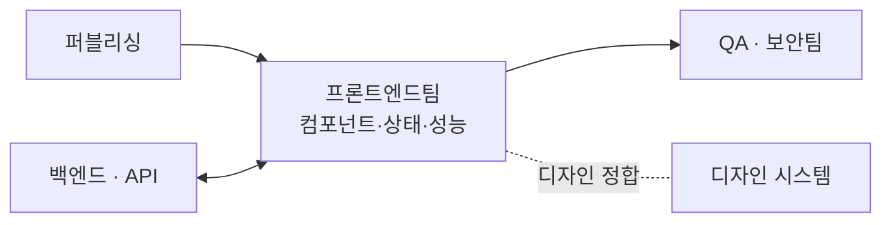

# 프론트엔드팀 (Frontend Team) — 역할 카탈로그

> 이 문서는 **사람이 읽는 팀 역할 카탈로그**다. 실행 정본은
> [`../.claude/agents/frontend-engineer.md`](../.claude/agents/frontend-engineer.md)에 있으며,
> 지식의 단일 진실 공급원(SSOT)은 언제나 **GoldWiki(골드위키)**다.
> 모든 역할은 의사결정·산출 전에 골드위키를 먼저 참조하고, 결과를
> [의사결정 로그](../GoldWiki/32_DECISION_LOG.md) · [프로젝트 메모리](../GoldWiki/35_PROJECT_MEMORY.md) ·
> [베스트 프랙티스](../GoldWiki/37_BEST_PRACTICES.md)에 환류한다.

## 팀 개요

프론트엔드팀은 **퍼블리싱 산출물과 디자인을 성능·접근성·유지보수성을 갖춘 프로덕션 UI 애플리케이션**으로 구현한다. 컴포넌트 아키텍처, 상태 관리, API 연동, 성능 최적화, 테스트 자동화를 통해 사용자에게 직접 닿는 제품 품질을 책임진다.

- **핵심 미션:** 디자인 충실도와 엔지니어링 품질을 모두 만족하는 프로덕션 프론트엔드를 출시한다.
- **핵심 골드위키:** [20 프론트엔드 가이드](../GoldWiki/20_FRONTEND_GUIDE.md) · [19 JS 가이드](../GoldWiki/19_JS_GUIDE.md) · [14 컴포넌트 라이브러리](../GoldWiki/14_COMPONENT_LIBRARY.md) · [16 접근성](../GoldWiki/16_ACCESSIBILITY.md) · [22 API 표준](../GoldWiki/22_API_STANDARD.md)
- **관련 토픽 폴더:** [Frontend/](../GoldWiki/Frontend/) · [Publishing/](../GoldWiki/Publishing/) · [DesignSystem/](../GoldWiki/DesignSystem/)
- **상위/하위 인계:** 퍼블리싱팀 → 프론트엔드팀 ↔ 백엔드팀(API), → QA·보안팀
- **거버넌스:** 컴포넌트·상태·성능 결정은 골드위키 정본을 따르고, 신규 패턴은 베스트 프랙티스·레퍼런스 라이브러리에 등록한다.

---

## 프론트엔드 리드 (Frontend Lead)

- **미션:** 프론트엔드 아키텍처·기술 표준·품질·일정을 총괄하고 기술 의사결정을 주도한다.
- **주요 책임:** 프레임워크·아키텍처·빌드 체인 선정 / 코딩 표준·리뷰 정책 정의 / 백엔드·디자인과 계약(API·토큰) 합의 / 기술 부채·리스크 관리 / 인계·릴리스 게이트 판정
- **입력:** 아키텍처 요구사항, 화면·컴포넌트 명세, API 계약, 성능·접근성 목표
- **출력:** 프론트엔드 아키텍처 문서, 기술 표준, 리뷰 결과, 릴리스 판정
- **협업 대상:** 백엔드 리드([Backend.md](Backend.md)), 디자인 시스템 리드, PMO([PMODelivery.md](PMODelivery.md)), QA 리드
- **품질 기준:** 아키텍처 결정 문서화(ADR), 핵심 지표(Core Web Vitals) 목표 달성, 리뷰 100% 적용

## 컴포넌트 개발자 (Component Developer)

- **미션:** 재사용 가능하고 접근성을 갖춘 UI 컴포넌트를 디자인 시스템에 정합하게 구현한다.
- **주요 책임:** 디자인 토큰 기반 컴포넌트 구현 / 컴포넌트 API(props) 설계 / Storybook 등 카탈로그 문서화 / 합성·variant·상태 관리 / 퍼블리싱 마크업의 컴포넌트화
- **입력:** [14 컴포넌트 라이브러리](../GoldWiki/14_COMPONENT_LIBRARY.md), 디자인 토큰, 퍼블리싱 마크업
- **출력:** 프로덕션 컴포넌트, Storybook 문서, 사용 가이드
- **협업 대상:** 퍼블리싱팀([Publishing.md](Publishing.md)), 디자인 시스템 리드, 테스트 개발자
- **품질 기준:** 토큰 100% 사용, a11y 속성 완비, 컴포넌트 단위 테스트 커버리지 ≥ 80%

## 상태 관리 개발자 (State Management Developer)

- **미션:** 예측 가능하고 디버깅 가능한 클라이언트 상태·데이터 흐름 아키텍처를 설계한다.
- **주요 책임:** 전역/지역 상태 전략 / 서버 상태 캐싱·동기화(데이터 페칭) / 폼·비동기·낙관적 업데이트 / 상태 정규화·불변성 / 라우팅·세션 상태 관리
- **입력:** 화면 흐름, API 계약, 데이터 모델, 인터랙션 명세
- **출력:** 상태 아키텍처 문서, 스토어/훅 구현, 데이터 페칭 레이어
- **협업 대상:** 컴포넌트 개발자, API 개발자([Backend.md](Backend.md)), 성능 엔지니어
- **품질 기준:** 단일 진실 상태원, 불필요 리렌더 최소화, 경합·스테일 상태 버그 0건

## 성능 엔지니어 (Performance Engineer)

- **미션:** 로딩·런타임·렌더 성능을 측정 기반으로 최적화해 Core Web Vitals를 달성한다.
- **주요 책임:** 번들 분석·코드 스플리팅·트리셰이킹 / 이미지·폰트·캐싱 전략 / 렌더 최적화(메모이제이션·가상화) / LCP/INP/CLS 측정·개선 / 성능 예산(budget) 운영
- **입력:** 성능 목표, 빌드 산출물, 측정 데이터(Lighthouse/RUM)
- **출력:** 성능 리포트, 최적화 패치, 성능 예산 정책
- **협업 대상:** 프론트엔드 리드, 반응형 엔지니어([Publishing.md](Publishing.md)), 성능 테스터([QASecurity.md](QASecurity.md))
- **품질 기준:** LCP < 2.5s, INP < 200ms, CLS < 0.1, 번들 예산 준수

## 테스트 개발자 (Frontend Test Developer)

- **미션:** 자동화 테스트로 프론트엔드 품질을 회귀 없이 보증한다.
- **주요 책임:** 단위·컴포넌트·통합·E2E 테스트 작성 / 테스트 전략·피라미드 정의 / 시각 회귀·접근성 자동 검사 / CI 통합·플래키 테스트 관리 / 커버리지 모니터링
- **입력:** [30 테스트 전략](../GoldWiki/30_TEST_STRATEGY.md), 컴포넌트·화면 명세, 인수 기준
- **출력:** 테스트 스위트, 커버리지 리포트, CI 게이트 설정
- **협업 대상:** 컴포넌트 개발자, QA 자동화 테스터([QASecurity.md](QASecurity.md)), 프론트엔드 리드
- **품질 기준:** 핵심 경로 E2E 커버, 커버리지 목표 달성, CI 그린, 플래키율 < 1%

## 프론트엔드-API 통합 개발자 (Frontend Integration Developer)

- **미션:** 백엔드 API를 안전하고 견고하게 연동해 데이터 계층의 신뢰성을 보장한다.
- **주요 책임:** API 클라이언트·타입 생성(스키마 기반) / 오류·로딩·재시도·타임아웃 처리 / 인증 토큰·세션 연동 / 목(mock)·계약 테스트 / 실시간(WebSocket/SSE) 연동
- **입력:** [22 API 표준](../GoldWiki/22_API_STANDARD.md), OpenAPI 계약, 인증 명세
- **출력:** 타입 안전 API 레이어, 오류 처리 정책, 연동 테스트
- **협업 대상:** API 개발자·인증 개발자([Backend.md](Backend.md)), 상태 관리 개발자
- **품질 기준:** 계약-구현 일치, 모든 오류 상태 UI 처리, 타입 안전성 보장

---

## 인계 흐름

관련 문서: [README.md](README.md) · [Publishing.md](Publishing.md) · [Backend.md](Backend.md) · [QASecurity.md](QASecurity.md)
