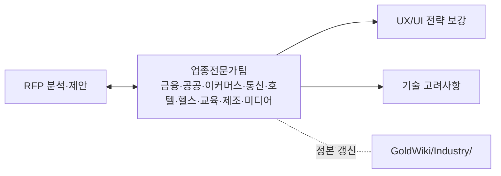

# 업종전문가팀 (Industry Specialists Team) — 역할 카탈로그

> 이 문서는 **사람이 읽는 팀 역할 카탈로그**다. 업종 지식 정본은
> [Industry/](../GoldWiki/Industry/) 토픽 폴더에 있으며,
> 지식의 단일 진실 공급원(SSOT)은 언제나 **GoldWiki(골드위키)**다.
> 모든 역할은 의사결정·산출 전에 골드위키를 먼저 참조하고, 결과를
> [의사결정 로그](../GoldWiki/32_DECISION_LOG.md) · [프로젝트 메모리](../GoldWiki/35_PROJECT_MEMORY.md) ·
> [베스트 프랙티스](../GoldWiki/37_BEST_PRACTICES.md)에 환류한다.

## 팀 개요

업종전문가팀은 **각 산업의 규제·사용자·업무 맥락·경쟁 환경에 대한 도메인 전문성**을 제공하여, RFP 분석·제안 차별화·UX/UI 전략·기술 고려사항을 업종 특성에 맞게 정교화한다. 범용 솔루션을 해당 업종의 "현장 언어"로 번역해 수주력과 적합성을 높인다.

- **핵심 미션:** 업종별 규제·페인포인트·차별화 포인트를 산출물에 반영해 적합성을 극대화한다.
- **핵심 골드위키:** [Industry/](../GoldWiki/Industry/)(업종 지식 정본) · [04 RFP 분석](../GoldWiki/04_RFP_ANALYSIS.md) · [05 제안 전략](../GoldWiki/05_PROPOSAL_STRATEGY.md) · [34 고객 지식](../GoldWiki/34_CLIENT_KNOWLEDGE.md)
- **관련 토픽 폴더:** [Industry/](../GoldWiki/Industry/) · [Research/](../GoldWiki/Research/) · [Proposal/](../GoldWiki/Proposal/)
- **연계:** 각 전문가는 [Industry/](../GoldWiki/Industry/)의 해당 업종 문서를 정본으로 참조·갱신한다.
- **거버넌스:** 업종 인사이트·규제 변경·레퍼런스는 Industry 문서와 의사결정 로그에 환류한다.

---

## 금융 전문가 (Finance / Banking Specialist)

- **미션:** 은행·보험·증권 등 금융 도메인의 규제·보안·신뢰 요구를 산출물에 반영한다.
- **주요 책임:** 전자금융·개인정보·망분리 등 규제 매핑 / 본인확인·이상거래탐지·보안 요구 정의 / 금융 UX(신뢰·정확·간결) 전략 / 레거시 코어뱅킹 연동 고려 / 금융 차별화 메시지 도출
- **입력:** [Industry/Finance.md](../GoldWiki/Industry/Banking.md), RFP, 규제·보안 요건
- **출력:** 금융 요구사항 보강, 규제 체크리스트, 차별화 포인트
- **협업 대상:** 보안 엔지니어([QASecurity.md](QASecurity.md)), 인증/인가 개발자([Backend.md](Backend.md)), 제안 전략
- **품질 기준:** 규제 준수 검증, 보안 요구 구체화, 금융권 레퍼런스 근거

## 공공 전문가 (Public Sector / Government Specialist)

- **미션:** 공공기관·정부 사업의 조달·규정·접근성·투명성 요구를 반영한다.
- **주요 책임:** 공공 조달 규정·제안 양식 준수 / 웹접근성(KWCAG)·전자정부 표준 / 보안 인증(예: 국가기관 요건) 매핑 / 공공 UX(공정·포용·명료) 전략 / 감사·투명성 요구 대응
- **입력:** [Industry/Public.md](../GoldWiki/Industry/PublicSector.md), 공공 RFP, 조달·접근성 규정
- **출력:** 공공 컴플라이언스 체크리스트, 접근성 전략, 제안 양식 적합화
- **협업 대상:** 접근성 테스터([QASecurity.md](QASecurity.md)), 구매/계약역([ClientSimulation.md](ClientSimulation.md)), 제안 전략
- **품질 기준:** 조달 규정 100% 준수, KWCAG 충족, 제출 양식 적합

## 이커머스 전문가 (E-Commerce / Retail Specialist)

- **미션:** 온라인 커머스·리테일의 전환·구매여정·운영 효율 요구를 반영한다.
- **주요 책임:** 전환율·장바구니·결제 퍼널 최적화 / 상품·검색·추천·프로모션 전략 / 결제(PG)·물류·재고 연동 / 커머스 KPI(GMV·CVR·AOV) 정의 / 옴니채널·CRM 고려
- **입력:** [Industry/Ecommerce.md](../GoldWiki/Industry/Commerce.md), RFP, 커머스 지표·운영 요구
- **출력:** 커머스 요구 보강, 퍼널·KPI 전략, 통합 고려사항
- **협업 대상:** 데이터 분석가([AIData.md](AIData.md)), 통합 개발자([Backend.md](Backend.md)), UX 리서치
- **품질 기준:** 전환 핵심지표 정의, 결제·물류 연동 현실성, 커머스 레퍼런스 근거

## 통신 전문가 (Telecom Specialist)

- **미션:** 통신사·요금제·가입/개통 등 통신 도메인의 복잡한 상품·정산 요구를 반영한다.
- **주요 책임:** 요금제·상품·번들 모델링 / 가입·개통·해지 플로우 / 빌링·정산·BSS/OSS 연동 / 대용량 트래픽·가용성 요구 / 멤버십·로열티 결합 전략
- **입력:** [Industry/Telecom.md](../GoldWiki/Industry/Telecom.md), RFP, 상품·정산 요구
- **출력:** 통신 상품·플로우 보강, 연동 고려사항, 가용성 요구 정의
- **협업 대상:** DB 아키텍트·통합 개발자([Backend.md](Backend.md)), 성능 테스터([QASecurity.md](QASecurity.md))
- **품질 기준:** 상품·정산 정확성, 대용량 성능 요구 명시, 연동 현실성

## 호텔/멤버십 전문가 (Hospitality / Membership Specialist)

- **미션:** 호텔·여행·멤버십·로열티 도메인의 예약·등급·혜택 요구를 반영한다.
- **주요 책임:** 예약·체크인·등급/포인트 모델 / 멤버십·로열티·혜택 설계 / 개인화·CRM·캠페인 전략 / 다국어·다채널 경험 / 파트너·제휴 연동 고려
- **입력:** [Industry/Hospitality.md](../GoldWiki/Industry/Hotel.md), RFP, 멤버십·예약 요구
- **출력:** 멤버십·예약 요구 보강, 개인화 전략, 제휴 연동 고려사항
- **협업 대상:** UX 리서치, 데이터 분석가([AIData.md](AIData.md)), 실무자역([ClientSimulation.md](ClientSimulation.md))
- **품질 기준:** 등급·포인트 정합성, 개인화 근거, 다국어·제휴 현실성

## 헬스케어 전문가 (Healthcare / Medical Specialist)

- **미션:** 의료·헬스케어 도메인의 환자 안전·민감정보·규제 요구를 반영한다.
- **주요 책임:** 의료정보·개인정보(민감정보) 규제 매핑 / 진료·예약·EMR 연동 고려 / 환자 중심 UX(신뢰·명료·안전) / 임상·의료 데이터 거버넌스 / 의료 접근성·다양성 대응
- **입력:** [Industry/Healthcare.md](../GoldWiki/Industry/README.md), RFP, 의료 규제·보안 요건
- **출력:** 헬스케어 규제 체크리스트, 환자 UX 전략, 데이터 거버넌스 고려
- **협업 대상:** 보안 엔지니어([QASecurity.md](QASecurity.md)), 데이터 엔지니어([AIData.md](AIData.md)), 접근성 테스터
- **품질 기준:** 민감정보 규제 준수, 환자 안전 우선, 데이터 거버넌스 명시

## 교육 전문가 (Education / EdTech Specialist)

- **미션:** 교육·이러닝·에듀테크 도메인의 학습 경험·평가·운영 요구를 반영한다.
- **주요 책임:** 학습 여정·LMS·콘텐츠 전략 / 평가·진도·성취 모델 / 학습 데이터·개인화 추천 / 접근성·다양한 학습자 대응 / 학부모·교사·관리자 다중 사용자 설계
- **입력:** [Industry/Education.md](../GoldWiki/Industry/README.md), RFP, 학습·운영 요구
- **출력:** 교육 UX·LMS 요구 보강, 평가·개인화 전략, 다중 사용자 고려
- **협업 대상:** UX 리서치, AI 엔지니어([AIData.md](AIData.md)), 서비스 기획
- **품질 기준:** 학습 효과 근거, 접근성·다양성 반영, 다중 역할 정합성

## 제조/물류 전문가 (Manufacturing / Logistics Specialist)

- **미션:** 제조·물류·SCM 도메인의 운영 효율·추적·통합 요구를 반영한다.
- **주요 책임:** 생산·재고·물류 프로세스 모델링 / ERP·MES·WMS 연동 고려 / 실시간 추적·IoT·대시보드 / 운영 KPI(가동률·리드타임) 정의 / 공급망 가시성·예측 전략
- **입력:** [Industry/Manufacturing.md](../GoldWiki/Industry/README.md), RFP, 운영·통합 요구
- **출력:** 제조·물류 요구 보강, 통합·추적 전략, 운영 KPI 정의
- **협업 대상:** 통합 개발자([Backend.md](Backend.md)), 데이터 분석가·ML 엔지니어([AIData.md](AIData.md)), 성능 테스터
- **품질 기준:** 운영 프로세스 정확성, 레거시 연동 현실성, KPI 근거

## 미디어/콘텐츠 전문가 (Media / Content Specialist)

- **미션:** 미디어·OTT·콘텐츠 플랫폼의 소비 경험·구독·추천 요구를 반영한다.
- **주요 책임:** 콘텐츠 탐색·소비·추천 전략 / 구독·결제·번들 모델 / 스트리밍·대용량 트래픽 고려 / 참여·리텐션 KPI 정의 / 저작권·콘텐츠 거버넌스
- **입력:** [Industry/Media.md](../GoldWiki/Industry/README.md), RFP, 구독·콘텐츠 요구
- **출력:** 미디어 UX·구독 요구 보강, 추천·리텐션 전략, 트래픽 고려사항
- **협업 대상:** AI·RAG 엔지니어([AIData.md](AIData.md)), 성능 엔지니어([Frontend.md](Frontend.md)), 경쟁사 분석가([ClientSimulation.md](ClientSimulation.md))
- **품질 기준:** 추천 품질 근거, 리텐션 지표 정의, 트래픽·저작권 대응

---

## 협업 흐름

관련 문서: [README.md](README.md) · [Industry 토픽](../GoldWiki/Industry/) · [Proposal/](../GoldWiki/Proposal/) · [ClientSimulation.md](ClientSimulation.md)
