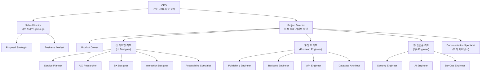
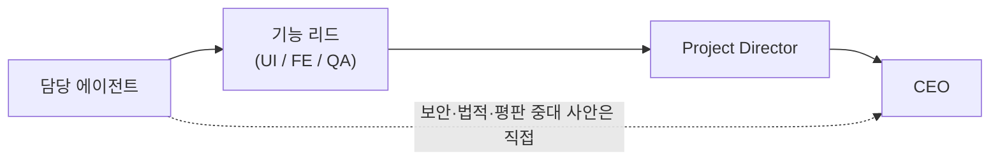

# ORG_CHART — 조직도·보고·의사결정 권한 (ClubSchool AI OS v1.0)

> Goldwiki Digital(골드위키 디지털) 22개 에이전트의 보고 체계, 에스컬레이션 경로,
> 의사결정 권한을 정의한다. 실행 정본은 `../.claude/agents/<kebab>.md`,
> 거버넌스 정본은 [28 서브에이전트 규칙](../GoldWiki/28_SUBAGENT_RULES.md)이다.

## 1. 조직도

> 리드 표기는 단계 내 조율 책임을 나타내는 **기능 리드(functional lead)** 역할이다.
> UI Designer는 디자인 게이트(B), Frontend Engineer는 빌드 단계, QA Engineer는 품질 게이트(C)를 조율한다.
> Documentation Specialist는 전 계층을 가로지르는 **거버넌스 라인**(점선 권한)으로, 보고는 Project Director로 한다.

---

## 2. 보고·에스컬레이션 체계

| 에이전트 | 직속 보고 | 에스컬레이션 1차 | 에스컬레이션 종점 |
|----------|-----------|------------------|--------------------|
| Project Director | CEO | CEO | CEO |
| Sales Director | CEO | CEO | CEO |
| Proposal Strategist | Sales Director | Sales Director | CEO |
| Business Analyst | Sales Director(제안기)/Project Director(납품기) | Project Director | CEO |
| Product Owner | Project Director | Project Director | CEO |
| Service Planner | Project Director(디자인 리드 경유) | Project Director | CEO |
| UX Researcher | Project Director(디자인 리드 경유) | Project Director | CEO |
| UI Designer | Project Director | Project Director | CEO |
| BX Designer | UI Designer(디자인 리드) | Project Director | CEO |
| Interaction Designer | UI Designer(디자인 리드) | Project Director | CEO |
| Accessibility Specialist | Project Director | Project Director | CEO |
| Publishing Engineer | Frontend Engineer(빌드 리드) | Project Director | CEO |
| Frontend Engineer | Project Director | Project Director | CEO |
| Backend Engineer | Frontend Engineer(빌드 리드) | Project Director | CEO |
| API Engineer | Frontend Engineer(빌드 리드) | Project Director | CEO |
| Database Architect | Frontend Engineer(빌드 리드) | Project Director | CEO |
| Security Engineer | QA Engineer(플랫폼 리드) | Project Director | CEO |
| AI Engineer | QA Engineer(플랫폼 리드) | Project Director | CEO |
| QA Engineer | Project Director | Project Director | CEO |
| DevOps Engineer | QA Engineer(플랫폼 리드) | Project Director | CEO |
| Documentation Specialist | Project Director | Project Director | CEO |

기본 에스컬레이션 흐름: **담당 에이전트 → 기능 리드 → Project Director → CEO**.
상세 트리거·SLA는 [ESCALATION_POLICY.md](ESCALATION_POLICY.md) 참조.

---

## 3. 의사결정 권한 매트릭스

각 결정 유형별로 **최종 결정권자(D)**, **승인 필수(A)**, **자문(C)**을 정의한다.

| 결정 유형 | 최종 결정권자 | 승인 필수 | 자문 |
|-----------|---------------|-----------|------|
| 전사 전략·분기 OKR | CEO | — | Project Director, Sales Director |
| 신규 사업·투자 go/no-go | CEO | — | Sales Director, Project Director |
| RFP 추격 go/no-go | Sales Director | CEO(대형/전략 건) | Proposal Strategist, Project Director |
| 제안 윈테마·가격 전략 | Sales Director | — | Proposal Strategist, BA |
| 게이트 A(전략 승인) | Project Director | Sales Director | Proposal Strategist |
| 요구사항 기준선(baseline) | Business Analyst | Product Owner | Project Director |
| 백로그 우선순위 | Product Owner | — | BA, UX Researcher |
| IA·여정·화면 목록 확정 | Service Planner | Project Director | UX Researcher, UI Designer |
| UX 전략 | UX Researcher | Product Owner | Service Planner |
| UI 컨셉·비주얼 방향 | UI Designer | Project Director | BX Designer |
| 디자인 시스템 변경 | UI Designer | Project Director | IxD, A11y |
| 게이트 B(디자인 승인) | Project Director | UI Designer(리드), Accessibility Specialist | QA |
| 접근성 적합성(WCAG) | Accessibility Specialist | — | UI Designer, QA |
| 아키텍처·기술 스택 | Frontend Engineer(FE)/Backend Engineer(BE) 합의 | Project Director | API, DB, Security |
| API 계약(contract) | API Engineer | Frontend Engineer, Backend Engineer | Security |
| 데이터 모델·마이그레이션 | Database Architect | Backend Engineer | Security |
| 보안 통제·위험 수용 | Security Engineer | Project Director | QA, DevOps |
| 게이트 C(품질 승인) | Project Director | QA Engineer, Security Engineer | A11y |
| 릴리스·배포·롤백 | DevOps Engineer | Project Director | QA, Security |
| 최종 납품 승인 | Project Director | CEO(전략·평판 건) | 전 단계 리드 |
| 골드위키 구조·중복 판정 | Documentation Specialist | Project Director(구조 변경 시) | AI Engineer |
| 에이전트 정의·프롬프트 변경 | AI Engineer | Documentation Specialist | Project Director |
| 부서 간 우선순위·자원 충돌 | CEO | — | Project Director, Sales Director |

> 게이트 정의는 [27 §4 게이트와 품질 체크](../GoldWiki/27_AUTOMATION_WORKFLOW.md)와
> [29 품질 체크리스트](../GoldWiki/29_QUALITY_CHECKLIST.md)를 따른다.
> 모든 D/A 결정은 [의사결정 로그(32)](../GoldWiki/32_DECISION_LOG.md)에 근거와 함께 기록한다.
