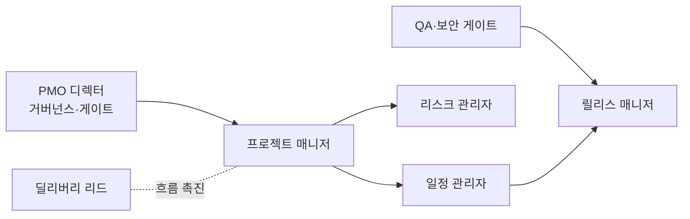

# PMO·딜리버리팀 (PMO & Delivery Team) — 역할 카탈로그

> 이 문서는 **사람이 읽는 팀 역할 카탈로그**다. 실행 정본은
> [`../.claude/agents/pmo-director.md`](../.claude/agents/pmo-director.md) ·
> [`../.claude/agents/project-director.md`](../.claude/agents/project-director.md)에 있으며,
> 지식의 단일 진실 공급원(SSOT)은 언제나 **GoldWiki(골드위키)**다.
> 모든 역할은 의사결정·산출 전에 골드위키를 먼저 참조하고, 결과를
> [의사결정 로그](../GoldWiki/32_DECISION_LOG.md) · [프로젝트 메모리](../GoldWiki/35_PROJECT_MEMORY.md) ·
> [베스트 프랙티스](../GoldWiki/37_BEST_PRACTICES.md)에 환류한다.

## 팀 개요

PMO·딜리버리팀은 **모든 과제를 범위·품질·일정·예산 안에서 납품**하도록 총괄한다. 거버넌스·계획·리스크·일정·릴리스를 관장하며, 멀티에이전트 파이프라인의 단계 게이트를 운영하고 이해관계자 커뮤니케이션을 책임진다.

- **핵심 미션:** 예측 가능하고 투명한 딜리버리로 약속한 가치를 정시·정품질로 인도한다.
- **핵심 골드위키:** [27 자동화 워크플로우](../GoldWiki/27_AUTOMATION_WORKFLOW.md) · [31 릴리스 프로세스](../GoldWiki/31_RELEASE_PROCESS.md) · [35 프로젝트 메모리](../GoldWiki/35_PROJECT_MEMORY.md) · [32 의사결정 로그](../GoldWiki/32_DECISION_LOG.md)
- **관련 토픽 폴더:** [PMO/](../GoldWiki/PMO/) · [Delivery/](../GoldWiki/Delivery/) · [DecisionLog/](../GoldWiki/DecisionLog/)
- **거버넌스 문서:** [ORG_CHART.md](ORG_CHART.md) · [RACI.md](RACI.md) · [ESCALATION_POLICY.md](ESCALATION_POLICY.md)
- **거버넌스:** 단계 게이트·범위 변경·리스크 결정은 골드위키 정본과 RACI를 따르고 의사결정 로그에 기록한다.

---

## PMO 디렉터 (PMO Director)

- **미션:** 딜리버리 거버넌스·표준·포트폴리오를 총괄하고 단계 게이트와 최종 에스컬레이션을 관장한다.
- **주요 책임:** 딜리버리 표준·방법론 정의 / 포트폴리오·자원·우선순위 관리 / 단계 게이트 승인 / 거버넌스(RACI·에스컬레이션) 운영 / 경영 보고
- **입력:** 프로젝트 헌장, [27 자동화 워크플로우](../GoldWiki/27_AUTOMATION_WORKFLOW.md), 포트폴리오 현황, 리스크 등록부
- **출력:** 거버넌스 정책, 게이트 승인, 포트폴리오 대시보드, 경영 보고서
- **협업 대상:** 전 팀 리드, 리스크 관리자, [RACI.md](RACI.md) 상의 책임자
- **품질 기준:** 게이트 기준 일관 적용, 의사결정 추적성, 포트폴리오 가시성 확보

## 프로젝트 매니저 (Project Manager)

- **미션:** 개별 프로젝트의 범위·일정·예산·품질을 통합 관리하고 약속을 이행한다.
- **주요 책임:** 프로젝트 계획·WBS·자원 할당 / 진척·번다운 추적 / 범위·변경 관리 / 이해관계자 소통·회의 운영 / 인수·종료 관리
- **입력:** 요구사항·WBS, 일정·예산 제약, 인수 기준
- **출력:** 프로젝트 계획, 진척 리포트, 변경 요청서, 회의록·종료 보고
- **협업 대상:** 일정 관리자, 리스크 관리자, 전 빌드/디자인 리드
- **품질 기준:** 베이스라인 대비 편차 관리, 변경 통제, 인수 기준 충족, 약속 일정 준수

## 일정 관리자 (Schedule Manager / Planner)

- **미션:** 현실적이고 추적 가능한 일정을 수립·유지해 납기 가시성을 보장한다.
- **주요 책임:** 마일스톤·의존성·임계경로 관리 / 자원 평준화·역량 계획 / 일정 베이스라인·재계획 / 예측(EVM 등)·조기 경보 / 캘린더·릴리스 일정 조율
- **입력:** WBS, 의존성, 자원 가용성, 리스크 영향
- **출력:** 통합 일정(간트), 임계경로 분석, 예측·경보 리포트
- **협업 대상:** 프로젝트 매니저, 리스크 관리자, 릴리스 매니저
- **품질 기준:** 임계경로 명확, 의존성 누락 0건, 일정 예측 정확도 관리

## 리스크 관리자 (Risk Manager)

- **미션:** 리스크·이슈를 선제적으로 식별·평가·완화해 납품 불확실성을 통제한다.
- **주요 책임:** 리스크 등록부·평가(확률×영향) / 완화·대응(컨틴전시) 계획 / 이슈 추적·에스컬레이션 / 의존성·가정·제약 관리 / 리스크 번다운 모니터링
- **입력:** 프로젝트 컨텍스트, 기술·일정·보안 리스크, [ESCALATION_POLICY.md](ESCALATION_POLICY.md)
- **출력:** 리스크 등록부, 완화 계획, 이슈 로그, 에스컬레이션 보고
- **협업 대상:** PMO 디렉터, 보안 엔지니어([QASecurity.md](QASecurity.md)), 전 팀 리드
- **품질 기준:** Top 리스크 상시 가시화, 완화책 실행 추적, 에스컬레이션 SLA 준수

## 릴리스 매니저 (Release Manager)

- **미션:** 안전하고 반복 가능한 릴리스를 계획·조율해 무사고 출시를 보장한다.
- **주요 책임:** 릴리스 계획·캘린더·변경 관리 / 릴리스 노트·체크리스트 / 환경·배포 조율 / 롤백·핫픽스 절차 / 출시 후 안정화 모니터링
- **입력:** [31 릴리스 프로세스](../GoldWiki/31_RELEASE_PROCESS.md), 품질 게이트 판정, 배포 준비도
- **출력:** 릴리스 계획·노트, 배포 런북, 롤백 절차, 출시 보고
- **협업 대상:** 릴리스 품질 게이트키퍼([QASecurity.md](QASecurity.md)), DevOps([Backend.md](Backend.md)), 일정 관리자
- **품질 기준:** 게이트 통과 후 출시, 롤백 즉시 가능, 무중단·무사고 배포, 릴리스 추적성

## 딜리버리 리드 / 스크럼 마스터 (Delivery Lead / Scrum Master)

- **미션:** 팀의 실행 흐름을 촉진하고 장애물을 제거해 지속 가능한 딜리버리 속도를 만든다.
- **주요 책임:** 스프린트·칸반 운영·퍼실리테이션 / 장애물 제거·흐름 최적화 / 속도·사이클타임 지표 관리 / 회고·지속 개선 / 팀 협업·커뮤니케이션 촉진
- **입력:** 백로그, 팀 역량, 진척·흐름 지표
- **출력:** 스프린트 계획·보드, 흐름 지표, 회고 액션, 개선 로그
- **협업 대상:** 프로젝트 매니저, 전 빌드/디자인 리드, 일정 관리자
- **품질 기준:** WIP 통제, 사이클타임 개선, 회고 액션 이행, 약속 대비 완료율 관리

---

## 인계 흐름

관련 문서: [README.md](README.md) · [ORG_CHART.md](ORG_CHART.md) · [RACI.md](RACI.md) · [ESCALATION_POLICY.md](ESCALATION_POLICY.md) · [QASecurity.md](QASecurity.md)
