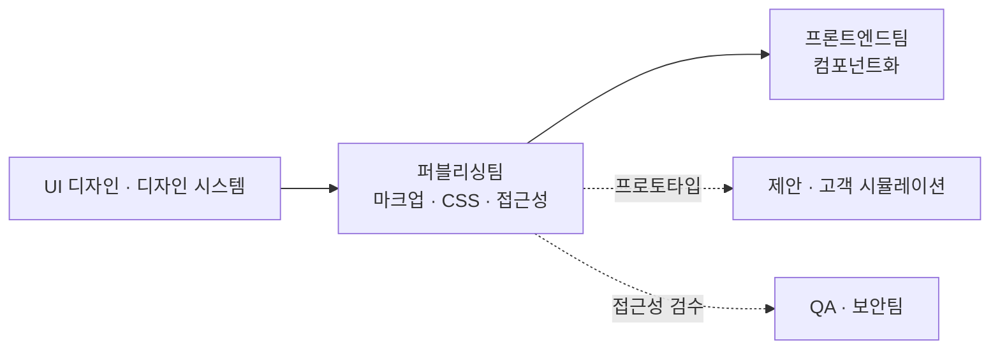

# 퍼블리싱팀 (Publishing Team) — 역할 카탈로그

> 이 문서는 **사람이 읽는 팀 역할 카탈로그**다. 실행 정본(에이전트 프롬프트)은
> [`../.claude/agents/publishing-engineer.md`](../.claude/agents/publishing-engineer.md)에 있으며,
> 지식의 단일 진실 공급원(SSOT)은 언제나 **GoldWiki(골드위키)**다.
> 모든 역할은 의사결정·산출 전에 골드위키를 먼저 참조하고, 결과를
> [의사결정 로그](../GoldWiki/32_DECISION_LOG.md) · [프로젝트 메모리](../GoldWiki/35_PROJECT_MEMORY.md) ·
> [베스트 프랙티스](../GoldWiki/37_BEST_PRACTICES.md)에 환류한다.

## 팀 개요

퍼블리싱팀은 **확정된 디자인(시안·디자인 시스템·토큰)을 시맨틱하고 접근성을 갖춘 정적 마크업(HTML/CSS)으로 변환**하여, 프론트엔드 개발팀이 프로덕션 컴포넌트로 끌어올릴 수 있는 견고한 기반 산출물을 만든다. 디자인과 개발 사이의 "번역 계층"으로서, 시각적 충실도(pixel fidelity)·시맨틱 구조·반응형·접근성·성능을 동시에 책임진다.

- **핵심 미션:** 디자인 의도를 손실 없이, 표준을 준수한 마크업으로 구현한다.
- **핵심 골드위키:** [17 HTML 가이드](../GoldWiki/17_HTML_GUIDE.md) · [18 CSS 가이드](../GoldWiki/18_CSS_GUIDE.md) · [15 디자인 토큰](../GoldWiki/15_DESIGN_TOKEN.md) · [14 컴포넌트 라이브러리](../GoldWiki/14_COMPONENT_LIBRARY.md) · [16 접근성](../GoldWiki/16_ACCESSIBILITY.md)
- **관련 토픽 폴더:** [Publishing/HTMLCSSGuide.md](../GoldWiki/Publishing/HTMLCSSGuide.md) · [DesignSystem/](../GoldWiki/DesignSystem/) · [UI/](../GoldWiki/UI/)
- **상위 인계:** UI 디자이너·디자인 시스템 리드 → 퍼블리싱팀 → 프론트엔드팀
- **거버넌스:** 모든 마크업 컨벤션·토큰 매핑·접근성 결정은 골드위키 정본을 따르고, 신규 패턴은 베스트 프랙티스에 등록한다.

---

## 퍼블리싱 리드 (Publishing Lead)

- **미션:** 퍼블리싱 산출물의 품질·일정·표준 준수를 총괄하고, 디자인-개발 간 인계 게이트를 판정한다.
- **주요 책임:** 마크업 컨벤션·폴더 구조·네이밍 규칙 정의 / 작업 분배와 코드 리뷰 / 디자인 시스템 리드와 토큰 합의 / 프론트엔드 인계 기준(handoff DoD) 확정 / 품질 게이트 통과 판정
- **입력:** 확정 디자인 시안, 화면 목록, 디자인 토큰, 컴포넌트 명세, 일정·범위
- **출력:** 퍼블리싱 가이드라인, 작업 분배 계획, 리뷰 결과, 인계 패키지(마크업 + 사용 설명)
- **협업 대상:** UI 디자인 리드, 디자인 시스템 리드, 프론트엔드 리드([Frontend.md](Frontend.md)), 접근성 테스터([QASecurity.md](QASecurity.md))
- **품질 기준:** W3C 검증 통과, 디자인 100% 반영, 접근성 WCAG 2.2 AA, 인계 시 미해결 결함 0건

## 마크업 개발자 (Markup Developer)

- **미션:** 의미론적으로 정확하고 검증을 통과하는 시맨틱 HTML 구조를 작성한다.
- **주요 책임:** 시맨틱 태그·랜드마크·헤딩 위계 구성 / 폼·테이블·리스트 등 구조적 마크업 / 디자인 화면별 페이지 골격 작성 / [17 HTML 가이드](../GoldWiki/17_HTML_GUIDE.md) 컨벤션 준수 / 재사용 가능한 마크업 패턴화
- **입력:** 화면 시안, IA·콘텐츠 구조, 컴포넌트 명세
- **출력:** 시맨틱 HTML 파일, 마크업 패턴 스니펫
- **협업 대상:** CSS 아키텍트, 접근성 퍼블리셔, UI 디자이너
- **품질 기준:** HTML 검증 0 오류, 헤딩 위계 논리적, 랜드마크 완비, div 남용 금지(non-semantic 최소화)

## CSS 아키텍트 (CSS Architect)

- **미션:** 확장 가능하고 유지보수성 높은 스타일 아키텍처를 설계하고 디자인 토큰을 코드로 연결한다.
- **주요 책임:** CSS 방법론(BEM/유틸리티/레이어) 정의 / 디자인 토큰 → CSS 커스텀 프로퍼티 매핑 / 반응형 그리드·레이아웃 시스템 / 다크모드·테마 변수 구조 / 스타일 중복 제거와 토큰 거버넌스
- **입력:** [15 디자인 토큰](../GoldWiki/15_DESIGN_TOKEN.md), 시안 스펙, 브레이크포인트 정책
- **출력:** CSS 아키텍처 문서, 토큰 변수 파일, 레이아웃 시스템, 스타일 가이드
- **협업 대상:** 디자인 시스템 리드, 마크업 개발자, 프론트엔드 컴포넌트 개발자
- **품질 기준:** 하드코딩 색상·치수 0건(전부 토큰), 반응형 모든 브레이크포인트 검증, 스펙 대비 시각 회귀 없음

## 접근성 퍼블리셔 (Accessibility Publisher)

- **미션:** 마크업 단계에서 WCAG 2.2 AA를 내재화(Shift-Left)해 모든 사용자에게 동등 접근을 보장한다.
- **주요 책임:** ARIA 역할·속성·라이브 영역 적용 / 키보드 내비게이션·포커스 순서 보장 / 명도 대비·대체 텍스트 검수 / 스크린리더 검증(NVDA/VoiceOver) / 접근성 결함 수정 가이드
- **입력:** [16 접근성](../GoldWiki/16_ACCESSIBILITY.md), 마크업 산출물, 인터랙션 명세
- **출력:** 접근성 적용 마크업, 검수 리포트, 수정 권고
- **협업 대상:** 마크업 개발자, 접근성 테스터([QASecurity.md](QASecurity.md)), UI 디자이너
- **품질 기준:** WCAG 2.2 AA 100%, 키보드 only 전 기능 도달, axe-core 위반 0건

## 프로토타입 엔지니어 (Prototype Engineer)

- **미션:** 인터랙션·전환·모션이 살아있는 동작형 정적 프로토타입을 신속히 제작해 제안·검증에 활용한다.
- **주요 책임:** 바닐라 JS 기반 인터랙션(탭/모달/아코디언 등) 구현 / CSS 트랜지션·애니메이션 / 클릭 가능한 데모 빌드 / 제안 발표용 시연 프로토타입 / 가벼운 호스팅·공유
- **입력:** 인터랙션 디자인 명세, 시안, [Proposal AI 기능 문서](../GoldWiki/Proposal/) 요구
- **출력:** 동작형 HTML 프로토타입, 데모 링크, 인터랙션 데모 스크립트
- **협업 대상:** 인터랙션 디자이너, 제안팀, 고객 시뮬레이션팀([ClientSimulation.md](ClientSimulation.md))
- **품질 기준:** 주요 시나리오 끊김 없는 시연, 60fps 모션, 모바일/데스크톱 동작 일치

## 반응형/크로스브라우저 엔지니어 (Responsive & Cross-Browser Engineer)

- **미션:** 다양한 기기·브라우저·뷰포트에서 일관된 렌더링과 성능을 보장한다.
- **주요 책임:** 브레이크포인트별 레이아웃 검증 / 크로스브라우저 호환성(Chrome/Safari/Firefox/Edge) / 폴리필·프로그레시브 인핸스먼트 / 마크업 성능(이미지·폰트·CLS) 최적화 / 디바이스 매트릭스 관리
- **입력:** 반응형 정책, 지원 브라우저 매트릭스, 마크업·CSS 산출물
- **출력:** 호환성 리포트, 성능 개선 패치, 디바이스 검증 결과
- **협업 대상:** CSS 아키텍트, 성능 엔지니어([Frontend.md](Frontend.md)), QA 자동화 테스터
- **품질 기준:** 지원 매트릭스 전 통과, Lighthouse 성능 90+, CLS < 0.1

---

## 인계 흐름

관련 문서: [README.md](README.md) · [COLLABORATION_MAP.md](COLLABORATION_MAP.md) · [Frontend.md](Frontend.md) · [QASecurity.md](QASecurity.md)
