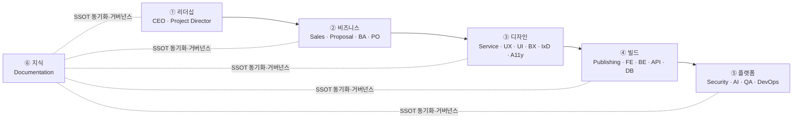

# Agents — 에이전트 조직 개요 (ClubSchool AI OS v1.0)

> 이 문서는 **사람이 읽는 조직/레지스트리 계층**이다. 각 에이전트의 실행 정본(프롬프트·규칙)은
> `.claude/agents/<kebab>.md`에 존재하며, 여기서는 그 정본으로 **링크만** 한다(중복 금지).
> 지식의 단일 진실 공급원(SSOT)은 언제나 **GoldWiki(골드위키)**다.

Goldwiki Digital(골드위키 디지털)은 22개의 전문 서브에이전트로 구성된 AI 디지털 컨설팅 조직이다.
모든 에이전트는 의사결정 전 골드위키를 먼저 참조하고, 결과를
[의사결정 로그](../GoldWiki/32_DECISION_LOG.md) · [프로젝트 메모리](../GoldWiki/35_PROJECT_MEMORY.md) ·
[베스트 프랙티스](../GoldWiki/37_BEST_PRACTICES.md) · [레퍼런스 라이브러리](../GoldWiki/36_REFERENCE_LIBRARY.md)에 환류한다.

## 관련 문서

| 문서 | 내용 |
|------|------|
| [ORG_CHART.md](ORG_CHART.md) | 조직도, 보고·에스컬레이션 체계, 의사결정 권한 매트릭스 |
| [RACI.md](RACI.md) | 21단계 파이프라인 × 22 에이전트 RACI 매트릭스 |
| [COLLABORATION_MAP.md](COLLABORATION_MAP.md) | 에이전트 간 인계(handoff) 흐름과 입출력 아티팩트 |
| [ESCALATION_POLICY.md](ESCALATION_POLICY.md) | 에스컬레이션 트리거·경로·SLA·충돌 해결 |
| [27 자동화 워크플로우](../GoldWiki/27_AUTOMATION_WORKFLOW.md) | 21단계 RFP→납품 파이프라인 정본 |
| [28 서브에이전트 규칙](../GoldWiki/28_SUBAGENT_RULES.md) | 에이전트 운영 거버넌스 정본 |

---

## 1. 6계층 조직 구조

조직은 가치 흐름(RFP → 제안 → 디자인 → 빌드 → 운영)을 따라 6개 기능 계층으로 나뉜다.
각 계층은 골드위키의 특정 지식 영역을 책임지고, 단계 게이트에서 다음 계층으로 산출물을 인계한다.

| 계층 | 구성 에이전트 | 핵심 책임 | 주요 골드위키 영역 |
|------|---------------|-----------|---------------------|
| **① 리더십(Leadership)** | CEO, Project Director | 전략·우선순위·OKR, 납품 총괄, 단계 게이트 승인, 최종 에스컬레이션 | 01·02·32·35·31 |
| **② 비즈니스(Business)** | Sales Director, Proposal Strategist, Business Analyst, Product Owner | 수주, 제안, 요구공학, 백로그·가치 우선순위 | 03·04·05·06·34 |
| **③ 디자인(Design)** | Service Planner, UX Researcher, UI Designer, BX Designer, Interaction Designer, Accessibility Specialist | IA·여정·UX 전략·UI 컨셉·브랜드·인터랙션·접근성 | 07–16 |
| **④ 빌드(Build)** | Publishing Engineer, Frontend Engineer, Backend Engineer, API Engineer, Database Architect | 퍼블리싱·프런트·백엔드·API·데이터 구현 | 17–23 |
| **⑤ 플랫폼(Platform)** | Security Engineer, AI Engineer, QA Engineer, DevOps Engineer | 보안·AI/RAG·품질·배포 자동화 | 24·25·26·29·30·31 |
| **⑥ 지식(Knowledge)** | Documentation Specialist | 골드위키 무결성, SSOT·중복 금지 거버넌스 강제 | 28·32·35·36·37·39 |

---

## 2. 22개 에이전트 레지스트리

> "정의 파일" 열은 실행 정본(`../.claude/agents/<kebab>.md`)으로의 링크다.

### ① 리더십

| 에이전트 | 미션 한 줄 | 주요 골드위키 | 핵심 협업자 | 정의 파일 |
|----------|-----------|----------------|--------------|-----------|
| **CEO** | 전략·OKR을 정의하고 부서 충돌의 최종 중재·에스컬레이션 종점이 된다 | [01](../GoldWiki/01_COMPANY_CONTEXT.md) [02](../GoldWiki/02_BUSINESS_GOALS.md) [32](../GoldWiki/32_DECISION_LOG.md) | Project Director, Sales Director | [ceo.md](../.claude/agents/ceo.md) |
| **Project Director** | 모든 과제를 범위·품질·일정·예산 안에서 납품하도록 총괄하고 단계 게이트를 승인한다 | [35](../GoldWiki/35_PROJECT_MEMORY.md) [29](../GoldWiki/29_QUALITY_CHECKLIST.md) [31](../GoldWiki/31_RELEASE_PROCESS.md) | CEO, BA, 전 납품 에이전트 | [project-director.md](../.claude/agents/project-director.md) |

### ② 비즈니스

| 에이전트 | 미션 한 줄 | 주요 골드위키 | 핵심 협업자 | 정의 파일 |
|----------|-----------|----------------|--------------|-----------|
| **Sales Director** | 파이프라인을 건강하게 유지하고 규율 있게 go/no-go를 판단한다 | [03](../GoldWiki/03_RFP_FRAMEWORK.md) [34](../GoldWiki/34_CLIENT_KNOWLEDGE.md) | CEO, Proposal Strategist | [sales-director.md](../.claude/agents/sales-director.md) |
| **Proposal Strategist** | 윈테마·스토리라인·경영요약·컴플라이언스로 수주 가능성을 극대화한다 | [04](../GoldWiki/04_RFP_ANALYSIS.md) [05](../GoldWiki/05_PROPOSAL_STRATEGY.md) [38](../GoldWiki/38_TEMPLATE_LIBRARY.md) | Sales Director, BA | [proposal-strategist.md](../.claude/agents/proposal-strategist.md) |
| **Business Analyst** | 모호한 요구를 검증·추적 가능한 요구사항·WBS·인수기준으로 전환한다 | [06](../GoldWiki/06_BUSINESS_ANALYSIS.md) [04](../GoldWiki/04_RFP_ANALYSIS.md) | Proposal Strategist, Product Owner | [business-analyst.md](../.claude/agents/business-analyst.md) |
| **Product Owner** | 가치 중심으로 백로그를 우선순위화하고 유저스토리·인수를 책임진다 | [02](../GoldWiki/02_BUSINESS_GOALS.md) [06](../GoldWiki/06_BUSINESS_ANALYSIS.md) [07](../GoldWiki/07_UX_PRINCIPLES.md) | BA, UX Researcher | [product-owner.md](../.claude/agents/product-owner.md) |

### ③ 디자인

| 에이전트 | 미션 한 줄 | 주요 골드위키 | 핵심 협업자 | 정의 파일 |
|----------|-----------|----------------|--------------|-----------|
| **Service Planner** | 비즈니스·사용자 니즈를 IA·여정·블루프린트·화면 목록으로 구조화한다 | [11](../GoldWiki/11_INFORMATION_ARCHITECTURE.md) [12](../GoldWiki/12_USER_FLOW.md) [13](../GoldWiki/13_USER_JOURNEY.md) | UX Researcher, UI Designer | [service-planner.md](../.claude/agents/service-planner.md) |
| **UX Researcher** | 추측이 아닌 증거로 누구를·왜·어떤 맥락에서 설계할지 정의한다 | [07](../GoldWiki/07_UX_PRINCIPLES.md) [11](../GoldWiki/11_INFORMATION_ARCHITECTURE.md) [13](../GoldWiki/13_USER_JOURNEY.md) | Service Planner, Product Owner | [ux-researcher.md](../.claude/agents/ux-researcher.md) |
| **UI Designer** | 리서치·IA를 디자인 시스템에 정합하는 시각적 화면으로 번역한다 | [08](../GoldWiki/08_UI_GUIDELINES.md) [09](../GoldWiki/09_DESIGN_SYSTEM.md) [14](../GoldWiki/14_COMPONENT_LIBRARY.md) [15](../GoldWiki/15_DESIGN_TOKEN.md) | BX Designer, IxD, Publishing | [ui-designer.md](../.claude/agents/ui-designer.md) |
| **BX Designer** | 모든 터치포인트에 일관된 브랜드 인격·감성 경험을 부여한다 | [01](../GoldWiki/01_COMPANY_CONTEXT.md) [09](../GoldWiki/09_DESIGN_SYSTEM.md) [15](../GoldWiki/15_DESIGN_TOKEN.md) | UI Designer | [bx-designer.md](../.claude/agents/bx-designer.md) |
| **Interaction Designer** | 정적 화면에 동작·상태 전환·피드백의 의미를 부여한다 | [12](../GoldWiki/12_USER_FLOW.md) [14](../GoldWiki/14_COMPONENT_LIBRARY.md) [07](../GoldWiki/07_UX_PRINCIPLES.md) | UI Designer, FE | [interaction-designer.md](../.claude/agents/interaction-designer.md) |
| **Accessibility Specialist** | WCAG 2.2 AA를 설계 단계에 내재화(Shift-Left)해 동등 접근을 보장한다 | [16](../GoldWiki/16_ACCESSIBILITY.md) [29](../GoldWiki/29_QUALITY_CHECKLIST.md) | UI Designer, QA, FE | [accessibility-specialist.md](../.claude/agents/accessibility-specialist.md) |

### ④ 빌드

| 에이전트 | 미션 한 줄 | 주요 골드위키 | 핵심 협업자 | 정의 파일 |
|----------|-----------|----------------|--------------|-----------|
| **Publishing Engineer** | 확정 디자인을 시맨틱·토큰 기반 정적 HTML/CSS 프로토타입으로 퍼블리시한다 | [17](../GoldWiki/17_HTML_GUIDE.md) [18](../GoldWiki/18_CSS_GUIDE.md) [15](../GoldWiki/15_DESIGN_TOKEN.md) | UI Designer, FE | [publishing-engineer.md](../.claude/agents/publishing-engineer.md) |
| **Frontend Engineer** | 디자인·프로토타입을 성능·접근성을 갖춘 프로덕션 UI 코드로 전환한다 | [20](../GoldWiki/20_FRONTEND_GUIDE.md) [14](../GoldWiki/14_COMPONENT_LIBRARY.md) [16](../GoldWiki/16_ACCESSIBILITY.md) | Publishing, API, IxD | [frontend-engineer.md](../.claude/agents/frontend-engineer.md) |
| **Backend Engineer** | 신뢰·안전·관측 가능한 서버 사이드 시스템을 구축한다 | [21](../GoldWiki/21_BACKEND_GUIDE.md) [24](../GoldWiki/24_SECURITY_GUIDE.md) | API, DB, Security | [backend-engineer.md](../.claude/agents/backend-engineer.md) |
| **API Engineer** | 일관·안전·진화 가능한 계약 우선 API를 설계한다 | [22](../GoldWiki/22_API_STANDARD.md) [24](../GoldWiki/24_SECURITY_GUIDE.md) | FE, Backend | [api-engineer.md](../.claude/agents/api-engineer.md) |
| **Database Architect** | 정확·고성능·진화 가능한 데이터 모델과 안전한 마이그레이션을 설계한다 | [23](../GoldWiki/23_DATABASE_GUIDE.md) | Backend, Security | [database-architect.md](../.claude/agents/database-architect.md) |

### ⑤ 플랫폼

| 에이전트 | 미션 한 줄 | 주요 골드위키 | 핵심 협업자 | 정의 파일 |
|----------|-----------|----------------|--------------|-----------|
| **Security Engineer** | OWASP 기준의 방어적 보안을 SDLC 전반에 내재화한다(공격 도구 생성 금지) | [24](../GoldWiki/24_SECURITY_GUIDE.md) [29](../GoldWiki/29_QUALITY_CHECKLIST.md) | Backend, API, QA, DevOps | [security-engineer.md](../.claude/agents/security-engineer.md) |
| **AI Engineer** | 골드위키를 두뇌로 삼는 멀티에이전트·RAG·프롬프트·평가 체계를 운영한다 | [25](../GoldWiki/25_AI_GUIDE.md) [26](../GoldWiki/26_PROMPT_ENGINEERING.md) [40](../GoldWiki/40_PROMPT_LIBRARY.md) | Documentation, 전 에이전트 | [ai-engineer.md](../.claude/agents/ai-engineer.md) |
| **QA Engineer** | 출시 가능 품질을 객관적 증거로 보증하고 품질 게이트를 판정한다 | [29](../GoldWiki/29_QUALITY_CHECKLIST.md) [30](../GoldWiki/30_TEST_STRATEGY.md) | Security, A11y, 전 빌드 | [qa-engineer.md](../.claude/agents/qa-engineer.md) |
| **DevOps Engineer** | 안전·반복·관측 가능한 CI/CD·IaC·릴리스 체계를 구축한다 | [31](../GoldWiki/31_RELEASE_PROCESS.md) [24](../GoldWiki/24_SECURITY_GUIDE.md) | QA, Backend, Security | [devops-engineer.md](../.claude/agents/devops-engineer.md) |

### ⑥ 지식

| 에이전트 | 미션 한 줄 | 주요 골드위키 | 핵심 협업자 | 정의 파일 |
|----------|-----------|----------------|--------------|-----------|
| **Documentation Specialist** | 골드위키를 SSOT로 유지하고 중복 금지·거버넌스를 전 에이전트에 강제한다 | [28](../GoldWiki/28_SUBAGENT_RULES.md) [32](../GoldWiki/32_DECISION_LOG.md) [37](../GoldWiki/37_BEST_PRACTICES.md) | 전 에이전트 | [documentation-specialist.md](../.claude/agents/documentation-specialist.md) |

---

## 3. 호출 방법

Claude Code에서 서브에이전트는 작업 위임으로 호출한다. 기본 패턴은 다음과 같다.

1. **자연어 위임** — 작업 성격에 맞는 에이전트를 지명한다.
   예: "`business-analyst`로 이 RFP의 요구사항을 추출하고 RTM을 작성하라."
2. **파이프라인 단계 기반 호출** — [27 자동화 워크플로우](../GoldWiki/27_AUTOMATION_WORKFLOW.md)의 단계 번호와
   [RACI.md](RACI.md)의 R(실무 담당)을 보고 해당 에이전트를 호출한다.
3. **체인 호출(인계)** — 한 에이전트의 산출물을 다음 에이전트의 입력으로 넘긴다.
   인계 규칙은 [COLLABORATION_MAP.md](COLLABORATION_MAP.md)를 따른다.

| 호출 의도 | 권장 진입 에이전트 |
|-----------|--------------------|
| 새 RFP 수령·검토 | Sales Director → Business Analyst |
| 요구사항·WBS·추적성 | Business Analyst |
| 제안 전략·경영요약 | Proposal Strategist |
| IA·여정·화면 목록 | Service Planner / UX Researcher |
| UI·디자인 시스템 | UI Designer |
| 퍼블리싱·구현 | Publishing Engineer → Frontend/Backend Engineer |
| 품질·보안 검수 | QA Engineer / Security Engineer |
| 배포·릴리스 | DevOps Engineer |
| 지식 정리·골드위키 갱신 | Documentation Specialist |
| 전략 충돌·게이트 승인 | Project Director → CEO |

각 에이전트의 입출력·세부 규칙은 정의 파일(`../.claude/agents/<kebab>.md`)에서 확인한다.

---

## 4. 거버넌스 — "골드위키 먼저 참조"

모든 에이전트는 다음 4대 원칙을 예외 없이 따른다([28 서브에이전트 규칙](../GoldWiki/28_SUBAGENT_RULES.md) 정본).

1. **골드위키 먼저 참조** — 어떤 결정·산출 전에도 관련 골드위키 문서를 먼저 읽는다.
2. **단일 진실 공급원(SSOT)** — 골드위키가 유일한 진실원이며, 다른 사본을 만들지 않는다.
3. **지식 중복 금지** — 동일 지식을 두 곳에 두지 않는다. 이 `Agents/` 계층은 정본을 **링크만** 한다.
4. **결정의 환류** — 모든 결정은 [의사결정 로그(32)](../GoldWiki/32_DECISION_LOG.md)에,
   학습은 [프로젝트 메모리(35)](../GoldWiki/35_PROJECT_MEMORY.md)·[베스트 프랙티스(37)](../GoldWiki/37_BEST_PRACTICES.md)에,
   재사용 자산은 [레퍼런스 라이브러리(36)](../GoldWiki/36_REFERENCE_LIBRARY.md)에 기록한다.

거버넌스 위반(중복 생성, 골드위키 미참조, 미기록 결정)은 Documentation Specialist가 적발하고,
재발 시 [ESCALATION_POLICY.md](ESCALATION_POLICY.md)에 따라 Project Director로 에스컬레이션한다.
