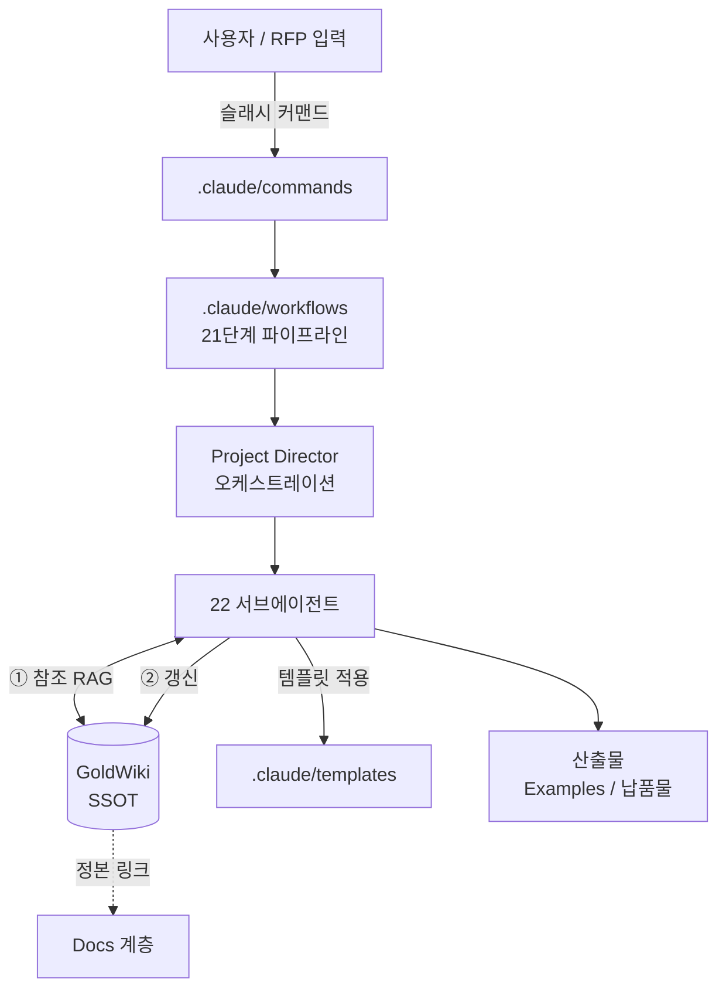
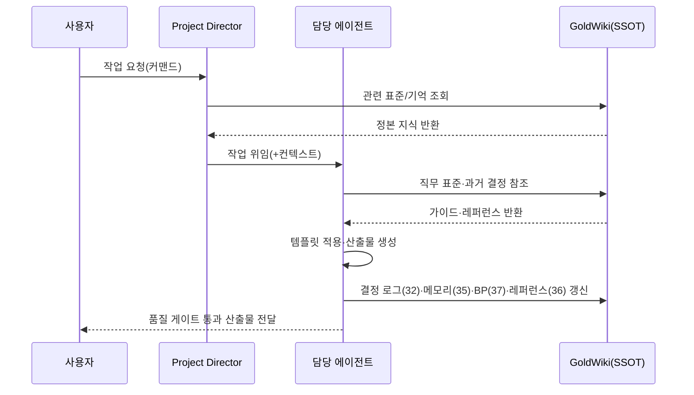
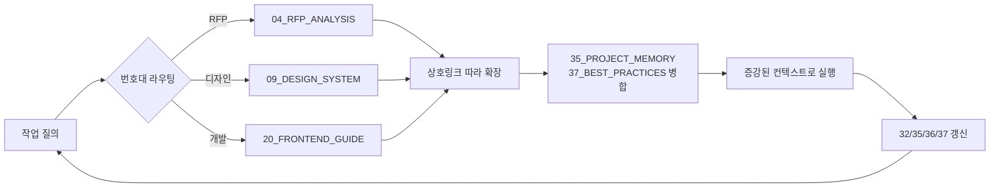
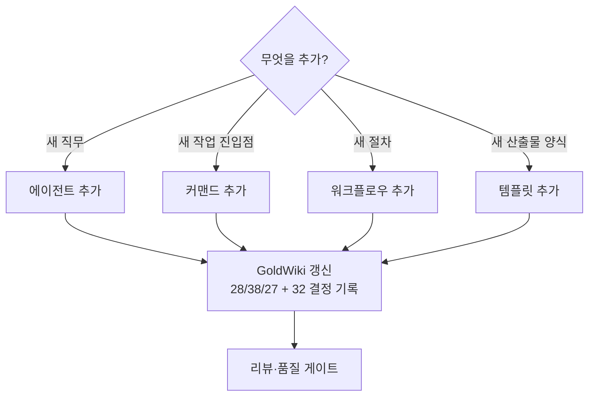

# ARCHITECTURE — ClubSchool AI OS 시스템 아키텍처

본 문서는 **ClubSchool AI OS v1.0**의 시스템 구조, 데이터·지식 흐름, GoldWiki RAG 동작, 디렉터리 구조, 확장 방법을 설명한다. 정본 운영 규칙은 GoldWiki에 있으며, 본 문서는 그 규칙이 구현체 위에서 어떻게 배치되는지를 다룬다.

## 1. 한눈에 보기

ClubSchool AI OS는 Claude Code 위에서 동작하는 **"AI 디지털 컨설팅 회사 운영체제"**다. RFP 분석부터 납품까지 디지털 에이전시의 전 공정을 수행하며, 다음 4개의 축으로 구성된다.

| 축 | 역할 | 비유 | 구현 위치 |
|---|---|---|---|
| **GoldWiki(SSOT)** | 단일 진실 공급원, 조직의 두뇌·장기기억 | 회사의 규정·노하우·기록 | `GoldWiki/` |
| **22 서브에이전트** | 직무별 실행 주체 | 직원 조직도 | `.claude/agents/` |
| **커맨드·워크플로우·프롬프트·템플릿** | 작업 진입점과 실행 절차 | 업무 매뉴얼·양식 | `.claude/{commands,workflows,prompts,templates}/` |
| **21단계 파이프라인** | RFP→납품 표준 공정 | 생산 라인 | 정본 `GoldWiki/27_AUTOMATION_WORKFLOW.md` |

핵심 거버넌스 원칙: **모든 에이전트는 의사결정 전에 GoldWiki를 먼저 참조하고, 모든 결정은 GoldWiki에 다시 기록한다.** 지식 중복은 금지된다.

## 2. 구성요소 상세

### 2.1 GoldWiki — 단일 진실 공급원(SSOT)

41개 한국어 지식 문서(`00_`~`40_`)로 구성된 조직의 두뇌다. 모든 표준·가이드·결정·기억이 여기에 모인다. 카테고리별 구성은 다음과 같다.

| 번호대 | 영역 | 대표 문서 |
|---|---|---|
| 00–02 | 시작·회사 맥락·목표 | `00_START_HERE`, `01_COMPANY_CONTEXT`, `02_BUSINESS_GOALS` |
| 03–06 | RFP·제안·분석 | `03_RFP_FRAMEWORK`, `04_RFP_ANALYSIS`, `05_PROPOSAL_STRATEGY`, `06_BUSINESS_ANALYSIS` |
| 07–16 | UX/UI·디자인 시스템·접근성 | `07_UX_PRINCIPLES` … `16_ACCESSIBILITY` |
| 17–25 | 퍼블리싱·개발·보안·AI | `17_HTML_GUIDE` … `25_AI_GUIDE` |
| 26–31 | 프롬프트·자동화·규칙·품질·릴리스 | `26_PROMPT_ENGINEERING` … `31_RELEASE_PROCESS` |
| 32–40 | 기록·기억·레퍼런스·베스트프랙티스 | `32_DECISION_LOG` … `40_PROMPT_LIBRARY` |

특히 **운영의 4대 갱신 대상 문서**는 다음과 같으며, 모든 의미 있는 결정은 이 네 문서를 갱신해야 한다(상세는 [`GOVERNANCE.md`](./GOVERNANCE.md)).

- [`../GoldWiki/32_DECISION_LOG.md`](../GoldWiki/32_DECISION_LOG.md) — 의사결정 로그(ADR)
- [`../GoldWiki/35_PROJECT_MEMORY.md`](../GoldWiki/35_PROJECT_MEMORY.md) — 프로젝트 메모리
- [`../GoldWiki/37_BEST_PRACTICES.md`](../GoldWiki/37_BEST_PRACTICES.md) — 베스트 프랙티스
- [`../GoldWiki/36_REFERENCE_LIBRARY.md`](../GoldWiki/36_REFERENCE_LIBRARY.md) — 레퍼런스 라이브러리

### 2.2 22개 서브에이전트

직무별 전문 에이전트 조직이다. 정의 파일은 `.claude/agents/<kebab>.md`, 사람용 조직/레지스트리 문서는 `Agents/`에 있다.

| 계층 | 에이전트 |
|---|---|
| 경영·관리 | CEO, Project Director |
| 영업·제안 | Sales Director, Proposal Strategist |
| 기획·분석 | Business Analyst, Product Owner, Service Planner |
| 리서치·디자인 | UX Researcher, UI Designer, BX Designer, Interaction Designer, Accessibility Specialist |
| 퍼블리싱·개발 | Publishing Engineer, Frontend Engineer, Backend Engineer, API Engineer, Database Architect |
| 보안·AI·품질·운영·문서 | Security Engineer, AI Engineer, QA Engineer, DevOps Engineer, Documentation Specialist |

각 에이전트의 공통 행동강령은 [`../GoldWiki/28_SUBAGENT_RULES.md`](../GoldWiki/28_SUBAGENT_RULES.md)에 정의되며, 핵심은 "GoldWiki 우선 참조 → 실행 → GoldWiki 갱신"이다.

### 2.3 커맨드·워크플로우·프롬프트·템플릿

| 종류 | 위치(기계용) | 위치(사람용) | 설명 |
|---|---|---|---|
| 커맨드 | `.claude/commands/*.md` | — | 슬래시 커맨드 진입점. frontmatter(`description`, `argument-hint`) + 프롬프트 본문 |
| 워크플로우 | `.claude/workflows/` | `Workflows/` | 다단계 작업 절차 정의와 런북 |
| 프롬프트 | `.claude/prompts/` | — | 재사용 프롬프트 조각 |
| 템플릿 | `.claude/templates/` | `Templates/` | 산출물 양식(기계 사용용 / 복사 사용용) |

커맨드 파일 형식(정본 규칙은 [`CONTRIBUTING.md`](./CONTRIBUTING.md)):

```markdown
---
description: <한국어 한 줄 설명>
argument-hint: [RFP 파일 경로]
---
<Claude에게 전달될 프롬프트 본문. 참조할 GoldWiki 문서, 사용할 에이전트,
 산출물 형식, 품질 게이트를 명시. $ARGUMENTS / $1 사용 가능.>
```

현재 설치된 커맨드: `analyze-rfp`, `generate-proposal`.

### 2.4 21단계 RFP→납품 파이프라인

표준 공정의 정본은 [`../GoldWiki/27_AUTOMATION_WORKFLOW.md`](../GoldWiki/27_AUTOMATION_WORKFLOW.md)다.

> 읽기 → 분석 → 요약 → 요구사항 추출 → 평가기준 → 숨은 기대 → 리스크 → 경쟁사 벤치마크 → 글로벌 베스트프랙티스 벤치마크 → 제안 전략 → WBS → IA → 유저 플로우 → 화면 목록 → UX 전략 → UI 컨셉 → 디자인 시스템 → HTML 프로토타입 계획 → 개발 계획 → QA 계획 → 경영 요약

## 3. 데이터·지식 흐름

### 3.1 전체 시스템 흐름



### 3.2 단일 작업의 지식 사이클(읽기-실행-기록)



핵심: **참조(읽기)와 기록(쓰기)이 한 사이클에서 닫힌다.** 이로써 다음 작업은 더 풍부한 컨텍스트로 시작된다(누적 학습).

## 4. 골드위키 RAG 동작

ClubSchool AI OS의 RAG는 외부 벡터DB가 아니라 **파일 기반·번호 인덱스·상호링크 그래프**로 구현된 경량 검색-증강 방식이다.

| 단계 | 동작 | 근거 |
|---|---|---|
| 1. 라우팅 | 작업 유형을 번호대(00–40)로 매핑 | 본 문서 §2.1 표 |
| 2. 진입 | `00_START_HERE` 또는 직무별 정본 문서로 진입 | 번호 규칙 |
| 3. 확장 | 문서 내 상호링크(`NN_*.md`)를 따라 관련 지식 수집 | 링크 그래프 |
| 4. 적용 | 수집한 표준·예시·과거 결정을 산출물에 반영 | 템플릿 + BP |
| 5. 인용·기록 | 사용한 정본을 인용하고 새 결정을 4대 문서에 기록 | 거버넌스 |



설계 원칙:

- **결정성(determinism)**: 번호 인덱스 덕분에 같은 질의는 같은 정본으로 라우팅된다.
- **추적성(traceability)**: 모든 산출물은 인용한 GoldWiki 문서로 근거를 추적할 수 있다.
- **중복금지(DRY)**: 같은 지식을 두 곳에 두지 않는다. 항상 정본을 링크한다(상세 [`GOVERNANCE.md`](./GOVERNANCE.md)).

## 5. 디렉터리 구조 설명

```
ClubSchool-AI-OS/
├── README.md            제품 개요(루트)
├── CLAUDE.md            Claude Code용 운영 지침(에이전트가 항상 읽음)
├── INSTALL.md           설치 절차
├── ROADMAP.md / CHANGELOG.md   로드맵·변경 이력
├── GoldWiki/            ← SSOT. 41개 정본 지식 문서
├── .claude/
│   ├── agents/          22개 에이전트 정의(기계용)
│   ├── commands/        슬래시 커맨드 진입점
│   ├── workflows/       파이프라인·다단계 절차 정의
│   ├── prompts/         재사용 프롬프트 조각
│   └── templates/       산출물 템플릿(기계용)
├── Agents/              에이전트 조직·레지스트리(사람용)
├── Workflows/           워크플로우 런북(사람용)
├── Templates/           산출물 템플릿(사람용, 복사 사용)
├── Examples/            완성 예시 산출물
└── Docs/                시스템 자체 보충 문서 ← 본 계층
```

| 구분 | 목적 | 독자 |
|---|---|---|
| `.claude/*` | 런타임에 Claude Code가 직접 소비 | 기계(에이전트) |
| `Agents/`, `Workflows/`, `Templates/` | 같은 자산의 사람용 설명/사본 | 사람 |
| `GoldWiki/` | 정본 지식. 기계·사람 공용 | 공용 |
| `Docs/` | 시스템 운영·구조 설명 | 사람 우선, AI 참조 |
| `Examples/` | 품질 기준선 예시 | 공용 |

## 6. 확장 방법

ClubSchool AI OS는 4개 확장 점을 가진다. 모든 확장은 **GoldWiki 동기화 의무**를 따른다(상세 절차 [`CONTRIBUTING.md`](./CONTRIBUTING.md)).



| 확장 | 추가 위치 | 동기화 대상(GoldWiki) | 핵심 규칙 |
|---|---|---|---|
| 에이전트 | `.claude/agents/<kebab>.md` + `Agents/` | `28_SUBAGENT_RULES` | 직무 경계 명확화, GoldWiki 우선 참조 강제 |
| 커맨드 | `.claude/commands/<name>.md` | `40_PROMPT_LIBRARY` | frontmatter + 참조/에이전트/게이트 명시 |
| 워크플로우 | `.claude/workflows/` + `Workflows/` | `27_AUTOMATION_WORKFLOW` | 단계·입출력·책임(RACI) 정의 |
| 템플릿 | `.claude/templates/` + `Templates/` | `38_TEMPLATE_LIBRARY` | 재사용·기계가독 구조, 예시 포함 |

확장 체크리스트:

- [ ] 기존 정본과 중복되지 않는가(없으면 추가, 있으면 정본 링크)
- [ ] 네이밍 규칙(kebab-case 파일명, 한국어 본문)을 따랐는가
- [ ] 해당 GoldWiki 정본을 갱신했는가
- [ ] 의사결정을 `32_DECISION_LOG`에 기록했는가
- [ ] 품질 게이트([`../GoldWiki/29_QUALITY_CHECKLIST.md`](../GoldWiki/29_QUALITY_CHECKLIST.md))를 통과했는가

## 관련 문서

- 용어 정의: [`GLOSSARY.md`](./GLOSSARY.md)
- 운영 원칙: [`GOVERNANCE.md`](./GOVERNANCE.md)
- 기여 절차: [`CONTRIBUTING.md`](./CONTRIBUTING.md)
- 파이프라인 정본: [`../GoldWiki/27_AUTOMATION_WORKFLOW.md`](../GoldWiki/27_AUTOMATION_WORKFLOW.md)
- 서브에이전트 규칙: [`../GoldWiki/28_SUBAGENT_RULES.md`](../GoldWiki/28_SUBAGENT_RULES.md)
