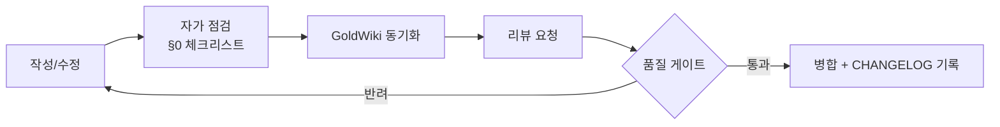

# CONTRIBUTING — 기여 가이드

ClubSchool AI OS v1.0에 문서·에이전트·커맨드·워크플로우·템플릿을 추가·수정하는 규칙과 절차를 정의한다. 사람·AI 기여자 모두에게 적용된다. 운영 원칙의 정본은 [`GOVERNANCE.md`](./GOVERNANCE.md)다.

## 0. 황금 규칙

> **모든 기여는 GoldWiki와 동기화되어야 한다.** 정본을 갱신하지 않은 기여는 미완성이다.

기여 전 자가 점검:

- [ ] 기존 정본과 중복되는가? (중복이면 신설 대신 정본 갱신 — [`GOVERNANCE.md`](./GOVERNANCE.md) §2)
- [ ] 한국어 본문 / 영문은 식별자·표준명·링크 경로만 유지하는가?
- [ ] 어떤 GoldWiki 정본을 갱신해야 하는가?

## 1. 기여 유형별 규칙

### 1.1 문서(Docs / GoldWiki)
- 신규 GoldWiki 문서는 번호 체계(`NN_`)와 카테고리를 지킨다([`ARCHITECTURE.md`](./ARCHITECTURE.md) §2.1).
- 가능하면 신설보다 가장 가까운 정본에 절을 추가한다.
- 상호링크는 상대경로. `Docs/`/`Agents/`/`Templates/`/`Examples/`에서 GoldWiki는 `../GoldWiki/NN_*.md`, `.claude/commands/`에서는 `../../GoldWiki/NN_*.md`.

### 1.2 에이전트
- 위치: `.claude/agents/<kebab>.md`(기계용) + `Agents/`(사람용 레지스트리).
- 직무 경계를 명확히 하고 기존 22개와 겹치지 않게 한다.
- 행동강령(GoldWiki 우선 참조)을 반드시 포함한다.
- 동기화 대상: [`../GoldWiki/28_SUBAGENT_RULES.md`](../GoldWiki/28_SUBAGENT_RULES.md).

### 1.3 커맨드
- 위치: `.claude/commands/<name>.md`.
- 형식:

```markdown
---
description: <한국어 한 줄 설명>
argument-hint: [RFP 파일 경로]
---
<프롬프트 본문(한국어). 참조할 GoldWiki 문서, 사용할 에이전트,
 산출물 형식, 품질 게이트를 명시. $ARGUMENTS / $1 사용 가능.>
```

- 동기화 대상: [`../GoldWiki/40_PROMPT_LIBRARY.md`](../GoldWiki/40_PROMPT_LIBRARY.md).

### 1.4 워크플로우
- 위치: `.claude/workflows/`(정의) + `Workflows/`(런북).
- 단계·입출력·책임(RACI)·품질 게이트를 정의한다.
- 동기화 대상: [`../GoldWiki/27_AUTOMATION_WORKFLOW.md`](../GoldWiki/27_AUTOMATION_WORKFLOW.md).

### 1.5 템플릿
- 위치: `.claude/templates/`(기계용) + `Templates/`(사람용 사본).
- 재사용 가능·기계 가독 구조로 만들고 채워진 예시를 포함한다.
- 동기화 대상: [`../GoldWiki/38_TEMPLATE_LIBRARY.md`](../GoldWiki/38_TEMPLATE_LIBRARY.md).

## 2. 네이밍 규칙

| 대상 | 규칙 | 예 |
|---|---|---|
| GoldWiki 문서 | `NN_UPPER_SNAKE.md` | `27_AUTOMATION_WORKFLOW.md` |
| Docs 문서 | `UPPER.md` | `ARCHITECTURE.md` |
| 에이전트 파일 | `kebab-case.md` | `ux-researcher.md` |
| 커맨드 파일 | `kebab-case.md` | `analyze-rfp.md` |
| frontmatter `name` | kebab-case | `analyze-rfp` |
| 본문 언어 | 한국어 | — |
| 영문 유지 | 파일·식별자·표준명(WCAG/OWASP/REST/SemVer)·링크 | — |

## 3. 리뷰 절차



| 단계 | 책임 | 점검 항목 |
|---|---|---|
| 자가 점검 | 기여자 | §0 체크리스트, 네이밍, 링크 |
| 동기화 | 기여자 | 해당 정본 + 4문서 규칙([`GOVERNANCE.md`](./GOVERNANCE.md) §3) |
| 리뷰 | Documentation Specialist / Project Director | 중복금지, 품질 기준, 링크 무결성 |
| 판정 | Project Director | 품질 게이트([`../GoldWiki/29_QUALITY_CHECKLIST.md`](../GoldWiki/29_QUALITY_CHECKLIST.md)) |

## 4. 커밋 컨벤션

Conventional Commits 스타일을 따른다. 제목은 한국어 요약, 타입은 영문 키워드.

```
<타입>(<범위>): <한국어 요약>

<본문: 변경 이유·영향·동기화한 GoldWiki 문서>
```

| 타입 | 용도 |
|---|---|
| `feat` | 새 에이전트·커맨드·워크플로우·템플릿 추가 |
| `docs` | 문서 추가·수정 |
| `fix` | 오류·링크·오탈자 수정 |
| `refactor` | 구조·정리(동작 불변) |
| `chore` | 설정·메타 변경 |

예:

```
feat(commands): RFP 평가기준 추출 커맨드 추가

04_RFP_ANALYSIS 정본 참조, Proposal Strategist 에이전트 사용.
40_PROMPT_LIBRARY 갱신, 32_DECISION_LOG에 결정 기록.
```

범위(scope) 권장값: `goldwiki`, `agents`, `commands`, `workflows`, `templates`, `docs`.

## 5. GoldWiki 동기화 의무(요약)

| 기여 | 갱신할 정본 | 추가로 |
|---|---|---|
| 에이전트 | `28_SUBAGENT_RULES` | 의미 있는 결정이면 4문서 규칙 |
| 커맨드 | `40_PROMPT_LIBRARY` | 동일 |
| 워크플로우 | `27_AUTOMATION_WORKFLOW` | 동일 |
| 템플릿 | `38_TEMPLATE_LIBRARY` | 동일 |
| 문서 | 해당 영역 정본 | 링크 무결성 점검 |

> 4문서 규칙: 의미 있는 결정 시 의사결정 로그(32)·프로젝트 메모리(35)·베스트 프랙티스(37)·레퍼런스 라이브러리(36)를 함께 갱신. 상세 [`GOVERNANCE.md`](./GOVERNANCE.md) §3.

## 관련 문서

- 운영 원칙: [`GOVERNANCE.md`](./GOVERNANCE.md)
- 시스템 구조·확장: [`ARCHITECTURE.md`](./ARCHITECTURE.md) §6
- 온보딩: [`ONBOARDING.md`](./ONBOARDING.md)
