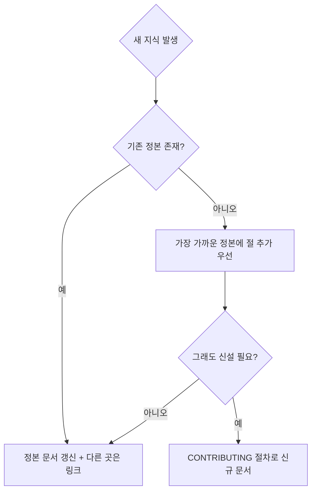
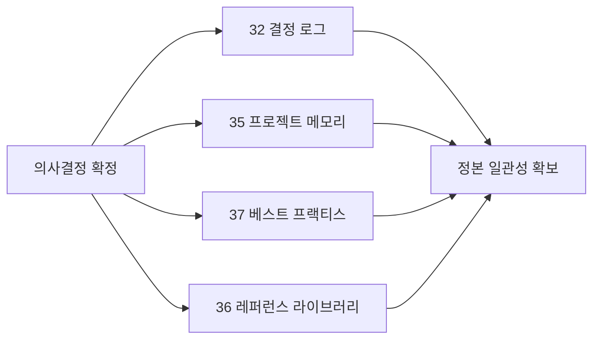
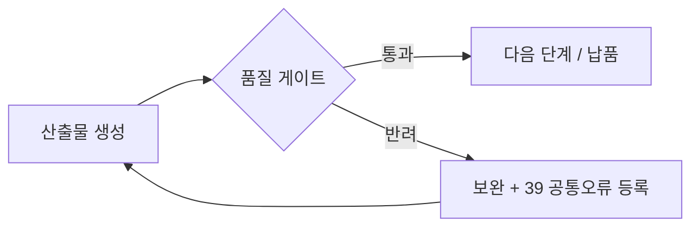

# GOVERNANCE — 거버넌스 모델

ClubSchool AI OS v1.0의 운영을 지배하는 원칙·규칙·기준을 정의한다. 모든 사람·에이전트는 본 문서를 준수한다. 본 문서는 운영 헌장이며, 실무 표준의 정본은 GoldWiki에 있다.

## 1. 제1원칙: SSOT(단일 진실 공급원)

> **GoldWiki가 유일한 정본이다. 모든 결정은 GoldWiki를 읽고, GoldWiki에 기록한다.**

| 원칙 | 의미 | 위반 시 |
|---|---|---|
| 우선 참조 | 모든 의사결정 전 GoldWiki를 먼저 본다 | 산출물 반려 |
| 정본 단일성 | 같은 지식은 한 곳에만 둔다 | 중복 제거·정본 링크로 교정 |
| 기록 의무 | 의미 있는 결정은 GoldWiki에 남긴다 | 미기록 결정은 무효로 간주 |
| 추적성 | 산출물은 인용한 정본으로 근거를 추적할 수 있어야 한다 | 근거 보강 요구 |

## 2. 중복금지(DRY) 규칙

- 사본을 만들지 않는다. **사본 대신 링크.**
- 표·체크리스트·정의가 두 문서에 필요하면 한쪽을 정본으로 정하고 다른 쪽은 링크한다.
- 충돌이 발견되면 정본을 기준으로 즉시 일원화한다.

## 3. 의사결정 시 4문서 갱신 규칙

의미 있는 결정(아키텍처·표준·프로세스·디자인·기술 선택 등)이 내려지면 다음 네 문서를 **반드시 함께** 갱신한다.

| # | 문서 | 무엇을 기록 |
|---|---|---|
| 1 | [`../GoldWiki/32_DECISION_LOG.md`](../GoldWiki/32_DECISION_LOG.md) | 결정의 배경·대안·결론·날짜·책임자(ADR) |
| 2 | [`../GoldWiki/35_PROJECT_MEMORY.md`](../GoldWiki/35_PROJECT_MEMORY.md) | 결정이 미친 프로젝트 맥락·상태 변화 |
| 3 | [`../GoldWiki/37_BEST_PRACTICES.md`](../GoldWiki/37_BEST_PRACTICES.md) | 재사용 가능한 모범 사례로 일반화 |
| 4 | [`../GoldWiki/36_REFERENCE_LIBRARY.md`](../GoldWiki/36_REFERENCE_LIBRARY.md) | 근거가 된 외부 자료·표준·사례 |

판단 기준 — "의미 있는 결정"인가?

- [ ] 향후 작업에 영향을 주는가
- [ ] 표준·프로세스·기술 선택을 바꾸는가
- [ ] 되돌릴 때 비용이 큰가
- [ ] 다른 에이전트가 알아야 하는가

하나라도 "예"이면 4문서 갱신 대상이다.

## 4. 에이전트 행동강령

모든 22개 서브에이전트가 따르는 공통 강령이다. 정본 규칙은 [`../GoldWiki/28_SUBAGENT_RULES.md`](../GoldWiki/28_SUBAGENT_RULES.md).

| 강령 | 내용 |
|---|---|
| 참조 우선 | 작업 전 관련 GoldWiki 정본을 읽는다 |
| 직무 경계 | 자기 직무 범위 내에서 책임지고, 경계 밖은 적임 에이전트에 위임 |
| 근거 기반 | 추측이 아닌 정본·데이터·표준에 근거해 산출 |
| 템플릿 준수 | 해당 산출물 템플릿을 적용한다([`../GoldWiki/38_TEMPLATE_LIBRARY.md`](../GoldWiki/38_TEMPLATE_LIBRARY.md)) |
| 게이트 통과 | 품질 게이트를 통과해야 다음 단계로 넘긴다 |
| 기록 의무 | 결정·산출을 GoldWiki에 기록한다(§3) |
| 한국어 산출 | 본문은 한국어, 표준명·식별자만 영문 유지 |
| 투명성 | 사용한 정본을 인용하고 가정을 명시한다 |

## 5. 버전·변경 관리

- 버전 표기는 **SemVer**(`MAJOR.MINOR.PATCH`)를 따른다. 정본: [`../GoldWiki/31_RELEASE_PROCESS.md`](../GoldWiki/31_RELEASE_PROCESS.md).
- 모든 변경은 루트 `CHANGELOG.md`에 기록한다.
- 변경 영향도 분류:

| 분류 | 예시 | 버전 영향 |
|---|---|---|
| 파괴적 변경 | 에이전트 직무 재편, 파이프라인 단계 변경 | MAJOR |
| 기능 추가 | 새 커맨드·에이전트·템플릿 | MINOR |
| 수정·보완 | 오탈자·링크·소규모 가이드 보강 | PATCH |

- 정본 문서를 바꾸면 이를 참조하는 링크의 유효성을 함께 점검한다(링크 무결성).

## 6. 품질 기준

산출물·문서가 충족해야 하는 최소 기준이다. 정본 체크리스트: [`../GoldWiki/29_QUALITY_CHECKLIST.md`](../GoldWiki/29_QUALITY_CHECKLIST.md).

| 기준 | 정의 |
|---|---|
| 경영진 수준 | 의사결정자가 바로 활용 가능한 명료성·완결성 |
| 클라이언트 제출 가능 | 외부 제출에 손색없는 완성도와 톤 |
| 구현 가능 | 실제로 만들 수 있는 구체성(모호어 금지) |
| 재사용 가능 | 다른 프로젝트에 전용 가능한 구조 |
| 근거 기반 | 정본·표준·데이터에 근거 |
| 추적 가능 | 인용한 GoldWiki 문서로 근거 추적 |

품질 게이트 흐름:

금지 사항: 플레이스홀더, "TODO", "추후 작성", 모호한 문구, 근거 없는 단정, 정본 미참조.

## 7. 거버넌스 RACI

| 활동 | CEO | Project Director | 담당 에이전트 | Documentation Specialist |
|---|---|---|---|---|
| 전략·우선순위 결정 | A | C | I | I |
| 파이프라인 오케스트레이션 | I | A/R | R | I |
| 산출물 생성 | I | A | R | C |
| GoldWiki 정본 갱신 | I | A | R | R |
| 품질 게이트 판정 | I | A | R | C |
| 문서 일관성·링크 무결성 | I | C | C | A/R |

## 관련 문서

- 기여 절차: [`CONTRIBUTING.md`](./CONTRIBUTING.md)
- 시스템 구조: [`ARCHITECTURE.md`](./ARCHITECTURE.md)
- 서브에이전트 규칙: [`../GoldWiki/28_SUBAGENT_RULES.md`](../GoldWiki/28_SUBAGENT_RULES.md)
- 품질 체크리스트: [`../GoldWiki/29_QUALITY_CHECKLIST.md`](../GoldWiki/29_QUALITY_CHECKLIST.md)
