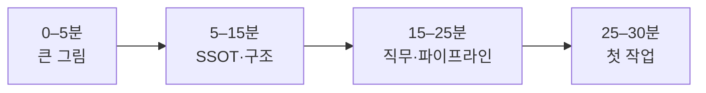
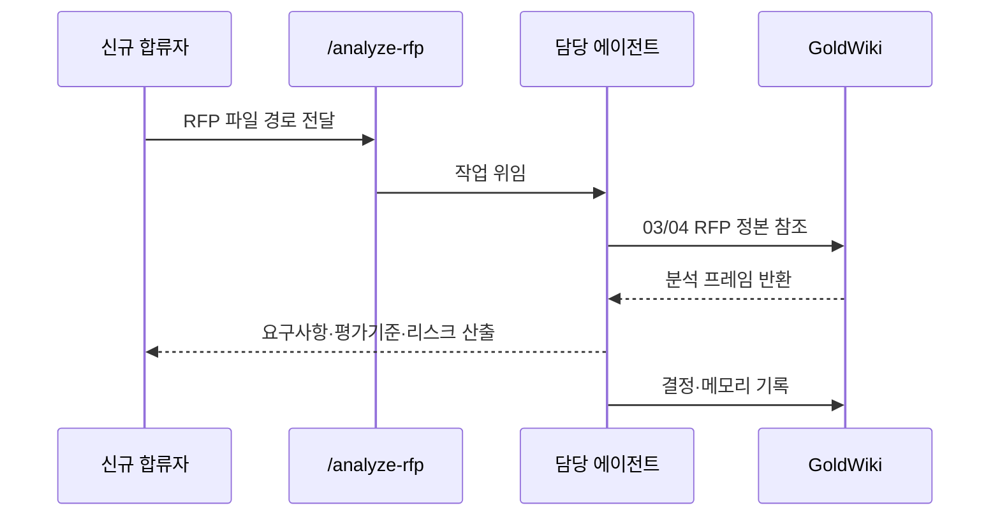

# ONBOARDING — 신규 합류 온보딩

ClubSchool AI OS v1.0에 새로 합류하는 사람·AI를 위한 온보딩 가이드다. 30분 안에 시스템을 이해하고 첫 작업을 시작하도록 돕는다.

## 0. 합류자 유형

| 유형 | 목표 | 우선 읽을 것 |
|---|---|---|
| 운영자(사람) | 시스템을 굴리고 의사결정 | 본 문서 → [`ARCHITECTURE.md`](./ARCHITECTURE.md) → [`GOVERNANCE.md`](./GOVERNANCE.md) |
| 기여자(사람) | 에이전트·커맨드·문서 추가 | 본 문서 → [`CONTRIBUTING.md`](./CONTRIBUTING.md) |
| AI 에이전트 | 직무 실행 | [`../GoldWiki/00_START_HERE.md`](../GoldWiki/00_START_HERE.md) → [`../GoldWiki/28_SUBAGENT_RULES.md`](../GoldWiki/28_SUBAGENT_RULES.md) |

## 1. 30분 빠른 시작

| 시간 | 할 일 | 자료 |
|---|---|---|
| 0–5분 | 제품 정체성 파악: "Claude Code 위의 AI 컨설팅 회사 OS" | 루트 `README.md` |
| 5–10분 | 시스템 4축(GoldWiki/에이전트/커맨드·워크플로우/파이프라인) 이해 | [`ARCHITECTURE.md`](./ARCHITECTURE.md) §1–2 |
| 10–15분 | SSOT 원칙과 중복금지 이해 | [`GOVERNANCE.md`](./GOVERNANCE.md) §1–2 |
| 15–20분 | 22 에이전트 로스터와 직무 경계 훑기 | [`ARCHITECTURE.md`](./ARCHITECTURE.md) §2.2, `Agents/` |
| 20–25분 | 21단계 파이프라인 흐름 파악 | [`../GoldWiki/27_AUTOMATION_WORKFLOW.md`](../GoldWiki/27_AUTOMATION_WORKFLOW.md) |
| 25–30분 | 첫 커맨드 실행: `/analyze-rfp` 로 샘플 RFP 분석 | `.claude/commands/analyze-rfp.md` |

## 2. 반드시 알아야 할 5가지

1. **GoldWiki가 정본(SSOT)이다.** 무엇을 하든 먼저 읽고, 끝나면 기록한다.
2. **지식 중복 금지.** 사본 대신 링크.
3. **의사결정 4문서 규칙.** 의미 있는 결정 시 32·35·37·36을 함께 갱신([`GOVERNANCE.md`](./GOVERNANCE.md) §3).
4. **품질 게이트.** 통과 못 하면 다음 단계로 넘기지 않는다.
5. **한국어 산출.** 본문은 한국어, 식별자·표준명만 영문.

## 3. 공통 온보딩 체크리스트

- [ ] 루트 `README.md`, `INSTALL.md`, `CLAUDE.md`를 읽었다
- [ ] [`ARCHITECTURE.md`](./ARCHITECTURE.md)로 시스템 4축을 이해했다
- [ ] [`GLOSSARY.md`](./GLOSSARY.md)로 핵심 용어(SSOT/IA/WBS/RACI/디자인 토큰/ADR 등)를 익혔다
- [ ] [`GOVERNANCE.md`](./GOVERNANCE.md)의 SSOT·4문서 규칙을 이해했다
- [ ] [`../GoldWiki/00_START_HERE.md`](../GoldWiki/00_START_HERE.md)와 번호 인덱스를 확인했다
- [ ] [`../GoldWiki/27_AUTOMATION_WORKFLOW.md`](../GoldWiki/27_AUTOMATION_WORKFLOW.md)로 21단계 파이프라인을 파악했다
- [ ] 설치 점검([`FAQ.md`](./FAQ.md) Q3)을 통과했다

## 4. 유형별 추가 체크리스트

### 운영자(사람)
- [ ] 거버넌스 RACI를 확인했다([`GOVERNANCE.md`](./GOVERNANCE.md) §7)
- [ ] 품질 게이트 판정 기준을 숙지했다([`../GoldWiki/29_QUALITY_CHECKLIST.md`](../GoldWiki/29_QUALITY_CHECKLIST.md))
- [ ] 변경·버전 관리(SemVer, CHANGELOG)를 이해했다([`../GoldWiki/31_RELEASE_PROCESS.md`](../GoldWiki/31_RELEASE_PROCESS.md))

### 기여자(사람)
- [ ] [`CONTRIBUTING.md`](./CONTRIBUTING.md)의 유형별 규칙·네이밍·커밋 컨벤션을 읽었다
- [ ] 확장 점 4개와 동기화 대상을 파악했다([`ARCHITECTURE.md`](./ARCHITECTURE.md) §6)
- [ ] 리뷰 절차와 GoldWiki 동기화 의무를 이해했다

### AI 에이전트
- [ ] [`../GoldWiki/28_SUBAGENT_RULES.md`](../GoldWiki/28_SUBAGENT_RULES.md) 행동강령을 적용한다
- [ ] 자기 직무의 정본 문서를 식별했다(번호대 라우팅, [`ARCHITECTURE.md`](./ARCHITECTURE.md) §2.1)
- [ ] 산출물 템플릿 위치를 확인했다([`../GoldWiki/38_TEMPLATE_LIBRARY.md`](../GoldWiki/38_TEMPLATE_LIBRARY.md))

## 5. 첫 작업 시나리오: RFP 분석

1. 샘플 RFP를 준비한다(없으면 `Examples/`의 예시 활용).
2. `/analyze-rfp [RFP 파일 경로]`를 실행한다.
3. 산출물이 품질 기준([`GOVERNANCE.md`](./GOVERNANCE.md) §6)을 충족하는지 검토한다.
4. 다음 단계(`/generate-proposal`)로 이어간다.

## 6. 막혔을 때

| 상황 | 가서 볼 곳 |
|---|---|
| 용어가 낯설다 | [`GLOSSARY.md`](./GLOSSARY.md) |
| 사용·설치 의문 | [`FAQ.md`](./FAQ.md) |
| 어디에 기록할지 모름 | [`ARCHITECTURE.md`](./ARCHITECTURE.md) §2.1 번호대 라우팅 |
| 에러·반복 실수 | [`../GoldWiki/39_COMMON_ERRORS.md`](../GoldWiki/39_COMMON_ERRORS.md) |
| 기여 방법 | [`CONTRIBUTING.md`](./CONTRIBUTING.md) |

## 관련 문서

- 시스템 구조: [`ARCHITECTURE.md`](./ARCHITECTURE.md)
- 운영 원칙: [`GOVERNANCE.md`](./GOVERNANCE.md)
- 자주 묻는 질문: [`FAQ.md`](./FAQ.md)
- 시작점(GoldWiki): [`../GoldWiki/00_START_HERE.md`](../GoldWiki/00_START_HERE.md)
