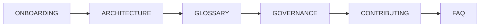

# Docs — ClubSchool AI OS 시스템 문서

이 디렉터리는 **ClubSchool AI OS v1.0** 시스템 자체를 설명하는 보충 문서 계층이다. 실무 산출물의 정본 지식은 `../GoldWiki/`(SSOT)에 있으며, `Docs/`는 "이 운영체제가 어떻게 구성되고 어떻게 운영·확장되는가"를 다룬다.

> 한 줄 요약: **무엇을 만드는가는 GoldWiki, 어떻게 굴러가는가는 Docs.**

## 문서 인덱스

| 문서 | 목적 | 주 독자 |
|---|---|---|
| [README.md](./README.md) | Docs 계층 인덱스(현재 문서) | 전체 |
| [ARCHITECTURE.md](./ARCHITECTURE.md) | 시스템 아키텍처·구성요소·데이터 흐름·확장 방법 | 운영자·개발자·AI |
| [GLOSSARY.md](./GLOSSARY.md) | 핵심 용어 30개+ 한국어 정의와 관련 문서 링크 | 전체(특히 신규) |
| [FAQ.md](./FAQ.md) | 설치·사용·운영 자주 묻는 질문 15개+ | 전체 |
| [GOVERNANCE.md](./GOVERNANCE.md) | SSOT 원칙·중복금지·4문서 갱신 규칙·행동강령 | 운영자·에이전트 |
| [CONTRIBUTING.md](./CONTRIBUTING.md) | 문서·에이전트·커맨드·템플릿 기여 규칙과 리뷰 절차 | 기여자(사람/AI) |
| [ONBOARDING.md](./ONBOARDING.md) | 신규 합류(사람/AI) 30분 빠른 시작과 체크리스트 | 신규 합류 |

## 리포지토리 지도

```
ClubSchool-AI-OS/
├── README.md / CLAUDE.md / INSTALL.md / ROADMAP.md / CHANGELOG.md
├── GoldWiki/      41개 지식 문서(00_~40_) — 단일 진실 공급원(SSOT)
├── .claude/
│   ├── agents/     22개 서브에이전트 정의(기계 사용용)
│   ├── commands/   슬래시 커맨드(.md)
│   ├── workflows/  워크플로우 정의
│   ├── prompts/    재사용 프롬프트
│   └── templates/  산출물 템플릿(기계 사용용)
├── Agents/         에이전트 조직/레지스트리(사람용)
├── Workflows/      워크플로우 런북(사람용)
├── Templates/      산출물 템플릿(사람용, 복사 사용)
├── Examples/       완성 예시 산출물
└── Docs/           아키텍처/용어집/FAQ/거버넌스/기여/온보딩 ← 현재 위치
```

## 읽는 순서 권장



1. **처음 합류**: `ONBOARDING.md` → `ARCHITECTURE.md` → `GLOSSARY.md`
2. **운영·의사결정 담당**: `GOVERNANCE.md` → `ARCHITECTURE.md`
3. **시스템에 기여**: `CONTRIBUTING.md` → `GOVERNANCE.md`
4. **막히는 점 해결**: `FAQ.md` → `../GoldWiki/39_COMMON_ERRORS.md`

## 관련 정본 문서(GoldWiki)

- 시작점: [`../GoldWiki/00_START_HERE.md`](../GoldWiki/00_START_HERE.md)
- 파이프라인 정본: [`../GoldWiki/27_AUTOMATION_WORKFLOW.md`](../GoldWiki/27_AUTOMATION_WORKFLOW.md)
- 서브에이전트 규칙: [`../GoldWiki/28_SUBAGENT_RULES.md`](../GoldWiki/28_SUBAGENT_RULES.md)
- 의사결정 로그: [`../GoldWiki/32_DECISION_LOG.md`](../GoldWiki/32_DECISION_LOG.md)
