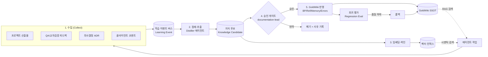
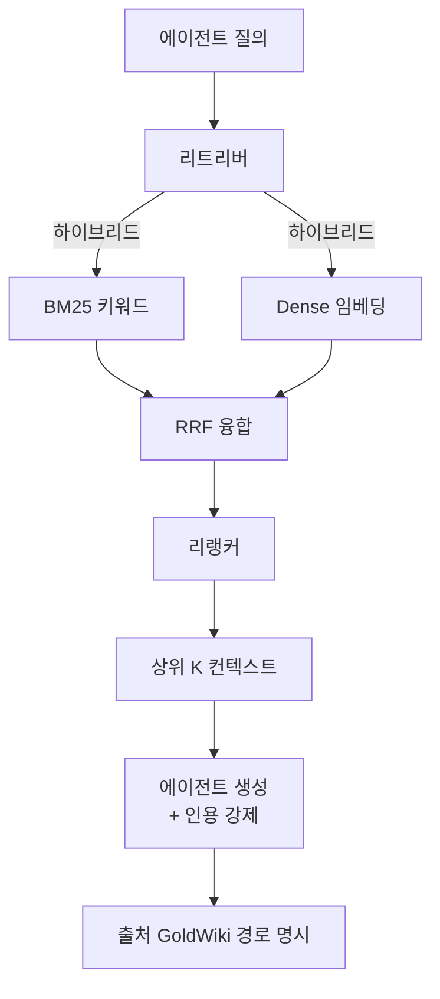
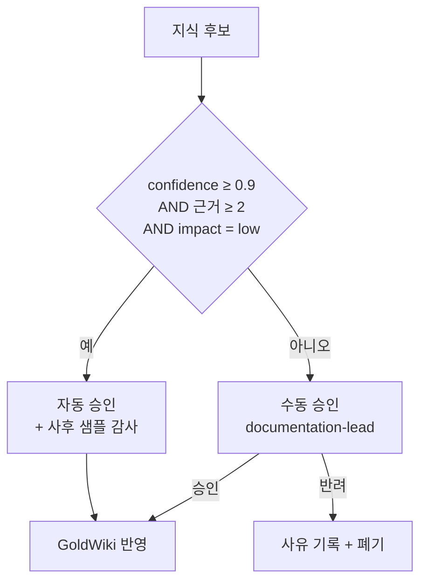

# 01 · 자동 학습 (Auto Learning) — ClubSchool AI OS v2.0

| 항목 | 내용 |
| --- | --- |
| **목적** | 모든 프로젝트 산출물·피드백·의사결정에서 재사용 가능한 패턴을 추출해 GoldWiki(베스트프랙티스·레퍼런스·프로젝트메모리·공통오류)와 벡터 인덱스를 자동 강화하는 학습 시스템을 설계한다. |
| **대상 독자** | ai-automation-lead, ai-engineer, documentation-lead, data-analytics-lead, 모든 산출 리드 |
| **담당(Owner)** | ai-automation-lead (파이프라인) · documentation-lead (SSOT 반영 승인) |
| **상태** | 설계(Design) |
| **관련 정본** | [GoldWiki/25_AI_GUIDE.md](../../GoldWiki/25_AI_GUIDE.md) · [GoldWiki/35_PROJECT_MEMORY.md](../../GoldWiki/35_PROJECT_MEMORY.md) · [GoldWiki/37_BEST_PRACTICES.md](../../GoldWiki/37_BEST_PRACTICES.md) |

---

## 1. 목적

v1.0에서 조직의 학습은 사람이 직접 산출물을 읽고 교훈을 베스트프랙티스 문서에 옮겨 적는 방식이다.
이는 느리고 누락이 잦으며, 같은 실수가 프로젝트마다 반복된다. 자동 학습은 **매 작업 단위에서 발생하는
신호(산출물, 사람·교차검증 피드백, 의사결정)를 자동으로 수집해 재사용 가능한 지식으로 정제하고, 사람 승인을
거쳐 GoldWiki에 반영**한다. 목표는 "프로젝트가 끝날 때마다 조직이 측정 가능하게 더 똑똑해지는 것"이다.

---

## 2. 현재 한계 (v1.0)

| 한계 | 영향 |
|------|------|
| 학습이 수기 의존 | 교훈 반영이 지연·누락되고 담당자 편차가 큼 |
| 검색이 키워드·경로 기반 | 유사 과거 사례를 의미 기반으로 찾지 못함(중복 작업 발생) |
| 피드백이 비구조화 | QA 반려·클라이언트 코멘트가 텍스트로 흩어져 패턴화되지 않음 |
| 회귀 방지 장치 없음 | 잘못된 교훈이 반영돼도 탐지·롤백 수단 부재 |
| 지식 버전 추적 부재 | 어떤 결정이 어떤 BP를 낳았는지 역추적 어려움 |

---

## 3. 목표 상태 (v2.0)

- 모든 산출물·게이트 결과·피드백·ADR이 **학습 이벤트(Learning Event)**로 표준 수집된다.
- 이벤트에서 **재사용 가능한 지식 후보(Knowledge Candidate)**(베스트프랙티스/레퍼런스/메모리/공통오류)가 자동 추출된다.
- 후보는 **임베딩되어 벡터 인덱스에 색인**되고, RAG로 에이전트가 작업 중 즉시 검색·인용한다.
- 후보의 GoldWiki 정본 반영은 **휴먼 인 더 루프 승인 게이트**를 통과해야 한다.
- 모든 반영은 **버전·출처·근거**가 남고, **회귀 평가(regression eval)**로 품질 하락 시 롤백된다.

---

## 4. 아키텍처



---

## 5. 구성요소

| 구성요소 | 책임 | 담당 |
|----------|------|------|
| **학습 이벤트 버스** | 산출물·피드백·결정을 표준 이벤트로 적재 | 런타임(coo-operator) |
| **Distiller(정제 에이전트)** | 이벤트에서 재사용 패턴을 추출해 후보 생성 | ai-automation-lead |
| **임베딩/색인기** | 후보·정본을 청크 단위로 임베딩해 벡터 인덱스 갱신 | ai-engineer |
| **벡터 인덱스** | RAG 검색 대상(의미 기반 유사 사례 조회) | ai-engineer |
| **승인 게이트** | 후보의 정본 반영 여부 판정(휴먼 인 더 루프) | documentation-lead |
| **회귀 평가기** | 반영 전후 품질·검색 정확도를 비교, 하락 시 롤백 | qa-lead |
| **지식 버전 저장소** | 후보·반영본의 SemVer·출처·diff 보관 | documentation-lead |

---

## 6. 데이터 흐름 (수집 → 정제 → 임베딩/색인 → 승인 게이트 → GoldWiki 반영)

1. **수집:** 에이전트가 작업을 완료하거나 게이트 결과가 나올 때마다 런타임이 `learning.event`를 버스에 발행한다.
2. **정제·추출:** Distiller가 일정 주기(또는 Job 종료 트리거)로 이벤트를 묶어 LLM 추출 프롬프트로
   "무엇이 통했고/실패했고/재사용 가능한가"를 분류해 `knowledge.candidate`를 만든다. 각 후보는
   대상 GoldWiki 문서(BP/Ref/Memory/Errors)와 신뢰도 점수를 갖는다.
3. **임베딩/색인:** 후보 본문을 청크(권장 300~800 토큰, 15% 오버랩)로 나눠 임베딩하고 벡터 인덱스에 upsert한다.
   메타데이터(출처 Job, 분야, 버전, 승인 상태)를 함께 저장해 필터링 검색을 지원한다.
4. **승인 게이트:** 신뢰도·영향도에 따라 자동 승인 후보군과 수동 승인 후보군을 나눈다(§9 참조).
   documentation-lead가 콘솔에서 diff를 검토해 승인/반려한다.
5. **GoldWiki 반영:** 승인 후보는 PR로 정본에 병합되며, 동일 작업 단위에서 [의사결정 로그](../../GoldWiki/32_DECISION_LOG.md)에
   ADR을, [프로젝트 메모리](../../GoldWiki/35_PROJECT_MEMORY.md)에 연결을 남긴다(CLAUDE.md "두뇌 갱신" 규칙 준수).

---

## 7. RAG·임베딩 인덱스 설계



설계 원칙:

- **하이브리드 검색.** Dense(임베딩) + Sparse(BM25)를 RRF로 융합 후 리랭커로 상위 K(권장 5~8)를 선택한다.
  표준명·코드·식별자 같은 정확 매칭이 중요한 도메인 특성상 키워드 검색을 반드시 병행한다.
- **정본 우선 인용.** 생성 응답은 검색된 GoldWiki 정본 경로를 인용해야 하며, 인용 없는 주장은 가드레일이 차단한다.
- **인덱스 신선도.** GoldWiki 변경 시 해당 문서만 증분 재색인하고, 야간에 전체 정합성 점검을 수행한다.
- **분리·격리.** 멀티 프로젝트 운영 시 프로젝트 메모리는 `project_id` 네임스페이스로 격리한다(05 문서 연계).

### 청크 메타데이터 예시 (JSON)

```json
{
  "chunk_id": "bp-2026-0612-uxflow-7-c03",
  "source_doc": "GoldWiki/37_BEST_PRACTICES.md",
  "source_section": "온보딩 플로우 이탈 감소",
  "project_id": "youth-club-platform",
  "domain": "ux",
  "version": "1.4.0",
  "approval_status": "approved",
  "embedding_model": "text-embedding-v3",
  "text": "온보딩 1화면당 입력 필드는 3개 이하로 제한하고, 진행률 인디케이터를 노출하면 이탈이 유의하게 감소한다...",
  "created_from_job": "job_8f21",
  "confidence": 0.86
}
```

---

## 8. 인터페이스 (스키마·예시 JSON)

### 8.1 학습 이벤트 (`learning.event`)

```json
{
  "event_id": "evt_01HX9...",
  "type": "deliverable_completed",
  "job_id": "job_8f21",
  "project_id": "youth-club-platform",
  "agent": "ux-research-lead",
  "stage": "13_user_flow",
  "artifact_path": "Examples/youth-club/13_user_flow.md",
  "signals": {
    "qa_first_pass": false,
    "rework_count": 2,
    "board_score": 91,
    "human_feedback": "온보딩 단계가 길어 이탈 우려, 단축안 반영 후 통과",
    "linked_adr": "GoldWiki/32_DECISION_LOG.md#adr-0142"
  },
  "created_at": "2026-06-12T08:30:00Z"
}
```

### 8.2 지식 후보 (`knowledge.candidate`)

```json
{
  "candidate_id": "kc_01HXA...",
  "category": "best_practice",
  "target_doc": "GoldWiki/37_BEST_PRACTICES.md",
  "title": "온보딩 화면당 입력 필드 3개 이하 원칙",
  "body": "신규 가입 온보딩에서 화면당 입력 필드를 3개 이하로 제한하고 진행률을 노출하면 이탈률이 감소한다. 근거: youth-club-platform 2회 재작업 후 Board 91점 통과.",
  "evidence": ["job_8f21", "GoldWiki/32_DECISION_LOG.md#adr-0142"],
  "confidence": 0.86,
  "impact": "medium",
  "auto_approvable": false,
  "proposed_version_bump": "minor",
  "status": "pending_review",
  "created_at": "2026-06-12T09:00:00Z"
}
```

### 8.3 승인 결정 (`learning.approval`)

```json
{
  "candidate_id": "kc_01HXA...",
  "decision": "approved",
  "approver": "documentation-lead",
  "edits": "근거 문장에 정량 수치(이탈률 -18%) 추가",
  "merged_pr": "PR-219",
  "new_version": "GoldWiki/37_BEST_PRACTICES.md@1.4.0",
  "decided_at": "2026-06-12T10:15:00Z"
}
```

---

## 9. 실패 모드와 가드레일

| 실패 모드 | 위험 | 가드레일 |
|-----------|------|----------|
| 잘못된 일반화 | 단일 사례를 보편 원칙으로 오인 | 최소 근거 수·신뢰도 임계(자동 승인은 confidence ≥ 0.9 **그리고** 근거 ≥ 2건) |
| 환각 후보 | 존재하지 않는 출처 인용 | 후보의 `evidence` 경로 실재 검증, 미검증 시 자동 반려 |
| 지식 중복/충돌 | SSOT 중복·상호 모순 | 벡터 유사도 중복 탐지(≥ 0.92면 병합 제안), 모순 시 ADR로 충돌 해소 |
| 회귀(품질 하락) | 새 지식이 검색·산출 품질을 떨어뜨림 | 반영 전후 회귀 평가, 골든셋 점수 하락 시 자동 롤백 |
| 민감정보 학습 | 클라이언트 비밀이 BP에 유출 | 수집 단계 PII/기밀 필터, `client_confidential` 태그는 메모리에만 격리 |
| 자동 승인 폭주 | 검토 없이 대량 반영 | 자동 승인 항목도 일일 한도·사후 샘플 감사 |

자동/수동 승인 분기:



---

## 10. 도입 단계 (마일스톤)

| 단계 | 내용 | 산출 |
|------|------|------|
| M4.1 | 학습 이벤트 스키마·버스 정의, 런타임 발행 연동 | 이벤트 적재 |
| M4.2 | 벡터 인덱스 구축 + 하이브리드 RAG, 에이전트 검색 연동 | RAG 검색 가동 |
| M4.3 | Distiller 추출 + 후보 생성, 콘솔 승인 UX | 후보 검토 루프 |
| M4.4 | 자동 승인 분기 + 회귀 평가 + 롤백 | 안전 자동 반영 |
| M4.5 | 멀티 프로젝트 네임스페이스 격리 | 격리된 메모리 |

---

## 11. 성공 지표 (KPI)

| KPI | 목표 |
|-----|------|
| 지식 자동 강화율 | ≥ 5건/프로젝트(승인 반영 기준) |
| RAG 검색 정확도(Recall@8) | ≥ 0.85 (골든셋 기준) |
| 후보 승인율 | 0.6~0.85 (너무 높으면 기준 느슨, 너무 낮으면 추출 품질 문제) |
| 동일 오류 재발률 | 전분기 대비 −40% |
| 회귀 롤백 발생률 | ≤ 5% |

---

## 12. 관련 GoldWiki 문서

- [GoldWiki/25_AI_GUIDE.md](../../GoldWiki/25_AI_GUIDE.md) · [GoldWiki/26_PROMPT_ENGINEERING.md](../../GoldWiki/26_PROMPT_ENGINEERING.md)
- [GoldWiki/35_PROJECT_MEMORY.md](../../GoldWiki/35_PROJECT_MEMORY.md) · [GoldWiki/36_REFERENCE_LIBRARY.md](../../GoldWiki/36_REFERENCE_LIBRARY.md)
- [GoldWiki/37_BEST_PRACTICES.md](../../GoldWiki/37_BEST_PRACTICES.md) · [GoldWiki/39_COMMON_ERRORS.md](../../GoldWiki/39_COMMON_ERRORS.md)
- [GoldWiki/32_DECISION_LOG.md](../../GoldWiki/32_DECISION_LOG.md)
- 연계: [02_AutoUpdate.md](02_AutoUpdate.md) · [03_QALoop.md](03_QALoop.md) · [05_Orchestration_and_Console.md](05_Orchestration_and_Console.md)
