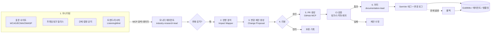
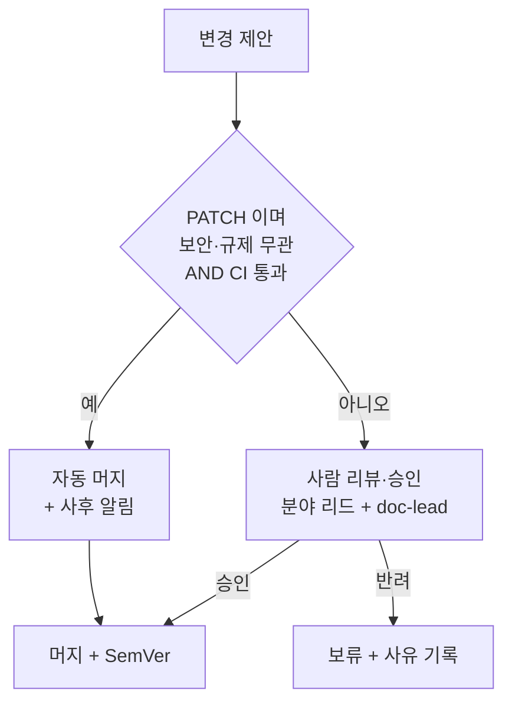

# 02 · 자동 업데이트 (Auto Update) — ClubSchool AI OS v2.0

| 항목 | 내용 |
| --- | --- |
| **목적** | 외부 표준·트렌드·규제 변화를 모니터링해 에이전트·커맨드·템플릿·GoldWiki 문서를 안전하게 자동 개정(제안→리뷰→PR→머지)하고, SemVer·변경 로그·롤백으로 통제하는 시스템을 설계한다. |
| **대상 독자** | ai-automation-lead, documentation-lead, industry-research-lead, security-risk-lead, devops-engineer |
| **담당(Owner)** | documentation-lead (SSOT 무결성·머지 권한) · ai-automation-lead (모니터링·제안 생성) |
| **상태** | 설계(Design) |
| **관련 정본** | [GoldWiki/31_RELEASE_PROCESS.md](../../GoldWiki/31_RELEASE_PROCESS.md) · [GoldWiki/32_DECISION_LOG.md](../../GoldWiki/32_DECISION_LOG.md) · [GoldWiki/36_REFERENCE_LIBRARY.md](../../GoldWiki/36_REFERENCE_LIBRARY.md) |

---

## 1. 목적

조직의 두뇌(GoldWiki)와 실행 자산(에이전트·커맨드·템플릿)은 외부 세계가 바뀌면 낡는다. WCAG 버전 상향,
프레임워크 메이저 릴리스, API 보안 권고, 개인정보 규제 개정, 디자인 트렌드 변화 등은 표준을 즉시 무효화한다.
자동 업데이트는 **이런 외부 변화를 상시 감시하고, 영향받는 자산을 식별해 개정안을 제안하며, 사람 리뷰를 거쳐
PR로 안전하게 반영**한다. 핵심 가치는 "조직이 항상 최신 표준 위에서 일하게 하는 것"이다.

---

## 2. 현재 한계 (v1.0)

| 한계 | 영향 |
|------|------|
| 외부 변화 감시 부재 | 표준 노후화를 사람이 우연히 인지할 때까지 방치 |
| 개정의 영향 범위 불명 | 한 표준 변경이 어느 문서·에이전트·템플릿에 파급되는지 추적 불가 |
| 변경이 수동·산발적 | 일관성 없는 개정, 누락·충돌 발생 |
| 버전·롤백 체계 미흡 | 잘못된 개정의 신속 원복 곤란 |

---

## 3. 목표 상태 (v2.0)

- **모니터 에이전트**가 외부 소스(표준 사이트·릴리스 노트·규제 공지·트렌드)를 주기 수집한다(MCP 검색·데이터 연동, 04 문서).
- 변화가 감지되면 **영향 분석기**가 GoldWiki·에이전트·커맨드·템플릿 중 영향받는 자산을 매핑한다.
- 자산별 **변경 제안(Change Proposal)**을 생성하고, **리뷰 → PR → 머지** 흐름으로 반영한다.
- 모든 자산은 **SemVer**로 버전화되고, **변경 로그**와 **롤백** 경로를 갖는다.
- **documentation-lead**가 SSOT 무결성(중복 금지·링크 정합·정본 단일성)을 강제한다.

---

## 4. 아키텍처



---

## 5. 구성요소

| 구성요소 | 책임 | 담당 |
|----------|------|------|
| **모니터 에이전트** | 외부 소스 주기 수집·변화 감지·요약 | industry-research-lead |
| **영향 분석기(Impact Mapper)** | 변화 → 영향 자산 매핑(역색인 활용) | ai-automation-lead |
| **제안 생성기** | 자산별 diff 형태 변경 제안 작성 | ai-automation-lead |
| **리뷰어** | 분야별 정확성 검토(보안·디자인·엔지니어링) | 해당 분야 리드 |
| **머지 게이트** | SSOT 무결성 강제·최종 머지 | documentation-lead |
| **CI 검증** | 링크 무결성·스키마·골든셋 회귀 점검 | devops-engineer |
| **버전/롤백 관리** | SemVer 태깅·변경 로그·원복 | devops-engineer |

영향 분석은 **자산 ↔ 외부 표준 매핑(역색인)**에 의존한다. 예: `GoldWiki/16_ACCESSIBILITY.md` → `WCAG`,
`GoldWiki/22_API_STANDARD.md` → `OpenAPI`, `accessibility-specialist` 에이전트 → `WCAG`. 이 매핑은 학습
파이프라인(01)이 함께 갱신한다.

---

## 6. 데이터 흐름 (모니터링 → 영향 분석 → 제안 → 리뷰 → PR → 머지 → 버전/롤백)

1. **모니터링:** 모니터 에이전트가 스케줄(예: 일 1회)로 외부 소스를 수집하고, 직전 스냅샷과 비교해 변화를 추출한다.
2. **영향 분석:** 감지된 변화 토픽으로 역색인을 조회해 영향 자산 목록과 우선순위(영향도×긴급도)를 산출한다.
3. **제안 생성:** 자산별로 "현행 → 개정" diff와 근거(출처 URL·인용)를 담은 변경 제안을 만든다.
4. **리뷰:** 분야 리드가 정확성·적합성을 검토(보안 권고는 security-risk-lead 필수). 규제·비가역 변경은 사람 승인 필수.
5. **PR:** 승인된 제안을 GitHub MCP로 PR 생성. PR 본문에 변경 제안 JSON과 ADR 링크를 첨부한다.
6. **CI 검증:** 링크 무결성(`/goldwiki-sync`), 스키마 검증, 골든셋 회귀 평가를 자동 실행한다.
7. **머지:** documentation-lead가 SSOT 무결성을 확인하고 머지. SemVer 범프와 변경 로그를 기록한다.
8. **롤백:** 머지 후 회귀·오류 발생 시 직전 태그로 원복하고 사유를 ADR에 남긴다.

SemVer 적용 기준:

| 범프 | 의미 | 예시 |
|------|------|------|
| **MAJOR** | 하위 호환 깨짐(표준 폐기·인터페이스 변경) | WCAG 2.x → 3.0 전환, API 계약 변경 |
| **MINOR** | 하위 호환 기능 추가·보강 | 새 베스트프랙티스 추가, 새 토큰 |
| **PATCH** | 오타·링크·세부 보정 | 인용 갱신, 깨진 링크 수정 |

---

## 7. 인터페이스 (변경 제안 스키마 JSON)

### 7.1 변경 제안 (`change.proposal`)

```json
{
  "proposal_id": "cp_01HXB...",
  "trigger": {
    "source": "https://www.w3.org/TR/WCAG22/",
    "detected_change": "WCAG 2.2 신규 성공기준 2.4.11 Focus Not Obscured 추가",
    "detected_at": "2026-06-20T02:00:00Z",
    "monitor_agent": "industry-research-lead",
    "category": "accessibility_standard",
    "severity": "high"
  },
  "impacted_assets": [
    { "path": "GoldWiki/16_ACCESSIBILITY.md", "current_version": "1.2.0", "proposed_bump": "minor" },
    { "path": ".claude/agents/accessibility-specialist.md", "current_version": "1.0.0", "proposed_bump": "minor" },
    { "path": "GoldWiki/29_QUALITY_CHECKLIST.md", "current_version": "1.3.0", "proposed_bump": "patch" }
  ],
  "diffs": [
    {
      "path": "GoldWiki/16_ACCESSIBILITY.md",
      "section": "포커스 가시성",
      "before": "포커스 표시는 WCAG 2.4.7을 충족한다.",
      "after": "포커스 표시는 WCAG 2.4.7 및 2.2의 2.4.11(Focus Not Obscured)을 충족하며, 고정 헤더가 포커스 요소를 가리지 않아야 한다."
    }
  ],
  "evidence": ["https://www.w3.org/TR/WCAG22/#focus-not-obscured-minimum"],
  "requires_human_approval": true,
  "reviewers": ["accessibility-specialist", "documentation-lead"],
  "status": "pending_review",
  "linked_adr": null
}
```

### 7.2 머지 결과 (`change.merge`)

```json
{
  "proposal_id": "cp_01HXB...",
  "decision": "merged",
  "pr": "PR-231",
  "merged_by": "documentation-lead",
  "version_bumps": [
    { "path": "GoldWiki/16_ACCESSIBILITY.md", "from": "1.2.0", "to": "1.3.0" },
    { "path": ".claude/agents/accessibility-specialist.md", "from": "1.0.0", "to": "1.1.0" }
  ],
  "changelog_entry": "WCAG 2.2 2.4.11 반영(포커스 가림 금지)",
  "rollback_ref": "tag:goldwiki-2026.06.19",
  "linked_adr": "GoldWiki/32_DECISION_LOG.md#adr-0151",
  "ci": { "link_check": "pass", "schema": "pass", "regression": "pass" },
  "merged_at": "2026-06-21T05:00:00Z"
}
```

---

## 8. 실패 모드와 가드레일

| 실패 모드 | 위험 | 가드레일 |
|-----------|------|----------|
| 거짓 양성(변화 오탐) | 불필요한 개정 폭주 | 변화 신뢰도 임계 + 사람 리뷰 필수 게이트 |
| 출처 신뢰성 저하 | 비공식·잘못된 소스 인용 | 허용 소스 화이트리스트(공식 표준·1차 출처만) |
| SSOT 무결성 훼손 | 중복·정본 분열·링크 단절 | documentation-lead 머지 게이트 + `/goldwiki-sync` CI |
| 연쇄 변경 누락 | 일부 영향 자산만 개정 | 영향 분석 완결성 체크(매핑된 자산 전수 포함 검증) |
| 비가역 자동 머지 | 검토 없이 MAJOR 반영 | MAJOR·규제·보안 변경은 자동 머지 금지, 사람 승인 필수 |
| 롤백 불가 | 잘못된 머지 원복 실패 | 머지 전 태그 스냅샷 + 단일 명령 롤백 보장 |

자동/수동 머지 분기:



---

## 9. 도입 단계 (마일스톤)

| 단계 | 내용 | 산출 |
|------|------|------|
| M5.1 | 허용 소스 정의 + 모니터 에이전트 스케줄 수집 | 변화 감지 로그 |
| M5.2 | 자산↔표준 역색인 + 영향 분석기 | 영향 매핑 |
| M5.3 | 변경 제안 생성 + 콘솔 리뷰 UX | 제안 검토 루프 |
| M5.4 | GitHub MCP PR + CI(링크/스키마/회귀) | 자동 PR |
| M5.5 | SemVer·변경 로그·롤백 자동화 | 안전 머지·원복 |

---

## 10. 성공 지표 (KPI)

| KPI | 목표 |
|-----|------|
| 표준 최신성 지연 | 외부 변경 → 반영까지 ≤ 14일 |
| 제안 정확도(머지율) | ≥ 0.7 (오탐 적음) |
| 영향 분석 완결성 | 누락 영향 자산 ≤ 2% |
| 자동 머지 사고율 | 롤백 유발 자동 머지 ≤ 3% |
| SSOT 무결성 위반 | `/goldwiki-sync` 위반 0건 유지 |

---

## 11. 관련 GoldWiki 문서

- [GoldWiki/31_RELEASE_PROCESS.md](../../GoldWiki/31_RELEASE_PROCESS.md) · [GoldWiki/32_DECISION_LOG.md](../../GoldWiki/32_DECISION_LOG.md)
- [GoldWiki/16_ACCESSIBILITY.md](../../GoldWiki/16_ACCESSIBILITY.md) · [GoldWiki/22_API_STANDARD.md](../../GoldWiki/22_API_STANDARD.md) · [GoldWiki/24_SECURITY_GUIDE.md](../../GoldWiki/24_SECURITY_GUIDE.md)
- [GoldWiki/36_REFERENCE_LIBRARY.md](../../GoldWiki/36_REFERENCE_LIBRARY.md) · [GoldWiki/29_QUALITY_CHECKLIST.md](../../GoldWiki/29_QUALITY_CHECKLIST.md)
- 연계: [01_AutoLearning.md](01_AutoLearning.md) · [04_MCP_MultiAgent.md](04_MCP_MultiAgent.md)
