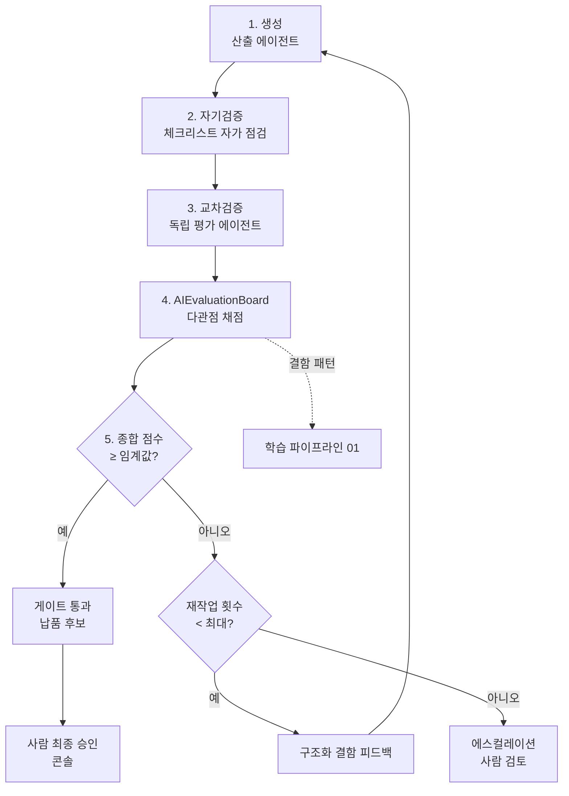

# 03 · 자동 품질 검증 루프 (QA Loop) — ClubSchool AI OS v2.0

| 항목 | 내용 |
| --- | --- |
| **목적** | 모든 산출물이 사람에게 도달하기 전, 생성→자기검증→교차검증→AIEvaluationBoard 채점→미달 시 자동 재작업의 폐루프(closed loop)를 거쳐 GoldWiki/QA의 품질 체계를 자동 통과하도록 설계한다. |
| **대상 독자** | qa-lead, qa-engineer, ai-automation-lead, coo-operator, 모든 산출 리드 |
| **담당(Owner)** | qa-lead (루프 운영) · coo-operator (게이트 판정·에스컬레이션) |
| **상태** | 설계(Design) |
| **관련 정본** | [GoldWiki/29_QUALITY_CHECKLIST.md](../../GoldWiki/29_QUALITY_CHECKLIST.md) · [GoldWiki/30_TEST_STRATEGY.md](../../GoldWiki/30_TEST_STRATEGY.md) · [GoldWiki/Proposal/AIEvaluationBoard.md](../../GoldWiki/Proposal/AIEvaluationBoard.md) |

---

## 1. 목적

v1.0의 품질 게이트는 사람이 [마스터 품질 체크리스트](../../GoldWiki/29_QUALITY_CHECKLIST.md)를 수동으로 판정한다.
이는 일관성·속도·확장성에 한계가 있다. QA 루프는 **모든 산출물을 자동으로 채점하고, 임계 점수에 미달하면
생성 에이전트에게 구체적 피드백과 함께 재작업을 지시하며, 통과할 때까지(또는 한도 도달 시 사람에게
에스컬레이션) 반복**한다. 목표는 "사람이 보는 첫 산출물은 이미 검증을 통과한 것"이다.

---

## 2. 현재 한계 (v1.0)

| 한계 | 영향 |
|------|------|
| 수동 게이트 | 판정자 편차·지연, 야간/대량 처리 불가 |
| 단일 검증 | 생성 에이전트의 사각지대가 그대로 통과 |
| 피드백 비구조화 | 반려 사유가 모호해 재작업 방향이 불명확 |
| 반복 통제 부재 | 무한 재작업·비용 폭주 위험 |

---

## 3. 목표 상태 (v2.0)

- 산출물은 **10단계 품질 검증 체계**를 자동 통과해야 납품된다.
- **3중 검증:** ① 자기검증(생성 에이전트) → ② 교차검증(다른 에이전트가 독립 평가) → ③ AIEvaluationBoard 채점.
- 미달 시 **자동 재작업 루프**: 구조화된 결함 목록을 생성 에이전트에 반환해 재생성.
- **점수 임계값·최대 반복 횟수·에스컬레이션**으로 비용·무한루프를 통제한다.

---

## 4. 아키텍처



---

## 5. 10단계 품질 검증 체계

[GoldWiki/29_QUALITY_CHECKLIST.md](../../GoldWiki/29_QUALITY_CHECKLIST.md)의 분야별 체크리스트를 자동화 단계로 매핑한다.

| # | 단계 | 검증 내용 | 자동화 방식 |
|---|------|-----------|-------------|
| 1 | 스키마/구조 | 산출물 형식·필수 섹션 충족 | 정적 검증 |
| 2 | 골드위키 정합 | SSOT 표준·인용 일치, 링크 무결 | RAG 대조 + 링크 체크 |
| 3 | 요구사항 추적성 | RFP 요구사항 매핑 누락 없음 | 추적표 대조 |
| 4 | 사실 정확성 | 수치·주장·인용의 근거 존재 | 교차검증 + 출처 확인 |
| 5 | 분야 전문성 | 분야별 체크리스트(UX/UI/접근성/보안 등) | 분야 평가 프롬프트 |
| 6 | 접근성/보안 | WCAG·OWASP 등 필수 기준 | 규칙 기반 + 평가 |
| 7 | 일관성 | 용어·톤·이전 산출물과 정합 | 일관성 평가 |
| 8 | 완결성 | 엣지 케이스·빈 상태·오류 처리 포함 | 평가 프롬프트 |
| 9 | 언어 품질 | 자연스러운 한국어, 플레이스홀더·AI 상투어 금지 | 언어 평가 |
| 10 | 클라이언트 준비 | 경영진 수준·제출 가능성 | Board 종합 판정 |

---

## 6. 구성요소

| 구성요소 | 책임 | 담당 |
|----------|------|------|
| **자기검증기** | 생성 직후 자체 체크리스트 점검·자기 수정 | 산출 에이전트 |
| **교차검증 에이전트** | 생성자와 다른 독립 에이전트가 결함 적발 | 분야 리드(생성자와 분리) |
| **AIEvaluationBoard** | 다관점 페르소나로 채점·종합 점수 산출 | qa-lead 운영 |
| **게이트 판정기** | 임계·반복·에스컬레이션 규칙 적용 | coo-operator |
| **결함 피드백 생성기** | 점수 미달 항목을 실행 가능한 수정 지시로 변환 | qa-lead |

교차검증의 **독립성 보장**: 산출 에이전트와 교차검증 에이전트는 반드시 다른 인스턴스여야 하며,
교차검증기는 생성 시 사용한 추론 컨텍스트를 보지 않고 산출물만 본다(편향 차단).

---

## 7. 데이터 흐름 (생성 → 자기검증 → 교차검증 → Board 채점 → 재작업 루프 → 게이트)

1. **생성:** 산출 에이전트가 GoldWiki·RAG를 참조해 산출물을 만든다.
2. **자기검증:** 동일 에이전트가 해당 분야 체크리스트로 자가 점검·1차 자기 수정한다.
3. **교차검증:** 독립 에이전트가 산출물만 보고 결함을 적발해 점수·코멘트를 낸다.
4. **Board 채점:** AIEvaluationBoard가 다관점(클라이언트/평가위원/전문가)으로 항목별 점수를 매긴다.
5. **종합 판정:** 가중 평균이 임계 이상이면 통과, 미만이면 결함 피드백을 생성한다.
6. **재작업:** 결함 피드백을 입력으로 생성 에이전트가 재생성한다(반복).
7. **한도/에스컬레이션:** 최대 반복(권장 3회) 도달 시 사람에게 에스컬레이션한다.
8. **학습 연계:** Board가 본 결함 패턴은 학습 파이프라인(01)으로 흘러 공통오류·베스트프랙티스를 강화한다.

임계값·반복 규칙(권장 기본값, 분야별 조정 가능):

| 파라미터 | 기본값 | 비고 |
|----------|--------|------|
| 통과 임계(종합) | 85 / 100 | 클라이언트 제출물은 90 |
| 항목 최저선(critical) | 모든 critical 항목 ≥ 80 | 접근성·보안·사실정확성은 미달 시 무조건 반려 |
| 최대 재작업 | 3회 | 초과 시 에스컬레이션 |
| 교차검증 가중 | 0.4 | Board 0.5, 자기검증 0.1 |
| 에스컬레이션 트리거 | 한도 초과 또는 점수 정체(개선 < 2점) | 사람 검토 큐로 이동 |

---

## 8. 인터페이스 (평가 결과 스키마 JSON)

### 8.1 평가 결과 (`qa.evaluation`)

```json
{
  "evaluation_id": "qae_01HXC...",
  "job_id": "job_8f21",
  "artifact_path": "Examples/youth-club/05_proposal_strategy.md",
  "iteration": 2,
  "stage": "proposal",
  "self_check": { "passed_items": 8, "total_items": 9, "auto_fixed": ["언어 상투어 1건 제거"] },
  "cross_review": {
    "reviewer_agent": "proposal-lead",
    "score": 82,
    "findings": [
      { "item": "evaluation_criteria_mapping", "severity": "high", "comment": "배점 30% 항목에 대응 강점 누락" }
    ]
  },
  "board": {
    "panelists": [
      { "persona": "client_evaluator", "score": 80 },
      { "persona": "domain_expert", "score": 86 },
      { "persona": "executive_reviewer", "score": 88 }
    ],
    "weighted_score": 84.6
  },
  "composite_score": 83.8,
  "threshold": 85,
  "critical_violations": [],
  "verdict": "rework",
  "feedback": [
    { "target_section": "win theme", "action": "평가배점 30% 항목과 1:1 대응하는 차별화 강점 1문단 추가" }
  ],
  "next_action": "regenerate",
  "evaluated_at": "2026-06-12T11:00:00Z"
}
```

### 8.2 게이트 결정 (`qa.gate`)

```json
{
  "job_id": "job_8f21",
  "artifact_path": "Examples/youth-club/05_proposal_strategy.md",
  "final_iteration": 3,
  "composite_score": 91.2,
  "verdict": "pass",
  "gate": "Gate A — 전략 승인",
  "decided_by": "coo-operator",
  "human_approval_required": true,
  "linked_adr": "GoldWiki/32_DECISION_LOG.md#adr-0144",
  "decided_at": "2026-06-12T11:40:00Z"
}
```

---

## 9. 실패 모드와 가드레일

| 실패 모드 | 위험 | 가드레일 |
|-----------|------|----------|
| 무한 재작업 | 비용·시간 폭주 | 최대 반복 한도 + 점수 정체 감지 → 에스컬레이션 |
| 평가자 담합/편향 | 생성·검증이 같은 추론 공유 | 교차검증 독립 인스턴스·컨텍스트 분리 강제 |
| 점수 인플레이션 | 채점이 후하게 수렴 | 골든셋 보정(라벨된 좋은/나쁜 산출물로 채점기 캘리브레이션) |
| critical 항목 우회 | 접근성·보안 미달이 평균에 묻힘 | critical 미달 시 종합 점수와 무관하게 무조건 반려 |
| 환각 평가 | 존재하지 않는 결함 지적 | 결함은 산출물 내 위치(섹션) 명시 필수, 미검증 결함 무시 |
| 통과 후 회귀 | 사람 승인 단계에서 품질 하락 발견 | 사람 반려도 학습 이벤트로 기록(01 연계) |

---

## 10. 도입 단계 (마일스톤)

| 단계 | 내용 | 산출 |
|------|------|------|
| M2.1 | 10단계 체계를 자동 평가 항목으로 매핑 | 평가 룰셋 |
| M2.2 | 자기검증 + 교차검증 에이전트 분리 구현 | 2중 검증 |
| M2.3 | AIEvaluationBoard 채점 + 골든셋 캘리브레이션 | 3중 검증 |
| M2.4 | 자동 재작업 루프 + 한도·에스컬레이션 | 폐루프 가동 |
| M2.5 | `/qa-gate` 커맨드 루프화 + 콘솔 가시화 | 운영 통합 |

---

## 11. 성공 지표 (KPI)

| KPI | 목표 |
|-----|------|
| 1차 통과율 | ≥ 80% |
| 평균 재작업 횟수 | ≤ 1.5회 |
| 채점-사람 일치도 | Board 판정과 사람 판정 일치율 ≥ 0.85 |
| critical 누락 적발 | 사람 단계 추가 발견 결함 ≤ 5% |
| 에스컬레이션 비율 | ≤ 10% |

---

## 12. 관련 GoldWiki 문서

- [GoldWiki/29_QUALITY_CHECKLIST.md](../../GoldWiki/29_QUALITY_CHECKLIST.md) · [GoldWiki/30_TEST_STRATEGY.md](../../GoldWiki/30_TEST_STRATEGY.md)
- [GoldWiki/Proposal/AIEvaluationBoard.md](../../GoldWiki/Proposal/AIEvaluationBoard.md) · [GoldWiki/Proposal/AIClientSimulation.md](../../GoldWiki/Proposal/AIClientSimulation.md)
- [GoldWiki/39_COMMON_ERRORS.md](../../GoldWiki/39_COMMON_ERRORS.md) · [GoldWiki/27_AUTOMATION_WORKFLOW.md](../../GoldWiki/27_AUTOMATION_WORKFLOW.md)
- 연계: [01_AutoLearning.md](01_AutoLearning.md) · [05_Orchestration_and_Console.md](05_Orchestration_and_Console.md)
