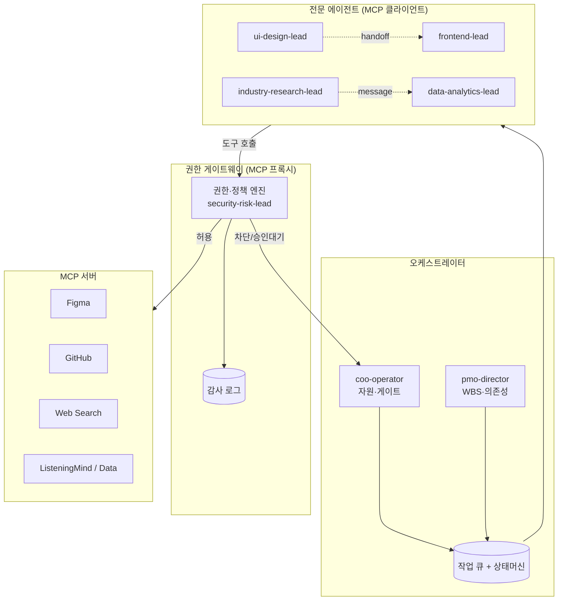
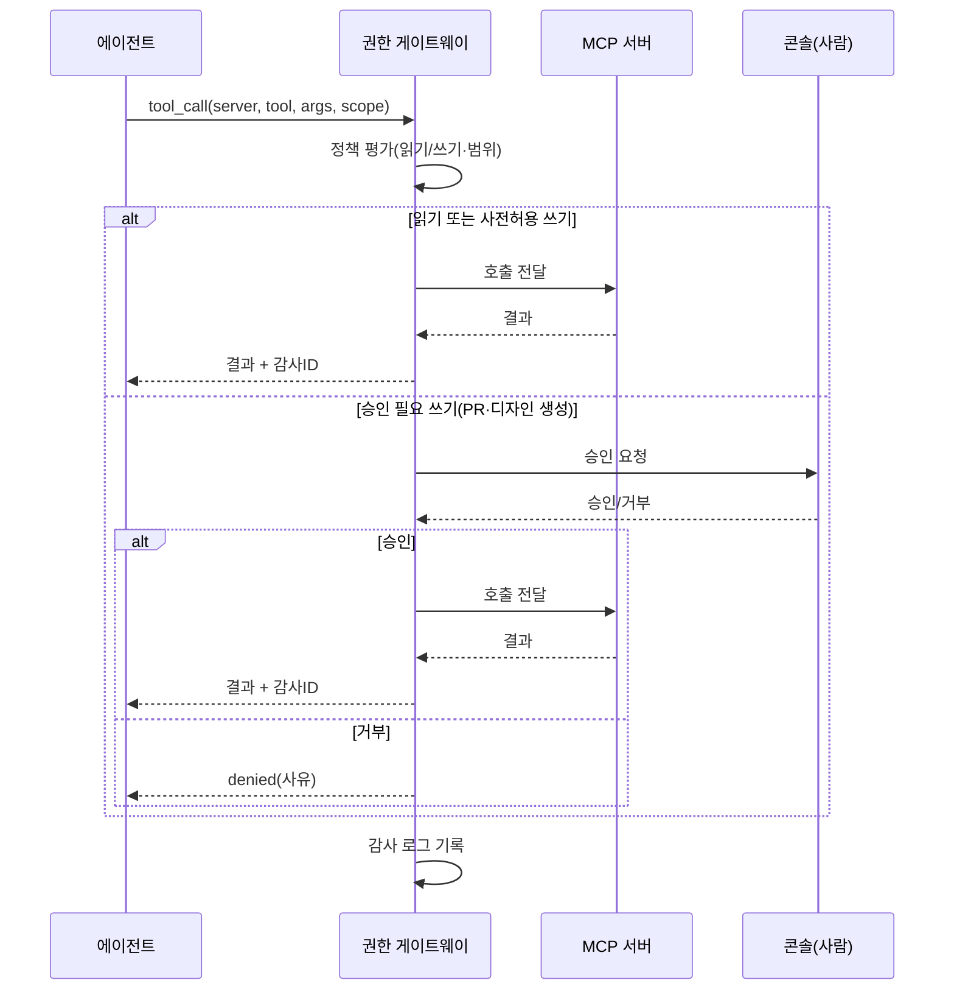
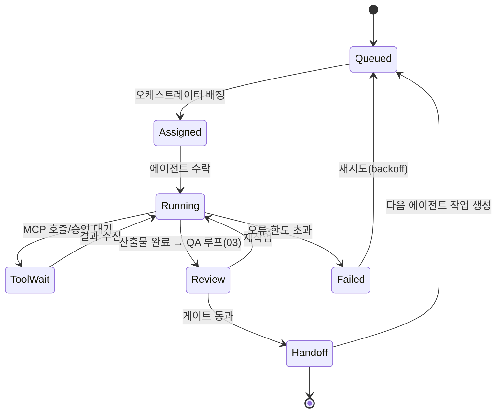

# 04 · MCP 멀티에이전트 협업 — ClubSchool AI OS v2.0

| 항목 | 내용 |
| --- | --- |
| **목적** | Model Context Protocol(MCP)로 외부 도구/서버(Figma·GitHub·Web Search·Data·ListeningMind 등)를 안전하게 연동하고, 에이전트 간 메시지/핸드오프 프로토콜·작업 큐·상태머신·권한 경계를 설계한다. |
| **대상 독자** | ai-automation-lead, ai-engineer, coo-operator, pmo-director, security-risk-lead, devops-engineer |
| **담당(Owner)** | ai-automation-lead (프로토콜) · security-risk-lead (권한·보안 경계) |
| **상태** | 설계(Design) |
| **관련 정본** | [GoldWiki/25_AI_GUIDE.md](../../GoldWiki/25_AI_GUIDE.md) · [GoldWiki/28_SUBAGENT_RULES.md](../../GoldWiki/28_SUBAGENT_RULES.md) · [GoldWiki/24_SECURITY_GUIDE.md](../../GoldWiki/24_SECURITY_GUIDE.md) |

---

## 1. 목적

v1.0 에이전트는 텍스트 산출에 머문다. 디자인을 Figma에 만들고, 코드를 GitHub에 PR로 올리고, 최신 정보를
웹에서 찾고, 검색 트렌드를 ListeningMind에서 가져오는 일은 사람이 중개해야 한다. MCP 멀티에이전트 협업은
**에이전트가 표준 프로토콜(MCP)로 외부 도구를 직접 호출하고, 에이전트끼리 명시적 메시지·핸드오프로
협업**하게 한다. 목표는 "디지털 동료가 도구를 쥐고, 서로 일을 주고받는 진짜 팀처럼 일하는 것"이다.

---

## 2. 현재 한계 (v1.0)

| 한계 | 영향 |
|------|------|
| 외부 도구 비연동 | 디자인·코드·검색·데이터 작업을 사람이 중개 |
| 암묵적 핸드오프 | 단계 인계가 비표준·비추적 |
| 작업 상태 불투명 | 어느 에이전트가 무엇을 하는지 가시화 부족 |
| 권한 경계 부재 | 외부 쓰기 작업의 통제 수단 미흡 |

---

## 3. 목표 상태 (v2.0)

- 에이전트는 **MCP 클라이언트**로서 등록된 MCP 서버의 도구를 호출한다(읽기/쓰기 분리).
- 에이전트 간 협업은 **표준 메시지(`agent.message`)와 핸드오프(`agent.handoff`)** 프로토콜을 따른다.
- 모든 작업은 **작업 큐 + 상태머신**으로 관리되어 추적·재시도·취소가 가능하다.
- 외부 쓰기(PR 생성·파일 변경·디자인 생성)는 **권한 토큰·승인 게이트·감사 로그**로 통제된다.

---

## 4. 아키텍처



핵심: 에이전트는 MCP 서버를 **직접** 부르지 않고 **권한 게이트웨이(MCP 프록시)**를 경유한다.
게이트웨이가 정책(읽기/쓰기, 범위, 승인 필요 여부)을 적용하고 모든 호출을 감사 로그에 남긴다.

---

## 5. 구성요소

| 구성요소 | 책임 | 담당 |
|----------|------|------|
| **오케스트레이터** | 작업 분해·배정·게이트·우선순위 | coo-operator / pmo-director |
| **작업 큐 + 상태머신** | 작업 수명주기·재시도·취소·의존성 | 런타임 |
| **MCP 클라이언트(에이전트)** | 등록 도구 호출, 결과 해석 | 각 전문 에이전트 |
| **권한 게이트웨이(MCP 프록시)** | 정책 적용·승인 게이트·감사 | security-risk-lead |
| **MCP 서버** | 외부 능력 제공(Figma/GitHub/검색/데이터) | 외부 + devops-engineer |

대표 MCP 서버 매핑:

| MCP 서버 | 용도 | 주 호출 에이전트 | 쓰기 위험 |
|----------|------|------------------|-----------|
| Figma | 디자인 생성/조회·디자인-투-코드 | ui-design-lead, design-system-lead | 중 |
| GitHub | PR·이슈·파일·CI | frontend-lead, backend-lead, devops-engineer | 높음 |
| Web Search | 최신 표준·트렌드 조회 | industry-research-lead | 낮음(읽기) |
| ListeningMind / Data | 검색 인텐트·클러스터·소비자 분석 | data-analytics-lead, rfp-strategy-lead | 낮음(읽기) |

---

## 6. 데이터 흐름

### 6.1 MCP 도구 호출 흐름



### 6.2 에이전트 핸드오프 흐름



---

## 7. 인터페이스 (메시지 스키마 JSON)

### 7.1 에이전트 메시지 (`agent.message`)

```json
{
  "message_id": "msg_01HXD...",
  "job_id": "job_8f21",
  "from": "industry-research-lead",
  "to": "data-analytics-lead",
  "intent": "request",
  "subject": "청소년 동아리 검색 인텐트 분석 요청",
  "payload": {
    "ask": "ListeningMind로 '동아리 가입' 관련 검색 인텐트 클러스터 추출",
    "context_refs": ["GoldWiki/34_CLIENT_KNOWLEDGE.md", "Examples/youth-club/04_rfp_analysis.md"],
    "deadline": "2026-06-12T15:00:00Z"
  },
  "created_at": "2026-06-12T12:00:00Z"
}
```

### 7.2 핸드오프 (`agent.handoff`)

```json
{
  "handoff_id": "ho_01HXE...",
  "job_id": "job_8f21",
  "from": "ui-design-lead",
  "to": "frontend-lead",
  "stage_from": "16_ui_concept",
  "stage_to": "18_html_prototype_plan",
  "artifacts": [
    { "path": "Examples/youth-club/16_ui_concept.md", "qa_verdict": "pass", "score": 91 }
  ],
  "mcp_outputs": [
    { "server": "figma", "resource": "figma://file/abc123", "kind": "design_frames" }
  ],
  "acceptance_criteria": ["디자인 토큰 기준 컴포넌트 9종 구현 가능", "접근성 critical 0건"],
  "created_at": "2026-06-12T13:00:00Z"
}
```

### 7.3 MCP 도구 호출 + 감사 (`mcp.tool_call`)

```json
{
  "call_id": "mc_01HXF...",
  "job_id": "job_8f21",
  "agent": "frontend-lead",
  "server": "github",
  "tool": "create_pull_request",
  "scope": "repo:clubschool/youth-club-proto",
  "args": { "title": "feat: 온보딩 프로토타입", "base": "main", "head": "feat/onboarding" },
  "write": true,
  "policy_decision": "approval_required",
  "approved_by": "coo-operator",
  "result": { "pr": "PR-12", "status": "open" },
  "audit_id": "aud_01HXG...",
  "called_at": "2026-06-12T14:10:00Z"
}
```

---

## 8. 권한·보안 경계

| 경계 | 규칙 |
|------|------|
| 읽기/쓰기 분리 | 읽기는 사전허용, 쓰기는 정책 평가 필수 |
| 최소 권한(Least Privilege) | 에이전트별 서버·범위(scope) 화이트리스트만 부여 |
| 승인 필요 작업 | GitHub PR/머지, Figma 파일 생성/수정, 외부 게시는 사람 승인 게이트 |
| 자격증명 격리 | MCP 자격증명은 게이트웨이만 보유, 에이전트에 노출 금지 |
| 감사 추적 | 모든 호출 `audit_id`로 기록, DecisionLog와 연결 |
| 비용/속도 제한 | 서버별 rate limit·일일 호출 한도, 초과 시 큐잉 |
| 데이터 경계 | 클라이언트 기밀은 외부 쓰기 호출 페이로드에서 마스킹 |

상세 보안 기준은 [GoldWiki/24_SECURITY_GUIDE.md](../../GoldWiki/24_SECURITY_GUIDE.md)를 따른다.

---

## 9. 실패 모드와 가드레일

| 실패 모드 | 위험 | 가드레일 |
|-----------|------|----------|
| MCP 서버 장애/타임아웃 | 작업 정지 | 타임아웃·재시도(backoff)·서킷 브레이커, v1.0 수동 폴백 |
| 권한 오남용 | 의도치 않은 외부 변경 | 최소 권한 + 승인 게이트 + 감사 |
| 핸드오프 유실/순환 | 작업 누락·무한 인계 | 상태머신 단일 소유권·핸드오프 그래프 사이클 검출 |
| 프롬프트 인젝션(도구 결과) | 외부 콘텐츠가 에이전트 조종 | 도구 결과를 데이터로만 취급, 지시 분리, 출처 표시 |
| 비용 폭주 | 과도한 도구 호출 | 작업당 호출 예산·전역 rate limit |
| 결과 환각 | 도구 결과 오해석 | 결과는 구조화 파싱, 불확실 시 사람 확인 |

---

## 10. 도입 단계 (마일스톤)

| 단계 | 내용 | 산출 |
|------|------|------|
| M3.1 | 권한 게이트웨이(MCP 프록시) + 정책·감사 | 통제된 호출 |
| M3.2 | 읽기형 MCP(Web Search, ListeningMind) 연동 | 외부 조회 |
| M3.3 | 쓰기형 MCP(Figma, GitHub) + 승인 게이트 | 외부 산출 |
| M3.4 | 메시지·핸드오프 프로토콜 + 작업 큐 상태머신 | 협업 표준화 |
| M3.5 | 비용·rate limit·서킷 브레이커 | 운영 안정화 |

---

## 11. 성공 지표 (KPI)

| KPI | 목표 |
|-----|------|
| MCP 호출 성공률 | ≥ 98% (재시도 포함) |
| 무단(정책 위반) 쓰기 | 0건 |
| 핸드오프 유실률 | ≤ 1% |
| 사람 중개 제거율 | 외부 도구 작업의 ≥ 70% 자동화 |
| 작업당 평균 도구 비용 | 예산 내 유지 |

---

## 12. 관련 GoldWiki 문서

- [GoldWiki/25_AI_GUIDE.md](../../GoldWiki/25_AI_GUIDE.md) · [GoldWiki/28_SUBAGENT_RULES.md](../../GoldWiki/28_SUBAGENT_RULES.md)
- [GoldWiki/24_SECURITY_GUIDE.md](../../GoldWiki/24_SECURITY_GUIDE.md) · [GoldWiki/10_FIGMA_GUIDE.md](../../GoldWiki/10_FIGMA_GUIDE.md) · [GoldWiki/22_API_STANDARD.md](../../GoldWiki/22_API_STANDARD.md)
- 연계: [02_AutoUpdate.md](02_AutoUpdate.md) · [03_QALoop.md](03_QALoop.md) · [05_Orchestration_and_Console.md](05_Orchestration_and_Console.md)
