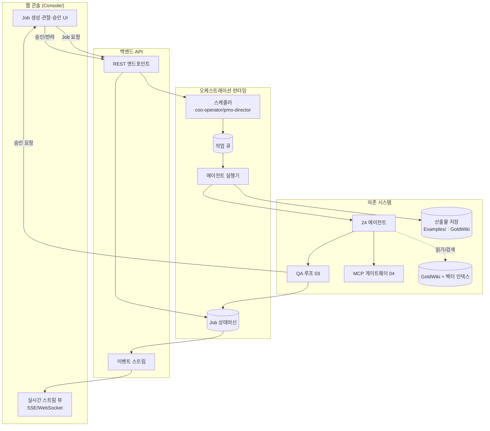
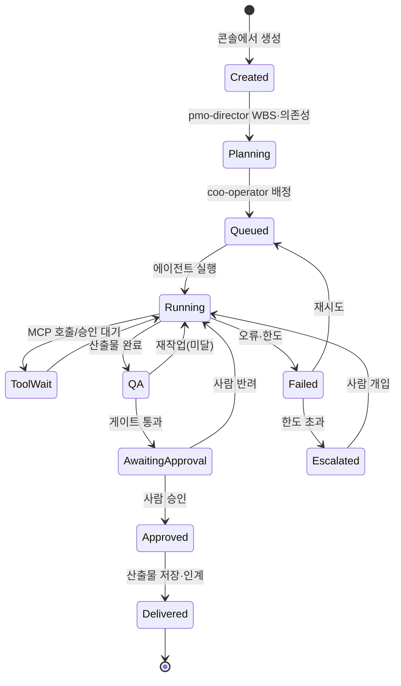
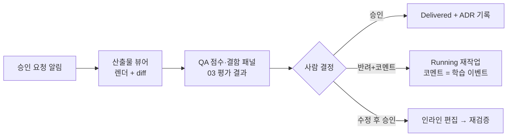

# 05 · 오케스트레이션 런타임과 웹 콘솔 연동 — ClubSchool AI OS v2.0

| 항목 | 내용 |
| --- | --- |
| **목적** | 웹 콘솔(`Console/`) ↔ 오케스트레이터 ↔ 에이전트 ↔ 산출물 저장의 실행 모델, 작업(Job) 수명주기, 실시간 상태/스트리밍, 산출물 검증·승인 UX, 향후 백엔드 API 인터페이스를 정의한다. |
| **대상 독자** | coo-operator, pmo-director, ai-automation-lead, frontend-lead, backend-lead, devops-engineer |
| **담당(Owner)** | coo-operator (런타임) · frontend-lead (콘솔) · backend-lead (API) |
| **상태** | 설계(Design) |
| **관련 정본** | [GoldWiki/27_AUTOMATION_WORKFLOW.md](../../GoldWiki/27_AUTOMATION_WORKFLOW.md) · [GoldWiki/21_BACKEND_GUIDE.md](../../GoldWiki/21_BACKEND_GUIDE.md) · [GoldWiki/22_API_STANDARD.md](../../GoldWiki/22_API_STANDARD.md) |

---

## 1. 목적

4대 능력(학습·업데이트·QA·MCP)은 모두 **무언가를 실행하는 런타임** 위에서 돌고, **사람이 관찰·승인하는
콘솔**을 통해 통제된다. 본 문서는 그 실행 모델을 정의한다. v1.0의 `Console/`은 manifest를 fetch해 에이전트·
커맨드·문서를 정적으로 렌더링하는 read-only 뷰다. v2.0은 이를 **작업을 생성·관찰·승인하는 운영 콘솔**로
확장하고, 그 뒤에 **오케스트레이션 런타임과 백엔드 API**를 둔다.

---

## 2. 현재 한계 (v1.0)

| 한계 | 영향 |
|------|------|
| 콘솔이 정적 카탈로그 | 작업 실행·상태 관찰 불가, manifest 렌더만 가능 |
| 런타임 명시 부재 | 작업 수명주기·재시도·취소가 비정형 |
| 산출물 승인 UX 없음 | 게이트 통과·사람 승인이 파일/CLI로 분산 |
| 백엔드 API 미정의 | 콘솔↔런타임 계약 부재로 확장 곤란 |

---

## 3. 목표 상태 (v2.0)

- 콘솔에서 **Job을 생성**(예: RFP 업로드 → 파이프라인 실행)하고 **실시간 상태/로그를 스트리밍**으로 본다.
- 런타임이 **Job 수명주기(상태머신)**를 관리하고, 에이전트·QA 루프·MCP 호출을 조율한다.
- 게이트 통과 산출물은 콘솔의 **검증·승인 UX**에서 diff·점수와 함께 승인/반려된다.
- 콘솔↔런타임은 **백엔드 API(엔드포인트 표)**로 통신하며, [GoldWiki/22_API_STANDARD.md](../../GoldWiki/22_API_STANDARD.md)를 따른다.

---

## 4. 아키텍처



---

## 5. Job 수명주기



각 상태 전이는 이벤트를 발행하며, 학습 파이프라인(01)과 콘솔 스트림이 이를 구독한다.

| 상태 | 의미 | 주체 |
|------|------|------|
| Created | Job 생성됨(입력·목표 확정) | 콘솔/사용자 |
| Planning | WBS·의존성·게이트 일정 수립 | pmo-director |
| Queued | 큐 대기(우선순위·자원 배분) | coo-operator |
| Running | 에이전트 작업 수행 | 실행기 |
| ToolWait | MCP 도구 호출/승인 대기 | MCP 게이트웨이 |
| QA | QA 루프 검증 중 | qa-lead |
| AwaitingApproval | 게이트 통과·사람 승인 대기 | coo-operator |
| Approved/Delivered | 승인·납품 완료 | 사람/런타임 |
| Failed/Escalated | 오류·한도 초과 | 런타임/사람 |

---

## 6. 실시간 상태/스트리밍

- **전송:** Server-Sent Events(기본) 또는 WebSocket(양방향 필요 시). 콘솔은 Job별 채널을 구독한다.
- **이벤트 종류:** `job.state_changed`, `agent.log`, `mcp.tool_call`, `qa.evaluation`, `approval.requested`.
- **재연결:** 마지막 수신 `seq`로 재구독해 누락 없이 이어 받는다.

### 스트림 이벤트 예시 (JSON)

```json
{ "seq": 142, "job_id": "job_8f21", "type": "qa.evaluation",
  "data": { "stage": "proposal", "iteration": 2, "composite_score": 83.8, "verdict": "rework" },
  "ts": "2026-06-12T11:00:00Z" }
```

```json
{ "seq": 151, "job_id": "job_8f21", "type": "approval.requested",
  "data": { "gate": "Gate A — 전략 승인", "artifact_path": "Examples/youth-club/05_proposal_strategy.md", "score": 91.2 },
  "ts": "2026-06-12T11:42:00Z" }
```

---

## 7. 산출물 검증·승인 UX



UX 원칙:

- 산출물 본문·이전 버전 diff·QA 점수(항목별)·교차검증 코멘트를 **한 화면**에서 본다.
- 반려 시 코멘트는 구조화되어 재작업 피드백과 학습 이벤트(01)로 동시에 흐른다.
- critical 위반(접근성·보안)이 있으면 승인 버튼이 비활성화된다.
- 모든 승인/반려는 [의사결정 로그](../../GoldWiki/32_DECISION_LOG.md)에 자동 ADR로 기록된다.

---

## 8. 백엔드 API 인터페이스 명세

[GoldWiki/22_API_STANDARD.md](../../GoldWiki/22_API_STANDARD.md)를 따른다(REST, 명사 자원, 버전 prefix `/v2`, 표준 에러 규약).

| 메서드 | 엔드포인트 | 설명 | 요청/응답 핵심 |
|--------|-----------|------|----------------|
| POST | `/v2/jobs` | Job 생성(파이프라인 실행 트리거) | `{ goal, inputs[], project_id, pipeline }` → `{ job_id, state }` |
| GET | `/v2/jobs` | Job 목록(필터: state·project) | `?state=running&project_id=...` |
| GET | `/v2/jobs/{id}` | Job 상세·현재 상태 | `{ job_id, state, stages[], current_stage }` |
| GET | `/v2/jobs/{id}/events` | 실시간 이벤트 스트림(SSE) | `text/event-stream`(`seq` 재개) |
| POST | `/v2/jobs/{id}/cancel` | Job 취소 | `→ { state: "cancelled" }` |
| POST | `/v2/jobs/{id}/retry` | 실패 Job 재시도 | `{ from_stage? }` |
| GET | `/v2/jobs/{id}/artifacts` | 산출물 목록·경로·QA 점수 | `[{ path, stage, score, verdict }]` |
| GET | `/v2/artifacts/{id}` | 산출물 본문·diff | `{ content, prev_version, diff }` |
| POST | `/v2/approvals/{gate_id}` | 게이트 승인/반려 | `{ decision, comment }` → ADR 생성 |
| GET | `/v2/agents` | 에이전트 레지스트리(manifest 연계) | `Console/manifest.json` 기반 |
| GET | `/v2/qa/evaluations/{id}` | 평가 결과 조회(03 스키마) | `qa.evaluation` |
| GET | `/v2/learning/candidates` | 학습 후보 목록(01) | `[knowledge.candidate]` |
| POST | `/v2/learning/candidates/{id}/approve` | 학습 후보 승인(01) | `{ decision, edits }` |
| GET | `/v2/changes/proposals` | 변경 제안 목록(02) | `[change.proposal]` |
| POST | `/v2/changes/proposals/{id}/review` | 변경 제안 리뷰(02) | `{ decision }` |

### Job 생성 요청/응답 예시 (JSON)

```json
// 요청
{ "goal": "RFP 분석→제안 전략까지 실행", "project_id": "youth-club-platform",
  "pipeline": "rfp-to-delivery", "inputs": [{ "kind": "rfp", "path": "uploads/rfp.pdf" }] }
// 응답
{ "job_id": "job_8f21", "state": "Created", "pipeline": "rfp-to-delivery",
  "created_at": "2026-06-12T08:00:00Z", "stream": "/v2/jobs/job_8f21/events" }
```

> v2.0 초기에는 백엔드가 없을 수 있다(콘솔이 manifest 정적 fetch). 위 API는 **목표 계약**이며,
> M1에서 read-only 조회 엔드포인트부터 단계적으로 구현한다. 그 전까지 콘솔은 manifest +
> 파일 기반 Job 상태(JSON)로 동작하는 점진적 경로를 취한다.

---

## 9. 실패 모드와 가드레일

| 실패 모드 | 위험 | 가드레일 |
|-----------|------|----------|
| 스트림 끊김 | 상태 누락 | `seq` 재개·하트비트, 폴링 폴백 |
| Job 고착(stuck) | 무한 대기 | 단계 타임아웃·자동 에스컬레이션 |
| 동시 승인 충돌 | 이중 승인/경합 | 게이트 단일 소유권·낙관적 락 |
| 미인증 작업 생성 | 권한 없는 실행 | 콘솔 인증·역할 기반 권한(RBAC) |
| 상태 불일치 | 콘솔↔런타임 표시 차 | 상태머신을 단일 진실로, 콘솔은 파생 뷰 |

---

## 10. 도입 단계 (마일스톤)

| 단계 | 내용 | 산출 |
|------|------|------|
| M1.1 | Job 상태머신·이벤트 스키마 정의 | 런타임 코어 |
| M1.2 | read-only 조회 API + 콘솔 상태 뷰 | 관측 가능성 |
| M1.3 | Job 생성·취소·재시도 API | 실행 제어 |
| M1.4 | SSE 스트리밍 + 실시간 뷰 | 실시간 관찰 |
| M1.5 | 승인 UX + ADR 연동 | 사람 승인 루프 |
| M6.x | 학습/업데이트/QA 콘솔 패널 통합 | 4대 능력 통합 UI |

---

## 11. 성공 지표 (KPI)

| KPI | 목표 |
|-----|------|
| Job 상태 가시성 | 실행 중 Job 100% 실시간 관찰 가능 |
| 상태 정확도 | 콘솔 표시 ↔ 런타임 실상태 불일치 ≤ 1% |
| 승인 처리 시간 | 게이트 통과 → 사람 승인 중위 ≤ 10분 |
| 스트림 가용성 | ≥ 99.5% |
| Job 고착률 | ≤ 1% |

---

## 12. 관련 GoldWiki 문서

- [GoldWiki/27_AUTOMATION_WORKFLOW.md](../../GoldWiki/27_AUTOMATION_WORKFLOW.md) · [GoldWiki/21_BACKEND_GUIDE.md](../../GoldWiki/21_BACKEND_GUIDE.md) · [GoldWiki/22_API_STANDARD.md](../../GoldWiki/22_API_STANDARD.md)
- [GoldWiki/20_FRONTEND_GUIDE.md](../../GoldWiki/20_FRONTEND_GUIDE.md) · [GoldWiki/32_DECISION_LOG.md](../../GoldWiki/32_DECISION_LOG.md)
- 연계: [01_AutoLearning.md](01_AutoLearning.md) · [02_AutoUpdate.md](02_AutoUpdate.md) · [03_QALoop.md](03_QALoop.md) · [04_MCP_MultiAgent.md](04_MCP_MultiAgent.md)
