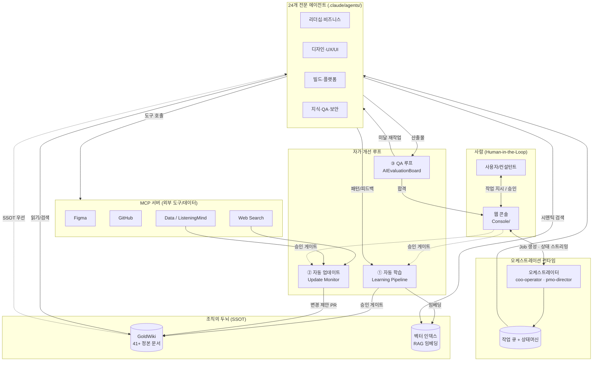

# Gold Wiki v2.0 아키텍처 개요 — ClubSchool AI OS

> 본 폴더(`Docs/architecture-v2/`)는 ClubSchool AI OS를 **"거의 사람 수준의 디지털 조직"**으로 진화시키기 위한
> v2.0 아키텍처 설계 문서 세트다. v1.0의 정적 지식(GoldWiki SSOT) + 24개 에이전트 위에
> **자동 학습 · 자동 업데이트 · 자동 품질 검증 · 멀티에이전트 협업(MCP)** 4대 능력을 추가한다.

| 항목 | 내용 |
| --- | --- |
| **목적** | v2.0 전체 아키텍처의 비전·구성·문서 인덱스를 제시하고, 4대 능력이 GoldWiki(SSOT)·오케스트레이터·콘솔과 어떻게 결합되는지 정의한다. |
| **대상 독자** | AI Engineer(ai-automation-lead), Project Director, COO(coo-operator), PMO(pmo-director), Documentation Lead, 모든 리드 에이전트 |
| **담당(Owner)** | ai-automation-lead (총괄), documentation-lead (SSOT 무결성) |
| **상태** | 설계(Design) — v2.0 목표 아키텍처 |
| **최종 수정** | 2026-06-26 |
| **관련 정본** | [GoldWiki/25_AI_GUIDE.md](../../GoldWiki/25_AI_GUIDE.md) · [GoldWiki/27_AUTOMATION_WORKFLOW.md](../../GoldWiki/27_AUTOMATION_WORKFLOW.md) · [GoldWiki/28_SUBAGENT_RULES.md](../../GoldWiki/28_SUBAGENT_RULES.md) |

---

## 1. 비전: 자가 개선하는 디지털 컨설팅 조직

v1.0은 **"읽고(read) → 산출하고 → 골드위키를 갱신(update)"**하는 파이프라인이다. 지식은 사람이
주입하고, 품질은 사람이 게이트에서 검수하며, 표준은 사람이 개정한다. 즉, **사람이 두뇌를 키우는 조직**이다.

v2.0의 목표는 조직이 **스스로 두뇌를 키우는 것**이다. 모든 프로젝트가 끝날 때마다 조직은 더 똑똑해지고,
외부 표준이 바뀌면 스스로 따라잡으며, 산출물은 사람이 보기 전에 이미 10단계 품질 게이트를 통과하고,
필요한 외부 도구(Figma·GitHub·검색·데이터)를 에이전트가 직접 호출해 협업한다.

> **v2.0 한 문장 정의** — "RFP를 받아 납품까지 자율 수행하되, 매 프로젝트마다 더 똑똑해지고(학습),
> 항상 최신이며(업데이트), 항상 검증되고(QA 루프), 도구와 동료를 스스로 부리는(MCP 협업) 디지털 조직."

설계 4대 불변 원칙:

1. **GoldWiki 우선(GoldWiki-First).** 모든 자동화는 SSOT를 우회하지 않고 강화한다. 학습·업데이트·검증의
   최종 산물은 항상 GoldWiki 정본의 개정으로 귀결된다.
2. **휴먼 인 더 루프(Human-in-the-Loop).** 자율성은 가드레일과 승인 게이트를 동반한다. 비가역·고위험
   변경은 사람 승인 없이 반영되지 않는다.
3. **추적 가능성(Traceability).** 모든 자동 변경은 출처·근거·점수·승인자가 [의사결정 로그](../../GoldWiki/32_DECISION_LOG.md)에
   ADR로 남는다.
4. **하위 호환(Backward Compatibility).** 에이전트·커맨드·템플릿·문서는 SemVer로 버전화하고 롤백 가능해야 한다.

---

## 2. 4대 능력 요약

| # | 능력 | v1.0 한계 | v2.0 목표 | 핵심 산물 | 정본 문서 |
|---|------|-----------|-----------|-----------|-----------|
| ① | **자동 학습**(Auto Learning) | 학습은 사람이 산출물을 읽고 베스트프랙티스에 수기 반영 | 산출물·피드백·의사결정에서 패턴을 추출해 GoldWiki(BP·레퍼런스·프로젝트메모리·공통오류)를 자동 강화 | 학습 파이프라인 + RAG 임베딩 인덱스 + 승인 게이트 | [01_AutoLearning.md](01_AutoLearning.md) |
| ② | **자동 업데이트**(Auto Update) | 표준 변화는 사람이 인지해 수동 개정 | 외부 표준·트렌드·규제 변화를 모니터링하고 에이전트·커맨드·템플릿·문서를 안전하게 자동 개정(제안→리뷰→PR→머지) | 변경 제안(Change Proposal) + SemVer + 롤백 | [02_AutoUpdate.md](02_AutoUpdate.md) |
| ③ | **자동 품질 검증**(QA Loop) | 게이트는 사람이 체크리스트로 수동 판정 | 생성→자기검증→교차검증→AIEvaluationBoard 채점→미달 시 자동 재작업 루프→게이트 통과 | 10단계 자동 QA 루프 + 평가 결과 스키마 | [03_QALoop.md](03_QALoop.md) |
| ④ | **멀티에이전트 협업**(MCP) | 에이전트는 텍스트 산출만, 외부 도구 비연동 | MCP로 Figma·GitHub·검색·데이터·ListeningMind 등 연동, 에이전트 간 핸드오프 프로토콜, 작업 큐·상태머신 | MCP 도구 호출 흐름 + 메시지/핸드오프 스키마 | [04_MCP_MultiAgent.md](04_MCP_MultiAgent.md) |

이 4대 능력은 **오케스트레이션 런타임**(coo-operator/pmo-director) 위에서 실행되며, **웹 콘솔**(`Console/`)을
통해 사람이 관찰·승인한다. 런타임·콘솔 설계는 [05_Orchestration_and_Console.md](05_Orchestration_and_Console.md)에 정의한다.

---

## 3. 전체 시스템 아키텍처

핵심 데이터 순환:

- **하향(실행):** 사용자 → 콘솔 → 오케스트레이터 → 작업 큐 → 에이전트 → (GoldWiki 읽기 + 벡터 검색 + MCP 도구) → 산출물.
- **상향(검증):** 산출물 → QA 루프(자기/교차/Board 채점) → 합격 시 콘솔 납품, 미달 시 에이전트 재작업.
- **순환(개선):** 산출물·피드백·결정 → 학습 파이프라인 → 승인 게이트 → GoldWiki 정본 강화 + 벡터 인덱스 재색인.
- **외향(최신화):** 외부 표준/트렌드(MCP 검색·데이터) → 업데이트 모니터 → 변경 제안 PR → 리뷰/머지 → GoldWiki 개정.

---

## 4. v1.0 → v2.0 차이표

| 차원 | v1.0 (Foundation) | v2.0 (Self-Improving Org) |
|------|-------------------|---------------------------|
| 지식 형태 | 정적 GoldWiki 문서(사람이 작성·갱신) | 정적 GoldWiki + **벡터 인덱스(RAG)** + 자동 강화 |
| 학습 | 없음 — 교훈은 수기로 반영 | **자동 학습 파이프라인** + 휴먼 승인 게이트 |
| 표준 최신화 | 사람이 인지·수동 개정 | **자동 업데이트 모니터** → 변경 제안 → PR/머지 |
| 품질 게이트 | 사람이 체크리스트 수동 판정 | **자동 10단계 QA 루프** + AIEvaluationBoard 채점 + 자동 재작업 |
| 외부 도구 | 비연동(텍스트 산출만) | **MCP 연동**(Figma·GitHub·검색·데이터 등) |
| 에이전트 협업 | 순차 핸드오프(암묵적) | **명시적 메시지/핸드오프 프로토콜 + 작업 큐 상태머신** |
| 오케스트레이션 | Project Director가 수동 조율 | coo-operator/pmo-director 런타임 + Job 수명주기 |
| 사람 인터페이스 | 파일·CLI | **웹 콘솔**(실시간 상태/스트리밍/승인 UX) + 향후 백엔드 API |
| 버전 관리 | 문서 단위 수정 | **SemVer + 변경 로그 + 롤백**(에이전트/커맨드/템플릿/문서) |
| 추적성 | DecisionLog 수기 | 자동 변경 전부 ADR·출처·점수·승인자 기록 |

> v2.0은 v1.0을 **대체하지 않고 감싼다.** 모든 v1.0 자산(GoldWiki·에이전트·커맨드·워크플로우)은 그대로 동작하며,
> 4대 능력은 그 위에 얹히는 레이어다. 따라서 자동화가 실패하면 v1.0의 수동 경로로 안전하게 폴백한다.

---

## 5. 문서 인덱스

| 문서 | 다루는 내용 |
|------|-------------|
| [README.md](README.md) | (본 문서) v2.0 비전·4대 능력·전체 아키텍처·차이표·인덱스 |
| [01_AutoLearning.md](01_AutoLearning.md) | 자동 학습 파이프라인, RAG/임베딩 인덱스, 승인 게이트, 지식 버전관리·회귀 방지 |
| [02_AutoUpdate.md](02_AutoUpdate.md) | 외부 변화 모니터링, 안전한 자동 개정, SemVer/변경 로그/롤백, 변경 제안 스키마 |
| [03_QALoop.md](03_QALoop.md) | 자기/교차/Board 검증 루프, 점수 임계값, 재작업 한도, 에스컬레이션, 평가 결과 스키마 |
| [04_MCP_MultiAgent.md](04_MCP_MultiAgent.md) | MCP 도구/서버 연동, 에이전트 간 메시지·핸드오프, 작업 큐·상태머신, 권한·보안 경계 |
| [05_Orchestration_and_Console.md](05_Orchestration_and_Console.md) | 런타임·콘솔 실행 모델, Job 수명주기, 실시간 스트리밍, 승인 UX, 백엔드 API 명세 |

---

## 6. 도입 단계(마일스톤) 요약

| 마일스톤 | 범위 | 4대 능력 | 산출 |
|----------|------|----------|------|
| **M1 — 관측 가능성** | 콘솔↔런타임 Job 수명주기·상태 스트리밍 | (런타임) | 05 문서 런타임, 콘솔 read-only |
| **M2 — QA 루프** | 자기/교차 검증 + Board 채점 자동화 | ③ | 03 문서, `/qa-gate` 루프화 |
| **M3 — MCP 연동** | Figma·GitHub·검색·데이터 MCP, 핸드오프 프로토콜 | ④ | 04 문서, MCP 권한 경계 |
| **M4 — 자동 학습** | 학습 파이프라인 + 벡터 인덱스 + 승인 게이트 | ① | 01 문서, RAG 인덱스 구축 |
| **M5 — 자동 업데이트** | 외부 변화 모니터 + 변경 제안 PR | ② | 02 문서, 변경 제안 파이프라인 |
| **M6 — 자율 운영** | 4대 능력 통합 + 멀티 프로젝트 격리 | ①②③④ | 전 문서 통합·KPI 대시보드 |

---

## 7. 전사 성공 지표(KPI)

| KPI | 정의 | v1.0 기준 | v2.0 목표 |
|-----|------|-----------|-----------|
| 1차 통과율(First-Pass Rate) | QA 루프 1회차에 게이트를 통과한 산출물 비율 | 측정 안 됨 | ≥ 80% |
| 평균 재작업 횟수 | 게이트 통과까지 평균 반복 횟수 | 측정 안 됨 | ≤ 1.5회 |
| 지식 자동 강화율 | 프로젝트당 자동 학습으로 추가/개정된 GoldWiki 항목 수 | 0 | ≥ 5건/프로젝트 |
| 표준 최신성 지연 | 외부 표준 변경 → GoldWiki 반영까지 소요 시간 | 수주~미반영 | ≤ 14일 |
| 자동화 폴백율 | 자동 경로 실패로 수동 폴백한 비율 | N/A | ≤ 10% |
| 환각/오류 적발율 | 교차검증이 잡아낸 사실오류·링크오류 비율 증가 | 기준선 | +50% 적발 |

---

## 8. 관련 GoldWiki 문서

- [GoldWiki/25_AI_GUIDE.md](../../GoldWiki/25_AI_GUIDE.md) — 멀티에이전트·RAG·가드레일 정본
- [GoldWiki/26_PROMPT_ENGINEERING.md](../../GoldWiki/26_PROMPT_ENGINEERING.md) — 프롬프트 표준
- [GoldWiki/27_AUTOMATION_WORKFLOW.md](../../GoldWiki/27_AUTOMATION_WORKFLOW.md) — RFP→납품 21단계 파이프라인
- [GoldWiki/28_SUBAGENT_RULES.md](../../GoldWiki/28_SUBAGENT_RULES.md) — 서브에이전트 공통 규칙
- [GoldWiki/29_QUALITY_CHECKLIST.md](../../GoldWiki/29_QUALITY_CHECKLIST.md) — 마스터 품질 체크리스트
- [GoldWiki/31_RELEASE_PROCESS.md](../../GoldWiki/31_RELEASE_PROCESS.md) — 릴리스·버전 관리
- [GoldWiki/32_DECISION_LOG.md](../../GoldWiki/32_DECISION_LOG.md) — 의사결정 로그(ADR)
- [GoldWiki/35_PROJECT_MEMORY.md](../../GoldWiki/35_PROJECT_MEMORY.md) — 프로젝트 메모리
- [GoldWiki/36_REFERENCE_LIBRARY.md](../../GoldWiki/36_REFERENCE_LIBRARY.md) — 레퍼런스 라이브러리
- [GoldWiki/37_BEST_PRACTICES.md](../../GoldWiki/37_BEST_PRACTICES.md) — 베스트 프랙티스
- [GoldWiki/39_COMMON_ERRORS.md](../../GoldWiki/39_COMMON_ERRORS.md) — 공통 오류
- [GoldWiki/Proposal/AIEvaluationBoard.md](../../GoldWiki/Proposal/AIEvaluationBoard.md) — AI 평가 보드
