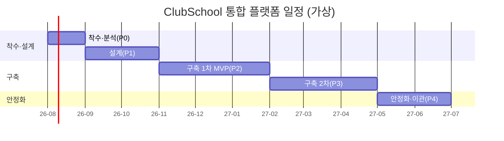

# 03 · 작업분해구조(WBS) 및 일정

> ⚠️ **가상 예시.** 공수·기간·인력은 모두 가상 산정이다.
> **파이프라인 단계:** 11(WBS) · **담당:** Project Director · **정본 참조:** [02_BUSINESS_GOALS](../GoldWiki/02_BUSINESS_GOALS.md), [35_PROJECT_MEMORY](../GoldWiki/35_PROJECT_MEMORY.md)

**사업:** 전국 청소년 동아리 통합 플랫폼 · **총 기간:** 11개월(2026-08 ~ 2027-06) · **납품:** 3단계 점진 납품

---

## 1. 단계(Phase) 개요

| 단계 | 기간 | 목표 | 게이트 |
| --- | --- | --- | --- |
| P0 착수·분석 | M1 | 연계 규격 확정, 요구 동결 | — |
| P1 설계 | M2~M3 | IA·UX·디자인 시스템·아키텍처 확정 | 게이트 B(디자인) |
| P2 구축 1차(MVP) | M4~M6 | 검색·가입·활동일지 핵심 기능 | 1차 납품 |
| P3 구축 2차 | M7~M9 | 포트폴리오·대시보드·Open API·연계 | 2차 납품 |
| P4 안정화·이관 | M10~M11 | 부하/보안/접근성 검수, 인수인계 | 게이트 C + 최종 |

---

## 2. 작업 패키지(WBS) — 공수 산정

공수 단위: MM(맨먼스). 총 **48.0 MM**(가상). 평균 투입 약 4.4명/월.

| WBS | 작업 패키지 | 주요 산출물 | 담당 에이전트 | 공수(MM) | 기간 |
| --- | --- | --- | --- | --- | --- |
| 1.0 | **착수·분석** | | | **3.5** | M1 |
| 1.1 | RFP 요구 동결·범위 확정 | 요구추적표 | Business Analyst | 1.0 | M1 |
| 1.2 | 외부 연계 규격 확정(정부24/NEIS) | 연계 ICD | API Engineer | 1.5 | M1 |
| 1.3 | 리스크·일정 베이스라인 | 리스크 레지스터 | Project Director | 1.0 | M1 |
| 2.0 | **설계** | | | **9.0** | M2~M3 |
| 2.1 | IA·유저 플로우 | [04_IA_and_User_Flow](04_IA_and_User_Flow.md) | UX Researcher | 2.0 | M2 |
| 2.2 | 화면 목록·정의 | [05_Screen_List](05_Screen_List.md) | Service Planner | 1.5 | M2 |
| 2.3 | UI 컨셉·디자인 시스템 | [06_Design_Concept](06_Design_Concept.md) | UI/BX Designer | 2.5 | M2~M3 |
| 2.4 | 아키텍처·API 계약·데이터 모델 | 아키텍처 설계서 | Backend/API/DB | 2.0 | M3 |
| 2.5 | 보안·접근성 설계 | 컴플라이언스 매트릭스 | Security/Accessibility | 1.0 | M3 |
| 3.0 | **구축 1차(MVP)** | | | **13.5** | M4~M6 |
| 3.1 | 디자인 시스템 퍼블리싱 | 컴포넌트 라이브러리 | Publishing Engineer | 2.5 | M4 |
| 3.2 | 통합 검색·자동완성(R-001) | 검색 모듈 | Frontend/Backend | 3.0 | M4~M5 |
| 3.3 | 회원가입·동아리 가입 3단계(R-002) | 가입 플로우 | Frontend | 2.5 | M5 |
| 3.4 | 지도교사 활동일지·출결(R-003) | 활동일지 모듈 | Frontend/Backend | 3.0 | M5~M6 |
| 3.5 | 인증·권한·SSO 기반(R-009) | 인증 서비스 | API/Security | 2.5 | M6 |
| 4.0 | **구축 2차** | | | **13.0** | M7~M9 |
| 4.1 | 활동 포트폴리오·뱃지(R-005) | 포트폴리오 모듈 | Frontend | 2.5 | M7 |
| 4.2 | 활동실적 집계·확인서 발급(R-004) | 발급 서비스 | Backend | 3.0 | M7~M8 |
| 4.3 | 학부모 연동·동의(R-006, R-013) | 동의 플로우 | Backend/Security | 2.0 | M8 |
| 4.4 | 기관 대시보드·통계 Open API(R-007/R-008) | 대시보드·API | AI/API | 3.5 | M8~M9 |
| 4.5 | 관리자 CMS(R-017) | 운영자 콘솔 | Backend | 2.0 | M9 |
| 5.0 | **안정화·이관** | | | **9.0** | M10~M11 |
| 5.1 | 부하·성능 튜닝(R-010) | 성능 리포트 | Backend/DevOps | 2.5 | M10 |
| 5.2 | 접근성·보안 검수(R-012/R-014/R-015) | 점검 결과서 | Accessibility/Security | 2.5 | M10 |
| 5.3 | 통합 QA·UAT | [08_QA_Plan](08_QA_Plan.md) 결과 | QA Engineer | 2.0 | M10~M11 |
| 5.4 | 인수인계·교육·매뉴얼(R-018) | 운영 매뉴얼 | Documentation | 2.0 | M11 |

---

## 3. 마일스톤

| 마일스톤 | 시점 | 완료 정의(DoD) |
| --- | --- | --- |
| M-0 착수보고 | M1 말 | 요구 동결, 연계 ICD 승인 |
| M-1 설계 확정 | M3 말 | 게이트 B 통과(디자인·접근성) |
| M-2 1차 납품(MVP) | M6 말 | 검색·가입·활동일지 운영 검증 |
| M-3 2차 납품 | M9 말 | 포트폴리오·대시보드·연계 완료 |
| M-4 최종 검수 | M11 중 | 게이트 C 통과(테스트·보안·접근성) |
| M-5 이관·종료 | M11 말 | 인수인계·교육 완료 |

---

## 4. 일정 간트(요약)

---

## 5. 핵심 의존성·임계경로

- **임계경로:** 1.2 연계 규격 → 3.5 인증/SSO → 4.3 학부모 동의 → 4.4 대시보드. 연계 규격 지연(RR-03)이 전체 일정을 끌어내린다 → M1 내 ICD 확정을 최우선 통제.
- **병렬 가능:** 2.3 디자인 시스템과 2.4 아키텍처는 병렬. 3.2 검색과 3.3 가입은 디자인 시스템(3.1) 완료 후 병렬.

---

## 6. 인력 구성(가상)

| 역할 | 인원 | 비고 |
| --- | --- | --- |
| PM/Project Director | 1 | 전 기간 |
| UX/UI/접근성 | 2 | P1 집중 |
| 프론트엔드 | 2 | P2~P3 집중 |
| 백엔드/API/DB | 3 | P2~P3 집중 |
| 보안/DevOps | 1 | 전 기간 |
| QA | 1 | P2~P4 |

---

## 거버넌스 갱신

- [프로젝트 메모리](../GoldWiki/35_PROJECT_MEMORY.md): WBS 베이스라인 48.0 MM, 임계경로 등록
- [의사결정 로그](../GoldWiki/32_DECISION_LOG.md): 3단계 점진 납품 채택
