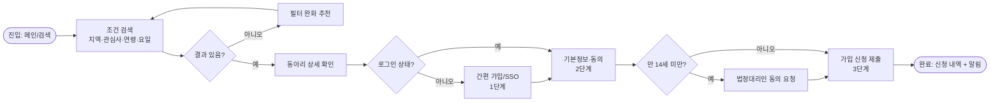
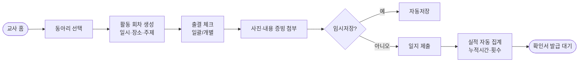
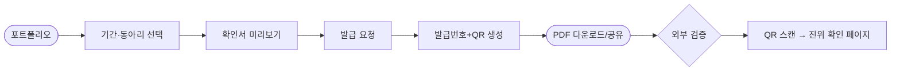
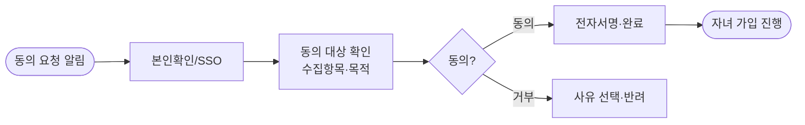

# 04 · 정보구조(IA) 및 핵심 유저 플로우

> ⚠️ **가상 예시.**
> **파이프라인 단계:** 12(IA) ~ 13(유저 플로우), 15(UX 전략 통합) · **담당:** UX Researcher, Interaction Designer
> **정본 참조:** [11_INFORMATION_ARCHITECTURE](../GoldWiki/11_INFORMATION_ARCHITECTURE.md), [12_USER_FLOW](../GoldWiki/12_USER_FLOW.md), [07_UX_PRINCIPLES](../GoldWiki/07_UX_PRINCIPLES.md)

---

## 1. 사용자(페르소나) 정의

| 페르소나 | 핵심 과업 | 환경 가정 |
| --- | --- | --- |
| 청소년 회원(만 9~24세) | 동아리 찾기·가입·활동 기록·포트폴리오 | 모바일 78%, 저사양·저대역폭 다수 |
| 지도교사 | 동아리 개설·출결·활동일지·실적 증빙 | PC/태블릿 혼용, 시간 부족 |
| 기관 담당자(진흥원/교육청) | 현황 모니터링·승인·통계·공지 | PC, 데이터 활용 욕구 |
| 학부모 | 자녀 활동 열람·동의(만 14세 미만) | 모바일, 간헐 접속 |

---

## 2. UX 전략 원칙(단계 15 요약)

1. **3분 규칙** — 가입~동아리 신청은 3단계·3분 이내([07_UX_PRINCIPLES](../GoldWiki/07_UX_PRINCIPLES.md)).
2. **접근성 우선** — 모든 플로우는 키보드·스크린리더로 완주 가능(WCAG AA).
3. **역할별 단일 진입** — 로그인 후 역할에 맞는 홈으로 자동 분기.
4. **실패해도 안전하게** — 입력 중 자동 저장, 실시간 유효성 검사, 명확한 오류 회복 경로.

---

## 3. 사이트맵 (IA)

```mermaid
flowchart TD
    ROOT[ClubSchool 통합 플랫폼] --> PUB[공개 영역]
    ROOT --> YOUTH[청소년 영역]
    ROOT --> TEACHER[지도교사 영역]
    ROOT --> ADMIN[기관 담당자 영역]
    ROOT --> PARENT[학부모 영역]
    ROOT --> SYS[공통/시스템]

    PUB --> P1[메인]
    PUB --> P2[동아리 통합 검색]
    PUB --> P3[동아리 상세]
    PUB --> P4[공지·이벤트]
    PUB --> P5[로그인/회원가입]

    YOUTH --> Y1[청소년 홈]
    YOUTH --> Y2[가입 신청 내역]
    YOUTH --> Y3[활동 포트폴리오]
    YOUTH --> Y4[활동 확인서]
    YOUTH --> Y5[내 정보·동의관리]

    TEACHER --> T1[교사 홈]
    TEACHER --> T2[동아리 관리]
    TEACHER --> T3[회원·출결 관리]
    TEACHER --> T4[활동일지 작성]
    TEACHER --> T5[실적·확인서 발급]

    ADMIN --> A1[관리 대시보드]
    ADMIN --> A2[동아리·기관 승인]
    ADMIN --> A3[통계·리포트]
    ADMIN --> A4[콘텐츠 관리 CMS]

    PARENT --> PA1[자녀 활동 열람]
    PARENT --> PA2[동의 처리]

    SYS --> S1[알림센터]
    SYS --> S2[고객지원/FAQ]
    SYS --> S3[접근성 설정]
```

**구조 원칙:** 깊이 3단계 이내, 공개 영역은 비로그인 탐색 허용(검색·상세까지), 가입·기록은 로그인 게이트.

---

## 4. 핵심 유저 플로우

### 플로우 A — 청소년: 동아리 검색 → 가입 (3단계, 윈 테마 1)

> 자동저장·실시간 검증으로 이탈 방지. 만 14세 미만은 RR-01 대응으로 동의 분기를 명시화.

### 플로우 B — 지도교사: 활동일지 작성 → 실적 집계

### 플로우 C — 청소년: 활동확인서 발급(신뢰성, RR-06 대응)

### 플로우 D — 학부모: 자녀 동의 처리

---

## 5. 내비게이션·접근성 규약

- 전 페이지 공통 GNB + 역할별 사이드/하단 탭. 모바일은 하단 탭 4개(홈/검색/활동/내정보).
- 모든 인터랙션은 포커스 순서 정의·`Skip to content` 제공([16_ACCESSIBILITY](../GoldWiki/16_ACCESSIBILITY.md)).
- 빈 상태·오류·로딩 3종 상태를 모든 목록 화면에 정의.

---

## 6. 인계

본 IA·플로우는 단계 14 [화면 목록](05_Screen_List.md)의 입력이 된다. 화면 ID는 본 사이트맵 노드와 1:1 대응한다.

---

## 거버넌스 갱신

- [정보구조](../GoldWiki/11_INFORMATION_ARCHITECTURE.md): 5개 영역·깊이 3 IA 등재
- [유저 플로우](../GoldWiki/12_USER_FLOW.md): 핵심 플로우 A~D 등재
- [프로젝트 메모리](../GoldWiki/35_PROJECT_MEMORY.md): 페르소나 4종, 3분 규칙
