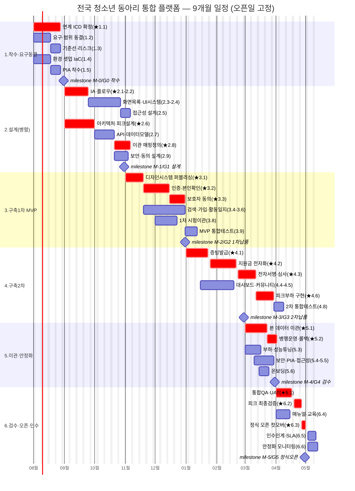
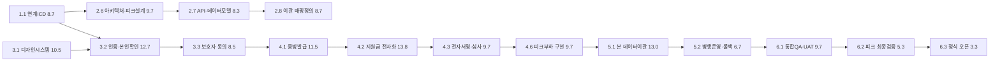

# 04 · 작업분해구조(WBS)·일정·자원 계획 — 전국 청소년 동아리 통합 플랫폼 구축

> **담당 에이전트:** pmo-director · **파이프라인 단계:** 11(WBS) · **본문:** 한국어
> **표준 참조(SSOT):** [PMO/WBSGuide](../../GoldWiki/PMO/WBSGuide.md) · 템플릿 [Templates/WBS](../../Templates/WBS.md)
> **선행 산출물:** [01_RFP_Analysis](01_RFP_Analysis.md) · [02_Proposal_Strategy](02_Proposal_Strategy.md) · [03_Executive_Summary](03_Executive_Summary.md)
> **추적성 ID 체계:** 요구 `REQ-###` ↔ 화면 `SCR-###` ↔ 플로우 `FLOW-###` ↔ 테스트 `TC-###` ↔ 리스크 `RISK-##`
> **작성 원칙:** 산출물 지향 · 100% 규칙 · MECE · 8/80 규칙 · 3점 산정(E=(O+4M+P)/6) · 단계/프로젝트 통합 버퍼 · 임계경로·게이트 명시

---

## 0. 개요

| 항목 | 내용 |
| --- | --- |
| 사업명 | 전국 청소년 동아리 통합 플랫폼 구축 |
| 발주기관 | 한국청소년활동진흥원 |
| 기준선 버전 | v1.0 (baseline) |
| 총 기간 | **9개월(M1~M9), 오픈일 고정** — 신학기 일정 연동(REQ-020) |
| 가정 착수일 | 계약일 = M1 시작(예: 2026-08-01), 정식 오픈 = M9 말 |
| 납품 방식 | **3단계 점진 납품**(MVP 1차 → 2차 → 안정화·정식 오픈) |
| 총 공수 | **순작업 360 MD + 통합 버퍼 60 MD = 420 MD** |
| 공수 단위 | MD(인일, man-day). 1 MM ≈ 20 MD 가정 |
| 평균 투입 | 약 9.3명/월(피크 M4~M7 약 11명) |
| 작성일 | 2026-06-26 |

> **일정 철학:** RFP가 "오픈일 고정·협상 불가"(H-7, REQ-020)를 명시하므로 **오픈일 역산(backward scheduling)** 으로 일정을 수립한다. 범위는 게이트별로 동결하고, 일정 압박은 (a) MVP 우선순위, (b) 검증 자산 재사용, (c) 통합 버퍼 15~20%, (d) 외부 연계 조기 확정으로 흡수한다(RISK-04 대응).

---

## 1. 단계(L1·Phase) 개요

WBSGuide §3 표준 단계 모델을 9개월·고정 오픈일에 맞춰 압축·재구성했다. 설계~구축을 병렬화하고 안정화 기간을 명시 확보한다.

| L1 | 단계(Phase) | 기간 | 핵심 목표 | 종료 게이트 |
| --- | --- | --- | --- | --- |
| 1 | 착수·요구 동결 | M1 | 연계 규격(ICD) 확정, 요구·범위 동결, 기준선 수립 | **G0** 착수 |
| 2 | 설계(UX·기술 병렬) | M2~M3 | IA·플로우·디자인 시스템·아키텍처·보안/접근성 설계 확정 | **G1** 설계 |
| 3 | 구축 1차(MVP) | M4~M5 | 회원·검색·가입·활동일지 핵심 기능 가동 | **G2** 1차 납품 |
| 4 | 구축 2차 | M6~M7 | 증빙발급·지원금 전자화·대시보드·연계·커뮤니티 | **G3** 2차 납품 |
| 5 | 데이터 이관·안정화 | M8 | 30만 회원·1.2만 동아리 이관, 부하·보안·접근성 검수 | **G4** 검수 |
| 6 | 검수·정식 오픈·인수 | M9 | UAT·피크 부하 검증·정식 오픈·인수인계 | **G5** 오픈·인수 |

> **단계 중첩:** 데이터 이관(L5)은 단발성 작업이 아니라 M3 매핑정의 → M6 1차 시험이관 → M8 본이관 → M9 컷오버로 **분산 수행**한다. 동시접속 피크 설계(REQ-019)는 L2 설계 → L4 구현 → L5/L6 부하검증으로 단계 전반에 걸쳐 통제한다.

---

## 2. WBS 표 (L1~L3, 산출물 지향)

> 공수 = 3점 산정 기대공수 E=(O+4M+P)/6. **모든 작업패키지는 8/80 규칙(1~10일급)** 을 만족하며 단일 담당·완료정의(DoD)를 갖는다. 선행은 FS(완료-시작) 기본, 표기는 SS/FF 명시. ★는 임계경로 작업.

### L1=1 · 착수·요구 동결 (M1)

| WBS | 작업패키지 | 산출물 | 담당(역할) | O | M | P | E(MD) | 선행 | 연결 REQ/RISK |
| --- | --- | --- | --- | --- | --- | --- | --- | --- | --- |
| 1 | **착수·요구 동결** | 착수보고서 | PMO | | | | **24.0** | - | REQ-020 |
| 1.1 ★ | 외부 연계 규격(ICD) 확정 — 본인확인·소셜·행정망 | 연계 ICD·책임분계서 | API Engineer | 6 | 8 | 14 | 8.7 | - | REQ-007,009,018 / RISK-05 |
| 1.2 | 요구·범위 동결 및 RTM 인수 | 동결 RTM·범위기술서 | Business Analyst | 3 | 4 | 7 | 4.3 | - | REQ-001~022 |
| 1.3 | 기준선 일정·리스크 레지스터 수립 | WBS 베이스라인·리스크 등록부 | PMO | 3 | 4 | 6 | 4.2 | 1.2 | RISK-01~09 / REQ-020 |
| 1.4 | 개발·공공클라우드 환경 셋업(IaC) | CI/CD·환경 구성서 | DevOps | 3 | 5 | 8 | 5.2 | - | REQ-018 |
| 1.5 | PIA 착수·개인정보 흐름도 작성 | PIA 착수 산출물 | Security | 2 | 3 | 5 | 3.2 | 1.2 | REQ-008,015,017 / RISK-01 |

### L1=2 · 설계 (M2~M3, UX트랙·기술트랙 병렬)

| WBS | 작업패키지 | 산출물 | 담당(역할) | O | M | P | E(MD) | 선행 | 연결 REQ/RISK |
| --- | --- | --- | --- | --- | --- | --- | --- | --- | --- |
| 2 | **설계** | 설계 패키지 | UX/CTO | | | | **78.0** | 1 | — |
| 2.1 ★ | IA·정보구조·역할별 내비게이션 | IA·사이트맵 | UX Researcher | 4 | 6 | 11 | 6.5 | 1.2 | REQ-021,014 |
| 2.2 ★ | 핵심 유저 플로우 6종(FLOW-01~06) | 유저 플로우 정의서 | UX Researcher | 5 | 7 | 12 | 7.5 | 2.1 | REQ-001~010,016 |
| 2.3 | 화면 목록·정의(SCR-001~050) | 화면 목록·와이어프레임 | Service Planner | 4 | 6 | 10 | 6.3 | 2.1 | 전 REQ(SCR 매핑) |
| 2.4 | UI 컨셉·디자인 시스템·토큰(모바일 우선) | UI 컨셉·토큰·컴포넌트 명세 | UI Designer | 6 | 9 | 15 | 9.5 | 2.2,2.3 | REQ-014 / RISK-08 |
| 2.5 | KWCAG 2.2 AA 접근성 설계 가이드 | 접근성 설계 가이드 | Accessibility | 3 | 5 | 8 | 5.2 | 2.4(SS) | REQ-013 / RISK-07 |
| 2.6 ★ | 시스템 아키텍처·피크부하 설계(캐싱·CDN·큐·오토스케일) | 아키텍처 설계서 | CTO/Backend | 6 | 9 | 16 | 9.7 | 1.1 | REQ-018,019 / RISK-02 |
| 2.7 | API 계약·데이터 모델 설계 | OpenAPI 명세·ERD | API/DB Architect | 5 | 8 | 13 | 8.3 | 2.6,2.2 | REQ-002,005,010 |
| 2.8 ★ | 데이터 이관 매핑 정의·정합 규칙 | 이관 매핑정의서·검증규칙 | DB Architect | 5 | 8 | 15 | 8.7 | 2.7 | REQ-016 / RISK-03 |
| 2.9 | 보안·전자서명·아동동의 설계 | 보안 설계서·동의 플로우 설계 | Security | 4 | 6 | 11 | 6.5 | 2.7 | REQ-006,008,015 / RISK-01,09 |
| 2.10 | 알림 채널 설계(푸시·문자·이메일) | 알림 설계서 | Backend | 2 | 3 | 5 | 3.2 | 2.7 | REQ-011 |

### L1=3 · 구축 1차 MVP (M4~M5)

| WBS | 작업패키지 | 산출물 | 담당(역할) | O | M | P | E(MD) | 선행 | 연결 REQ/RISK |
| --- | --- | --- | --- | --- | --- | --- | --- | --- | --- |
| 3 | **구축 1차(MVP)** | MVP 빌드 | Frontend/Backend | | | | **84.5** | 2 | — |
| 3.1 ★ | 디자인 시스템 퍼블리싱·컴포넌트 라이브러리 | 퍼블리시 컴포넌트 | Publishing Engineer | 7 | 10 | 16 | 10.5 | 2.4,2.5 | REQ-013,014 |
| 3.2 ★ | 통합 회원·소셜로그인·본인확인 연동 | 인증 서비스(SCR-001) | API/Security | 8 | 12 | 20 | 12.7 | 1.1,3.1 | REQ-007,009 / RISK-05 |
| 3.3 ★ | 보호자(법정대리인) 동의 플로우 | 동의 화면(SCR-002) | Security/Frontend | 5 | 8 | 14 | 8.5 | 3.2,2.9 | REQ-008 / RISK-01 |
| 3.4 | 동아리 검색(지역·관심사·연령·요일 필터) | 검색 모듈(SCR-010) | Frontend/Backend | 6 | 9 | 15 | 9.5 | 3.1,2.7 | REQ-001 |
| 3.5 ★ | 모집·가입 신청·승인 워크플로우 | 가입 플로우(SCR-011,040) | Frontend/Backend | 7 | 10 | 17 | 10.7 | 3.2,3.4 | REQ-002 |
| 3.6 | 활동일지·사진·봉사시간 등록 | 활동기록 모듈(SCR-020) | Frontend/Backend | 7 | 10 | 16 | 10.5 | 3.5 | REQ-003 |
| 3.7 | 알림 채널 구현(푸시·문자·이메일) | 알림 서비스 | Backend | 4 | 6 | 10 | 6.3 | 2.10,3.2 | REQ-011 |
| 3.8 | 1차 시험 데이터 이관·정합 검증(부분셋) | 시험이관 리포트 | DB Architect | 6 | 9 | 16 | 9.7 | 2.8 | REQ-016 / RISK-03 |
| 3.9 | MVP 통합·스모크 테스트 | MVP 테스트 결과(TC-101~103,107~109,111) | QA Engineer | 4 | 5 | 9 | 5.5 | 3.2~3.7 | REQ-001~003,007~009,011 |

### L1=4 · 구축 2차 (M6~M7)

| WBS | 작업패키지 | 산출물 | 담당(역할) | O | M | P | E(MD) | 선행 | 연결 REQ/RISK |
| --- | --- | --- | --- | --- | --- | --- | --- | --- | --- |
| 4 | **구축 2차** | 2차 빌드 | Backend/Frontend | | | | **86.5** | 3 | — |
| 4.1 ★ | 생활기록부 증빙 발급(PDF·QR·전자서명 검증) | 증빙발급 서비스(SCR-021) | Backend/Security | 7 | 11 | 18 | 11.5 | 3.6,2.9 | REQ-004,006 / RISK-06 |
| 4.2 ★ | 지원금 신청·심사·정산 전자화 | 지원금 모듈(SCR-030,031) | Backend | 9 | 13 | 22 | 13.8 | 3.5,2.9 | REQ-005 / RISK-02,09 |
| 4.3 ★ | 전자서명 기반 신청·심사(부인방지) | 전자서명 연동 | Security/API | 6 | 9 | 16 | 9.7 | 4.2 | REQ-006 / RISK-09 |
| 4.4 | 운영기관 대시보드·통계·정산 현황 시각화 | 대시보드(SCR-050) | AI/Backend | 7 | 10 | 17 | 10.7 | 4.2,2.7 | REQ-010,022 |
| 4.5 | 게시판·커뮤니티·모더레이션 | 커뮤니티 모듈(SCR-012) | Frontend | 5 | 8 | 13 | 8.3 | 3.1 | REQ-012 |
| 4.6 ★ | 지원금 마감 피크 부하 흡수 구현(대기열·캐시·오토스케일) | 피크대응 구성 | Backend/DevOps | 6 | 9 | 16 | 9.7 | 4.2,2.6 | REQ-019 / RISK-02 |
| 4.7 | 정산 회계 추적성·감사 로그 | 정산 추적 모듈 | Backend | 4 | 6 | 11 | 6.5 | 4.2 | REQ-022 / RISK-09 |
| 4.8 | 2차 통합 테스트 | 통합 테스트 결과(TC-104~106,110,112) | QA Engineer | 4 | 6 | 10 | 6.3 | 4.1~4.7 | REQ-004~006,010,012 |

### L1=5 · 데이터 이관·안정화 (M8)

| WBS | 작업패키지 | 산출물 | 담당(역할) | O | M | P | E(MD) | 선행 | 연결 REQ/RISK |
| --- | --- | --- | --- | --- | --- | --- | --- | --- | --- |
| 5 | **데이터 이관·안정화** | 이관·안정화 패키지 | DB/DevOps | | | | **52.5** | 4 | — |
| 5.1 ★ | 본 데이터 이관(회원30만·동아리1.2만)·정합률 검증 | 이관 검증 리포트(TC-116) | DB Architect | 8 | 12 | 22 | 13.0 | 3.8,4.* | REQ-016 / RISK-03 |
| 5.2 ★ | 병행 운영·롤백 절차 리허설 | 컷오버·롤백 계획서 | DB/DevOps | 4 | 6 | 12 | 6.7 | 5.1 | REQ-016 / RISK-03 |
| 5.3 | 부하·성능 튜닝(피크 가정 부하 테스트) | 성능 리포트(TC-119) | Backend/DevOps | 6 | 9 | 16 | 9.7 | 4.6 | REQ-019 / RISK-02 |
| 5.4 | 보안 점검·PIA 완료·취약점 조치 | 보안 점검·PIA 결과서(TC-115,117) | Security | 5 | 8 | 14 | 8.5 | 4.3 | REQ-015,017 / RISK-01,09 |
| 5.5 | 접근성 검수(axe+수동, KWCAG 2.2 AA) | 접근성 점검 결과서(TC-113,114) | Accessibility | 4 | 6 | 11 | 6.5 | 4.5 | REQ-013,014 / RISK-07 |
| 5.6 | 활용률 온보딩(튜토리얼·뱃지·푸시) | 온보딩 패키지 | Service Planner/Frontend | 5 | 7 | 12 | 7.5 | 4.5 | REQ-021 / RISK-08 |

### L1=6 · 검수·정식 오픈·인수 (M9)

| WBS | 작업패키지 | 산출물 | 담당(역할) | O | M | P | E(MD) | 선행 | 연결 REQ/RISK |
| --- | --- | --- | --- | --- | --- | --- | --- | --- | --- |
| 6 | **검수·정식 오픈·인수** | 최종 납품물 | PMO/QA | | | | **34.5** | 5 | REQ-020 |
| 6.1 ★ | 통합 QA·E2E·UAT(발주처 입회) | UAT 결과서(TC-101~122 회귀) | QA Engineer | 6 | 9 | 16 | 9.7 | 5.1~5.5 | 전 REQ |
| 6.2 ★ | 피크 동시접속 최종 부하 검증 | 피크 검증 리포트 | DevOps/Backend | 3 | 5 | 9 | 5.3 | 5.3,6.1 | REQ-019 / RISK-02 |
| 6.3 ★ | 컷오버·정식 오픈(고정 오픈일) | 오픈 확인서 | PMO/DevOps | 2 | 3 | 6 | 3.3 | 5.2,6.1,6.2 | REQ-020 / RISK-04 |
| 6.4 | 운영 매뉴얼·관리자 교육 | 운영 매뉴얼·교육 자료 | Documentation | 5 | 7 | 12 | 7.5 | 6.1 | REQ-010,022 |
| 6.5 | 인수인계·하자보수 체계·SLA | 인수확인서·SLA | PMO | 4 | 6 | 10 | 6.3 | 6.3,6.4 | REQ-020 |
| 6.6 | 안정화 모니터링·핫픽스(오픈 직후) | 안정화 일지 | DevOps/Backend | 1 | 2 | 4 | 2.2(예비) | 6.3 | RISK-02,04 |

> **100% 규칙 확인:** L1 합계 = 24.0 + 78.0 + 84.5 + 86.5 + 52.5 + 34.5 = **360.0 MD**(순작업). 22개 요구(REQ-001~022) 전부 1개 이상 작업패키지에 매핑되어 누락 0, 작업 간 범위 중복 0(MECE).

---

## 3. 공수·버퍼 요약

| 구분 | MD | 비고 |
| --- | --- | --- |
| L1=1 착수 | 24.0 | 연계 규격·환경·PIA 착수 |
| L1=2 설계 | 78.0 | UX·기술 병렬, 이관 매핑 선반영 |
| L1=3 MVP | 84.5 | 인증·검색·가입·활동일지 |
| L1=4 2차 | 86.5 | 증빙·지원금·대시보드·피크대응 |
| L1=5 이관·안정화 | 52.5 | 본이관·부하·보안·접근성 |
| L1=6 검수·오픈 | 34.5 | UAT·컷오버·인수 |
| **순작업 소계** | **360.0** | |
| **통합 버퍼(약 16.7%)** | **60.0** | 단계 말 배치(아래 §6) |
| **총계** | **420.0** | WBSGuide §4 버퍼 15~20% 준수 |

---

## 4. 마일스톤·품질 게이트

| 마일스톤 | 대응 WBS | 목표 시점 | 승인 주체 | 완료 기준(DoD) |
| --- | --- | --- | --- | --- |
| **M-0 착수보고 / G0** | 1.* | M1 말 | 발주처/PMO | 연계 ICD 승인, 요구·범위 동결, 기준선 확정 |
| **M-1 설계 확정 / G1** | 2.* | M3 말 | 발주처/CTO | IA·디자인시스템·아키텍처·이관 매핑·보안 설계 승인, 접근성 가이드 확정 |
| **M-2 1차 납품(MVP) / G2** | 3.* | M5 말 | 발주처 | 회원·검색·가입·활동일지 운영 검증, 시험이관 정합 확인 |
| **M-3 2차 납품 / G3** | 4.* | M7 말 | 발주처 | 증빙발급·지원금 전자화·대시보드·연계·커뮤니티 완료, 통합 테스트 통과 |
| **M-4 검수 / G4** | 5.* | M8 말 | 발주처/QA | 본이관 정합률 100%, 부하·보안·접근성 검수 통과, PIA 완료 |
| **M-5 정식 오픈·인수 / G5** | 6.* | **M9 말(고정)** | 발주처 | UAT 통과, 피크 부하 검증, 정식 오픈, 인수확인·교육 완료 |

> **게이트 규칙:** 각 게이트는 범위 동결 지점이다. 게이트 미통과 시 변경요청(§9)으로 전환하며, 후속 단계는 게이트 합격 전 착수하지 않는다(임계경로 작업에 한함). 비임계 작업은 게이트 전 병행 가능.

---

## 5. 일정 간트 (mermaid, 9개월)

> 간트의 각 섹션 말미에는 **단계 버퍼**가 흡수되어 있으며(§6), 위 막대는 버퍼 차감 후의 계획 기간이다. 주말 제외(`excludes weekends`)로 영업일 기준 산정했다.

---

## 6. 임계경로·의존성·리스크 일정 버퍼

### 6.1 임계경로(Critical Path)

- **임계경로:** `1.1 연계ICD → 2.6 아키텍처 → 2.7 API → 2.8 이관매핑 → 3.2 인증 → 3.3 동의 → 4.1 증빙 → 4.2 지원금 → 4.3 전자서명 → 4.6 피크부하 → 5.1 본이관 → 5.2 컷오버 → 6.1 UAT → 6.2 부하검증 → 6.3 오픈`.
- **임계경로 길이(순작업):** 약 149.9 MD. **지연 시 오픈일(고정) 위협** → 이 경로의 작업은 일일 진척 추적·주간 게이트 점검 대상.
- **선두 통제점:** `1.1 연계 ICD`는 M1 내 확정이 절대조건(RISK-05). 미확정 시 인증·증빙·지원금 전 후속이 연쇄 지연된다.

### 6.2 병렬화로 단축한 경로

| 병렬 묶음 | 작업 | 효과 |
| --- | --- | --- |
| 설계 병렬 | UX트랙(2.1~2.5) ∥ 기술트랙(2.6~2.9) | 설계 단계 약 2주 단축 |
| MVP 병렬 | 검색·가입·활동일지(3.4~3.6)를 인증(3.2) 완료 후 병행 | M4~M5 처리량 확보 |
| 2차 병렬 | 대시보드·커뮤니티(4.4,4.5)를 지원금 경로와 병행 | 비임계 작업 흡수 |
| 이관 병렬 | 부하·보안·접근성(5.3~5.5)을 본이관(5.1)과 병행 | M8 압축 |

### 6.3 리스크 연계 일정 버퍼 (RISK-01~09 ↔ 버퍼 배치)

> WBSGuide §4: 작업패키지 단위 버퍼 금지, **단계·프로젝트 통합 버퍼**로 운영. 총 60 MD를 고위험 단계에 가중 배치한다.

| 버퍼 ID | 배치 단계 | 일정 버퍼 | 방어 대상 리스크 | 소비 트리거(소진 시 에스컬레이션) |
| --- | --- | --- | --- | --- |
| BUF-1 | M1 말(착수 후) | 4 MD | RISK-05 연계 규격 지연 | ICD 미승인 시 mock 우선 개발 전환·발주처 공식 질의 |
| BUF-2 | M3 말(설계 게이트) | 8 MD | RISK-01 아동동의/PIA, RISK-07 접근성 | 설계 반려·재작업, PIA 의견 반영 |
| BUF-3 | M5 말(1차 납품) | 10 MD | RISK-04 범위 과다, RISK-08 활용률 | MVP 결함·범위 조정, 온보딩 보강 |
| BUF-4 | M7 말(2차 납품) | 14 MD | RISK-02 피크, RISK-06 증빙 신뢰성, RISK-09 추적성 | 지원금/전자서명 재작업, 부하 보강 |
| BUF-5 | M8 말(검수) | **16 MD** | **RISK-03 데이터 이관**, RISK-02 부하 | 본이관 정합 오류·롤백·재이관(최대 버퍼) |
| BUF-6 | M9(오픈 직전) | 8 MD | RISK-04 오픈일, RISK-02 피크 | UAT 결함·핫픽스, 오픈 직후 안정화 |
| **합계** | | **60 MD** | | 버퍼 소비는 주간 PMO 보고·[의사결정 로그] 기록 |

> **버퍼 가중 근거:** 가장 큰 영향(매우높음) 리스크인 데이터 이관(RISK-03)과 동시접속 피크(RISK-02)에 BUF-5(16 MD)·BUF-4(14 MD)를 집중 배치했다. 이는 RFP 분석 리스크 등록부(§d)의 "높음" 등급 5건(RISK-01~05, 08)과 정렬한다.

---

## 7. 자원 투입 계획 (역할별 R&R)

> 인력 단위는 FTE(상근 환산). 투입률은 9개월 평균. 담당 리드는 WBSGuide §3 표준 단계 리드와 정렬.

| 역할(에이전트) | FTE | 집중 단계 | 주요 책임(R&R) | 총 공수(MD, 버퍼 제외) |
| --- | --- | --- | --- | --- |
| PMO / Project Director | 1.0 | 전 기간 | 일정·범위·리스크·게이트 통제, 발주처 커뮤니케이션 | 40 (1.3,1.* 관리,6.3,6.5,통제) |
| Business Analyst | 0.5 | M1~M2 | 요구 동결·RTM·범위 관리 | 4 (1.2) + 변경관리 |
| UX Researcher | 1.0 | M2~M3 | IA·플로우 설계 | 14 (2.1,2.2) |
| Service Planner | 0.6 | M2, M8 | 화면 정의·온보딩 설계 | 13.8 (2.3,5.6) |
| UI Designer | 1.0 | M2~M4 | 디자인 시스템·토큰 | 9.5 (2.4) |
| Accessibility Specialist | 0.6 | M3, M8 | KWCAG 설계·검수 | 11.7 (2.5,5.5) |
| CTO / Backend Lead | 1.0 | 전 기간 | 아키텍처·피크설계·핵심 백엔드 | 9.7(2.6)+백엔드 분담 |
| Backend Engineer | 2.0 | M4~M8 | 지원금·증빙·활동·정산·부하 | 약 70 (3.6,4.1,4.2,4.6,4.7,5.3,6.2,6.6 분담) |
| API Engineer | 1.0 | M1~M6 | 연계 ICD·인증·API 계약 | 약 35 (1.1,2.7,3.2,4.3 분담) |
| Frontend Engineer | 2.0 | M4~M7 | 검색·가입·활동·커뮤니티·동의 | 약 55 (3.3~3.6,4.5,5.6 분담) |
| Publishing Engineer | 1.0 | M4 | 디자인 시스템 퍼블리싱 | 10.5 (3.1) |
| DB Architect | 1.0 | M3, M6, M8 | 이관 매핑·시험/본 이관·롤백 | 38.1 (2.8,3.8,5.1,5.2) |
| Security Engineer | 1.0 | M1~M9 | PIA·아동동의·전자서명·보안검수 | 약 36 (1.5,2.9,3.3,4.3,5.4 분담) |
| AI Engineer | 0.5 | M6~M7 | 대시보드 통계·분석 | 10.7 (4.4) |
| DevOps Engineer | 1.0 | M1, M8~M9 | 환경·CI/CD·부하·컷오버 | 약 30 (1.4,4.6,5.3,6.2,6.3,6.6 분담) |
| QA Engineer | 1.0 | M5~M9 | 통합·E2E·UAT | 27.5 (3.9,4.8,6.1) |
| Documentation Specialist | 0.5 | M9 | 매뉴얼·교육 | 7.5 (6.4) |
| **피크 동시 투입** | **약 11명** | M4~M7 | 구축 1·2차 중첩 구간 | — |

> **자원 평준화:** 구축 1·2차(M4~M7)가 피크 구간이다. UX/UI 인력은 M3 이후 접근성 검수(M8)까지 부분 투입으로 평준화하고, QA는 M5부터 점진 투입해 과부하를 분산한다.

---

## 8. 주요 가정

| # | 가정 | 미충족 시 영향 | 연계 |
| --- | --- | --- | --- |
| A-1 | 발주처 산출물 검토·게이트 승인은 영업일 5일 이내 | 게이트 지연 → 임계경로 연쇄 지연 | 전 게이트 |
| A-2 | 본인확인·소셜·행정망 연계 규격을 M1 내 발주처가 제공 | 인증·증빙·지원금 전 후속 지연 | RISK-05 / 1.1 |
| A-3 | 데이터 이관 병행 운영 기간(기존 시스템 종료 시점) 확보 | 무중단 전환 불가, 롤백 위험 증가 | RISK-03 / 5.2 |
| A-4 | 공공 클라우드·행정망 환경을 M1 내 사용 가능 | 환경 셋업·부하 테스트 지연 | REQ-018 / 1.4 |
| A-5 | 검증된 디자인 시스템·접근성 자산 재사용 가능 | 설계·퍼블리싱 공수 증가 | 2.4,3.1 |
| A-6 | 오픈일은 고정·협상 불가, 미달 시 범위 조정으로 흡수 | MVP 우선 납품·후속 기능 차기 이관 | RISK-04 / REQ-020 |

---

## 9. 변경 관리

> 기준선(v1.0) 변경 시 본 절에 이력을 남기고 [의사결정 로그](../../GoldWiki/32_DECISION_LOG.md)·[프로젝트 메모리](../../GoldWiki/35_PROJECT_MEMORY.md)에 회신한다. 고정 오픈일 정책상 **범위(scope)를 우선 조정**하고 일정은 최후 수단으로만 변경한다.

| 변경 ID | 일자 | 변경 내용 | 사유 | 공수/일정 영향 | 승인 |
| --- | --- | --- | --- | --- | --- |
| C-001 | (예시) | 권장 요구(REQ-021,022) 범위 조정 | 오픈일 압박 | -N MD / 일정 보전 | PMO/발주처 |

---

## 10. 자체 점검 체크리스트 (WBSGuide §품질기준·체크리스트)

- [x] 산출물 지향으로 분해했다(모든 작업패키지에 검증 가능 산출물 1개 이상).
- [x] 100% 규칙·MECE를 검증했다(L1 합계 360 MD, 누락·중복 0).
- [x] 모든 작업패키지가 8/80 범위(1~10일급) 안에 있다.
- [x] 3점 산정(O/M/P)으로 공수를 계산하고 기대공수 E를 기록했다.
- [x] 단일 담당·완료정의(DoD: 마일스톤 DoD·산출물)로 완료 판정 가능하다.
- [x] 의존성(FS/SS/FF)·임계경로를 식별했다(임계 149.9 MD).
- [x] 마일스톤(M-0~M-5)·품질 게이트(G0~G5)를 일정에 반영했다.
- [x] 단계·프로젝트 통합 버퍼(60 MD, 16.7%)를 고위험 단계에 가중 배치했다.
- [x] 리스크 등록부(RISK-01~09)와 버퍼·통제점을 정렬했다.
- [x] 요구사항 추적표(REQ-001~022)와 정합한다(전 요구 매핑).

---

## 11. 인계 (거버넌스 갱신)

본 WBS 기준선은 단계 12 이후 UX/UI 설계·기술 설계·구축·QA의 일정·자원 통제 기준으로 인계된다.

**거버넌스 갱신 트리거(의사결정 로그·프로젝트 메모리 기록 대상):**
- WBS 베이스라인 v1.0: 순작업 360 MD + 버퍼 60 MD = 420 MD, 9개월 고정 오픈일
- 3단계 점진 납품(MVP/2차/안정화) 채택
- 임계경로(연계ICD→인증→증빙→지원금→전자서명→피크→본이관→오픈) 등록
- 리스크 연계 버퍼 6종(BUF-1~6) 등록, RISK-03·02에 최대 가중

**미해결 질의(선행 확정 필요):**
1. 본인확인·행정망 연계 규격·책임 분계 및 제공 시점(A-2 / 1.1)
2. 데이터 이관 병행 운영 기간·기존 시스템 종료 시점(A-3 / 5.2)
3. 공공 클라우드·행정망 환경 제공 시점(A-4 / 1.4)
4. 전자서명 인증 수단 지정 및 회계 시스템 연계 범위(4.3,4.7)
