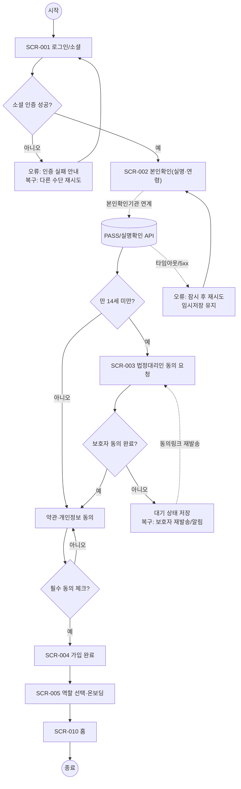
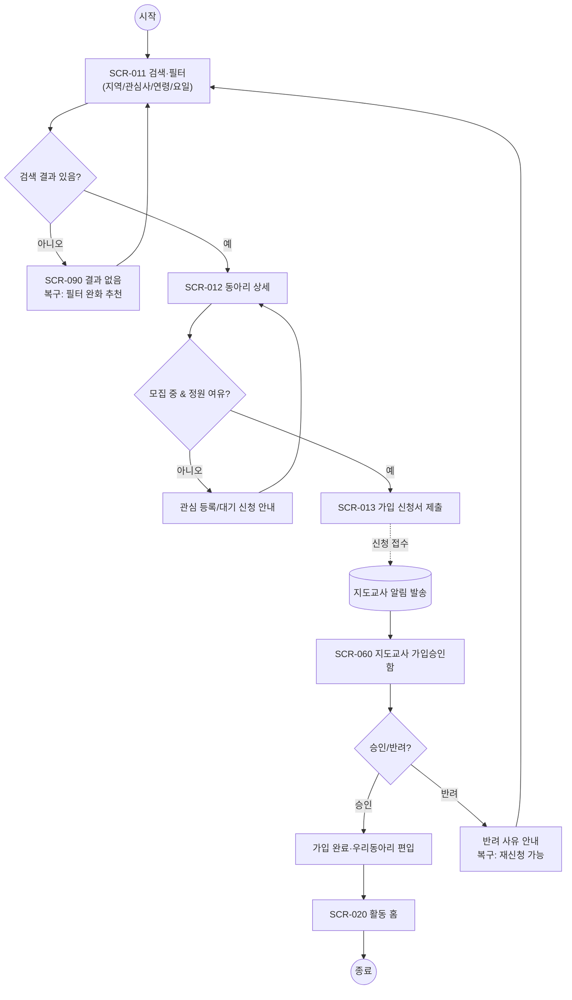
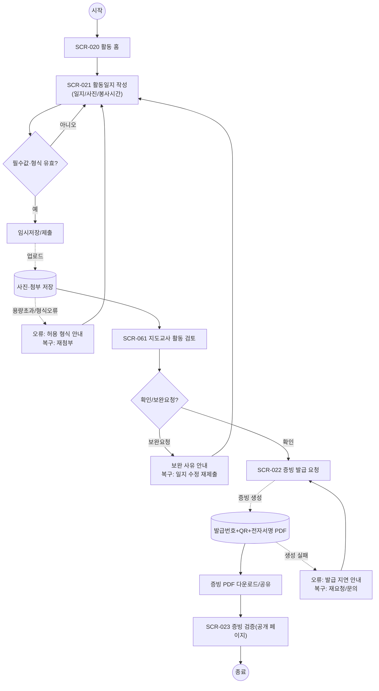
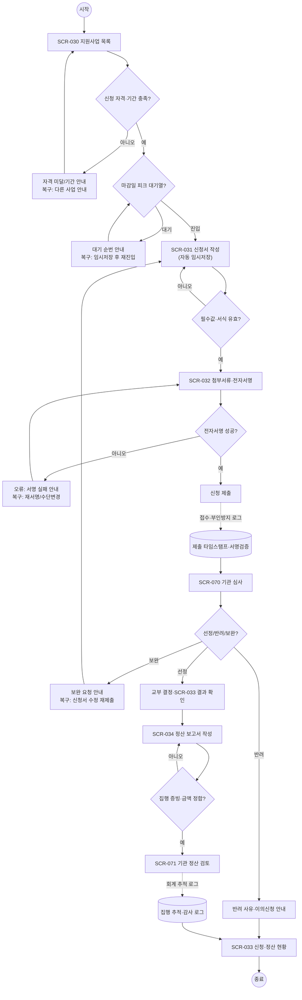

# 05 · 정보구조(IA) · 핵심 유저플로우 · 화면목록 — 전국 청소년 동아리 통합 플랫폼

> **담당 에이전트:** information-architecture-lead · **파이프라인 단계:** 5(IA/플로우) · **본문:** 한국어
> **표준 참조(SSOT):** [InformationArchitectureGuide](../../GoldWiki/UX/InformationArchitectureGuide.md) · [UserFlowGuide](../../GoldWiki/UX/UserFlowGuide.md) · [ScreenList_Template](../../Templates/ScreenList_Template.md)
> **선행 입력:** [01_RFP_Analysis.md](01_RFP_Analysis.md) · [02_Proposal_Strategy.md](02_Proposal_Strategy.md)
> **추적성 ID 체계:** 요구 `REQ-###` ↔ 화면 `SCR-###` ↔ 플로우 `FLOW-##` ↔ 테스트 `TC-###`
> **작성일:** 2026-06-26

---

## 0. 설계 원칙 (RFP 동인 → IA 결정)

본 IA·플로우는 RFP 분석에서 확정된 발주처 동인 3축과 4개 사용자 역할을 구조로 옮긴 결과다. 모든 결정은 추적 가능한 요구(REQ)에 근거한다.

| 설계 원칙 | 근거(REQ/RFP 신호) | IA·플로우 반영 |
| --- | --- | --- |
| 모바일 퍼스트·도달 깊이 ≤ 3 | REQ-014, H-1(청소년 70% 모바일) | 하단 탭 5개 중심 IA, 핵심 과업 3탭 이내 도달 |
| 역할별 분리 IA(4역할) | REQ-021, RFP §2 | 청소년/지도교사·멘토/기관담당/진흥원관리자 4개 내비 트리 분기 |
| 접근성 내장(KWCAG 2.2 AA) | REQ-013, H-8 | 모든 화면 상태에 포커스·대체텍스트·오류 안내 규격, 저대역폭 폴백 |
| 증빙 신뢰성 가시화 | REQ-004, H-3 | 증빙 발급/검증을 독립 화면(SCR-022/SCR-023)으로 분리 |
| 아동 개인정보 보호 가시화 | REQ-008, RISK-01 | 법정대리인 동의를 별도 화면(SCR-003)·별도 플로우로 격리 |
| 마감일 피크 흡수 | REQ-019, RISK-02 | 지원금 신청 플로우에 대기열·임시저장·재진입 노드 명시 |

> 라벨링 원칙(IA 가이드 §2): 사용자 용어 우선("우리 동아리", "활동일지", "증빙 발급"), 내부 용어("워크플로우", "엔티티") 노출 금지. 카드소팅은 폐쇄형으로 청소년 20명·지도교사 10명 표본 검증을 시행하며, 트리 테스트 탐색 성공률 목표 ≥ 80%(REQ-021 검증, TC-121 시드).

---

## 1. 정보구조 (사이트맵)

### 1.1 IA-ID 등록 (사이트맵 노드 ↔ 화면 ↔ 요구 추적)

| IA-ID | 영역(라벨) | 대상 역할 | 내비 유형 | 대응 SCR | 대응 REQ |
| --- | --- | --- | --- | --- | --- |
| IA-00 | 홈(둘러보기) | 전체 | 글로벌(탭1) | SCR-010 | REQ-001 |
| IA-01 | 동아리 찾기 | 청소년/전체 | 글로벌(탭2) | SCR-011, SCR-012, SCR-013 | REQ-001, REQ-002 |
| IA-02 | 우리 동아리(활동) | 청소년/지도교사 | 글로벌(탭3) | SCR-020~SCR-023 | REQ-003, REQ-004 |
| IA-03 | 지원금 | 청소년/지도교사/기관 | 글로벌(탭4) | SCR-030~SCR-035 | REQ-005, REQ-006, REQ-022 |
| IA-04 | 내 정보(마이) | 전체 | 글로벌(탭5) | SCR-040~SCR-044 | REQ-007~009, REQ-011 |
| IA-05 | 커뮤니티·공지 | 전체 | 로컬 | SCR-050~SCR-052 | REQ-011, REQ-012 |
| IA-06 | 승인·관리(지도교사) | 지도교사/멘토 | 역할 분기 | SCR-060~SCR-062 | REQ-002, REQ-003 |
| IA-07 | 기관 운영 콘솔 | 기관담당 | 역할 분기 | SCR-070~SCR-073 | REQ-005, REQ-010, REQ-022 |
| IA-08 | 진흥원 관리자 콘솔 | 진흥원관리자 | 역할 분기 | SCR-080~SCR-083 | REQ-010, REQ-015, REQ-017 |
| IA-09 | 인증·온보딩 | 비로그인 | 유틸리티 | SCR-001~SCR-005 | REQ-007~009 |
| IA-10 | 공통·시스템 | 전체 | 유틸/푸터 | SCR-090~SCR-094 | REQ-013, REQ-015, REQ-018 |

### 1.2 사이트맵 (역할별 분기 · 깊이 ≤ 3)

```mermaid
flowchart TD
  ROOT["전국 청소년 동아리 통합 플랫폼"]

  ROOT --> AUTH["IA-09 인증·온보딩"]
  ROOT --> GNB["글로벌 내비(하단 탭 5)"]
  ROOT --> ROLE["역할별 콘솔"]
  ROOT --> SYS["IA-10 공통·시스템"]

  AUTH --> A1["SCR-001 로그인/소셜"]
  AUTH --> A2["SCR-002 본인확인"]
  AUTH --> A3["SCR-003 법정대리인 동의(만14세 미만)"]
  AUTH --> A4["SCR-004 회원가입 완료"]
  AUTH --> A5["SCR-005 역할 선택·온보딩"]

  GNB --> T1["IA-00 홈 · SCR-010"]
  GNB --> T2["IA-01 동아리 찾기"]
  GNB --> T3["IA-02 우리 동아리"]
  GNB --> T4["IA-03 지원금"]
  GNB --> T5["IA-04 내 정보"]

  T2 --> C1["SCR-011 검색·필터"]
  T2 --> C2["SCR-012 동아리 상세"]
  T2 --> C3["SCR-013 가입 신청"]

  T3 --> D1["SCR-020 활동 홈"]
  T3 --> D2["SCR-021 활동일지 작성"]
  T3 --> D3["SCR-022 증빙 발급"]
  T3 --> D4["SCR-023 증빙 검증(공개)"]

  T4 --> E1["SCR-030 지원사업 목록"]
  T4 --> E2["SCR-031 신청서 작성"]
  T4 --> E3["SCR-032 첨부·전자서명"]
  T4 --> E4["SCR-033 신청 현황·결과"]
  T4 --> E5["SCR-034 정산 보고"]

  T5 --> F1["SCR-040 마이 홈"]
  T5 --> F2["SCR-041 내 활동 포트폴리오"]
  T5 --> F3["SCR-042 알림 함"]
  T5 --> F4["SCR-043 개인정보·동의 관리"]

  ROLE --> R1["IA-06 지도교사: SCR-060 가입승인함 / SCR-061 활동검토 / SCR-062 동아리관리"]
  ROLE --> R2["IA-07 기관: SCR-070 지원금심사 / SCR-071 정산검토 / SCR-072 참여현황 / SCR-073 공지발송"]
  ROLE --> R3["IA-08 진흥원: SCR-080 통합대시보드 / SCR-081 통계분석 / SCR-082 권한·감사 / SCR-083 PIA·개인정보"]

  SYS --> S1["SCR-090 검색결과 없음/빈상태"]
  SYS --> S2["SCR-091 오류/네트워크"]
  SYS --> S3["SCR-092 접근성 설정"]
  SYS --> S4["SCR-093 약관·개인정보처리방침"]
```

### 1.3 내비게이션 사양 (역할 분리)

| 내비 유형 | 구성 | 노출 조건 | 근거 |
| --- | --- | --- | --- |
| 글로벌(하단 탭) | 홈 · 동아리찾기 · 우리동아리 · 지원금 · 내정보 | 모든 로그인 사용자(라벨 동일, 권한별 내용 분기) | REQ-014, REQ-021 |
| 역할 진입점 | 마이 홈 상단 "관리자 전환" 카드 | 지도교사/기관/진흥원 권한 보유 시 | REQ-021 |
| 로컬 | 영역 내 탭/필터(예: 지원금 목록→상세→현황) | 영역 진입 시 | REQ-005 |
| 유틸리티 | 검색, 알림, 접근성 설정 | 전 화면 헤더 | REQ-011, REQ-013 |
| 푸터 | 약관·개인정보·고객센터·기관문의 | 웹(PC/Tablet) | REQ-015, CP |

> **도달 깊이 검증:** 청소년 핵심 과업(동아리 가입, 활동일지 등록, 지원금 신청)은 모두 탭 1회 + 화면 2회 이내(≤3)로 도달한다. IA 가이드 §4(깊이 ≤ 3) 충족.

---

## 2. 핵심 유저플로우 (mermaid)

> 표기 원칙(UserFlowGuide §표기법): 한 화면 = 한 노드, 모든 분기 2출구 이상, 모든 에러에 (메시지·복구·시스템처리). 점선은 백그라운드 시스템 처리. 각 플로우는 화면목록(§3)·QA 시드(§4)와 1:1 정합.

### FLOW-04 회원가입·본인확인 (REQ-007~009 · TC-107~109)

만 14세 미만 분기를 별도 동의 경로로 격리(RISK-01 완화). 데드엔드 없음.

### FLOW-01 동아리 검색 → 상세 → 가입(승인) (REQ-001~002 · TC-101~102)

### FLOW-02 활동기록 → 증빙 발급 (REQ-003~004 · TC-103~104)

증빙 위변조 방지(발급번호·QR·전자서명)를 시스템 처리로 명시(H-3, RISK-06).

### FLOW-03 지원금 신청 → 심사 → 정산 (REQ-005~006, 022 · TC-105~106, 122)

마감일 동시접속 피크에 대한 대기열·임시저장·재진입을 명시(REQ-019, RISK-02). 전자서명 부인방지(REQ-006).

### 분기·예외 명세 (공통)

| 플로우 | 예외 | 사용자 메시지 | 복구 행동 | 시스템 처리 |
| --- | --- | --- | --- | --- |
| FLOW-04 | 본인확인 타임아웃 | "확인이 지연됩니다. 잠시 후 재시도" | 재시도 버튼, 입력 유지 | 임시저장, 연계 재호출 |
| FLOW-04 | 보호자 동의 미완 | "보호자 동의 대기 중" | 동의 링크 재발송 | 대기 상태 저장·알림 |
| FLOW-01 | 무결과 검색 | "조건에 맞는 동아리가 없어요" | 필터 완화 추천 | 추천 동아리 노출 |
| FLOW-01 | 가입 반려 | "지도교사가 반려했습니다(사유)" | 재신청/다른 동아리 | 반려 사유 기록 |
| FLOW-02 | 첨부 형식 오류 | "지원 형식: jpg/png/pdf, 10MB 이하" | 재첨부 | 업로드 차단·검증 |
| FLOW-02 | 증빙 생성 실패 | "발급이 지연됩니다" | 재요청/문의 | 큐 재처리·알림 |
| FLOW-03 | 마감 피크 대기 | "접속이 많아 대기 중(순번 N)" | 임시저장 후 재진입 | 대기열·오토스케일 |
| FLOW-03 | 전자서명 실패 | "서명에 실패했습니다" | 재서명/수단 변경 | 서명 세션 재발급 |
| 공통 | 세션 만료 | "보안을 위해 로그아웃되었습니다" | 재로그인(원위치 복귀) | 작성 내용 임시저장 |
| 공통 | 권한 없음 | "접근 권한이 없습니다" | 역할 전환/홈 이동 | 접근 로그 기록 |

---

## 3. 화면목록 (SCR-### · 화면명 · 역할 · 연결 REQ)

> ScreenList_Template 준수. 화면ID는 IA·플로우·테스트를 잇는 키로 끝까지 유지한다. 반응형: M=Mobile(기본), T=Tablet, P=PC. 우선순위: P0(오픈 필수)·P1·P2.

### 3.1 화면 목록 표 (추적)

| SCR-ID | 화면명 | 역할(권한) | 대응 IA | 대응 REQ | 대응 FLOW | 반응형 | 우선순위 |
| --- | --- | --- | --- | --- | --- | --- | --- |
| SCR-001 | 로그인/소셜 로그인 | 비로그인 | IA-09 | REQ-007 | FLOW-04 | M/T/P | P0 |
| SCR-002 | 본인확인(실명·연령) | 비로그인 | IA-09 | REQ-009 | FLOW-04 | M/T/P | P0 |
| SCR-003 | 법정대리인 동의(만14세 미만) | 비로그인/보호자 | IA-09 | REQ-008 | FLOW-04 | M/T/P | P0 |
| SCR-004 | 회원가입 완료 | 비로그인 | IA-09 | REQ-007 | FLOW-04 | M/T/P | P0 |
| SCR-005 | 역할 선택·온보딩 | 로그인 | IA-09 | REQ-021 | FLOW-04 | M/T/P | P0 |
| SCR-010 | 홈(둘러보기) | 전체 | IA-00 | REQ-001 | FLOW-01 | M/T/P | P0 |
| SCR-011 | 동아리 검색·필터 | 전체 | IA-01 | REQ-001 | FLOW-01 | M/T/P | P0 |
| SCR-012 | 동아리 상세 | 전체 | IA-01 | REQ-001, REQ-002 | FLOW-01 | M/T/P | P0 |
| SCR-013 | 가입 신청서 | 청소년 | IA-01 | REQ-002 | FLOW-01 | M/T/P | P0 |
| SCR-020 | 우리 동아리 활동 홈 | 청소년/지도교사 | IA-02 | REQ-003 | FLOW-02 | M/T/P | P0 |
| SCR-021 | 활동일지 작성(사진·봉사시간) | 청소년/지도교사 | IA-02 | REQ-003 | FLOW-02 | M/T/P | P0 |
| SCR-022 | 증빙 발급 | 청소년/지도교사 | IA-02 | REQ-004 | FLOW-02 | M/T/P | P0 |
| SCR-023 | 증빙 검증(공개) | 전체(비로그인 가능) | IA-02 | REQ-004 | FLOW-02 | M/T/P | P0 |
| SCR-030 | 지원사업 목록 | 청소년/지도교사/기관 | IA-03 | REQ-005 | FLOW-03 | M/T/P | P0 |
| SCR-031 | 지원금 신청서 작성 | 청소년/지도교사 | IA-03 | REQ-005 | FLOW-03 | M/T/P | P0 |
| SCR-032 | 첨부서류·전자서명 | 청소년/지도교사 | IA-03 | REQ-006 | FLOW-03 | M/T/P | P0 |
| SCR-033 | 신청·정산 현황·결과 | 청소년/지도교사/기관 | IA-03 | REQ-005, REQ-022 | FLOW-03 | M/T/P | P0 |
| SCR-034 | 정산 보고서 작성 | 청소년/지도교사 | IA-03 | REQ-022 | FLOW-03 | M/T/P | P1 |
| SCR-040 | 마이 홈 | 전체 | IA-04 | REQ-007 | - | M/T/P | P0 |
| SCR-041 | 내 활동 포트폴리오 | 청소년 | IA-04 | REQ-003 | - | M/T/P | P1 |
| SCR-042 | 알림 함 | 전체 | IA-04 | REQ-011 | - | M/T/P | P0 |
| SCR-043 | 개인정보·동의 관리 | 전체 | IA-04 | REQ-008, REQ-015 | - | M/T/P | P0 |
| SCR-050 | 공지 목록·상세 | 전체 | IA-05 | REQ-011 | - | M/T/P | P1 |
| SCR-051 | 커뮤니티 게시판 | 전체 | IA-05 | REQ-012 | - | M/T/P | P1 |
| SCR-052 | 게시글 신고·관리 | 전체/관리 | IA-05 | REQ-012 | - | M/T/P | P1 |
| SCR-060 | 지도교사 가입승인함 | 지도교사/멘토 | IA-06 | REQ-002 | FLOW-01 | M/T/P | P0 |
| SCR-061 | 지도교사 활동 검토 | 지도교사/멘토 | IA-06 | REQ-003 | FLOW-02 | M/T/P | P0 |
| SCR-062 | 동아리 관리(정원·일정) | 지도교사 | IA-06 | REQ-002 | - | T/P | P1 |
| SCR-070 | 기관 지원금 심사 | 기관담당 | IA-07 | REQ-005 | FLOW-03 | T/P | P0 |
| SCR-071 | 기관 정산 검토·집행 추적 | 기관담당 | IA-07 | REQ-022 | FLOW-03 | T/P | P0 |
| SCR-072 | 기관 참여 현황 | 기관담당 | IA-07 | REQ-010 | FLOW-05 | T/P | P1 |
| SCR-073 | 기관 공지·알림 발송 | 기관담당 | IA-07 | REQ-011 | - | T/P | P1 |
| SCR-080 | 진흥원 통합 대시보드 | 진흥원관리자 | IA-08 | REQ-010 | FLOW-05 | P | P0 |
| SCR-081 | 통계 분석·정산 현황 | 진흥원관리자 | IA-08 | REQ-010, REQ-022 | FLOW-05 | P | P1 |
| SCR-082 | 권한·감사 로그 관리 | 진흥원관리자 | IA-08 | REQ-015 | - | P | P1 |
| SCR-083 | PIA·개인정보 관리 | 진흥원관리자 | IA-08 | REQ-017 | - | P | P1 |
| SCR-090 | 검색결과 없음/빈 상태 | 전체 | IA-10 | REQ-001 | FLOW-01 | M/T/P | P0 |
| SCR-091 | 오류/네트워크 안내 | 전체 | IA-10 | REQ-014 | 공통 | M/T/P | P0 |
| SCR-092 | 접근성 설정 | 전체 | IA-10 | REQ-013 | - | M/T/P | P0 |
| SCR-093 | 약관·개인정보처리방침 | 전체 | IA-10 | REQ-015 | - | M/T/P | P0 |
| SCR-094 | 고객센터·문의 | 전체 | IA-10 | REQ-011 | - | M/T/P | P1 |

> **신규 FLOW-05(통계·정산 조회)**: RTM(01_RFP_Analysis §RTM)에서 SCR-050 운영 대시보드로 표기된 항목을 본 단계에서 SCR-072/080/081로 세분화했다. REQ-010, REQ-022 ↔ TC-110, TC-122 추적 유지.

### 3.2 화면 상태 정의 (대표 화면)

| SCR-ID | 기본 | 빈 상태 | 로딩 | 오류 | 권한 없음 |
| --- | --- | --- | --- | --- | --- |
| SCR-011 | 필터+카드 리스트 | "조건에 맞는 동아리 없음"+필터완화 | 스켈레톤 카드 | 재시도 버튼 | - |
| SCR-021 | 작성 폼 | 첫 활동 안내 | 업로드 진행률 | 형식/용량 인라인 오류 | 로그인 유도 |
| SCR-031 | 신청 폼(자동저장) | 임시저장 불러오기 | 저장 인디케이터 | 마감/자격 안내 | 자격 미달 안내 |
| SCR-032 | 첨부+서명 영역 | 첨부 없음 안내 | 서명 처리중 | 서명 실패 재시도 | - |
| SCR-070 | 심사 목록·필터 | 심사 대상 없음 | 스켈레톤 표 | 데이터 재조회 | 기관 권한 안내 |
| SCR-080 | 지표 카드+차트 | 데이터 수집 중 안내 | 차트 스켈레톤 | 부분 실패+갱신 | 관리자 권한 안내 |

### 3.3 화면 상세 (핵심 5종)

#### SCR-003 법정대리인 동의 (RISK-01 격리 화면)
| 항목 | 내용 |
| --- | --- |
| 목적 | 만 14세 미만 가입 시 보호자 동의를 별도 경로로 수집·증빙(아동 개인정보 감사 대응) |
| 진입 경로 | SCR-002 본인확인(연령 < 14) 분기 |
| 이탈/다음 | 동의 완료 → SCR-004 / 미완 → 대기 상태(보호자 재발송) |
| 핵심 컴포넌트 | 보호자 정보 입력, 동의 항목 체크, 본인확인 연계, 동의 타임스탬프 표시 |
| 데이터 | 본인확인 API, 동의 이력 저장(감사 로그) |
| 예외 | 보호자 본인확인 실패, 동의 거부, 링크 만료 |
| 추적 | REQ-008 · FLOW-04 · TC-108 |

#### SCR-022 증빙 발급
| 항목 | 내용 |
| --- | --- |
| 목적 | 생활기록부 연계용 활동 증빙 PDF 발급(발급번호·QR·전자서명) |
| 진입 경로 | SCR-020 활동 홈, SCR-061 지도교사 확인 후 |
| 이탈/다음 | 발급 → PDF 다운로드/공유 / 검증 → SCR-023 |
| 핵심 컴포넌트 | 발급 대상 선택, 미리보기, 발급번호·QR, 전자서명 검증 표시 |
| 데이터 | 활동기록, 증빙 생성 큐, 전자서명 인증서 |
| 예외 | 미승인 활동, 생성 실패, 위변조 검증 실패 |
| 추적 | REQ-004 · FLOW-02 · TC-104 |

#### SCR-032 첨부서류·전자서명
| 항목 | 내용 |
| --- | --- |
| 목적 | 지원금 신청의 부인방지 전자서명·첨부서류 제출 |
| 진입 경로 | SCR-031 신청서 작성 완료 |
| 이탈/다음 | 서명 성공 → 제출 / 실패 → 재서명 |
| 핵심 컴포넌트 | 첨부 업로더, 서식 검증, 전자서명 위젯, 제출 확인 |
| 데이터 | 전자서명 인증, 첨부 저장, 부인방지 로그 |
| 예외 | 서명 수단 오류, 첨부 누락/용량 초과, 세션 만료 |
| 추적 | REQ-006 · FLOW-03 · TC-106 |

#### SCR-070 기관 지원금 심사
| 항목 | 내용 |
| --- | --- |
| 목적 | 제출된 지원금 신청의 선정/반려/보완 처리 |
| 진입 경로 | 기관 콘솔(IA-07), 알림 |
| 이탈/다음 | 선정 → 교부/정산(SCR-071) / 보완·반려 → 신청자 알림 |
| 핵심 컴포넌트 | 심사 목록·필터, 신청서 뷰어, 평가 입력, 일괄 처리 |
| 데이터 | 신청 데이터, 심사 이력, 알림 발송 |
| 예외 | 권한 없음, 동시 심사 충돌, 마감 후 처리 |
| 추적 | REQ-005 · FLOW-03 · TC-105 |

#### SCR-080 진흥원 통합 대시보드
| 항목 | 내용 |
| --- | --- |
| 목적 | 17개 시·도 참여 현황·통계·정산 현황 가시화(행정 효율 KPI) |
| 진입 경로 | 진흥원 콘솔(IA-08) |
| 이탈/다음 | 통계 분석(SCR-081), 개인정보 관리(SCR-083) |
| 핵심 컴포넌트 | 지표 카드, 지역별 차트, 정산 진행률, 기간 필터, 내보내기 |
| 데이터 | 집계 데이터, 정산 추적, 감사 로그 |
| 예외 | 데이터 지연, 부분 집계 실패, 권한 분리 |
| 추적 | REQ-010 · FLOW-05 · TC-110 |

---

## 4. QA 시나리오 시드 (플로우 → 테스트 추적)

| TC | 시나리오 | 출처 FLOW/SCR | 대응 REQ | 핵심 검증점 |
| --- | --- | --- | --- | --- |
| TC-101 | 필터 검색 결과/무결과 처리 | FLOW-01/SCR-011, SCR-090 | REQ-001 | 4개 필터 조합·빈상태 복구 |
| TC-102 | 가입 신청→승인/반려 상태전이 | FLOW-01/SCR-013, SCR-060 | REQ-002 | 승인·반려·재신청 경로 |
| TC-103 | 활동일지 작성·첨부 검증 | FLOW-02/SCR-021 | REQ-003 | 필수값·형식·보완요청 |
| TC-104 | 증빙 발급·공개 검증 | FLOW-02/SCR-022, SCR-023 | REQ-004 | 발급번호·QR·서명 검증 |
| TC-105 | 지원금 신청→심사 E2E | FLOW-03/SCR-031, SCR-070 | REQ-005 | 선정/반려/보완 전 경로 |
| TC-106 | 전자서명 부인방지 | FLOW-03/SCR-032 | REQ-006 | 서명 성공·실패·로그 |
| TC-107~109 | 가입·본인확인·아동 동의 | FLOW-04/SCR-001~003 | REQ-007~009 | 연령 분기·보호자 동의 |
| TC-110 | 대시보드 데이터 정합 | FLOW-05/SCR-080 | REQ-010 | 집계·정산 정합률 |
| TC-114 | 3 breakpoint 반응형 | 전 화면 | REQ-014 | M/T/P 레이아웃 |
| TC-119 | 마감일 피크 대기열 | FLOW-03/SCR-030, SCR-031 | REQ-019 | 대기열·임시저장 재진입 |
| TC-121 | 역할별 시나리오·트리테스트 | 전 플로우 | REQ-021 | 탐색 성공률 ≥ 80% |
| TC-122 | 정산 추적·집행 감사 | FLOW-03/SCR-071 | REQ-022 | 회계 추적성 |

---

## 5. 추적성 매트릭스(RTM) 갱신 — SCR/FLOW 확정

> 01_RFP_Analysis의 RTM 골격(빈 SCR/FLOW)을 본 단계에서 확정한다. **REQ → SCR → FLOW → TC** 끊김 없음.

| 요구 ID | 화면(SCR) | 플로우(FLOW) | 테스트(TC) | 상태 |
| --- | --- | --- | --- | --- |
| REQ-001 | SCR-010, SCR-011, SCR-012, SCR-090 | FLOW-01 | TC-101 | 확정 |
| REQ-002 | SCR-013, SCR-060, SCR-062 | FLOW-01 | TC-102 | 확정 |
| REQ-003 | SCR-020, SCR-021, SCR-061 | FLOW-02 | TC-103 | 확정 |
| REQ-004 | SCR-022, SCR-023 | FLOW-02 | TC-104 | 확정 |
| REQ-005 | SCR-030, SCR-031, SCR-070 | FLOW-03 | TC-105 | 확정 |
| REQ-006 | SCR-032 | FLOW-03 | TC-106 | 확정 |
| REQ-007 | SCR-001, SCR-004, SCR-040 | FLOW-04 | TC-107 | 확정 |
| REQ-008 | SCR-003, SCR-043 | FLOW-04 | TC-108 | 확정 |
| REQ-009 | SCR-002 | FLOW-04 | TC-109 | 확정 |
| REQ-010 | SCR-072, SCR-080, SCR-081 | FLOW-05 | TC-110 | 확정 |
| REQ-011 | SCR-042, SCR-050, SCR-073, SCR-094 | - | TC-111 | 확정 |
| REQ-012 | SCR-051, SCR-052 | - | TC-112 | 확정 |
| REQ-013 | SCR-092 + 전 화면 상태 | 공통 | TC-113 | 확정 |
| REQ-014 | 전 화면(M/T/P) | 공통 | TC-114 | 확정 |
| REQ-015 | SCR-043, SCR-082, SCR-093 | - | TC-115 | 확정 |
| REQ-017 | SCR-083 | - | TC-117 | 확정 |
| REQ-019 | SCR-030, SCR-031 | FLOW-03 | TC-119 | 확정 |
| REQ-021 | SCR-005 + 역할 분기 IA | 전 플로우 | TC-121 | 확정 |
| REQ-022 | SCR-034, SCR-071, SCR-081 | FLOW-03/05 | TC-122 | 확정 |

> 비화면 요구(REQ-016 데이터 이관·배치, REQ-018 환경 제약, REQ-020 일정)는 화면 비대상으로 백엔드/PMO 단계에서 추적한다.

---

## 6. 검증 체크리스트 (IA·UserFlow 가이드 품질 기준)

**IA 가이드 품질 기준**
- [x] 라벨이 사용자 용어 기반(폐쇄형 카드소팅 검증 계획 포함, TC-121)
- [x] 중요 콘텐츠 도달 깊이 ≤ 3 (청소년 핵심 3과업 탭+2화면 이내)
- [x] 내비게이션 역할(글로벌/로컬/유틸/푸터) 구분
- [x] 검색 전략(파셋 필터·무결과 처리 SCR-090) 존재
- [x] 사이트맵이 유저플로우·화면목록과 정합

**UserFlow 가이드 품질 기준**
- [x] 모든 핵심 과업에 happy path + 에러 경로 동시 존재(FLOW-01~04)
- [x] 모든 분기 2출구 이상(데드엔드 없음)
- [x] 모든 에러에 사용자 메시지 + 복구 경로(§2 분기·예외 명세)
- [x] 플로우의 모든 화면이 화면목록과 1:1 매칭
- [x] 빈 상태/로딩/권한 예외 포함(§3.2 상태 정의)

**ScreenList 템플릿 기준**
- [x] 모든 화면이 IA-ID·REQ에 매핑
- [x] 플로우 등장 화면 전부 등재
- [x] 각 화면 상태(빈/로딩/오류) 정의
- [x] 반응형 대상(M/T/P) 표기

---

## 7. 인계 (단계 6 → UI)

본 IA·플로우·화면목록은 단계 6 [UI 컨셉·디자인 시스템], 단계 8 [QA 게이트]의 입력으로 인계된다.

**인계 산출물:** 사이트맵(역할 분기) · 핵심 플로우 4종 + FLOW-05 · 화면목록 41화면(P0 24·P1 15·P2 0) · RTM 확정본.

**거버넌스 갱신 트리거(의사결정 로그·프로젝트 메모리 기록 대상):**
- RTM의 SCR/FLOW 골격을 확정값으로 전환(REQ-010 운영 대시보드를 SCR-072/080/081 + FLOW-05로 세분화)
- 아동 개인정보 동의를 독립 화면(SCR-003)·독립 플로우로 격리(RISK-01 완화 설계)
- 지원금 마감 피크를 플로우 노드(대기열·임시저장·재진입)로 명시(REQ-019, RISK-02)

**UI 단계 확인 요청 사항:**
1. 역할 전환 UX(단일 계정 다역할 vs 분리 콘솔) 최종안
2. 증빙 공개 검증 페이지(SCR-023)의 비로그인 접근 범위
3. 진흥원 대시보드(SCR-080) 통계 항목·Open API 공개 수준(01 단계 미해결 Q&A 연계)
