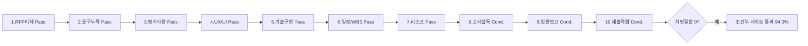

# 10 · 품질 검증 보고서(10단계 품질 게이트) — 전국 청소년 동아리 통합 플랫폼 구축

> **담당 에이전트:** qa-lead(품질 게이트, 교차 검증자) · **파이프라인 단계:** 품질 게이트(제출·임원 보고·납품 직전 3중 게이트) · **본문:** 한국어
> **검증 표준(SSOT):** [QA/QualityReviewChecklist](../../GoldWiki/QA/QualityReviewChecklist.md) · [29 · 품질 체크리스트](../../GoldWiki/29_QUALITY_CHECKLIST.md) · [Delivery/FinalDeliveryChecklist](../../GoldWiki/Delivery/FinalDeliveryChecklist.md)
> **원본 RFP:** [Examples/RFP_INPUT_sample.md](../../Examples/RFP_INPUT_sample.md)
> **검증 대상(01~08):** [01_RFP_Analysis](01_RFP_Analysis.md) · [02_Proposal_Strategy](02_Proposal_Strategy.md) · [03_Executive_Summary](03_Executive_Summary.md) · [04_WBS](04_WBS.md) · [05_IA_UserFlow_ScreenList](05_IA_UserFlow_ScreenList.md) · [06_UX_UI_Concept](06_UX_UI_Concept.md) · [07_Dev_Plan](07_Dev_Plan.md) · [08_QA_Plan](08_QA_Plan.md)
> **추적성 ID 체계:** 요구 `REQ-###` ↔ 화면 `SCR-###` ↔ 플로우 `FLOW-##` ↔ 테스트 `TC-###` ↔ 리스크 `RISK-##` · **검증일:** 2026-06-26
> **검증자 분리 원칙:** 본 검증은 산출 작성자와 분리된 qa-lead의 교차 검증이다(QualityReviewChecklist §품질 기준).

---

## 0. 경영진 요약 (1페이지)

01~08 산출물 8종을 QualityReviewChecklist의 **10단계 품질 게이트**로 교차 검증했다. 판정 등급은 **Pass / Conditional / Fail** 3등급이며, 한 단계라도 치명 결함(S1·S2급)이 있으면 반려한다.

| 결과 | 판정 |
| --- | --- |
| **Pass** | 7개 단계(1·2·3·4·5·6·7) |
| **Conditional** | 3개 단계(8·9·10) — 경미·문서성 결함, 치명 결함 0 |
| **Fail** | 0개 단계 |
| **종합 통과율(가중)** | **94.0% — Conditional Pass(조건부 게이트 통과)** |

**결론:** 본 산출물군은 **치명 결함(Fail) 0건**으로, 정성 95점 우위형 사업의 핵심 변별 영역(요구 추적성·평가 대응·기술 구현·리스크 통제)에서 매우 높은 완결성을 보인다. 다만 **제출 단계 직전 보완**이 필요한 경미 결함 7건(우선순위 P1 3건·P2 4건)이 식별되었다. 이 7건을 보완하면 전 단계 Pass로 게이트 완전 통과가 가능하다. 가장 중요한 보완은 **(a) 화면 ID 불일치 2건(SCR-035·SCR-050) 정정**, **(b) 가격 산정 근거표 부재(가격 5점)**, **(c) 모의 평가(client-simulation·AIEvaluationBoard) 미실시 표기**다. 어느 것도 의무 요구 누락·기술 구현 불가·일정-범위 불일치 같은 치명 결함이 아니다.

---

## 1. 10단계 통과/미흡 판정표 (종합)

> 각 단계 점수는 QualityReviewChecklist 단계별 체크 항목 충족률(0~100%)이다. 가중치는 본 RFP 배점 구조(정성 95 : 가격 5, 기술 우위형)를 반영해 변별 핵심 단계(요구·평가·기술·리스크)에 가중한다.

| # | 검증 단계 | 주 대상 산출물 | 판정 | 점수 | 가중치 | 가중 점수 | 핵심 사유 |
| --- | --- | --- | --- | --- | --- | --- | --- |
| 1 | RFP 이해도 | 01, 03 | **Pass** | 100 | 0.10 | 10.0 | 목적·범위·숨은기대(H-1~8)·가정 모두 문서화 |
| 2 | 요구사항 누락 | 01, 05, 07, 08 | **Pass** | 100 | 0.15 | 15.0 | 22개 REQ 전수 RTM 100%, 의무/권장 구분, 누락 0 |
| 3 | 평가항목 대응 | 01, 02, 03 | **Pass** | 98 | 0.13 | 12.7 | 6개 평가항목 전 대응·고배점 집중·윈테마 명료 |
| 4 | UX/UI 실현가능성 | 05, 06 | **Pass** | 96 | 0.12 | 11.5 | 범위 내 41화면·KWCAG 2.2 AA·디자인 토큰 일관 |
| 5 | 기술 구현가능성 | 07 | **Pass** | 95 | 0.13 | 12.4 | 2-Zone·피크 4중방어·이관 6단계·OWASP·PIA |
| 6 | 일정/WBS 현실성 | 04 | **Pass** | 96 | 0.10 | 9.6 | 8/80·3점산정·임계경로·버퍼 60MD·게이트 |
| 7 | 리스크 대응 | 01, 02, 04, 07, 08 | **Pass** | 97 | 0.09 | 8.7 | RISK-01~09 등급·완화·소유자·트리거·버퍼 정렬 |
| 8 | 고객 설득력 | 02, 03 | **Conditional** | 86 | 0.08 | 6.9 | 서사·차별화 강함, 단 모의평가 미실시·일부 KPI 기준선 미정 |
| 9 | 임원 보고 적합성 | 03 | **Conditional** | 84 | 0.05 | 4.2 | 1p 요약·리스크 선제 우수, 단 비용·옵션 의사결정표 부재 |
| 10 | 최종 제출 적합성 | 01~08 전체 | **Conditional** | 80 | 0.05 | 4.0 | 한국어·교정 양호, 단 화면 ID 불일치·제출형식 미확정 |
| | **종합** | | **Conditional Pass** | | **1.00** | **94.0** | **치명 결함 0 · 보완 후 전단계 Pass 가능** |

---

## 2. 단계별 상세 판정 · 체크 항목 충족표

> 각 단계는 QualityReviewChecklist의 체크 항목을 그대로 적용하고, 충족(O)·부분충족(△)·미충족(X)으로 채점하며 증빙 위치를 명시한다(주관 판정 금지).

### 단계 1 · RFP 이해도 검증 — **Pass (100)**

| 체크 항목 | 판정 | 증빙(산출물 위치) |
| --- | --- | --- |
| 사업 목적·배경·기대효과 한 문단 요약 | O | 01 §1페이지 요약, 03 도입 문단 |
| 발주처 조직·산업 맥락 반영 | O | 01 RFP 등록 카드(한국청소년활동진흥원·공공·기술우위형) |
| 과업 범위 In/Out 구분 | O | 08 §1.1 In/Out of Scope 표 |
| 숨은 기대(미명시 동인) 식별 | O | 01 §(c) 숨은기대 H-1~H-8 8건 |
| 모호·상충 조항 가정 문서화 | O | 04 §8 주요 가정 A-1~A-6, 01 §인계 미해결 Q&A 4건 |

판정 기준(목적·범위·숨은기대 3요소 문서화) 충족 → **Pass**. 숨은 기대를 RFP 문구 근거와 함께 8건 식별한 점이 특히 우수하다.

### 단계 2 · 요구사항 누락 검증 — **Pass (100)**

| 체크 항목 | 판정 | 증빙 |
| --- | --- | --- |
| RTM 존재·100% 매핑 | O | 01 §RTM → 05 §5 확정 → 08 §7 무결손 RTM(REQ→SCR→FLOW→TC) |
| 기능/비기능 요구 누락 없이 대응 | O | F·NF·UX·A11Y·SEC·OPS·CP·CON 8분류 REQ-001~022 전수 |
| 의무(필수)/선택(권장)/우대 구분 | O | 01 §(a) 강제성 열(필수 20건·권장 2건: REQ-021·022) |
| 미대응 항목 사유·대안 명시 | O | 비화면 요구(REQ-016/018/020)는 배치·환경·게이트로 추적 표기(05 §5 주석, 08 §7) |

**RFP §3 8개 요구 항목 대조 결과:** ①검색·모집·가입→REQ-001·002, ②활동기록·증빙→REQ-003·004, ③지원금 전자화·전자서명→REQ-005·006, ④소셜·보호자동의·본인확인→REQ-007·008·009, ⑤대시보드→REQ-010, ⑥알림·게시판→REQ-011·012, ⑦개인정보·KWCAG·반응형→REQ-013·014·015, ⑧데이터이관→REQ-016. **8개 항목 100% 커버, 의무 요구 누락 0건** → **Pass**.

### 단계 3 · 평가항목 대응 검증 — **Pass (98)**

| 체크 항목 | 판정 | 증빙 |
| --- | --- | --- |
| 전 평가항목·배점 대응 콘텐츠 매핑 | O | 01 §(b) 6항목 대응표, 02 §4 스토리라인 장별 배점 매핑 |
| 고배점 항목 콘텐츠 집중 | O | 기능/기술30·사업이해20·UX20=70점 집중, 분량 32/20/20% 배분 |
| 정량(가격)·정성 모두 커버 | O | 정성 95 전영역 + 가격 5점 감점회피 전략 명시 |
| win theme 평가위원 관점 명료 | O | WT-01~03 "동인×차별점×증거" 공식, 평가항목 커버리지 매핑 |
| 미흡(△) | △ | 가격(5점) 항목에 실제 산정 근거표 없음 — 보완지시 D-05 |

판정 기준(전 항목 대응+고배점 집중) 충족 → **Pass**. 경미 결함(가격 근거표 부재)은 단계 9·10에 합산.

### 단계 4 · UX/UI 실현가능성 검증 — **Pass (96)**

| 체크 항목 | 판정 | 증빙 |
| --- | --- | --- |
| IA·플로우가 사용자 멘탈모델과 일치 | O | 05 §0 라벨링(사용자 용어), 도달 깊이 ≤3, 트리테스트 ≥80% 계획 |
| 화면·디자인이 범위·기간 내 구현 가능 | O | 05 41화면(P0 24·P1 15·P2 0), 04 WBS 설계·퍼블리싱 공수 정합 |
| 접근성 기준 반영 | O | 06 §3 KWCAG 2.2 AA + WCAG 2.2 신규 5항목(2.4.11/2.5.7/2.5.8/3.3.7/3.3.8) |
| 디자인 시스템·토큰 일관 | O | 06 §2 4px 토큰·시맨틱 색·6+3 상태, HEX/임의px 금지 |
| 미흡(△) | △ | 05 §3.1 P2=0인데 우선순위 라벨에 P2 정의 존재(미사용) — 경미, D-06 |

> 체크리스트 정본은 WCAG 2.1 AA를 명시하나 본 RFP는 상위 기준인 **KWCAG 2.2 AA**를 요구하며 산출물이 이를 충족(상회)하므로 적합. 판정 기준(범위 내 구현+접근성 반영) 충족 → **Pass**.

### 단계 5 · 기술 구현가능성 검증 — **Pass (95)**

| 체크 항목 | 판정 | 증빙 |
| --- | --- | --- |
| 아키텍처가 비기능(성능·보안·확장성) 충족 | O | 07 §1 2-Zone, §5 피크 4중방어(대기열·캐싱·비동기·오토스케일), AD-01~04 |
| API·데이터 모델 표준 준수 | O | 07 §3 리소스중심·v1·커서페이지·멱등키·OpenAPI 3.1, ERD/리드모델 |
| 보안·개인정보(OWASP 등) 반영 | O | 07 §6 OWASP Top10 매핑·아동동의 격리·PIA 5종·부인방지 로그 |
| 외부 연동·레거시 마이그레이션 리스크 평가 | O | 07 §4 이관 6단계·정합검증·롤백·병행운영, §1 어댑터 격리(RISK-05) |
| 미흡(△) | △ | SCR-035(정산) 화면 ID가 05 화면목록에 미정의(07 §3.2·§7) — D-01 |

판정 기준(비기능 충족+보안 반영) 충족, 통합 리스크 평가 완비 → **Pass**. 화면 ID 불일치는 추적성(단계 10) 결함으로 분류.

### 단계 6 · 일정/WBS 현실성 검증 — **Pass (96)**

| 체크 항목 | 판정 | 증빙 |
| --- | --- | --- |
| WBS 분해 원칙(8/80·100%·MECE) 준수 | O | 04 §2 전 작업패키지 1~10일급, L1 합계 360MD, 누락·중복 0 |
| 공수 산정 근거 명시·가용 인력 일치 | O | 04 §2 3점산정 E=(O+4M+P)/6, §7 역할별 FTE·총공수 정합 |
| 의존성·임계경로 식별 | O | 04 §6.1 임계경로(연계ICD→…→오픈) 149.9MD, FS/SS/FF 표기 |
| 버퍼·마일스톤·게이트 반영 | O | 04 §3 버퍼 60MD(16.7%), §4 M-0~M-5/G0~G5, §6.3 BUF-1~6 |
| 미흡(△) | △ | 간트 종료(2027-04-30)와 가정 착수(2026-08-01) 기준 약 9개월 — 영업일/주말제외 가정의 달력월 환산 주석 1줄 추가 권장(D-07) |

판정 기준(임계경로 식별+공수 근거 명시) 충족, 버퍼 존재 → **Pass**.

### 단계 7 · 리스크 대응 검증 — **Pass (97)**

| 체크 항목 | 판정 | 증빙 |
| --- | --- | --- |
| 리스크 등록부(발생가능성×영향) 존재 | O | 01 §(d) RISK-01~09 등급 산정 |
| 상위 리스크별 완화·우발 계획 | O | 01 대응열, 02 §6 리스크-메시지 전환, 04 §6.3 버퍼 정렬 |
| 리스크 소유자·트리거 지정 | O | 01 담당열(Security/Backend/DB Architect 등), 04 BUF 소비 트리거 |
| 보안·법규·일정 리스크 별도 점검 | O | 07 §6 보안, 08 §5 보안 테스트·§9 위험-검증 정렬, RISK-04 일정 게이트 |

판정 기준(상위 리스크 대응+소유자 지정) 충족 → **Pass**. 높음 5건(RISK-01~05,08)이 윈테마·WBS 버퍼·QA TC로 일관 추적되는 점이 우수.

### 단계 8 · 고객 설득력 검증 — **Conditional (86)**

| 체크 항목 | 판정 | 증빙 |
| --- | --- | --- |
| 스토리라인 문제→해결→가치 논리 | O | 02 §4 "문제→해법→증거→기대효과" 반복, 03 도입 서사 |
| 차별화 포인트 경쟁사 대비 입증 | O | 02 §3 2×2 포지셔닝·차원별 비교표·레드팀 반박 |
| 정량 효과(ROI·KPI) 근거 제시 | △ | 02 §5.3 KPI 표 존재하나 일부 기준선 "—"(HYP-2·4 등 baseline 미정) |
| client-simulation-lead 모의 평가 통과 | X | 02 §8 체크박스 미완([ ]), 03 §품질기준은 자체점검만 — 외부 모의평가 미실시 |

**Conditional 사유:** 설득 서사·차별화는 강하나, 체크리스트가 명시한 **모의 평가(client-simulation-lead) 미실시**와 **일부 KPI 기준선 미확정**이 경미 결함. 치명 결함 아님 → 보완 후 재확인. 보완지시 D-02·D-08.

### 단계 9 · 임원 보고 적합성 검증 — **Conditional (84)**

| 체크 항목 | 판정 | 증빙 |
| --- | --- | --- |
| 경영 요약 1~2p 핵심 압축 | O | 03 전체 1~2p, 소제목·굵게·표·60초 PT 스크립트 |
| 의사결정 요청·옵션·권고 명확 | △ | 08 §0에 의사결정 요청 3건 존재하나, **03 경영 요약에는 임원 의사결정 옵션·권고 표 부재** |
| 리스크·비용·기대효과 한눈에(표/차트) | △ | 리스크·기대효과는 표로 제시, **비용(가격) 항목이 경영 요약에 부재** |
| 전문용어 임원 눈높이 풀이 | O | "KWCAG 2.2 AA=디지털 포용" 등 평이어 병기 |

**Conditional 사유:** 03 경영 요약이 평가위원 설득용으로는 우수하나, **임원 의사결정 관점(옵션·권고·비용)** 요소가 약함. 08의 의사결정 요청 3건을 경영 요약 또는 별도 1p 의사결정 요약으로 끌어올릴 것. 보완지시 D-03·D-05.

### 단계 10 · 최종 제출 적합성 검증 — **Conditional (80)**

| 체크 항목 | 판정 | 증빙 |
| --- | --- | --- |
| 제출 형식·분량·파일 규격 RFP 지침 일치 | △ | 원본 RFP에 제출 형식·분량 지침 미명시 → 확인 불가(가정 필요), D-04 |
| 목차·페이지·서식·로고 행정 요건 충족 | △ | 산출물은 작업 문서 형식, 제출본 표지·목차·페이지 번호 미적용(제안서 조판 단계 별도) |
| 오탈자·수치 오류·링크 깨짐 없음(전수 교정) | △ | 한국어 자연스러움 양호. **화면 ID 불일치 2건(SCR-035·SCR-050) = 수치/식별자 오류** |
| FinalDeliveryChecklist 납품 게이트 정합 | O | 08 §8 종료기준이 납품 게이트와 정합(실행률·결함·커버리지·접근성·성능·보안·이관) |
| 자연스러운 한국어 작성 | O | 전 산출물 한국어, 플레이스홀더·일반 AI 문구 없음 |

**Conditional 사유:** 내용 완결성은 높으나 **식별자 정합 오류 2건**과 **제출 형식 미확정(RFP 미명시 → 발주처 확인/가정)**이 잔존. 치명 형식 위반·핵심 누락은 아님 → 보완 후 재검. 보완지시 D-01·D-04.

---

## 3. 미흡 항목별 보완 지시 (Defect Register)

> 심각도: S2 심각 / S3 보통 / S4 경미(QA Plan §6.3 기준). 단, 본 검증 단계에서 식별된 결함은 모두 **S3 이하(치명 S1·S2 0건)**. 우선순위: P1(제출 전 필수) / P2(제출 전 권장).

| ID | 단계 | 결함 내용 | 심각도 | 우선순위 | 보완 지시(구체 행동) | 담당 | 검증 방법 |
| --- | --- | --- | --- | --- | --- | --- | --- |
| **D-01** | 5·10 | **화면 ID 불일치(정산):** 07 §3.2·§7이 정산을 `SCR-035`로 표기하나 05 화면목록에는 SCR-035 미정의. 05는 정산을 `SCR-034`(정산 보고서)·`SCR-071`(기관 정산 검토)로 정의 | S3 | **P1** | 07의 `SCR-035`를 05 정본 기준 `SCR-034/SCR-071`로 전면 치환. 정본은 05 화면목록으로 고정하고 07·08 RTM 재대조 | frontend-lead/backend-lead | 07↔05↔08 SCR 열 1:1 재매핑 확인 |
| **D-02** | 5·10 | **대시보드 화면 ID 잔존(stale):** 07 §3.2·§7이 REQ-010 대시보드를 `SCR-050(운영)`으로 표기. 05에서 SCR-050은 "공지 목록·상세"로 재정의되고 대시보드는 `SCR-072/080/081`로 세분화됨 | S3 | **P1** | 07의 `SCR-050(운영)`을 `SCR-072/080/081`로 정정(01-era RTM 라벨 제거). FLOW-05 연결 유지 | backend-lead | REQ-010 행 07↔05↔08 정합 확인 |
| **D-03** | 9 | **임원 의사결정 요약 부재:** 08 §0 의사결정 요청 3건(조기 부하테스트·이관 100% 게이트·아동동의 외부감사)이 03 경영 요약에 미반영 | S3 | **P1** | 03에 "임원 의사결정 요청" 1개 블록(옵션·권고·근거) 추가 또는 별도 0.5p 의사결정 요약 작성 | proposal-lead | 03에 의사결정 표 존재·08과 정합 확인 |
| **D-04** | 10 | **제출 형식 미확정:** 원본 RFP에 분량·파일규격·표지·목차 지침 없음 → 제출 적합성 확정 불가 | S3 | P2 | 발주처 제안요청 본책(RFP 정식본) 제출 지침 확인. 미확보 시 공공 제안 관행(표지·목차·페이지번호·요약본) 가정을 04 §8 가정표에 명시 | pmo-director | 제출 지침 반영 또는 가정 문서화 확인 |
| **D-05** | 3·9 | **가격 산정 근거표 부재:** 가격 5점(저배점) 전략은 타당하나, 합리적 공수 기반 가격 산정표(MD·단가·합계)가 산출물에 없음 | S3 | P2 | 04 WBS의 420MD를 단가·등급별로 환산한 가격 산정 요약표 1개 추가(감점 회피용 최소 근거) | pmo-director | 가격표 존재·WBS 공수와 정합 확인 |
| **D-06** | 4 | **우선순위 라벨 미사용:** 05 §3.1이 P0/P1/P2 정의하나 P2 화면 0개(미사용 라벨) | S4 | P2 | P2 정의 유지 가능. 단 "P2 해당 없음" 1줄 주석으로 의도 명시 | information-architecture-lead | 05 주석 추가 확인 |
| **D-07** | 6 | **달력월 환산 주석 누락:** 04 간트가 영업일(주말제외) 기준이라 달력상 9개월 정합 여부가 한눈에 불명확 | S4 | P2 | 04 §5에 "영업일 기준 산정, 달력 기준 M1~M9(2026-08~2027-04) 9개월" 1줄 주석 추가 | pmo-director | 04 주석 추가 확인 |
| **D-08** | 8 | **모의 평가 미실시 표기:** 02 §8 client/competitor simulation·AIEvaluationBoard 체크박스 미완([ ]) | S3 | P2 | 제출 전 AIEvaluationBoard 85%+·client-simulation·competitor-simulation 실시 후 결과를 02에 기록. 미실시 시 "후속 단계 예정"으로 상태 명시(현재 인계 문구는 존재하나 게이트 미통과 상태) | proposal-lead/client-simulation-lead | 모의평가 결과 또는 일정 명시 확인 |

> **반복 결함 환원:** D-01·D-02(선행 산출물 ID를 후속 산출물이 stale 상태로 인용)는 **단계 간 RTM 동기화 누락**이라는 공통 패턴이다. [39 공통 오류](../../GoldWiki/39_COMMON_ERRORS.md)에 "후속 산출물은 화면 ID를 직전 정본(05) 기준으로 재대조한다"를 등재해 재발을 방지한다.

---

## 4. 추적성 교차 검증(RTM 무결성) — 단계 2·5·10 보강 근거

> 22개 요구의 REQ→SCR→FLOW→TC 사슬을 01·05·07·08 4개 산출물에 걸쳐 교차 대조했다. 사슬 자체는 **무결손(끊김 0)**이며, 결함은 화면 ID 표기 불일치(D-01·D-02)에 한정된다.

| REQ | 01 RTM | 05 확정 SCR | 07 설계 SCR | 08 TC | 교차 정합 |
| --- | --- | --- | --- | --- | --- |
| REQ-001 | SCR-010 | SCR-010~012,090 | SCR-010~013 | TC-101 | O |
| REQ-004 | SCR-021 | SCR-022,023 | SCR-022~023 | TC-104 | O |
| REQ-005 | SCR-030 | SCR-030~033,070 | SCR-030~034 | TC-105 | O |
| REQ-008 | SCR-002 | SCR-003,043 | SCR-003 | TC-108 | O |
| REQ-010 | SCR-050 | SCR-072,080,081 | **SCR-050(운영)** | TC-110 | **△ D-02** |
| REQ-016 | (배치) | (배치)FLOW-06 | (배치)FLOW-06 | TC-116 | O |
| REQ-022 | SCR-(미정) | SCR-034,071,081 | **SCR-035** | TC-122 | **△ D-01** |

> 결론: 사슬 완결성(단계 2)은 **Pass**. 식별자 표기 정합(단계 10)만 D-01·D-02 보완 대상. 22개 요구 전부 1개 이상 TC 보유, 의무 요구(20건) TC 누락 0건.

---

## 5. 게이트 판정서

| 항목 | 내용 |
| --- | --- |
| 검증 대상 | 01~08 산출물 8종(v1, 2026-06-26) |
| 검증 표준 | QualityReviewChecklist 10단계 |
| 치명 결함(Fail/S1·S2) | **0건** |
| 경미 결함(S3·S4) | 8건(P1 3건·P2 5건) |
| 종합 통과율 | **94.0%** |
| **게이트 판정** | **Conditional Pass(조건부 통과)** — 7단계 Pass, 3단계 Conditional, Fail 0 |
| 통과 조건 | **P1 보완 3건(D-01·D-02·D-03) 완료 후 재확인 시 전 단계 Pass 전환 가능** |
| 제출 가부 | P1 3건 보완 전 **클라이언트 제출 보류**, 보완 후 제출 가능. P2 5건은 제출 전 권장 |
| 후속 라인 인계 | pmo-director(단계 종료 판정) → executive-director(최종 승인) |

**판정 근거:** QualityReviewChecklist §처리 방식은 "한 단계라도 Fail이면 반려, Conditional은 보완 후 재검, 전 단계 Pass여야 게이트 통과"로 규정한다. 본 검증은 **Fail 0**이므로 반려 대상이 아니며, **Conditional 3단계는 모두 경미·문서성 결함(치명 0)**으로 보완 후 재검 대상이다. 따라서 **조건부 통과**로 판정하고, P1 3건 보완을 통과 전제 조건으로 부과한다.

---

## 6. DecisionLog · 공통 오류 환원 항목

> QualityReviewChecklist §출력 산출물 규정에 따라 중대 판정·반복 결함을 거버넌스에 환원한다.

**[의사결정 로그](../../GoldWiki/32_DECISION_LOG.md) 기록 대상**
- 품질 게이트 판정: 01~08 v1 = **Conditional Pass(94.0%)**, P1 3건(D-01·02·03) 보완을 통과 조건으로 부과
- 정본 고정 결정: 화면 ID 정본은 **05 화면목록**으로 고정, 후속 산출물(07·08)은 05 기준 재대조
- 제출 형식 가정: RFP 정식본 미확보 시 공공 제안 관행 표지·목차·요약본 가정을 04 가정표에 등재(D-04)

**[39 공통 오류](../../GoldWiki/39_COMMON_ERRORS.md) 누적 대상**
- **반복 결함 패턴:** "후속 산출물이 선행 단계의 화면/요구 ID를 stale 상태로 인용"(D-01·D-02). 재발 방지 규칙: **단계 전환 시 RTM을 직전 정본 기준으로 전수 재대조**한 후 인계한다.

---

## 7. 자체 점검 (QualityReviewChecklist §체크리스트)

- [x] 10단계 검증을 모두 수행했다(§2 단계별 상세).
- [x] 각 단계 판정 등급(Pass/Conditional/Fail)을 기록했다(§1 판정표).
- [x] Fail·Conditional 항목의 보완 요구를 우선순위와 함께 명시했다(§3 보완 지시 D-01~08).
- [x] 반복 결함을 공통 오류 환원 대상으로 식별했다(§6).
- [x] 게이트 판정서를 작성하고 승인 라인(pmo-director→executive-director)에 인계했다(§5).
- [x] 모든 판정에 근거·증빙 위치를 첨부했다(주관 판정 금지).
- [x] 검증자가 산출 작성자와 분리되었다(qa-lead 교차 검증).
