# 00 · 여기서 시작하세요 (통합 마스터 인덱스 & 운영 매뉴얼)

| 항목 | 내용 |
| --- | --- |
| **목적** | ClubSchool AI OS · 골드위키(Gold Wiki) 전체 워크스페이스의 단일 진입점이자 운영 매뉴얼. 모든 사람·AI 에이전트가 작업 전 가장 먼저 읽는 문서. |
| **대상 독자** | 신규 합류자, 클라이언트, 경영진, 24개 활성 에이전트, 80명 전문 역할 |
| **담당(Owner) 에이전트** | executive-director, documentation-lead |
| **참조(상위 문서)** | 없음 (최상위 루트 문서) |
| **연계(하위 문서)** | 토픽 폴더 24개 · 번호형 41개 · 에이전트 24개 · 커맨드 · 워크플로우 |
| **최종 수정** | 2026-06-26 |
| **상태** | 활성(Active) |

---

## 1. 골드위키란 무엇인가

골드위키(Gold Wiki)는 **Goldwiki Digital(ClubSchool AI OS)의 조직 두뇌(Organizational Brain)** 이자 **단일 진실 공급원(Single Source of Truth, SSOT)** 이다. 회사의 모든 방법론·표준·의사결정·산출물 템플릿·프로젝트 기억이 이곳 한 곳에 집결된다.

회사는 AI 증강(AI-augmented) 멀티에이전트 운영 모델로 동작한다. **24개 활성 AI 서브에이전트**와 **80명 전문 역할**이 실무를 수행하며, 골드위키가 이들이 공유하는 지식의 원천이다. 사람과 AI가 동일 문서를 참조함으로써 일관성·추적성·재사용성을 보장한다.

> **핵심 원칙(5대):** 골드위키 우선 · SSOT · 지식 중복 금지 · 두뇌 갱신 · 품질 기준. 전문은 [운영 원칙](Foundation/OperatingPrinciples.md). 모든 에이전트는 의사결정 전 골드위키를 먼저 참조하고, 새 결정은 자동으로 [의사결정 로그](Foundation/DecisionLog.md)·[프로젝트 메모리](Foundation/ProjectMemory.md)·[베스트 프랙티스](37_BEST_PRACTICES.md)·[레퍼런스 라이브러리](36_REFERENCE_LIBRARY.md)를 갱신한다.

---

## 2. 골드위키 구조: 토픽 폴더 + 번호형 문서

골드위키는 두 축으로 조직된다.
- **토픽 폴더(24개):** 직능·도메인별 심화 지식. 각 폴더에 `README.md`와 핵심 문서.
- **번호형 문서(41개, 00–40):** 권장 학습 순서를 따르는 기반 지식 백본.

두 축은 상호 링크로 연결된다. 토픽 폴더는 번호형 정본을 인용하고, 번호형 문서는 토픽 폴더로 심화 링크한다.

---

## 3. 토픽 폴더 24개 탐색 지도

각 폴더의 `README.md`가 폴더 목적·문서 목록·담당 에이전트를 안내한다.

### 3.1 기반·조직 (거버넌스)
| 폴더 | 목적 | 담당 |
| --- | --- | --- |
| [Foundation](Foundation/README.md) | 운영 원칙·ADR·프로젝트 메모리·품질 기준 | documentation-lead |
| [Company](Company/README.md) | 회사 개요(정본 [01](01_COMPANY_CONTEXT.md) 링크) | executive-director |
| [Organization](Organization/README.md) | 24 에이전트·80 역할 조직도·운영 규칙 | coo-operator |
| [DecisionLog](DecisionLog/README.md) | 의사결정(ADR) 운영 진입점 | documentation-lead |
| [ProjectMemory](ProjectMemory/README.md) | 프로젝트 기억 운영 진입점 | pmo-director |

### 3.2 수주·비즈니스
| 폴더 | 목적 | 담당 |
| --- | --- | --- |
| [RFP](RFP/README.md) | RFP 분석·전략 | rfp-strategy-lead |
| [Proposal](Proposal/README.md) | 제안 전략·작성 | proposal-lead |
| [Business](Business/README.md) | 비즈니스 분석·요구공학 | business-analysis-lead |
| [Research](Research/README.md) | 업종·시장 리서치 | industry-research-lead |
| [Industry](Industry/README.md) | 업종별 플레이북 | industry-research-lead |

### 3.3 디자인·브랜드
| 폴더 | 목적 | 담당 |
| --- | --- | --- |
| [UX](UX/README.md) | UX 리서치·IA·플로우·여정 | ux-research-lead |
| [UI](UI/README.md) | UI 디자인·화면 설계 | ui-design-lead |
| [DesignSystem](DesignSystem/README.md) | 토큰·컴포넌트·접근성 | design-system-lead |
| [Brand](Brand/README.md) | 브랜드 경험(BX) | bx-design-lead |
| [Publishing](Publishing/README.md) | 시맨틱 마크업·퍼블리싱 | publishing-lead |

### 3.4 엔지니어링·AI·데이터
| 폴더 | 목적 | 담당 |
| --- | --- | --- |
| [Frontend](Frontend/README.md) | 프론트엔드 구현 | frontend-lead |
| [Backend](Backend/README.md) | 백엔드·API·DB | backend-lead |
| [AI](AI/README.md) | AI 자동화·프롬프트 | ai-automation-lead |
| [Data](Data/README.md) | 데이터 분석·BI | data-analytics-lead |

### 3.5 품질·운영·자산
| 폴더 | 목적 | 담당 |
| --- | --- | --- |
| [QA](QA/README.md) | 테스트·품질 게이트 | qa-lead |
| [PMO](PMO/README.md) | 일정·리스크·거버넌스 | pmo-director |
| [Delivery](Delivery/README.md) | 납품·릴리스·이관 | pmo-director |
| [Templates](Templates/README.md) | 재사용 산출물 템플릿 | documentation-lead |
| [PromptLibrary](PromptLibrary/README.md) | 검증된 프롬프트 | ai-automation-lead |

> 참고: 일부 토픽 폴더 README는 점진적으로 채워진다. 정본 백본은 아래 번호형 41개 문서이며, 토픽 폴더는 그 위의 심화 레이어이다.

---

## 4. 번호형 문서 41개 전체 지도

번호는 권장 학습 순서를 따른다.

### 4.1 기초(Foundation) · 00–06
| 번호 | 문서 | 한 줄 설명 | 토픽 |
| --- | --- | --- | --- |
| 00 | [여기서 시작하세요](00_START_HERE.md) | 본 문서. 통합 마스터 인덱스. | Foundation |
| 01 | [회사 컨텍스트](01_COMPANY_CONTEXT.md) | 미션·서비스·운영 모델. | [Company](Company/README.md) |
| 02 | [비즈니스 목표](02_BUSINESS_GOALS.md) | 북극성·OKR·KPI. | [Business](Business/README.md) |
| 03 | [RFP 대응 프레임워크](03_RFP_FRAMEWORK.md) | 21단계 파이프라인. | [RFP](RFP/README.md) |
| 04 | [RFP 심층 분석](04_RFP_ANALYSIS.md) | 요구사항 추출·리스크. | [RFP](RFP/README.md) |
| 05 | [제안 전략](05_PROPOSAL_STRATEGY.md) | 윈 테마·가격·레드팀. | [Proposal](Proposal/README.md) |
| 06 | [비즈니스 분석](06_BUSINESS_ANALYSIS.md) | 요구공학·추적성. | [Business](Business/README.md) |

### 4.2 디자인 · 07–16
| 번호 | 문서 | 한 줄 설명 | 토픽 |
| --- | --- | --- | --- |
| 07 | [UX 원칙](07_UX_PRINCIPLES.md) | 사용자 중심 설계 원칙. | [UX](UX/README.md) |
| 08 | [UI 가이드라인](08_UI_GUIDELINES.md) | 시각 디자인 규칙. | [UI](UI/README.md) |
| 09 | [디자인 시스템](09_DESIGN_SYSTEM.md) | 디자인 시스템 운영. | [DesignSystem](DesignSystem/README.md) |
| 10 | [Figma 가이드](10_FIGMA_GUIDE.md) | Figma 작업 표준. | [UI](UI/README.md) |
| 11 | [정보구조(IA)](11_INFORMATION_ARCHITECTURE.md) | 사이트맵·내비게이션. | [UX](UX/README.md) |
| 12 | [사용자 플로우](12_USER_FLOW.md) | 태스크 플로우. | [UX](UX/README.md) |
| 13 | [사용자 여정](13_USER_JOURNEY.md) | 여정 지도·페인포인트. | [UX](UX/README.md) |
| 14 | [컴포넌트 라이브러리](14_COMPONENT_LIBRARY.md) | UI 컴포넌트 카탈로그. | [DesignSystem](DesignSystem/README.md) |
| 15 | [디자인 토큰](15_DESIGN_TOKEN.md) | 색·타이포·스페이싱 토큰. | [DesignSystem](DesignSystem/README.md) |
| 16 | [접근성](16_ACCESSIBILITY.md) | WCAG 준수 기준. | [DesignSystem](DesignSystem/README.md) |

### 4.3 엔지니어링 · 17–24
| 번호 | 문서 | 한 줄 설명 | 토픽 |
| --- | --- | --- | --- |
| 17 | [HTML 가이드](17_HTML_GUIDE.md) | 시맨틱 마크업. | [Publishing](Publishing/README.md) |
| 18 | [CSS 가이드](18_CSS_GUIDE.md) | 스타일 아키텍처. | [Publishing](Publishing/README.md) |
| 19 | [JS 가이드](19_JS_GUIDE.md) | 자바스크립트 표준. | [Frontend](Frontend/README.md) |
| 20 | [프런트엔드 가이드](20_FRONTEND_GUIDE.md) | FE 아키텍처. | [Frontend](Frontend/README.md) |
| 21 | [백엔드 가이드](21_BACKEND_GUIDE.md) | 서버 계층 설계. | [Backend](Backend/README.md) |
| 22 | [API 표준](22_API_STANDARD.md) | REST/OpenAPI 규약. | [Backend](Backend/README.md) |
| 23 | [데이터베이스 가이드](23_DATABASE_GUIDE.md) | 데이터 모델링. | [Backend](Backend/README.md) |
| 24 | [보안 가이드](24_SECURITY_GUIDE.md) | OWASP 보안 통제. | [QA](QA/README.md) |

### 4.4 AI · 자동화 · QA · 25–31
| 번호 | 문서 | 한 줄 설명 | 토픽 |
| --- | --- | --- | --- |
| 25 | [AI 가이드](25_AI_GUIDE.md) | AI 활용·거버넌스. | [AI](AI/README.md) |
| 26 | [프롬프트 엔지니어링](26_PROMPT_ENGINEERING.md) | 프롬프트 설계. | [AI](AI/README.md) |
| 27 | [자동화 워크플로](27_AUTOMATION_WORKFLOW.md) | 파이프라인·오케스트레이션. | [PMO](PMO/README.md) |
| 28 | [서브에이전트 규칙](28_SUBAGENT_RULES.md) | 에이전트 운영 규칙. | [Organization](Organization/README.md) |
| 29 | [품질 체크리스트](29_QUALITY_CHECKLIST.md) | 단계별 품질 게이트. | [QA](QA/README.md) |
| 30 | [테스트 전략](30_TEST_STRATEGY.md) | 테스트 레벨·커버리지. | [QA](QA/README.md) |
| 31 | [릴리스 프로세스](31_RELEASE_PROCESS.md) | 배포·롤백. | [Delivery](Delivery/README.md) |

### 4.5 지식 · 32–40
| 번호 | 문서 | 한 줄 설명 | 토픽 |
| --- | --- | --- | --- |
| 32 | [의사결정 로그](32_DECISION_LOG.md) | ADR 적재 정본. | [DecisionLog](DecisionLog/README.md) |
| 33 | [회의록](33_MEETING_NOTE.md) | 결정·액션 보관. | [PMO](PMO/README.md) |
| 34 | [클라이언트 지식](34_CLIENT_KNOWLEDGE.md) | 고객별 컨텍스트. | [Research](Research/README.md) |
| 35 | [프로젝트 메모리](35_PROJECT_MEMORY.md) | 학습 누적 정본. | [ProjectMemory](ProjectMemory/README.md) |
| 36 | [레퍼런스 라이브러리](36_REFERENCE_LIBRARY.md) | 외부 표준 색인. | Foundation |
| 37 | [베스트 프랙티스](37_BEST_PRACTICES.md) | 모범 사례. | Foundation |
| 38 | [템플릿 라이브러리](38_TEMPLATE_LIBRARY.md) | 산출물 템플릿. | [Templates](Templates/README.md) |
| 39 | [공통 오류](39_COMMON_ERRORS.md) | 반복 실수·회피책. | [QA](QA/README.md) |
| 40 | [프롬프트 라이브러리](40_PROMPT_LIBRARY.md) | 검증된 프롬프트. | [PromptLibrary](PromptLibrary/README.md) |

---

## 5. 24개 활성 에이전트

실행 정의는 `../.claude/agents/<name>.md`, 조직 구조는 [조직 지도](Organization/OrganizationMap.md), 공통 규칙은 [에이전트 운영 규칙](Organization/AgentOperatingRules.md)을 따른다.

| # | 에이전트 | 역할 | 본부 |
| --- | --- | --- | --- |
| 1 | executive-director | 총괄·전략·최종승인 | 경영 |
| 2 | coo-operator | 운영총괄 | 운영 |
| 3 | cto-reviewer | 기술검토 | 운영 |
| 4 | pmo-director | PMO·일정·리스크 | 운영 |
| 5 | rfp-strategy-lead | RFP 분석·전략 | 비즈니스 |
| 6 | proposal-lead | 제안 총괄 | 비즈니스 |
| 7 | business-analysis-lead | 비즈니스 분석 | 비즈니스 |
| 8 | industry-research-lead | 업종 리서치 | 비즈니스 |
| 9 | product-strategy-lead | 프로덕트 전략 | 비즈니스 |
| 10 | service-planning-lead | 서비스 기획 | 비즈니스 |
| 11 | ux-research-lead | UX 리서치 | 디자인 |
| 12 | information-architecture-lead | 정보구조(IA) | 디자인 |
| 13 | ui-design-lead | UI 디자인 | 디자인 |
| 14 | design-system-lead | 디자인 시스템 | 디자인 |
| 15 | bx-design-lead | 브랜드 경험 | 디자인 |
| 16 | publishing-lead | 퍼블리싱 | 디자인 |
| 17 | frontend-lead | 프론트엔드 | 엔지니어링 |
| 18 | backend-lead | 백엔드 | 엔지니어링 |
| 19 | ai-automation-lead | AI 자동화 | 엔지니어링 |
| 20 | data-analytics-lead | 데이터 분석 | 엔지니어링 |
| 21 | qa-lead | QA | 품질·지식 |
| 22 | security-risk-lead | 보안·리스크 | 품질·지식 |
| 23 | documentation-lead | 문서·골드위키 | 품질·지식 |
| 24 | client-simulation-lead | 고객·평가·경쟁 시뮬레이션 | 품질·지식 |

> 80명 전문 역할의 에이전트 매핑은 [조직 지도 §80명 역할 매핑](Organization/OrganizationMap.md)을 참조한다.

---

## 6. 슬래시 커맨드

실행 정의는 `../.claude/commands/<name>.md`에 있다. 커맨드는 해당 단계의 에이전트를 호출하고 관련 골드위키 정본을 참조한다.

| 커맨드 | 목적 | 주 호출 에이전트 |
| --- | --- | --- |
| `/analyze-rfp` | RFP 접수·분석·요구사항 추출 | rfp-strategy-lead, business-analysis-lead |
| `/generate-proposal` | 윈 전략·제안서 생성 | proposal-lead |
| `/plan-ux` | UX 리서치·IA·플로우 수립 | ux-research-lead, information-architecture-lead |
| `/design-system-init` | 디자인 토큰·컴포넌트 초기화 | design-system-lead, ui-design-lead |
| `/publish-prototype` | HTML 프로토타입 퍼블리싱 | publishing-lead, frontend-lead |
| `/qa-gate` | 품질 게이트 판정 | qa-lead |
| `/security-review` | 보안·리스크 검토 | security-risk-lead |
| `/new-decision` | ADR 기록 | documentation-lead |
| `/run-pipeline` | RFP→납품 파이프라인 실행 | pmo-director |
| `/goldwiki-sync` | 골드위키 정본 동기화·중복 점검 | documentation-lead |

> 위 10개가 현재 등록된 커맨드이다. 추가 커맨드(예: `/plan-backend`, `/data-analyze`, `/brand-system`, `/industry-brief` 등)는 동일 형식으로 확장하며, 확장 시 본 표와 `../.claude/commands/`를 함께 갱신한다.

---

## 7. 워크플로우

각 워크플로우는 다수 에이전트를 오케스트레이션한다. 정본 오케스트레이션은 [27_AUTOMATION_WORKFLOW](27_AUTOMATION_WORKFLOW.md), 실행 정의는 `../.claude/workflows/`, 사람용 런북은 `../Workflows/`에 있다.

| 워크플로우 | 목적 | 런북 / 실행 정의 |
| --- | --- | --- |
| RFP→납품 파이프라인 | 21단계 전 과정 | `../Workflows/RFP_to_Delivery_Runbook.md` · `../.claude/workflows/rfp-to-delivery.md` |
| 제안 스프린트 | RFP 분석→제안 제출 | `../Workflows/Proposal_Runbook.md` · `../.claude/workflows/proposal-sprint.md` |
| 디자인 스프린트 | UX→UI→디자인 시스템 | `../Workflows/Design_Runbook.md` · `../.claude/workflows/design-sprint.md` |
| 납품·QA | 구현→QA→릴리스 이관 | `../.claude/workflows/delivery-qa.md` |

> 위 4개가 현재 등록된 워크플로우이다. 세부 단계 워크플로우(예: 비즈니스 분석, IA 설계, 백엔드 아키텍처, 데이터 분석, 보안 점검, 업종 브리프 등)는 동일 형식으로 확장하며, 확장 시 본 표와 `../.claude/workflows/`·`../Workflows/`를 함께 갱신한다.

---

## 8. RFP → 납품 흐름 (가치 흐름)

영업 접수에서 운영 이관까지 21단계로 표준화된다. 각 단계의 담당·산출물·게이트는 [RFP 대응 프레임워크](03_RFP_FRAMEWORK.md), 오케스트레이션은 [27_AUTOMATION_WORKFLOW](27_AUTOMATION_WORKFLOW.md)에 정의된다.

```mermaid
flowchart LR
  A[RFP 접수<br/>rfp-strategy-lead] --> B[분석·요구추출<br/>business-analysis-lead]
  B --> C[업종/시장 리서치<br/>industry-research-lead]
  C --> D[윈 전략·제안<br/>proposal-lead]
  D --> G1{G-제안<br/>qa-lead}
  G1 --> E[UX·IA·플로우<br/>ux-research-lead]
  E --> F[UI·디자인시스템<br/>ui-design-lead]
  F --> G2{G-설계}
  G2 --> H[퍼블리싱·FE/BE<br/>publishing/frontend/backend-lead]
  H --> I[보안·QA<br/>security-risk-lead·qa-lead]
  I --> G3{G-구현}
  G3 --> J[납품·이관<br/>pmo-director·documentation-lead]
  J --> K[메모리·베스트프랙티스 환류]
```

각 게이트의 통과 기준은 [전사 품질 기준](Foundation/QualityStandard.md)·[품질 체크리스트](29_QUALITY_CHECKLIST.md)에 정의된다.

---

## 9. 빠른 시작

### 9.1 사람용
1. 본 문서로 전체 지형 파악.
2. [회사 컨텍스트](01_COMPANY_CONTEXT.md)·[운영 원칙](Foundation/OperatingPrinciples.md)으로 방향 이해.
3. 자신의 본부 토픽 폴더 README → 핵심 문서 정독.
4. 작업 전 정본 확인, 결정은 [의사결정 로그](Foundation/DecisionLog.md)에 ADR로 기록.

### 9.2 AI 에이전트용
1. **항상 골드위키를 먼저 읽는다.** 본 문서 → 자신의 에이전트 정의(`../.claude/agents/`) → [에이전트 운영 규칙](Organization/AgentOperatingRules.md).
2. 입력에서 RFP 단계를 식별하고 [03](03_RFP_FRAMEWORK.md)에서 자신의 단계를 찾는다.
3. 읽을 정본·갱신할 문서를 확인하고 표준대로 실행.
4. 산출물은 [템플릿 라이브러리](38_TEMPLATE_LIBRARY.md)·[Templates](Templates/README.md) 사용.
5. 결정·학습을 두뇌 4종에 환류, 품질 게이트 통과 후 인계.

---

## 10. 거버넌스 (요약)

| 요소 | 규칙 | 정본 |
| --- | --- | --- |
| 권위 | 골드위키 기록이 공식 표준 | [운영 원칙](Foundation/OperatingPrinciples.md) |
| 단일 출처 | 동일 정보 1곳, 나머지는 링크 | 운영 원칙 §SSOT |
| 변경 관리 | 표준 변경은 ADR 기록 | [의사결정 로그](Foundation/DecisionLog.md) |
| 추적성 | 산출물→정본·담당자 추적 | [전사 품질 기준](Foundation/QualityStandard.md) |
| 환류 | 종료 학습→메모리·베스트프랙티스 | [프로젝트 메모리](Foundation/ProjectMemory.md) |
| 신선도 | 문서별 최종 수정일·상태 유지 | 본 문서 메타 |

문서 생애주기: 초안(Draft) → 검토(Review) → 활성(Active) → 개정(Revising) → 보관(Archived).

---

## 관련 골드위키 문서
- [운영 원칙](Foundation/OperatingPrinciples.md) · [전사 품질 기준](Foundation/QualityStandard.md)
- [조직 지도](Organization/OrganizationMap.md) · [에이전트 운영 규칙](Organization/AgentOperatingRules.md)
- [회사 컨텍스트](01_COMPANY_CONTEXT.md) · [RFP 대응 프레임워크](03_RFP_FRAMEWORK.md)
- [의사결정 로그](Foundation/DecisionLog.md) · [프로젝트 메모리](Foundation/ProjectMemory.md)
- [템플릿 라이브러리](38_TEMPLATE_LIBRARY.md) · [베스트 프랙티스](37_BEST_PRACTICES.md)

> **거버넌스:** 골드위키 규칙에 따라, 본 문서에서 발생한 모든 의사결정은 [의사결정 로그](Foundation/DecisionLog.md), [프로젝트 메모리](Foundation/ProjectMemory.md), [베스트 프랙티스](37_BEST_PRACTICES.md), [레퍼런스 라이브러리](36_REFERENCE_LIBRARY.md)를 갱신한다.
