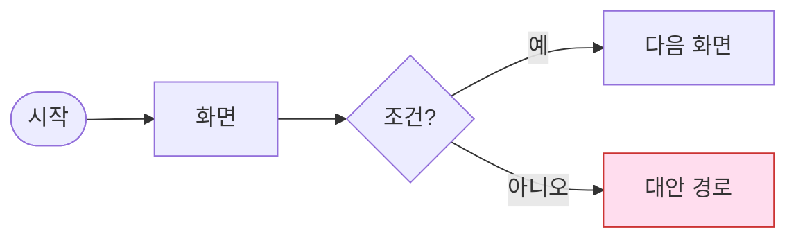
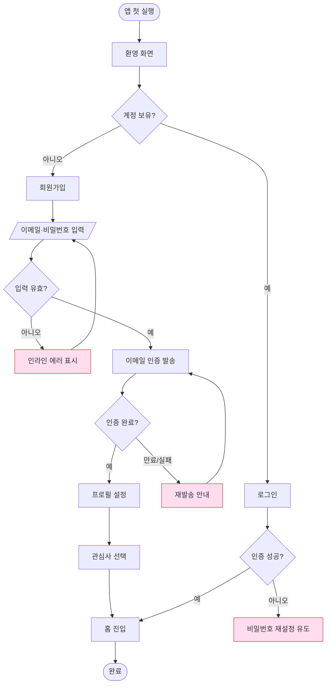
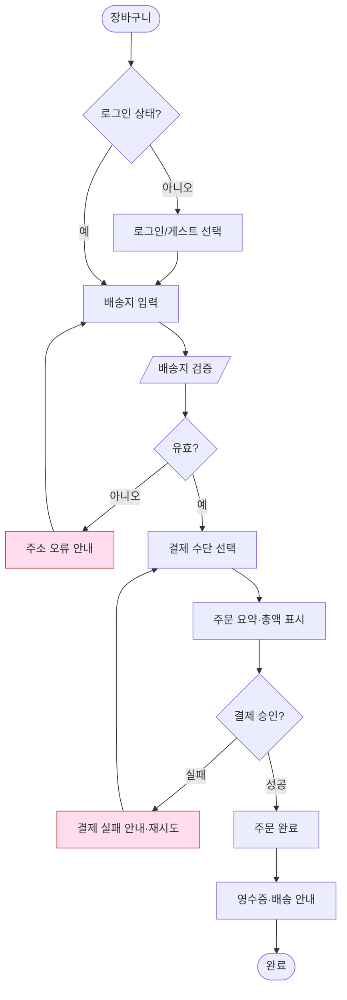

# 12 · 유저 플로우

| 항목 | 내용 |
| --- | --- |
| **목적** | Goldwiki Digital(골드위키 디지털)의 유저 플로우 표준(표기법, 플로우 유형, 엣지·에러 경로, 화면 매핑, 예시 플로우)을 정의한다. |
| **대상 독자** | 서비스 기획자, 인터랙션 디자이너, UX 리서처, UI 디자이너, 프런트엔드 엔지니어 |
| **담당(Owner) 에이전트** | Interaction Designer (협업: Service Planner, UX Researcher) |
| **참조(상위 문서)** | [정보구조](11_INFORMATION_ARCHITECTURE.md), [UX 원칙](07_UX_PRINCIPLES.md) |
| **연계(하위 문서)** | [유저 여정](13_USER_JOURNEY.md), [컴포넌트 라이브러리](14_COMPONENT_LIBRARY.md), [UI 가이드라인](08_UI_GUIDELINES.md) |
| **최종 수정** | 2026-06-26 |
| **상태** | 활성(Active) |

---

## 1. 유저 플로우의 목적

유저 플로우는 사용자가 과업을 완수하기까지의 **단계·결정·시스템 반응**을 시각화한다. [UX 원칙](07_UX_PRINCIPLES.md)의 실행/평가 간극을 단계로 분해하여, 화면 목록과 구현 범위를 도출하는 근거가 된다.

---

## 2. 표기법 · 범례

골드위키는 mermaid `flowchart`를 표준 표기로 사용한다.

| 도형 | 의미 | mermaid 표기 |
| --- | --- | --- |
| 둥근 사각형 | 시작/종료 | `([시작])` |
| 사각형 | 화면/단계 | `[화면]` |
| 마름모 | 결정/분기 | `{조건?}` |
| 평행사변형 | 입력/출력 | `[/입력/]` |
| 빨간 노드 | 에러/실패 경로 | `:::error` |
| 화살표 | 흐름 방향 | `-->` |

---

## 3. 플로우 유형

| 유형 | 정의 | 사용 시점 |
| --- | --- | --- |
| 과업 플로우(Task Flow) | 단일 경로의 직선 흐름 | 단순 과업(로그인 등) |
| 결정 플로우(Wireflow/Decision) | 분기·조건 포함 | 다중 경로(결제 등) |
| 시스템 플로우(System Flow) | 시스템 처리·상태 전이 | 백엔드 연동·비동기 작업 |

---

## 4. 엣지 케이스 · 에러 경로 표준

모든 플로우는 정상 경로(happy path)와 함께 다음을 반드시 포함한다.

| 범주 | 예시 | 처리 원칙 |
| --- | --- | --- |
| 입력 오류 | 형식 오류, 필수 누락 | 인라인 검증, 명확한 에러 메시지([08](08_UI_GUIDELINES.md)) |
| 인증 실패 | 비밀번호 오류 | 재시도·복구 경로(원칙 4) |
| 네트워크 오류 | 타임아웃 | 재시도 버튼, 상태 보존 |
| 빈 결과 | 검색 0건 | 빈 상태 패턴 |
| 권한 부족 | 미인증 접근 | 로그인 유도 후 복귀 |
| 시스템 오류 | 서버 5xx | 안내+고객지원 링크 |

---

## 5. 플로우 → 화면 목록 매핑

플로우의 각 화면 노드는 화면 목록(Screen Inventory)으로 전환되어 디자인·개발 범위가 된다.

| 플로우 노드 | 화면 ID | 화면명 | 주요 컴포넌트 | 상태 |
| --- | --- | --- | --- | --- |
| 시작 | ONB-01 | 환영 | card, button | empty |
| 입력 | ONB-02 | 정보 입력 | form, input, select | error |
| 확인 | ONB-03 | 검토 | table, button | loading |
| 종료 | ONB-04 | 완료 | card, toast | success |

컴포넌트 사양은 [컴포넌트 라이브러리](14_COMPONENT_LIBRARY.md)를 참조한다.

---

## 6. 예시 플로우 1 — 온보딩(Onboarding)

**핵심 설계 결정**
- 가치 경험 전 가입 강제를 피하기 위해 "둘러보기" 경로를 환영 화면에 둔다(안티패턴 회피, [07](07_UX_PRINCIPLES.md)).
- 이메일 인증 만료 시 즉시 재발송 경로를 제공한다(원칙 4 가역성).

---

## 7. 예시 플로우 2 — 결제(Checkout)

**핵심 설계 결정**
- 총액(배송비·세금 포함)을 결제 직전이 아닌 요약 단계에서 명시한다(원칙 10 투명성).
- 결제 실패 시 입력값을 보존하여 재시도 마찰을 줄인다.

---

## 8. 플로우 품질 기준

- [ ] 정상 경로 + 모든 에러 경로 포함
- [ ] 분기마다 조건이 명시되었는가
- [ ] 각 화면 노드가 화면 목록으로 매핑되었는가
- [ ] 종료 노드(성공/실패)가 명확한가
- [ ] [정보구조](11_INFORMATION_ARCHITECTURE.md) 사이트맵과 정합한가
- [ ] 되돌리기·재시도 경로가 있는가(원칙 4)

---

## 관련 골드위키 문서

- [11 · 정보구조](11_INFORMATION_ARCHITECTURE.md) — 사이트맵 분기를 흐름으로 전개.
- [13 · 유저 여정](13_USER_JOURNEY.md) — 플로우를 감정·터치포인트 맥락으로 확장.
- [07 · UX 원칙](07_UX_PRINCIPLES.md) — 가역성·투명성 등 설계 근거.
- [14 · 컴포넌트 라이브러리](14_COMPONENT_LIBRARY.md) — 화면 노드의 구성 컴포넌트.
- [08 · UI 가이드라인](08_UI_GUIDELINES.md) — 에러·빈 상태의 시각 규칙.

> **거버넌스:** 골드위키 규칙에 따라, 본 문서에서 발생한 모든 의사결정은 [의사결정 로그](32_DECISION_LOG.md), [프로젝트 메모리](35_PROJECT_MEMORY.md), [베스트 프랙티스](37_BEST_PRACTICES.md), [레퍼런스 라이브러리](36_REFERENCE_LIBRARY.md)를 갱신한다.
