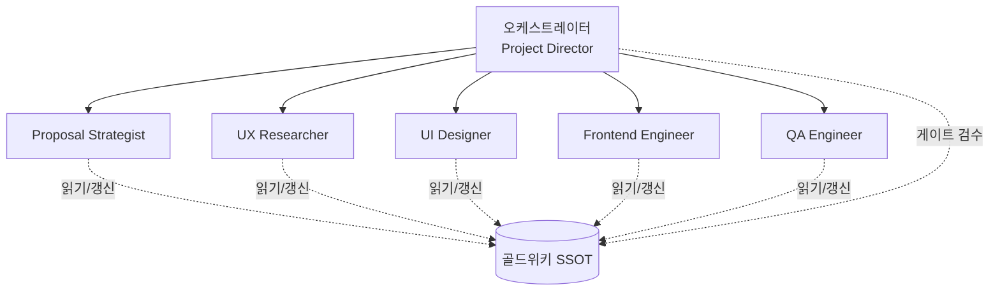
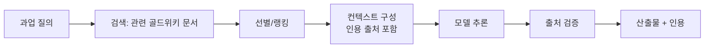

# 25 · 워크스페이스 AI 엔지니어링 가이드

| 항목 | 내용 |
| --- | --- |
| **목적** | Goldwiki Digital(골드위키 디지털)의 멀티에이전트 AI 워크스페이스를 안전하고 일관되며 비용 효율적으로 운영하기 위한 공학 표준을 정의한다. |
| **대상 독자** | AI Engineer, Backend Engineer, Project Director, QA Engineer 및 AI 산출물을 다루는 모든 에이전트 |
| **담당(Owner) 에이전트** | AI Engineer |
| **참조(상위 문서)** | [회사 컨텍스트](01_COMPANY_CONTEXT.md), [비즈니스 목표](02_BUSINESS_GOALS.md), [서브에이전트 규칙](28_SUBAGENT_RULES.md) |
| **연계(하위 문서)** | [프롬프트 엔지니어링](26_PROMPT_ENGINEERING.md), [자동화 워크플로우](27_AUTOMATION_WORKFLOW.md), [프롬프트 라이브러리](40_PROMPT_LIBRARY.md) |
| **최종 수정** | 2026-06-26 |
| **상태** | 활성(Active) |

---

## 1. 개요: 골드위키는 조직의 두뇌다

골드위키 디지털의 운영 모델은 **AI 증강(AI-Augmented)** 방식이다. RFP 분석부터 제안, UX/UI, 프로토타입, 개발, QA까지 전 과정을 22개의 전문 AI 서브에이전트가 수행하며, 모든 지식과 의사결정의 단일 진실 공급원(SSOT, Single Source of Truth)은 **골드위키(`/GoldWiki`)**다.

본 가이드의 제1원칙은 다음과 같다.

> 모든 AI 에이전트는 작업·판단 전에 반드시 골드위키를 먼저 참조한다. 모델의 사전학습 지식보다 골드위키의 명시적 컨텍스트가 항상 우선한다.

이 원칙을 통해 환각(hallucination)을 줄이고, 조직 일관성을 확보하며, 지식 중복을 방지한다.

---

## 2. 멀티에이전트 시스템 동작 방식

### 2.1 구조

골드위키 워크스페이스는 **오케스트레이터(Orchestrator) + 전문 서브에이전트** 구조로 동작한다.



- **오케스트레이터**: 과업을 분해하고, 적합한 서브에이전트에 위임하며, 단계 간 품질 게이트를 통과시킨다.
- **서브에이전트**: 단일 책임 원칙(Single Responsibility)에 따라 자기 도메인만 수행한다. 22개 에이전트의 레지스트리는 [서브에이전트 규칙](28_SUBAGENT_RULES.md)에 정의되어 있다.
- **공유 메모리**: 모든 에이전트는 골드위키를 통해 비동기로 소통한다. 직접 호출이 아니라 **문서를 매개로 한 인계(handoff)**가 기본이다.

### 2.2 에이전트 통신 패턴

| 패턴 | 설명 | 사용 예 |
| --- | --- | --- |
| 순차 위임(Sequential) | 단계별로 결과를 다음 에이전트에 인계 | RFP 분석 → 제안 전략 |
| 병렬 팬아웃(Fan-out) | 독립 과업을 동시 실행 후 취합 | 경쟁사 벤치마크 + 글로벌 베스트프랙티스 벤치마크 |
| 평가자-실행자(Evaluator-Executor) | 한 에이전트가 산출, 다른 에이전트가 검수 | UI Designer 산출 → QA Engineer 검수 |
| 사람 개입(Human-in-the-loop) | 게이트에서 사람 승인 필요 | 최종 제안서 클라이언트 제출 전 |

### 2.3 컨텍스트 인계 규약

인계 시 다음 메타데이터를 항상 포함한다.

```json
{
  "from_agent": "ux-researcher",
  "to_agent": "ui-designer",
  "artifact": "11_INFORMATION_ARCHITECTURE.md",
  "decision_refs": ["32_DECISION_LOG.md#D-2026-041"],
  "open_questions": ["로그인 진입 동선 2안 중 택1 필요"],
  "quality_gate_passed": true
}
```

---

## 3. 모델 선택(Claude 모델 패밀리)

골드위키 워크스페이스는 Anthropic의 Claude 모델 패밀리를 사용한다. 과업의 **복잡도·지연·비용** 삼각 균형을 기준으로 모델 등급을 선택한다.

| 모델 등급 | 대표 특성 | 적합 과업 | 골드위키 내 사용 예 |
| --- | --- | --- | --- |
| **상위 추론 모델**(Opus 계열) | 최고 수준 추론·장문 분석·복잡한 의사결정 | 심층 분석, 전략 수립, 모호성 큰 합성 작업 | RFP 숨은기대 추출, 제안 전략, 아키텍처 설계 |
| **균형 모델**(Sonnet 계열) | 추론·속도·비용의 균형 | 일상적 산출물 생성, 코드 작성, 문서화 | 화면 목록 작성, HTML 프로토타입, QA 케이스 |
| **경량 모델**(Haiku 계열) | 빠르고 저렴, 단순 과업 최적 | 분류, 추출, 라우팅, 요약 1차 패스 | 문서 태깅, 단순 요약, 라우팅 판단 |

> 정확한 모델 ID·가격·컨텍스트 한도는 시점에 따라 변하므로, 운영 전 반드시 최신 Anthropic 공식 문서(또는 `claude-api` 스킬)로 확인한다. 본 가이드는 **선택 기준**만 규정하고 구체 수치는 명시하지 않는다.

### 3.1 모델 선택 의사결정 규칙

1. 과업이 **모호하거나 전략적 판단**을 요하면 상위 추론 모델을 쓴다.
2. 과업이 **명확한 산출 형식과 절차**를 가지면 균형 모델을 기본으로 한다.
3. 과업이 **대량·반복·단순**하면 경량 모델로 비용을 절감한다.
4. 동일 파이프라인 안에서 **모델 혼합(model cascading)**을 적극 활용한다. 예: 경량 모델로 1차 추출 → 균형 모델로 정제 → 상위 모델로 최종 검수.

---

## 4. 골드위키 기반 컨텍스트와 RAG

### 4.1 컨텍스트 주입 원칙

에이전트는 작업 시작 시 **관련 골드위키 문서를 컨텍스트로 주입**한다. 전체 문서를 무분별하게 넣지 않고, 과업과 관련된 문서만 선별한다(토큰 비용·정확도 모두를 위해).

| 과업 유형 | 필수 주입 문서 |
| --- | --- |
| RFP 분석 | [03](03_RFP_FRAMEWORK.md), [04](04_RFP_ANALYSIS.md), [34](34_CLIENT_KNOWLEDGE.md) |
| UX 설계 | [07](07_UX_PRINCIPLES.md), [11](11_INFORMATION_ARCHITECTURE.md), [12](12_USER_FLOW.md) |
| UI/디자인 | [08](08_UI_GUIDELINES.md), [09](09_DESIGN_SYSTEM.md), [15](15_DESIGN_TOKEN.md) |
| 개발 | [17](17_HTML_GUIDE.md)~[24](24_SECURITY_GUIDE.md) |
| 모든 과업 | [37](37_BEST_PRACTICES.md), [39](39_COMMON_ERRORS.md) |

### 4.2 RAG 파이프라인



- **검색**: 과업 키워드로 골드위키 문서·섹션을 검색한다.
- **랭킹/선별**: 관련도 높은 상위 N개만 컨텍스트에 포함한다.
- **인용 강제**: 골드위키에서 가져온 사실은 반드시 출처 문서·섹션을 표기한다. 출처 없는 단정은 금지한다.
- **검증**: 산출 후 인용된 출처가 실제로 그 내용을 뒷받침하는지 확인한다.

### 4.3 컨텍스트 신선도

골드위키가 SSOT이므로, 에이전트는 **캐시된 기억이 아니라 현재 문서 상태**를 읽어야 한다. 의사결정이 바뀌면 [의사결정 로그](32_DECISION_LOG.md)가 우선한다.

---

## 5. 도구 사용(Tool Use)

에이전트는 추론만으로 부족한 작업에 도구를 호출한다.

| 도구 범주 | 용도 | 주의사항 |
| --- | --- | --- |
| 파일 읽기/쓰기 | 골드위키·산출물 입출력 | 절대경로 사용, 기존 문서 우선 수정 |
| 검색(Grep/Glob) | 코드·문서 탐색 | 광범위 탐색은 검색 도구로 |
| 웹 검색/페치 | 외부 벤치마크·표준 확인 | 출처 신뢰도 검증, 인용 보존 |
| 코드 실행 | 빌드·테스트·린트 | 샌드박스 정책 준수 |

### 5.1 도구 사용 규칙

1. **최소 권한 원칙**: 과업에 필요한 도구만 사용한다.
2. **결정적 도구 우선**: 계산·검증·조회는 모델 추측 대신 도구로 처리한다.
3. **도구 결과 검증**: 도구 출력이 비정상이면 재시도·대체 전략을 적용한다(에러 패턴은 [공통 오류](39_COMMON_ERRORS.md) 참조).
4. **부작용 통제**: 외부 시스템 변경(파일 쓰기, API 호출)은 게이트 통과 후 수행한다.

---

## 6. 평가(Evaluation)와 가드레일(Guardrails)

### 6.1 평가 체계

| 평가 유형 | 방법 | 적용 시점 |
| --- | --- | --- |
| 규칙 기반(Rule-based) | 형식·필수 항목·금지어 자동 검사 | 산출 직후 |
| LLM 평가자(LLM-as-Judge) | 별도 모델이 품질 루브릭으로 채점 | 게이트 통과 전 |
| 골든셋 회귀(Golden Set) | 검증된 정답 사례와 비교 | 프롬프트/모델 변경 시 |
| 사람 검수(Human Review) | 전문가 최종 확인 | 클라이언트 제출 전 |

평가 루브릭 예시(제안서 요약):

| 기준 | 배점 | 합격선 |
| --- | --- | --- |
| 요구사항 충족 정확도 | 30 | 27 이상 |
| 숨은 기대 반영 | 20 | 16 이상 |
| 논리 일관성 | 20 | 16 이상 |
| 골드위키 근거 인용 | 15 | 12 이상 |
| 한국어 표현 품질 | 15 | 12 이상 |

### 6.2 가드레일

| 가드레일 | 통제 내용 |
| --- | --- |
| 입력 가드레일 | 민감정보·기밀 RFP 데이터 처리 정책, 프롬프트 인젝션 탐지 |
| 출력 가드레일 | 금지 표현(추측성 단정, 미확인 수치) 차단, 형식 강제 |
| 범위 가드레일 | 에이전트가 자기 도메인 밖 결정을 내리지 못하도록 제한 |
| 인용 가드레일 | 출처 없는 사실 주장 차단 |

---

## 7. 비용(Cost)과 지연(Latency)

### 7.1 비용 최적화 전략

| 전략 | 설명 | 절감 효과 |
| --- | --- | --- |
| 모델 캐스케이딩 | 단순 단계는 경량 모델로 처리 | 높음 |
| 프롬프트 캐싱 | 반복되는 시스템 프롬프트·골드위키 컨텍스트 캐시 | 높음 |
| 컨텍스트 선별 | 관련 문서만 주입, 토큰 절감 | 중간 |
| 배치 처리 | 비실시간 과업은 묶어서 처리 | 중간 |
| 조기 종료 | 게이트 미통과 시 후속 단계 중단 | 중간 |

### 7.2 지연 관리

- 대화형/클라이언트 대면 과업은 빠른 모델·스트리밍 응답을 우선한다.
- 백그라운드 합성 과업(전체 RFP 분석 등)은 지연보다 품질을 우선한다.
- 병렬 팬아웃으로 전체 파이프라인 지연을 단축한다.

### 7.3 모니터링 지표

| 지표 | 설명 | 목표 |
| --- | --- | --- |
| 토큰/과업 | 과업당 평균 토큰 소비 | 추세 하향 |
| 비용/납품물 | 산출물 1건당 모델 비용 | 예산 내 |
| p95 지연 | 응답 95퍼센타일 지연 | 합의 SLA 내 |
| 캐시 적중률 | 프롬프트 캐시 적중 비율 | 상향 |

---

## 8. 환각 완화(Hallucination Mitigation)

| 기법 | 적용 방법 |
| --- | --- |
| 근거 강제(Grounding) | 골드위키·도구 결과만 사실 근거로 인정, 인용 필수 |
| 불확실성 표명 | 모르는 것은 "확인 필요"로 명시, 추측 금지 |
| 검증 패스 | 산출 후 별도 검증 단계(셀프 체크 또는 LLM 평가자) |
| 구조화 출력 | 스키마 강제로 임의 생성 여지 축소 |
| 출처 대조 | 인용 문서가 실제로 주장을 뒷받침하는지 대조 |

환각 위험 신호: 구체적 수치·날짜·고유명사가 출처 없이 등장, 골드위키에 없는 "사실" 주장, 과도하게 단정적인 어조.

---

## 9. 휴먼인더루프(Human-in-the-Loop) 정책

| 게이트 | 사람 승인 필요 여부 | 승인자 |
| --- | --- | --- |
| RFP 분석 결과 확정 | 권장 | Project Director |
| 제안 전략 확정 | 필수 | Sales Director, Project Director |
| 디자인 시스템 채택 | 필수 | UI Designer 리드, Project Director |
| 클라이언트 산출물 제출 | 필수 | Project Director (+ CEO 중대 건) |
| 운영 환경 릴리스 | 필수 | DevOps Engineer + Project Director |

원칙: **되돌릴 수 없거나 외부에 노출되는 결정**은 반드시 사람 승인을 거친다. 에스컬레이션 경로는 [서브에이전트 규칙](28_SUBAGENT_RULES.md)의 에스컬레이션 매트릭스를 따른다.

---

## 관련 골드위키 문서

- [26_PROMPT_ENGINEERING.md](26_PROMPT_ENGINEERING.md) — 에이전트 프롬프트 설계 표준
- [27_AUTOMATION_WORKFLOW.md](27_AUTOMATION_WORKFLOW.md) — RFP→납품 자율 파이프라인
- [28_SUBAGENT_RULES.md](28_SUBAGENT_RULES.md) — 22개 서브에이전트 공통 규칙과 레지스트리
- [29_QUALITY_CHECKLIST.md](29_QUALITY_CHECKLIST.md) — AI 출력 품질 체크리스트
- [40_PROMPT_LIBRARY.md](40_PROMPT_LIBRARY.md) — 재사용 프롬프트 모음
- [37_BEST_PRACTICES.md](37_BEST_PRACTICES.md) — 조직 베스트 프랙티스
- [39_COMMON_ERRORS.md](39_COMMON_ERRORS.md) — 반복 오류와 대응

> **거버넌스:** 골드위키 규칙에 따라, 본 문서에서 발생한 모든 의사결정은 [의사결정 로그](32_DECISION_LOG.md), [프로젝트 메모리](35_PROJECT_MEMORY.md), [베스트 프랙티스](37_BEST_PRACTICES.md), [레퍼런스 라이브러리](36_REFERENCE_LIBRARY.md)를 갱신한다.
