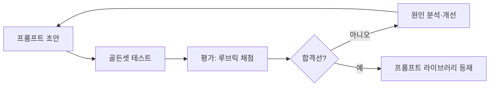

# 26 · 프롬프트 엔지니어링 표준

| 항목 | 내용 |
| --- | --- |
| **목적** | Goldwiki Digital(골드위키 디지털)의 모든 AI 에이전트가 일관되고 신뢰할 수 있는 프롬프트를 설계·운영하기 위한 표준을 정의한다. |
| **대상 독자** | AI Engineer, 모든 서브에이전트 작성자, Documentation Specialist |
| **담당(Owner) 에이전트** | AI Engineer |
| **참조(상위 문서)** | [AI 가이드](25_AI_GUIDE.md), [서브에이전트 규칙](28_SUBAGENT_RULES.md) |
| **연계(하위 문서)** | [프롬프트 라이브러리](40_PROMPT_LIBRARY.md), [자동화 워크플로우](27_AUTOMATION_WORKFLOW.md), [템플릿 라이브러리](38_TEMPLATE_LIBRARY.md) |
| **최종 수정** | 2026-06-26 |
| **상태** | 활성(Active) |

---

## 1. 원칙

프롬프트는 골드위키 디지털의 **실행 코드**다. 코드처럼 버전 관리하고, 테스트하고, 재사용한다. 모든 프롬프트는 골드위키를 먼저 참조하도록 설계한다.

핵심 원칙:

1. **명확성 우선**: 모호함은 환각과 재작업의 원인이다.
2. **근거 기반**: 사실은 골드위키·도구 결과에서만 가져오게 한다.
3. **구조화**: 출력 형식을 명시적으로 강제한다.
4. **재사용**: 검증된 패턴은 [프롬프트 라이브러리](40_PROMPT_LIBRARY.md)에 등재한다.

---

## 2. 프롬프트 구성요소

모든 프롬프트는 다음 6개 블록으로 구성한다(RCTCFE 모델).

| 블록 | 한국어 명칭 | 역할 |
| --- | --- | --- |
| Role | 역할 | 에이전트의 정체성·전문성·관점 정의 |
| Context | 맥락 | 골드위키 근거, 프로젝트 배경, 클라이언트 정보 |
| Task | 과업 | 수행할 구체적 작업 한 가지 |
| Constraints | 제약 | 하지 말 것, 범위, 분량, 톤, 언어(한국어) |
| Format | 형식 | 출력 구조(표/JSON/마크다운/섹션) |
| Examples | 예시 | few-shot 입출력 예 |

### 2.1 기본 골격 템플릿

```text
[역할]
당신은 골드위키 디지털의 {에이전트명}이다. {핵심 전문성}을 갖추었다.
작업 전 반드시 골드위키 관련 문서를 먼저 참조한다.

[맥락]
- 프로젝트: {프로젝트명}
- 참조 골드위키: {문서 목록과 핵심 발췌}
- 클라이언트 배경: {요지}

[과업]
{단일하고 명확한 과업}

[제약]
- 모든 출력은 한국어로 작성한다.
- 골드위키에 근거 없는 사실은 단정하지 않는다(불확실하면 "확인 필요"로 표기).
- 분량: {예: 표 형식, 최대 N항목}

[형식]
{출력 스키마/구조}

[예시]
입력: {...}  →  출력: {...}
```

---

## 3. 역할·맥락·과업·제약·형식 상세

### 3.1 역할(Role) 설계

- 직무명, 전문 영역, 판단 관점을 구체화한다. "당신은 도우미다"는 금지.
- 좋은 예: "당신은 골드위키 디지털의 UX Researcher다. 정량·정성 리서치를 통합해 정보구조(IA) 가설을 수립한다."

### 3.2 맥락(Context) 설계

- 골드위키 발췌를 **인용 가능한 형태**로 삽입한다.
- 출처 라벨을 붙인다: `[출처: 04_RFP_ANALYSIS.md §요구사항]`.

### 3.3 과업(Task) 설계

- 한 프롬프트는 **하나의 과업**만. 복합 과업은 파이프라인으로 분해한다([27](27_AUTOMATION_WORKFLOW.md) 참조).
- 동사로 시작: "추출하라", "분류하라", "요약하라", "설계하라".

### 3.4 제약(Constraints) 설계

| 제약 유형 | 예시 |
| --- | --- |
| 언어 | "모든 출력은 자연스러운 실무 한국어" |
| 근거 | "근거 없는 수치·날짜 금지" |
| 범위 | "UX 영역만 다루고 UI 결정은 하지 않음" |
| 분량/형식 | "표로, 최대 10행" |
| 톤 | "격식 있는 비즈니스 문어체" |

### 3.5 형식(Format) 설계

출력 형식을 명시하면 후처리·평가가 쉬워진다.

```json
{
  "requirements": [
    {"id": "R-01", "category": "기능", "text": "...", "priority": "필수", "source": "RFP p.12"}
  ],
  "open_questions": ["..."]
}
```

---

## 4. Few-shot 프롬프팅

few-shot은 형식·톤·판단 기준을 예시로 가르치는 기법이다.

| 상황 | 권장 샷 수 |
| --- | --- |
| 형식이 단순·명확 | 0~1샷 |
| 분류·라벨링 | 2~5샷(경계 사례 포함) |
| 복잡한 판단·톤 | 3~5샷(다양한 케이스) |

설계 원칙:
- 예시는 **대표성**과 **경계 사례**를 함께 담는다.
- 예시 입출력은 실제 골드위키 형식과 일치시킨다.
- 예시가 길어 토큰이 부담되면, 핵심 패턴만 압축한다.

few-shot 예시(요구사항 우선순위 분류):

```text
입력: "사용자는 SSO로 로그인할 수 있어야 한다." → 출력: {priority: "필수", reason: "인증 핵심 기능"}
입력: "다크 모드를 지원하면 좋겠다." → 출력: {priority: "선택", reason: "선호 표현('좋겠다')"}
```

---

## 5. CoT(사고연쇄) vs 직접 응답

| 기법 | 사용 시점 | 주의 |
| --- | --- | --- |
| **CoT(Chain-of-Thought)** | 다단계 추론, 분석, 모호성 큰 합성 | 추론 과정을 출력에 노출할지 결정(클라이언트 산출물은 결론만) |
| **직접 응답(Direct)** | 분류·추출·형식 변환 등 명확 과업 | 불필요한 추론은 비용·지연만 증가 |

CoT 운영 규칙:
- 내부 추론은 별도 영역(예: `<scratch>`)에 두고 최종 산출에서 제거한다.
- "단계별로 생각하라"는 지시는 복잡 과업에만 선택적으로 적용한다.
- RFP 숨은기대 추출·리스크 분석 등은 CoT 권장, 화면 목록 작성은 직접 응답 권장.

---

## 6. 구조화 출력(Structured Output)

| 방법 | 설명 |
| --- | --- |
| JSON 스키마 강제 | 후처리·평가·파이프라인 연결에 최적 |
| 마크다운 표/섹션 | 사람이 읽는 골드위키 문서 산출 시 |
| 마커 구분 | `===섹션===` 등으로 영역 분리 |

원칙: 산출물이 **다음 에이전트의 입력**이 되면 JSON, **사람이 읽는 문서**면 골드위키 마크다운 형식을 따른다.

---

## 7. 평가와 반복(Iteration)

프롬프트는 한 번에 완성되지 않는다. 측정 → 개선 사이클을 돈다.



평가 항목: 정확도, 형식 준수율, 근거 인용률, 한국어 품질, 토큰 효율. 평가 방법은 [AI 가이드 §6](25_AI_GUIDE.md)를 따른다.

---

## 8. 프롬프트 버전 관리

프롬프트는 코드처럼 버전을 관리한다.

| 항목 | 규칙 |
| --- | --- |
| 식별자 | `PRM-{도메인}-{일련}` 예: `PRM-RFP-007` |
| 버전 | SemVer 적용: `v1.2.0`([릴리스 프로세스](31_RELEASE_PROCESS.md) 참조) |
| 변경 기록 | 변경 사유·평가 결과를 [의사결정 로그](32_DECISION_LOG.md)에 기록 |
| 저장소 | [프롬프트 라이브러리](40_PROMPT_LIBRARY.md)가 정본 |

버전 메타데이터 예시:

```yaml
id: PRM-RFP-007
version: v1.3.0
owner: ai-engineer
model_tier: 상위 추론
eval_score: 0.93
changelog: "숨은기대 추출 정확도 향상을 위해 few-shot 2건 추가"
```

---

## 9. 재사용 패턴(Reusable Patterns)

| 패턴 | 용도 | 골격 |
| --- | --- | --- |
| 추출기(Extractor) | RFP 요구사항·평가기준 추출 | 역할+근거+JSON 스키마 |
| 분류기(Classifier) | 우선순위·심각도 라벨링 | few-shot 경계 사례 + 직접 응답 |
| 합성기(Synthesizer) | 전략·요약 생성 | CoT + 근거 인용 |
| 평가자(Judge) | 산출물 채점 | 루브릭 + 점수 스키마 |
| 변환기(Transformer) | 형식 변환(표→문서 등) | 입출력 예시 + 형식 강제 |

각 패턴의 완성형 프롬프트는 [프롬프트 라이브러리](40_PROMPT_LIBRARY.md)에서 관리한다.

---

## 10. 안티패턴(피해야 할 것)

| 안티패턴 | 문제 | 대안 |
| --- | --- | --- |
| 다중 과업 한 프롬프트 | 품질 저하, 디버깅 곤란 | 파이프라인 분해 |
| 근거 없는 단정 유도 | 환각 | 근거 인용 강제 |
| 형식 미지정 | 후처리 불가 | 스키마 강제 |
| 영어 혼용 출력 | 표준 위반 | "한국어로 작성" 명시 |
| 예시 없는 모호 과업 | 결과 편차 | few-shot 추가 |

---

## 관련 골드위키 문서

- [25_AI_GUIDE.md](25_AI_GUIDE.md) — AI 엔지니어링 전반과 평가·가드레일
- [27_AUTOMATION_WORKFLOW.md](27_AUTOMATION_WORKFLOW.md) — 프롬프트가 단계별로 쓰이는 파이프라인
- [28_SUBAGENT_RULES.md](28_SUBAGENT_RULES.md) — 에이전트 프롬프트 템플릿 규약
- [40_PROMPT_LIBRARY.md](40_PROMPT_LIBRARY.md) — 검증된 프롬프트 정본
- [38_TEMPLATE_LIBRARY.md](38_TEMPLATE_LIBRARY.md) — 문서·산출물 템플릿
- [37_BEST_PRACTICES.md](37_BEST_PRACTICES.md) — 조직 베스트 프랙티스

> **거버넌스:** 골드위키 규칙에 따라, 본 문서에서 발생한 모든 의사결정은 [의사결정 로그](32_DECISION_LOG.md), [프로젝트 메모리](35_PROJECT_MEMORY.md), [베스트 프랙티스](37_BEST_PRACTICES.md), [레퍼런스 라이브러리](36_REFERENCE_LIBRARY.md)를 갱신한다.
