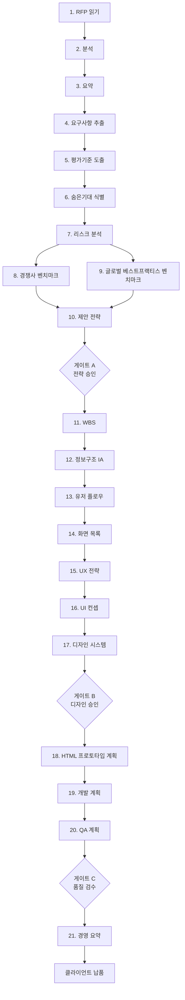

# 27 · 자율 RFP→납품 자동화 파이프라인

| 항목 | 내용 |
| --- | --- |
| **목적** | RFP 수령부터 경영 요약까지 21단계 자율 워크플로우를 정의하고, 각 단계의 트리거·담당 에이전트·입력·산출물·골드위키 접점·인계·품질 게이트를 표준화한다. |
| **대상 독자** | 모든 서브에이전트, Project Director, AI Engineer |
| **담당(Owner) 에이전트** | Project Director (오케스트레이터) |
| **참조(상위 문서)** | [AI 가이드](25_AI_GUIDE.md), [RFP 프레임워크](03_RFP_FRAMEWORK.md), [서브에이전트 규칙](28_SUBAGENT_RULES.md) |
| **연계(하위 문서)** | [품질 체크리스트](29_QUALITY_CHECKLIST.md), [테스트 전략](30_TEST_STRATEGY.md), [릴리스 프로세스](31_RELEASE_PROCESS.md) |
| **최종 수정** | 2026-06-26 |
| **상태** | 활성(Active) |

---

## 1. 개요

골드위키 디지털의 핵심 자산은 **RFP를 받아 클라이언트 납품물까지 자율적으로 생산하는 21단계 파이프라인**이다. 각 단계는 골드위키를 읽고(read) 산출 후 골드위키를 갱신(update)한다. 단계 사이에는 **품질 게이트**가 있어, 통과해야 다음 단계로 인계된다.

핵심 원칙:
- 모든 단계는 작업 전 골드위키를 먼저 참조한다.
- 모든 산출물은 다음 단계의 입력이 되도록 구조화한다.
- 모든 의사결정은 [의사결정 로그](32_DECISION_LOG.md)·[프로젝트 메모리](35_PROJECT_MEMORY.md)를 갱신한다.

---

## 2. 파이프라인 다이어그램



게이트 통과 기준은 [품질 체크리스트](29_QUALITY_CHECKLIST.md)의 클라이언트 준비 게이트를 따른다.

---

## 3. 단계별 상세 명세

### 단계 1 · RFP 읽기

| 항목 | 내용 |
| --- | --- |
| 트리거 | 신규 RFP 문서 수령 |
| 담당 에이전트 | Business Analyst |
| 입력 | 원본 RFP(PDF/문서), 클라이언트 배경 |
| 산출물 | 정규화된 RFP 텍스트, 메타데이터(발주처·예산·기한) |
| 읽는 문서 | [03](03_RFP_FRAMEWORK.md), [34](34_CLIENT_KNOWLEDGE.md) |
| 갱신 문서 | [04](04_RFP_ANALYSIS.md), [35](35_PROJECT_MEMORY.md) |
| 인계 | → 단계 2(분석) |

### 단계 2 · 분석

| 항목 | 내용 |
| --- | --- |
| 트리거 | 정규화된 RFP 확보 |
| 담당 에이전트 | Business Analyst, Proposal Strategist |
| 입력 | 정규화 RFP |
| 산출물 | 구조 분석(범위·목표·제약·이해관계자) |
| 읽는 문서 | [03](03_RFP_FRAMEWORK.md), [06](06_BUSINESS_ANALYSIS.md) |
| 갱신 문서 | [04](04_RFP_ANALYSIS.md) |
| 인계 | → 단계 3 |

### 단계 3 · 요약

| 항목 | 내용 |
| --- | --- |
| 트리거 | 분석 완료 |
| 담당 에이전트 | Business Analyst |
| 입력 | 구조 분석 |
| 산출물 | 1페이지 핵심 요약(목적·범위·기대효과) |
| 읽는 문서 | [04](04_RFP_ANALYSIS.md) |
| 갱신 문서 | [04](04_RFP_ANALYSIS.md), [35](35_PROJECT_MEMORY.md) |
| 인계 | → 단계 4 |

### 단계 4 · 요구사항 추출

| 항목 | 내용 |
| --- | --- |
| 트리거 | 요약 확정 |
| 담당 에이전트 | Business Analyst, Product Owner |
| 입력 | 분석·요약 |
| 산출물 | 요구사항 목록(ID·기능/비기능·우선순위·출처) |
| 읽는 문서 | [03](03_RFP_FRAMEWORK.md), [06](06_BUSINESS_ANALYSIS.md) |
| 갱신 문서 | [04](04_RFP_ANALYSIS.md) |
| 인계 | → 단계 5 |

요구사항 산출 형식:

```json
{"id":"R-012","type":"기능","text":"SSO 로그인 지원","priority":"필수","source":"RFP §3.2"}
```

### 단계 5 · 평가기준 도출

| 항목 | 내용 |
| --- | --- |
| 트리거 | 요구사항 확보 |
| 담당 에이전트 | Proposal Strategist |
| 입력 | RFP 평가 항목, 요구사항 |
| 산출물 | 평가기준·배점 매트릭스, 우리 강점 매핑 |
| 읽는 문서 | [03](03_RFP_FRAMEWORK.md), [05](05_PROPOSAL_STRATEGY.md) |
| 갱신 문서 | [04](04_RFP_ANALYSIS.md), [05](05_PROPOSAL_STRATEGY.md) |
| 인계 | → 단계 6 |

### 단계 6 · 숨은기대 식별

| 항목 | 내용 |
| --- | --- |
| 트리거 | 평가기준 확보 |
| 담당 에이전트 | Proposal Strategist, Business Analyst |
| 입력 | RFP 전문, 클라이언트 지식 |
| 산출물 | 명시되지 않은 기대·동기·정치적 맥락 분석 |
| 읽는 문서 | [04](04_RFP_ANALYSIS.md), [34](34_CLIENT_KNOWLEDGE.md) |
| 갱신 문서 | [05](05_PROPOSAL_STRATEGY.md), [34](34_CLIENT_KNOWLEDGE.md) |
| 인계 | → 단계 7 |
| 비고 | CoT 추론 권장([26 §5](26_PROMPT_ENGINEERING.md)) |

### 단계 7 · 리스크 분석

| 항목 | 내용 |
| --- | --- |
| 트리거 | 숨은기대 확보 |
| 담당 에이전트 | Project Director, Business Analyst |
| 입력 | 요구사항·기대·제약 |
| 산출물 | 리스크 레지스터(발생가능성·영향·대응) |
| 읽는 문서 | [06](06_BUSINESS_ANALYSIS.md), [37](37_BEST_PRACTICES.md) |
| 갱신 문서 | [35](35_PROJECT_MEMORY.md), [39](39_COMMON_ERRORS.md) |
| 인계 | → 단계 8, 9(병렬) |

### 단계 8 · 경쟁사 벤치마크

| 항목 | 내용 |
| --- | --- |
| 트리거 | 리스크 분석 완료 |
| 담당 에이전트 | Business Analyst, Service Planner |
| 입력 | 도메인·경쟁 환경 |
| 산출물 | 경쟁사 비교표, 차별화 포인트 |
| 읽는 문서 | [34](34_CLIENT_KNOWLEDGE.md), [36](36_REFERENCE_LIBRARY.md) |
| 갱신 문서 | [36](36_REFERENCE_LIBRARY.md) |
| 인계 | → 단계 10 |

### 단계 9 · 글로벌 베스트프랙티스 벤치마크

| 항목 | 내용 |
| --- | --- |
| 트리거 | 리스크 분석 완료(단계 8과 병렬) |
| 담당 에이전트 | Service Planner, UX Researcher |
| 입력 | 도메인, 글로벌 표준 |
| 산출물 | 우수 사례·표준(WCAG, 업계 패턴) 요약 |
| 읽는 문서 | [07](07_UX_PRINCIPLES.md), [16](16_ACCESSIBILITY.md), [37](37_BEST_PRACTICES.md) |
| 갱신 문서 | [36](36_REFERENCE_LIBRARY.md), [37](37_BEST_PRACTICES.md) |
| 인계 | → 단계 10 |

### 단계 10 · 제안 전략

| 항목 | 내용 |
| --- | --- |
| 트리거 | 벤치마크 2종 취합 |
| 담당 에이전트 | Proposal Strategist, Sales Director |
| 입력 | 평가기준·숨은기대·벤치마크 |
| 산출물 | 수주 전략, 핵심 메시지, 승부수(win theme) |
| 읽는 문서 | [05](05_PROPOSAL_STRATEGY.md), [02](02_BUSINESS_GOALS.md) |
| 갱신 문서 | [05](05_PROPOSAL_STRATEGY.md), [32](32_DECISION_LOG.md) |
| 인계 | → **게이트 A** |

> **게이트 A(전략 승인)**: Sales Director·Project Director 승인 필수([25 §9](25_AI_GUIDE.md) 휴먼인더루프). 미통과 시 단계 5~10 재작업.

### 단계 11 · WBS(작업분해구조)

| 항목 | 내용 |
| --- | --- |
| 트리거 | 게이트 A 통과 |
| 담당 에이전트 | Project Director |
| 입력 | 제안 전략, 범위 |
| 산출물 | WBS, 일정, 담당 매핑 |
| 읽는 문서 | [02](02_BUSINESS_GOALS.md), [35](35_PROJECT_MEMORY.md) |
| 갱신 문서 | [35](35_PROJECT_MEMORY.md) |
| 인계 | → 단계 12 |

### 단계 12 · 정보구조(IA)

| 항목 | 내용 |
| --- | --- |
| 트리거 | WBS 확정 |
| 담당 에이전트 | UX Researcher, Service Planner |
| 입력 | 요구사항, 사용자 정의 |
| 산출물 | 사이트맵·콘텐츠 구조 |
| 읽는 문서 | [07](07_UX_PRINCIPLES.md), [11](11_INFORMATION_ARCHITECTURE.md) |
| 갱신 문서 | [11](11_INFORMATION_ARCHITECTURE.md) |
| 인계 | → 단계 13 |

### 단계 13 · 유저 플로우

| 항목 | 내용 |
| --- | --- |
| 트리거 | IA 확정 |
| 담당 에이전트 | UX Researcher, Interaction Designer |
| 입력 | IA, 핵심 과업 |
| 산출물 | 주요 사용자 플로우 다이어그램 |
| 읽는 문서 | [11](11_INFORMATION_ARCHITECTURE.md), [12](12_USER_FLOW.md), [13](13_USER_JOURNEY.md) |
| 갱신 문서 | [12](12_USER_FLOW.md) |
| 인계 | → 단계 14 |

### 단계 14 · 화면 목록

| 항목 | 내용 |
| --- | --- |
| 트리거 | 플로우 확정 |
| 담당 에이전트 | Service Planner, UI Designer |
| 입력 | 플로우, IA |
| 산출물 | 화면 정의서(화면 ID·명칭·목적·요소) |
| 읽는 문서 | [12](12_USER_FLOW.md), [08](08_UI_GUIDELINES.md) |
| 갱신 문서 | [11](11_INFORMATION_ARCHITECTURE.md) |
| 인계 | → 단계 15 |

### 단계 15 · UX 전략

| 항목 | 내용 |
| --- | --- |
| 트리거 | 화면 목록 확정 |
| 담당 에이전트 | UX Researcher |
| 입력 | 화면 목록, 사용자 여정 |
| 산출물 | UX 원칙·핵심 경험 정의 |
| 읽는 문서 | [07](07_UX_PRINCIPLES.md), [13](13_USER_JOURNEY.md) |
| 갱신 문서 | [07](07_UX_PRINCIPLES.md) |
| 인계 | → 단계 16 |

### 단계 16 · UI 컨셉

| 항목 | 내용 |
| --- | --- |
| 트리거 | UX 전략 확정 |
| 담당 에이전트 | UI Designer, BX Designer |
| 입력 | UX 전략, 브랜드 |
| 산출물 | 비주얼 컨셉·무드·키 스크린 시안 |
| 읽는 문서 | [08](08_UI_GUIDELINES.md), [10](10_FIGMA_GUIDE.md) |
| 갱신 문서 | [08](08_UI_GUIDELINES.md) |
| 인계 | → 단계 17 |

### 단계 17 · 디자인 시스템

| 항목 | 내용 |
| --- | --- |
| 트리거 | UI 컨셉 확정 |
| 담당 에이전트 | UI Designer, Interaction Designer, Accessibility Specialist |
| 입력 | UI 컨셉, 디자인 토큰 |
| 산출물 | 컴포넌트·토큰·패턴 정의 |
| 읽는 문서 | [09](09_DESIGN_SYSTEM.md), [14](14_COMPONENT_LIBRARY.md), [15](15_DESIGN_TOKEN.md), [16](16_ACCESSIBILITY.md) |
| 갱신 문서 | [09](09_DESIGN_SYSTEM.md), [14](14_COMPONENT_LIBRARY.md), [15](15_DESIGN_TOKEN.md) |
| 인계 | → **게이트 B** |

> **게이트 B(디자인 승인)**: 접근성(WCAG)·디자인 일관성 검수 필수. [29](29_QUALITY_CHECKLIST.md)의 UX·UI·디자인시스템·접근성 체크리스트 적용.

### 단계 18 · HTML 프로토타입 계획

| 항목 | 내용 |
| --- | --- |
| 트리거 | 게이트 B 통과 |
| 담당 에이전트 | Publishing Engineer, Frontend Engineer |
| 입력 | 디자인 시스템, 화면 목록 |
| 산출물 | 프로토타입 범위·구조·우선순위 계획 |
| 읽는 문서 | [17](17_HTML_GUIDE.md), [18](18_CSS_GUIDE.md), [20](20_FRONTEND_GUIDE.md) |
| 갱신 문서 | [38](38_TEMPLATE_LIBRARY.md) |
| 인계 | → 단계 19 |

### 단계 19 · 개발 계획

| 항목 | 내용 |
| --- | --- |
| 트리거 | 프로토타입 계획 확정 |
| 담당 에이전트 | Frontend Engineer, Backend Engineer, API Engineer, Database Architect |
| 입력 | 요구사항, 프로토타입 계획 |
| 산출물 | 아키텍처·API 계약·데이터 모델·개발 일정 |
| 읽는 문서 | [20](20_FRONTEND_GUIDE.md), [21](21_BACKEND_GUIDE.md), [22](22_API_STANDARD.md), [23](23_DATABASE_GUIDE.md), [24](24_SECURITY_GUIDE.md) |
| 갱신 문서 | [32](32_DECISION_LOG.md) |
| 인계 | → 단계 20 |

### 단계 20 · QA 계획

| 항목 | 내용 |
| --- | --- |
| 트리거 | 개발 계획 확정 |
| 담당 에이전트 | QA Engineer, Security Engineer |
| 입력 | 요구사항, 개발 계획 |
| 산출물 | 테스트 전략·케이스·종료기준 |
| 읽는 문서 | [29](29_QUALITY_CHECKLIST.md), [30](30_TEST_STRATEGY.md), [24](24_SECURITY_GUIDE.md) |
| 갱신 문서 | [30](30_TEST_STRATEGY.md) |
| 인계 | → **게이트 C** |

> **게이트 C(품질 검수)**: [30](30_TEST_STRATEGY.md) 종료기준 충족 + [29](29_QUALITY_CHECKLIST.md) DoD 통과.

### 단계 21 · 경영 요약

| 항목 | 내용 |
| --- | --- |
| 트리거 | 게이트 C 통과 |
| 담당 에이전트 | Project Director, CEO |
| 입력 | 전 단계 산출물 |
| 산출물 | 경영진·클라이언트용 1~2페이지 요약 |
| 읽는 문서 | 전 단계 골드위키 산출물 |
| 갱신 문서 | [35](35_PROJECT_MEMORY.md), [37](37_BEST_PRACTICES.md) |
| 인계 | → 클라이언트 납품 |

---

## 4. 단계 간 게이트와 품질 체크

| 게이트 | 위치 | 통과 조건 | 승인자 |
| --- | --- | --- | --- |
| 게이트 A | 단계 10 후 | 전략 정합성·수주 가능성 | Sales/Project Director |
| 게이트 B | 단계 17 후 | 디자인 일관성·접근성 | UI Lead/Project Director |
| 게이트 C | 단계 20 후 | 테스트 종료기준·DoD | QA/Project Director |
| 최종 | 단계 21 후 | 경영 승인·클라이언트 준비 | Project Director(+CEO) |

각 게이트는 미통과 시 직전 관련 단계로 **롤백**한다. 롤백 사유는 [공통 오류](39_COMMON_ERRORS.md)에 누적 기록한다.

---

## 5. 인계 규약

모든 인계는 [AI 가이드 §2.3](25_AI_GUIDE.md)의 인계 메타데이터를 포함한다. 미해결 질문(open questions)이 있으면 게이트 통과 전 반드시 해소한다.

---

## 관련 골드위키 문서

- [25_AI_GUIDE.md](25_AI_GUIDE.md) — 멀티에이전트 오케스트레이션과 게이트
- [28_SUBAGENT_RULES.md](28_SUBAGENT_RULES.md) — 단계별 담당 에이전트 정의
- [03_RFP_FRAMEWORK.md](03_RFP_FRAMEWORK.md) — RFP 분석 프레임워크
- [05_PROPOSAL_STRATEGY.md](05_PROPOSAL_STRATEGY.md) — 제안 전략 수립
- [29_QUALITY_CHECKLIST.md](29_QUALITY_CHECKLIST.md) — 게이트 품질 기준
- [30_TEST_STRATEGY.md](30_TEST_STRATEGY.md) — QA 계획 표준

> **거버넌스:** 골드위키 규칙에 따라, 본 문서에서 발생한 모든 의사결정은 [의사결정 로그](32_DECISION_LOG.md), [프로젝트 메모리](35_PROJECT_MEMORY.md), [베스트 프랙티스](37_BEST_PRACTICES.md), [레퍼런스 라이브러리](36_REFERENCE_LIBRARY.md)를 갱신한다.
