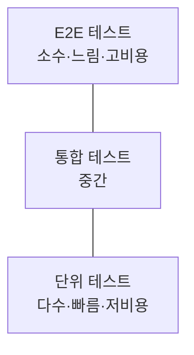
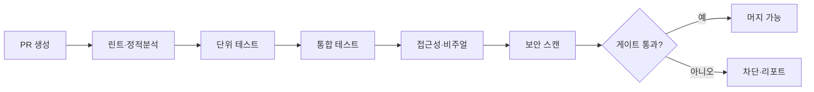
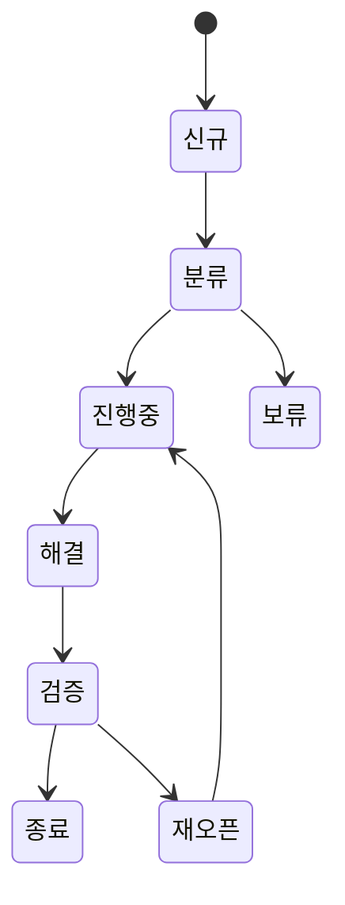

# 30 · 테스트 전략

| 항목 | 내용 |
| --- | --- |
| **목적** | Goldwiki Digital(골드위키 디지털)의 모든 디지털 산출물에 대한 테스트 전략, 유형, 커버리지 목표, 자동화, 결함 관리, 종료기준을 표준화한다. |
| **대상 독자** | QA Engineer, Frontend/Backend/API Engineer, Security Engineer, DevOps Engineer |
| **담당(Owner) 에이전트** | QA Engineer |
| **참조(상위 문서)** | [품질 체크리스트](29_QUALITY_CHECKLIST.md), [자동화 워크플로우](27_AUTOMATION_WORKFLOW.md) |
| **연계(하위 문서)** | [릴리스 프로세스](31_RELEASE_PROCESS.md), [보안 가이드](24_SECURITY_GUIDE.md), [공통 오류](39_COMMON_ERRORS.md) |
| **최종 수정** | 2026-06-26 |
| **상태** | 활성(Active) |

---

## 1. 테스트 철학

테스트는 품질을 "검사"하는 것이 아니라 "설계"하는 활동이다. 골드위키 디지털은 **시프트 레프트(shift-left)** 원칙에 따라 요구사항 단계부터 검증 가능성을 고려한다. 모든 테스트 활동은 [품질 체크리스트](29_QUALITY_CHECKLIST.md)의 DoD와 연결된다.

---

## 2. 테스트 피라미드



| 계층 | 비중 | 특성 |
| --- | --- | --- |
| 단위(Unit) | 약 70% | 빠르고 격리됨, 함수·컴포넌트 단위 |
| 통합(Integration) | 약 20% | 모듈·서비스 간 상호작용 |
| E2E | 약 10% | 사용자 시나리오 전체 흐름 |

안티패턴 "아이스크림 콘"(E2E 과다)을 피한다. 빠른 피드백을 위해 하위 계층을 두껍게 유지한다.

---

## 3. 테스트 유형

| 유형 | 목적 | 담당 | 도구 예 |
| --- | --- | --- | --- |
| 단위(Unit) | 개별 로직 정확성 | Frontend/Backend Engineer | Jest, Vitest, JUnit, pytest |
| 통합(Integration) | 모듈·DB·API 연동 | Backend/API Engineer | Supertest, Testcontainers |
| E2E | 사용자 시나리오 | QA Engineer | Playwright, Cypress |
| 비주얼 회귀(Visual) | UI 외형 변화 감지 | QA Engineer, UI Designer | Playwright snapshot, Chromatic |
| 접근성(a11y) | WCAG 준수 | Accessibility Specialist | axe-core, Pa11y, Lighthouse |
| 성능(Performance) | 응답·부하·Core Web Vitals | QA/DevOps Engineer | k6, Lighthouse, WebPageTest |
| 보안(Security) | 취약점 탐지 | Security Engineer | OWASP ZAP, Snyk, SAST/DAST |

각 유형의 합격 기준은 [품질 체크리스트](29_QUALITY_CHECKLIST.md)의 분야별 항목과 일치시킨다.

---

## 4. 커버리지 목표

| 대상 | 라인 커버리지 | 분기 커버리지 | 비고 |
| --- | --- | --- | --- |
| 핵심 비즈니스 로직 | ≥ 90% | ≥ 85% | 결제·인증 등 |
| 일반 모듈 | ≥ 80% | ≥ 75% | |
| UI 컴포넌트 | ≥ 70% | — | 비주얼 테스트로 보완 |
| 전체 평균 | ≥ 80% | ≥ 75% | 릴리스 게이트 |

커버리지는 품질의 필요조건이지 충분조건이 아니다. 의미 있는 단언(assertion) 없는 커버리지는 무효로 본다.

---

## 5. 테스트 데이터

| 원칙 | 설명 |
| --- | --- |
| 격리 | 테스트 간 데이터 간섭 금지, 각 테스트 독립 셋업/정리 |
| 재현성 | 시드(seed) 고정으로 결정적 결과 보장 |
| 익명화 | 실데이터 사용 시 개인정보 마스킹([24](24_SECURITY_GUIDE.md)) |
| 팩토리 | 테스트 데이터 빌더/팩토리로 생성 |
| 경계값 | 빈값·최대값·특수문자·다국어 포함 |

```javascript
// 테스트 데이터 팩토리 예시
const makeUser = (overrides = {}) => ({
  id: 'u-001', name: '홍길동', role: 'member', ...overrides,
});
```

---

## 6. 테스트 환경

| 환경 | 용도 | 데이터 |
| --- | --- | --- |
| 로컬(Local) | 개발자 단위·통합 테스트 | 모의/시드 |
| CI | 자동 회귀 테스트 | 격리 시드 |
| 스테이징(Staging) | E2E·UAT·성능 | 운영 유사(익명화) |
| 운영(Production) | 스모크·모니터링 | 실데이터(읽기 위주) |

환경 구성·승격 경로는 [릴리스 프로세스](31_RELEASE_PROCESS.md)와 정합되게 운영한다.

---

## 7. 자동화



- 모든 PR은 자동 테스트 게이트를 통과해야 머지된다.
- E2E·성능은 스테이징 배포 후 야간/스케줄 실행을 병행한다.
- 플레이키(flaky) 테스트는 격리·수정 전까지 게이트에서 제외하고 [공통 오류](39_COMMON_ERRORS.md)에 기록한다.

---

## 8. 도구 스택(예시)

| 영역 | 권장 도구 |
| --- | --- |
| 단위 | Jest / Vitest / pytest / JUnit |
| E2E | Playwright |
| 비주얼 | Playwright Snapshot / Chromatic |
| 접근성 | axe-core / Lighthouse CI |
| 성능 | k6 / Lighthouse |
| 보안 | OWASP ZAP / Snyk |
| CI | GitHub Actions |

도구 선택 결정은 [의사결정 로그](32_DECISION_LOG.md)에 기록하고 프로젝트 특성에 맞게 조정한다.

---

## 9. 결함 라이프사이클



| 상태 | 설명 |
| --- | --- |
| 신규(New) | 결함 보고됨 |
| 분류(Triage) | 심각도·우선순위·담당 배정 |
| 진행중(In Progress) | 수정 작업 중 |
| 해결(Resolved) | 수정 완료, 검증 대기 |
| 검증(Verify) | QA 재현 테스트 |
| 종료(Closed) | 검증 통과 |
| 재오픈(Reopen) | 검증 실패 |

---

## 10. 결함 심각도

| 심각도 | 정의 | 대응 SLA |
| --- | --- | --- |
| S1 치명(Blocker) | 핵심 기능 마비·데이터 손실·보안 사고 | 즉시 |
| S2 심각(Critical) | 주요 기능 장애, 우회 불가 | 24시간 내 |
| S3 보통(Major) | 기능 장애, 우회 가능 | 다음 릴리스 |
| S4 경미(Minor) | 사소한 결함·표기 | 백로그 |

---

## 11. 종료기준(Exit Criteria)

릴리스 전 다음을 모두 충족해야 한다.

- [ ] 계획된 테스트 케이스 실행률 ≥ 95%.
- [ ] 통과율 ≥ 98%.
- [ ] S1·S2 결함 0건(잔존 없음).
- [ ] S3 결함은 합의된 처리 계획 보유.
- [ ] 커버리지 목표(§4) 충족.
- [ ] 접근성·보안·성능 테스트 합격.
- [ ] [품질 체크리스트(29)](29_QUALITY_CHECKLIST.md) DoD 통과.

---

## 관련 골드위키 문서

- [29_QUALITY_CHECKLIST.md](29_QUALITY_CHECKLIST.md) — 분야별 품질 체크리스트·DoD
- [31_RELEASE_PROCESS.md](31_RELEASE_PROCESS.md) — 릴리스 게이트와 환경
- [24_SECURITY_GUIDE.md](24_SECURITY_GUIDE.md) — 보안 테스트 기준
- [16_ACCESSIBILITY.md](16_ACCESSIBILITY.md) — 접근성 테스트 기준
- [20_FRONTEND_GUIDE.md](20_FRONTEND_GUIDE.md) — 프론트엔드 테스트 관행
- [39_COMMON_ERRORS.md](39_COMMON_ERRORS.md) — 반복 결함·플레이키 테스트

> **거버넌스:** 골드위키 규칙에 따라, 본 문서에서 발생한 모든 의사결정은 [의사결정 로그](32_DECISION_LOG.md), [프로젝트 메모리](35_PROJECT_MEMORY.md), [베스트 프랙티스](37_BEST_PRACTICES.md), [레퍼런스 라이브러리](36_REFERENCE_LIBRARY.md)를 갱신한다.
