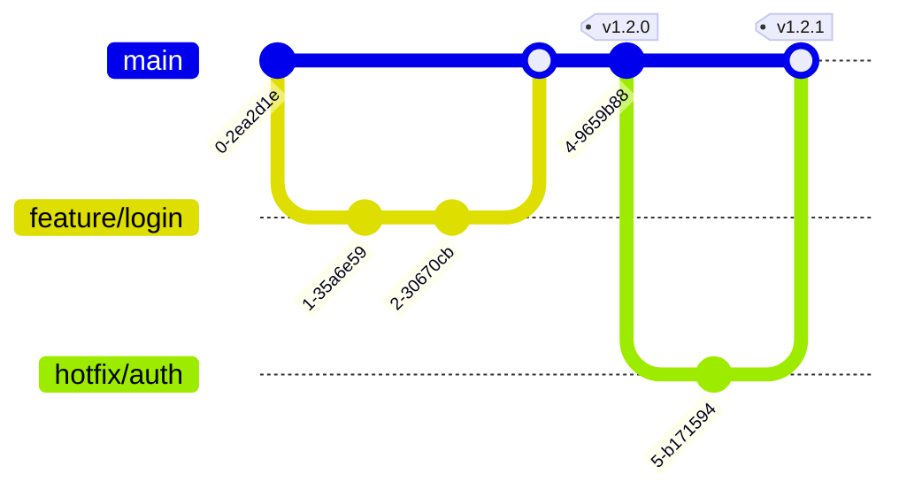
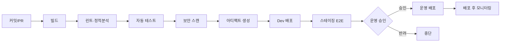
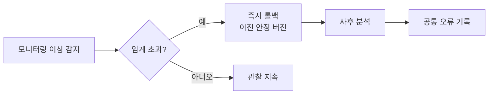

# 31 · 릴리스 프로세스

| 항목 | 내용 |
| --- | --- |
| **목적** | Goldwiki Digital(골드위키 디지털)의 코드·산출물 릴리스를 위한 브랜칭 전략, CI/CD 파이프라인, 버저닝, 릴리스·롤백·모니터링 표준을 정의한다. |
| **대상 독자** | DevOps Engineer, Backend/Frontend/API Engineer, QA Engineer, Project Director |
| **담당(Owner) 에이전트** | DevOps Engineer |
| **참조(상위 문서)** | [테스트 전략](30_TEST_STRATEGY.md), [품질 체크리스트](29_QUALITY_CHECKLIST.md) |
| **연계(하위 문서)** | [보안 가이드](24_SECURITY_GUIDE.md), [공통 오류](39_COMMON_ERRORS.md), [의사결정 로그](32_DECISION_LOG.md) |
| **최종 수정** | 2026-06-26 |
| **상태** | 활성(Active) |

---

## 1. 원칙

릴리스는 **작고 자주, 자동화되고 되돌릴 수 있게** 한다. 모든 릴리스는 [테스트 전략](30_TEST_STRATEGY.md)의 종료기준과 [품질 체크리스트](29_QUALITY_CHECKLIST.md)의 게이트를 통과해야 한다. 운영 환경 릴리스는 사람 승인이 필수다([25 §9](25_AI_GUIDE.md)).

---

## 2. 브랜칭 전략

트렁크 기반(Trunk-Based)을 기본으로 하되, 짧은 수명의 기능 브랜치를 사용한다.

| 브랜치 | 용도 | 규칙 |
| --- | --- | --- |
| `main` | 항상 배포 가능한 정본 | 직접 푸시 금지, PR·게이트 통과만 머지 |
| `feature/*` | 기능 개발 | 수명 짧게(수일 내), `main`에서 분기 |
| `fix/*` | 버그 수정 | 동일 규칙 |
| `release/*` | 릴리스 안정화(필요 시) | 핫픽스 백포트 |
| `hotfix/*` | 운영 긴급 수정 | `main`에서 분기, 신속 배포 |

PR 규칙: 리뷰 1인 이상 승인, 모든 자동 게이트 통과, 작업 단위는 작게 유지.

---

## 3. 환경

| 환경 | 목적 | 승격 트리거 |
| --- | --- | --- |
| 개발(Dev) | 통합 확인 | `main` 머지 시 자동 |
| 스테이징(Staging) | E2E·UAT·성능·접근성 | 릴리스 후보 태깅 |
| 운영(Production) | 실서비스 | 사람 승인 후 |

환경 정의는 [테스트 전략 §6](30_TEST_STRATEGY.md)과 정합한다. 환경별 구성·비밀은 안전하게 분리 관리한다([24](24_SECURITY_GUIDE.md)).

---

## 4. CI/CD 파이프라인

| 단계 | 내용 | 실패 시 |
| --- | --- | --- |
| 빌드 | 의존성 설치·컴파일·번들 | 즉시 중단 |
| 린트/정적분석 | 코드 스타일·정적 취약점 | 차단 |
| 자동 테스트 | 단위·통합([30](30_TEST_STRATEGY.md)) | 차단 |
| 보안 스캔 | SAST·의존성·시크릿 스캔 | 차단 |
| 아티팩트 | 버전 태그된 빌드 산출물 | — |
| 배포 | 환경별 자동/승인 배포 | 롤백 |
| 모니터링 | 헬스·에러·성능 관측 | 자동 알림 |

---

## 5. 버저닝(SemVer)

[유의적 버전(SemVer)](https://semver.org) `MAJOR.MINOR.PATCH`를 따른다.

| 구분 | 증가 조건 | 예 |
| --- | --- | --- |
| MAJOR | 하위 호환 깨지는 변경 | `1.4.2 → 2.0.0` |
| MINOR | 하위 호환 기능 추가 | `1.4.2 → 1.5.0` |
| PATCH | 하위 호환 버그 수정 | `1.4.2 → 1.4.3` |

- 프리릴리스: `2.0.0-rc.1`, 빌드 메타데이터: `2.0.0+build.42`.
- 태그는 `v` 접두사 사용: `v2.0.0`.
- API 버저닝은 [API 표준(22)](22_API_STANDARD.md)을 따른다. 프롬프트 버저닝도 동일 규칙([26 §8](26_PROMPT_ENGINEERING.md)).

---

## 6. 릴리스 체크리스트

- [ ] [테스트 전략](30_TEST_STRATEGY.md) 종료기준 충족(S1·S2 0건).
- [ ] [품질 체크리스트](29_QUALITY_CHECKLIST.md) 클라이언트 준비 게이트 통과.
- [ ] 보안 스캔 통과([24](24_SECURITY_GUIDE.md)).
- [ ] 버전 번호·태그 결정(SemVer).
- [ ] 릴리스 노트·변경 로그 작성(한국어).
- [ ] 데이터베이스 마이그레이션 검증·롤백 스크립트 준비.
- [ ] 구성·비밀·환경 변수 확인.
- [ ] 롤백 계획 수립·검증.
- [ ] 이해관계자 공지·승인([25 §9](25_AI_GUIDE.md)).
- [ ] 모니터링·알림 활성화 확인.

---

## 7. 변경관리(Change Management)

| 변경 유형 | 승인 | 일정 |
| --- | --- | --- |
| 일반 변경 | PR 리뷰 + 게이트 | 정규 릴리스 창 |
| 표준 변경(반복·저위험) | 자동 승인 | 상시 |
| 긴급 변경(Hotfix) | DevOps + Project Director | 즉시 |

모든 변경은 [의사결정 로그](32_DECISION_LOG.md)와 변경 이력에 기록한다. 변경 영향·롤백 가능성을 사전 평가한다.

---

## 8. 배포 전략

| 전략 | 설명 | 적용 |
| --- | --- | --- |
| 블루-그린(Blue-Green) | 신·구 환경 전환으로 무중단 | 중요 서비스 |
| 카나리(Canary) | 일부 트래픽에 점진 노출 | 위험 큰 변경 |
| 롤링(Rolling) | 순차 인스턴스 교체 | 일반 |
| 기능 플래그(Feature Flag) | 코드 배포와 노출 분리 | 점진 출시·A/B |

---

## 9. 롤백(Rollback)

- 롤백 트리거: 에러율 급증, 핵심 지표 하락, S1 결함 발생.
- 롤백은 자동화하고 정기적으로 리허설한다.
- 데이터 마이그레이션은 전방·후방 호환을 보장하여 롤백 가능하게 설계한다.
- 사후 분석(post-mortem) 결과는 [공통 오류](39_COMMON_ERRORS.md)·[베스트 프랙티스](37_BEST_PRACTICES.md)에 기록한다.

---

## 10. 릴리스 후 모니터링

| 지표 | 관측 항목 | 알림 임계 |
| --- | --- | --- |
| 가용성 | 헬스체크·업타임 | 다운 즉시 |
| 에러율 | 5xx·예외율 | 기준 대비 급증 |
| 지연 | p95/p99 응답시간 | SLA 초과 |
| 핵심 지표 | 전환·로그인 등 비즈니스 KPI | 유의미 하락 |
| 리소스 | CPU·메모리·DB 부하 | 임계 초과 |

배포 직후 일정 기간 집중 관측(하이퍼케어)하고, 이상 시 §9 롤백 절차를 발동한다.

---

## 관련 골드위키 문서

- [30_TEST_STRATEGY.md](30_TEST_STRATEGY.md) — 릴리스 전 테스트 종료기준
- [29_QUALITY_CHECKLIST.md](29_QUALITY_CHECKLIST.md) — 클라이언트 준비 게이트
- [24_SECURITY_GUIDE.md](24_SECURITY_GUIDE.md) — 보안 스캔·비밀 관리
- [22_API_STANDARD.md](22_API_STANDARD.md) — API 버저닝
- [27_AUTOMATION_WORKFLOW.md](27_AUTOMATION_WORKFLOW.md) — 납품 파이프라인 연계
- [39_COMMON_ERRORS.md](39_COMMON_ERRORS.md) — 사후 분석·반복 장애

> **거버넌스:** 골드위키 규칙에 따라, 본 문서에서 발생한 모든 의사결정은 [의사결정 로그](32_DECISION_LOG.md), [프로젝트 메모리](35_PROJECT_MEMORY.md), [베스트 프랙티스](37_BEST_PRACTICES.md), [레퍼런스 라이브러리](36_REFERENCE_LIBRARY.md)를 갱신한다.
