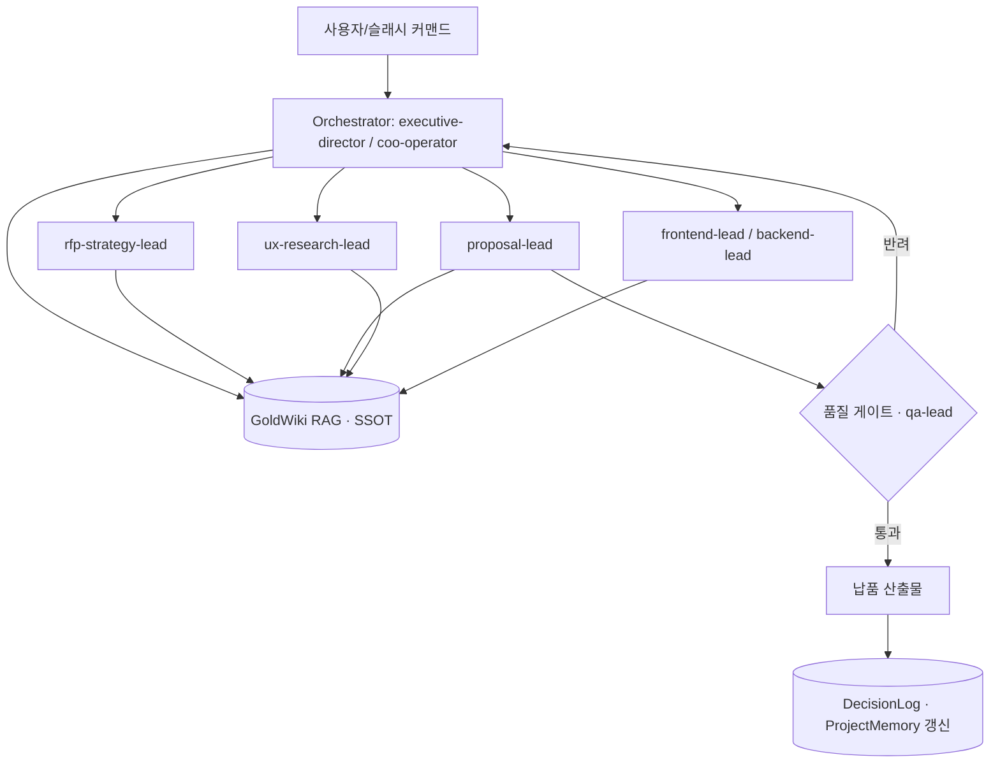

# AI 자동화 가이드 — 멀티에이전트·GoldWiki RAG·프롬프트·평가·가드레일

> 이 문서는 GoldWiki(SSOT)에 속한다. ClubSchool AI OS의 핵심 운영 원리를 정의한다. **모든 에이전트는 의사결정 전 GoldWiki를 먼저 참조한다**는 원칙이 이 문서에서 구체화된다.

| 항목 | 내용 |
| --- | --- |
| **담당(Owner) 에이전트** | `ai-automation-lead` |
| **협업 에이전트** | `executive-director`, `coo-operator`, `documentation-lead`, `backend-lead`, `data-analytics-lead`, `qa-lead`, `security-risk-lead` |
| **상위 참조** | [AI 가이드(번호형)](../25_AI_GUIDE.md), [프롬프트 엔지니어링(번호형)](../26_PROMPT_ENGINEERING.md), [자동화 워크플로우(번호형)](../27_AUTOMATION_WORKFLOW.md), [서브에이전트 규칙(번호형)](../28_SUBAGENT_RULES.md) |
| **연계** | [프롬프트 라이브러리](../PromptLibrary/README.md), [의사결정 로그](../DecisionLog/README.md), [프로젝트 메모리](../ProjectMemory/README.md) |
| **최종 수정** | 2026-06-26 · **상태** 활성(Active) |

---

## 목적

Claude Code 기반 멀티에이전트로 RFP→납품 전 과정을 자동화하기 위한 아키텍처, GoldWiki 기반 RAG, 프롬프트 표준, 평가(eval), 가드레일을 정의한다. 지식 중복을 막고 모든 산출물을 근거 기반·재현 가능하게 만든다.

## 언제 사용하는가

- 새 서브에이전트·슬래시 커맨드·워크플로우를 설계할 때.
- 에이전트가 GoldWiki를 참조/갱신하는 RAG 흐름을 구성할 때.
- 프롬프트 품질·일관성을 표준화할 때.
- 자동화 산출물의 평가·가드레일·휴먼 게이트를 설계할 때.

## 입력 정보

| 입력 | 출처 |
| --- | --- |
| 운영 원칙·거버넌스 | [00_START_HERE](../00_START_HERE.md), [서브에이전트 규칙(번호형)](../28_SUBAGENT_RULES.md) |
| 도메인 지식(SSOT) | GoldWiki 전체 토픽 폴더·번호형 문서 |
| 프롬프트 자산 | [프롬프트 라이브러리](../PromptLibrary/README.md), [40_PROMPT_LIBRARY](../40_PROMPT_LIBRARY.md) |
| 품질·평가 기준 | [품질 체크리스트(번호형)](../29_QUALITY_CHECKLIST.md) |

## 처리 방식

### 1) 멀티에이전트 아키텍처

오케스트레이터(`executive-director`/`coo-operator`)가 작업을 분해해 24개 도메인 서브에이전트에 위임한다.



원칙: **GoldWiki 우선 참조** → 작업 → **GoldWiki 갱신**(DecisionLog/ProjectMemory/BestPractices). 모든 에이전트는 [서브에이전트 규칙](../28_SUBAGENT_RULES.md)을 따른다.

### 2) GoldWiki RAG

GoldWiki를 단일 지식원으로 사용한다. 검색 → 근거 인용 → 산출 → 갱신 루프.

```
1) Retrieve: 토픽 폴더 README + 관련 번호형 문서를 우선 로드(메타→본문).
2) Ground:   답변/산출물에 근거 문서 경로를 인용(예: ../04_RFP_ANALYSIS.md).
3) Generate: 인용 근거 범위 내에서만 단정. 근거 없으면 "확인 필요"로 표시.
4) Update:   새 결정→DecisionLog, 재사용 지식→BestPractices/ProjectMemory.
```

청킹은 문서의 H2/H3 섹션 단위, 메타데이터(폴더·담당 에이전트·최종수정)를 함께 인덱싱한다. 지식 중복 금지: 동일 내용은 한 곳에 두고 나머지는 링크한다.

### 3) 프롬프트 표준 (R-C-T-O-G)

| 요소 | 내용 |
| --- | --- |
| **R**ole | 에이전트 역할·페르소나 |
| **C**ontext | 참조할 GoldWiki 문서 경로 명시(먼저 읽게 함) |
| **T**ask | 구체 작업·범위 |
| **O**utput | 형식·구조·산출물 |
| **G**uardrail | 제약·금지·품질 기준·에스컬레이션 |

```
[R] 너는 proposal-lead다.
[C] GoldWiki 05_PROPOSAL_STRATEGY.md, 04_RFP_ANALYSIS.md, Proposal/README.md를 먼저 읽어라.
[T] 첨부 RFP에 대한 제안서 목차와 핵심 메시지(Win Theme)를 작성하라.
[O] 마크다운 목차 + 섹션별 1줄 메시지 + 근거(인용 경로).
[G] 근거 없는 수치 금지. 클라이언트 제출 품질. 완료 후 DecisionLog 갱신, qa-lead 검토.
```

### 4) 평가(Eval)

자동화 산출물은 게이트 통과 전 평가한다.

| 평가 축 | 방법 |
| --- | --- |
| 정확성·근거성 | GoldWiki 인용 일치, 환각 검출(LLM-as-judge + 룰) |
| 완전성 | 필수 섹션·체크리스트 충족률 |
| 형식 준수 | 템플릿/구조 검증(스키마) |
| 안전성 | PII·민감정보·금지 표현 스캔 |

골든셋(대표 RFP·산출물)으로 회귀 평가하고 점수를 [프로젝트 메모리](../ProjectMemory/README.md)에 기록한다.

### 5) 가드레일

- **입력**: 프롬프트 인젝션 방어, 민감정보 입력 차단, 범위 외 요청 거절.
- **처리**: 도구 권한 최소화(Read/Write/Edit/Grep/Glob 등 필요한 것만), 외부 호출 화이트리스트.
- **출력**: PII 마스킹, 근거 없는 단정 금지, 법적·재무 단정은 휴먼 검토 필수.
- **휴먼 게이트**: 클라이언트 제출·계약·비용 영향 산출물은 `executive-director` 최종 승인.

## 출력 산출물

| 산출물 | 설명 |
| --- | --- |
| 에이전트/커맨드/워크플로우 정의 | 표준 형식 준수 |
| RAG 파이프라인 설계 | 검색·근거·갱신 루프 |
| 프롬프트 자산 | [프롬프트 라이브러리](../PromptLibrary/README.md) 등록 |
| 평가 리포트 | 골든셋 점수·회귀 결과 |
| 가드레일 정책 | 입력/처리/출력/휴먼 게이트 |

## 품질 기준

- [ ] 모든 산출물이 GoldWiki 근거를 인용.
- [ ] 환각·근거 없는 수치 0건(평가 통과).
- [ ] 도구 권한 최소화 원칙 준수.
- [ ] PII·민감정보 출력 0건.
- [ ] 휴먼 게이트가 필요한 산출물에 승인 기록.
- [ ] 결정·재사용 지식이 GoldWiki에 갱신됨.

## 체크리스트

- [ ] 에이전트가 작업 전 GoldWiki를 먼저 읽었는가.
- [ ] 프롬프트가 R-C-T-O-G를 갖췄는가.
- [ ] 평가 골든셋으로 회귀 검증했는가.
- [ ] 가드레일(입력/처리/출력)이 적용됐는가.
- [ ] DecisionLog/ProjectMemory 갱신했는가.

## 예시 프롬프트

```
역할: ai-automation-lead. GoldWiki AI/AIAutomationGuide.md, 27_AUTOMATION_WORKFLOW.md, 28_SUBAGENT_RULES.md를 먼저 읽어라.
작업: 'RFP 분석→제안 초안' 워크플로우를 멀티에이전트로 설계. GoldWiki RAG·평가·가드레일 포함.
출력: mermaid 흐름, 참여 에이전트, 품질 게이트, 평가 축, 가드레일 정책.
완료 후 DecisionLog에 설계 결정을, PromptLibrary에 사용 프롬프트를 등록하라.
```

---

### 관련 문서
[AI README](README.md) · [프롬프트 라이브러리](../PromptLibrary/README.md) · [백엔드 가이드](../Backend/BackendGuide.md) · [데이터 분석 가이드](../Data/DataAnalyticsGuide.md) · [25_AI_GUIDE](../25_AI_GUIDE.md) · [27_AUTOMATION_WORKFLOW](../27_AUTOMATION_WORKFLOW.md) · [28_SUBAGENT_RULES](../28_SUBAGENT_RULES.md)
