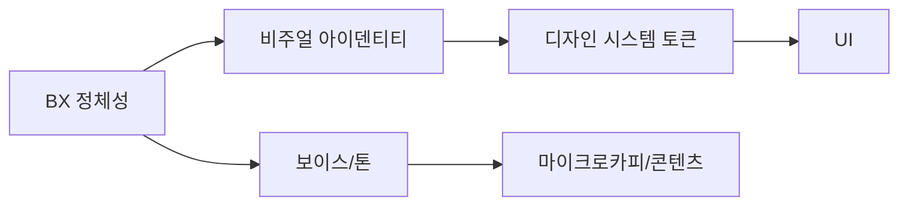

# 브랜드 경험(BX) 가이드라인 (Brand Experience Guidelines)

Goldwiki Digital(골드위키 디지털)의 브랜드 경험 표준. **브랜드 톤·보이스·비주얼 아이덴티티**를 정의하여, 모든 접점에서 일관된 인상과 신뢰를 전달한다.

> 이 문서를 쓰는 에이전트(BX Designer)는 [01_COMPANY_CONTEXT](../01_COMPANY_CONTEXT.md), [02_BUSINESS_GOALS](../02_BUSINESS_GOALS.md), [08_UI_GUIDELINES](../08_UI_GUIDELINES.md)를 먼저 참조한다. BX는 UX·UI·디자인 시스템의 상위 정체성 레이어다.

---

## 목적

- 브랜드 핵심 가치·포지셔닝·퍼스낼리티를 정의한다.
- 글쓰기 톤·보이스(Voice & Tone)와 비주얼 아이덴티티(로고/색/타이포/이미지) 규칙을 표준화한다.
- 브랜드 일관성을 모든 산출물·접점에 적용하는 기준을 제공한다.

## 언제 사용하는가

| 시점 | 사용 목적 |
| --- | --- |
| 제안서/세일즈 | 브랜드 일관 메시지·톤 |
| UI/디자인 시스템 | 비주얼 토큰의 정체성 근거 |
| 콘텐츠/마이크로카피 | 보이스·톤 적용 |
| 캠페인/마케팅 | 비주얼·메시지 가이드 |

## 입력 정보

- 회사 컨텍스트·미션: [01_COMPANY_CONTEXT](../01_COMPANY_CONTEXT.md)
- 비즈니스 목표·타깃: [02_BUSINESS_GOALS](../02_BUSINESS_GOALS.md)
- 페르소나: [../UX/UXStrategyFramework](../UX/UXStrategyFramework.md)
- 디자인 토큰·UI: [../DesignSystem/DesignSystemGuide](../DesignSystem/DesignSystemGuide.md), [../UI/UIGuidelines](../UI/UIGuidelines.md)

## 처리 방식

### 1. 브랜드 정체성
- 미션/비전, 핵심 가치 3~5개
- 포지셔닝 문장: "[타깃]에게 [차별점]을 제공하는 [카테고리]"
- 브랜드 퍼스낼리티(예: 전문적·명료·신뢰·진취) — 형용사 5개로 고정

### 2. 보이스 & 톤
- **보이스**(불변): 브랜드의 성격. 예) 전문적이되 친근, 군더더기 없음
- **톤**(가변): 상황별 조정

| 상황 | 톤 |
| --- | --- |
| 성공/완료 | 간결·긍정 |
| 오류 | 공감·해결 중심(비난 금지) |
| 온보딩 | 안내·격려 |
| 마케팅 | 자신감·근거 제시 |

| Do | Don't |
| --- | --- |
| 능동태, 짧은 문장 | 수동태 남발, 장황 |
| 사용자 용어 | 내부 전문용어 |
| "다음 단계를 진행하세요" | "에러 발생" 식 무책임 통보 |

### 3. 비주얼 아이덴티티
- **로고**: 클리어스페이스(로고 높이의 1배), 최소 크기, 금지 사용(왜곡/그림자/임의 색)
- **색**: 브랜드 컬러 → 시맨틱 토큰으로 연결([15_DESIGN_TOKEN](../15_DESIGN_TOKEN.md)). 대비 WCAG AA 준수
- **타이포**: 브랜드 서체 + 대체 서체, 위계 규칙은 [../UI/UIGuidelines](../UI/UIGuidelines.md)
- **이미지/일러스트**: 톤(사실적/추상), 피사체, 색 보정 가이드
- **모션**: 이징/지속시간 원칙(절제·기능적)

### 4. 적용 매트릭스


## 출력 산출물

| 산출물 | 형식 |
| --- | --- |
| 브랜드 가이드북 | 문서/PDF |
| 보이스·톤 사전 | 표 |
| 로고/색/타이포 사양 | 문서 + 토큰 연계 |
| 마이크로카피 가이드 | 표 |

## 품질 기준

- [ ] 브랜드 퍼스낼리티가 형용사로 명확히 고정되었다.
- [ ] 보이스(불변)와 톤(상황별)이 구분되어 정의되었다.
- [ ] 브랜드 색이 시맨틱 토큰으로 연결되고 대비 AA를 충족한다.
- [ ] 로고 클리어스페이스·금지 사용이 명시되었다.
- [ ] 마이크로카피 Do/Don't 예시가 있다.

## 체크리스트

- [ ] 포지셔닝 문장이 정의되었는가
- [ ] 상황별 톤 매트릭스가 있는가
- [ ] 로고 사용/금지 규칙이 있는가
- [ ] 색·타이포가 디자인 시스템과 정합하는가
- [ ] 적용 매트릭스로 접점 일관성이 보장되는가
- [ ] [09_DESIGN_SYSTEM](../09_DESIGN_SYSTEM.md)·[08_UI_GUIDELINES](../08_UI_GUIDELINES.md)와 연결했는가

## 예시 프롬프트

```
역할: bx-design-lead(BX Designer). GoldWiki/Brand/BXGuidelines.md를 따른다.
입력: 01_COMPANY_CONTEXT, 02_BUSINESS_GOALS, 브랜드 컬러, 페르소나.
작업: 브랜드 퍼스낼리티(형용사 5)·포지셔닝 문장·보이스/톤 매트릭스·
      비주얼 아이덴티티(로고/색/타이포) 가이드 작성. 마이크로카피 Do/Don't 포함.
출력: 보이스·톤 표, 적용 매트릭스 mermaid, 토큰 연계 색 표.
```
