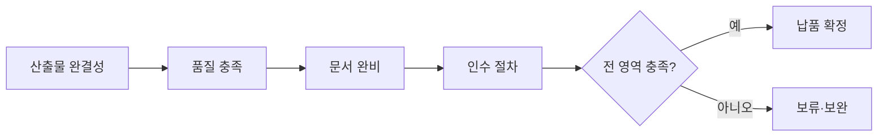

# 최종 납품 체크리스트 (Final Delivery Checklist)

## 목적

ClubSchool AI OS 프로젝트의 **최종 납품(handover)** 단계에서 산출물·품질·문서·인수가 모두 충족되었는지 검증하는 정본 체크리스트다. 납품물이 계약·RFP 요건을 빠짐없이 충족하고, 클라이언트가 운영·유지보수할 수 있는 상태로 인계되도록 보장한다. 본 문서는 GoldWiki SSOT의 납품 게이트 기준이며, [품질 검증 10단계](../QA/QualityReviewChecklist.md) 통과를 전제로 한다.

> 모든 에이전트는 납품 전 GoldWiki를 먼저 참조한다. 납품 결과·이슈·교훈은 [../DecisionLog/](../DecisionLog/)와 [../35_PROJECT_MEMORY.md](../35_PROJECT_MEMORY.md)에 기록해 차기 프로젝트 자산으로 환원한다.

## 언제 사용하는가

- 프로젝트 최종 단계(L8 납품·인수)에서 클라이언트 인계 직전.
- 단계별 중간 산출물의 부분 납품(milestone delivery) 시.
- 검수 요청(인수 검사) 제출 전 자가 점검.
- 하자보수·인수 인계 후 잔여 의무 확인 시.

## 입력 정보

| 입력 | 출처 | 비고 |
| --- | --- | --- |
| 계약·RFP 납품 요건 | [../RFP/](../RFP/), 과업지시서 | 산출물 목록·형식 기준 |
| 산출물 정의·WBS | [../PMO/WBSGuide.md](../PMO/WBSGuide.md) | 산출물 추적 |
| 품질 검증 결과 | [../QA/QualityReviewChecklist.md](../QA/QualityReviewChecklist.md) | 10단계 Pass 증빙 |
| 릴리스 기준 | [../31_RELEASE_PROCESS.md](../31_RELEASE_PROCESS.md) | 버전·배포 |
| 테스트 결과 | [../30_TEST_STRATEGY.md](../30_TEST_STRATEGY.md) | QA 통과 증빙 |

## 처리 방식

납품 검증은 **4개 영역(산출물·품질·문서·인수)** 을 순차로 점검한다. 각 영역은 게이트이며, 한 영역이라도 미충족이면 납품을 보류한다.



### 1. 산출물 영역

납품 대상 산출물이 계약·WBS 정의대로 빠짐없이 존재하고 최신본인지 확인한다.

- [ ] 산출물 목록이 계약·RFP 요건과 100% 일치한다.
- [ ] 각 산출물이 최종 승인 버전이며 버전·일자가 표기되었다.
- [ ] 소스 코드·디자인 원본·자산이 합의된 형식으로 포함되었다.
- [ ] 산출물 간 상호 참조·링크가 유효하다(깨진 링크 0건).
- [ ] 부분 납품 시 잔여 산출물·일정이 명시되었다.

### 2. 품질 영역

산출물이 합의된 품질 기준과 테스트를 통과했는지 확인한다.

- [ ] [품질 검증 10단계](../QA/QualityReviewChecklist.md)를 모두 Pass했다.
- [ ] 기능·통합·접근성 테스트 결과가 기준을 충족한다([../30_TEST_STRATEGY.md](../30_TEST_STRATEGY.md)).
- [ ] 알려진 결함(known issues)이 등록·등급화되었고 치명 결함이 없다.
- [ ] 보안·개인정보 점검을 통과했다([../24_SECURITY_GUIDE.md](../24_SECURITY_GUIDE.md)).
- [ ] 성능 기준(응답시간·부하)이 검증되었다.

### 3. 문서 영역

운영·유지보수·인수에 필요한 문서가 완비되었는지 확인한다.

- [ ] 사용자/운영자 매뉴얼이 작성되었다.
- [ ] 기술 문서(아키텍처·API·DB·배포)가 최신이다([../22_API_STANDARD.md](../22_API_STANDARD.md)).
- [ ] 릴리스 노트·변경 이력이 정리되었다([../../Templates/Release_Notes.md](../../Templates/Release_Notes.md)).
- [ ] 유지보수·이관 가이드(계정·권한·환경)가 포함되었다.
- [ ] 모든 문서가 자연스러운 한국어로 작성되었다.

### 4. 인수 영역

클라이언트 인수·검수 절차와 잔여 의무를 확정한다.

- [ ] 인수 검사(UAT) 일정·기준·담당이 합의되었다.
- [ ] 인수확인서·검수조서 양식이 준비되었다.
- [ ] 교육·핸드오버 세션이 계획·실시되었다.
- [ ] 하자보수 범위·기간·연락 체계가 명시되었다.
- [ ] 미해결 이슈·후속 과제가 인계 목록에 기록되었다.

### 납품 판정 기준

| 판정 | 기준 | 조치 |
| --- | --- | --- |
| 납품 확정 | 4개 영역 전 항목 충족 | 인수확인서 서명, DecisionLog 기록 |
| 조건부 납품 | 경미 결함·문서 보완 잔여 | 보완 일정 합의 후 부분 인계 |
| 납품 보류 | 치명 결함·핵심 산출물 누락 | 재작업, 게이트 재검 |

## 출력 산출물

- **납품 검증 보고서**: 4개 영역별 점검 결과·미충족 항목.
- **납품물 목록(BOM)**: 산출물·버전·형식·위치.
- **인수확인서·검수조서**: 클라이언트 서명용.
- **이관·핸드오버 패키지**: 매뉴얼·기술문서·계정/권한·잔여 과제.
- **교훈(lessons learned)**: [../35_PROJECT_MEMORY.md](../35_PROJECT_MEMORY.md)·[../DecisionLog/](../DecisionLog/)에 기록.

## 품질 기준

- 4개 영역 전 항목 충족 시에만 납품을 확정한다.
- 모든 산출물은 최종 승인 버전이며 추적 가능하다.
- 치명 결함·핵심 산출물 누락이 0건이다.
- 클라이언트가 독립 운영 가능한 문서·교육이 제공되었다.
- 인수확인서로 인계가 공식 확정된다.

## 체크리스트

- [ ] 산출물 영역(5항목)을 점검했다.
- [ ] 품질 영역(5항목)을 점검하고 10단계 Pass를 확인했다.
- [ ] 문서 영역(5항목)을 점검했다.
- [ ] 인수 영역(5항목)을 점검했다.
- [ ] 납품 판정(확정/조건부/보류)을 기록했다.
- [ ] 인수확인서와 핸드오버 패키지를 인계했다.
- [ ] 교훈을 ProjectMemory·DecisionLog에 기록했다.

## 예시 프롬프트

```text
당신은 pmo-director다. GoldWiki/Delivery/FinalDeliveryChecklist.md로 아래 프로젝트의
최종 납품 적합성을 검증하라.

입력: 산출물 목록·버전, 품질 검증 보고서(10단계 결과), 테스트 결과, 문서 목록, 인수 일정
요구:
1) 4개 영역(산출물·품질·문서·인수)별 항목 점검 결과
2) 미충족 항목과 보완 요구(우선순위)
3) 납품 판정(확정/조건부/보류)과 사유
4) 인수확인서·핸드오버 패키지 구성 목록
5) ProjectMemory·DecisionLog에 기록할 교훈

모든 출력은 한국어로 작성한다.
```
