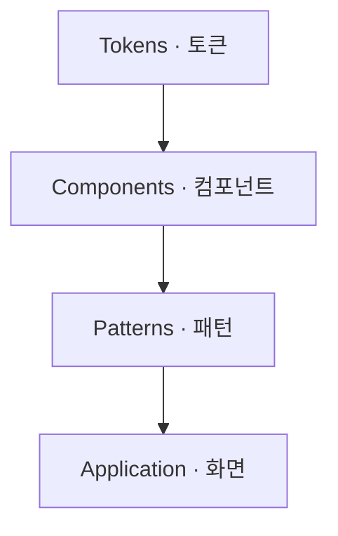
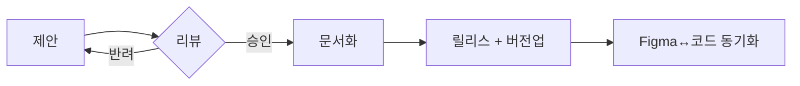

# 디자인 시스템 가이드 (Design System Guide)

Goldwiki Digital(골드위키 디지털)의 디자인 시스템 구축·운영 표준. **토큰 → 컴포넌트 → 패턴**의 3계층과 거버넌스를 정의하여, 디자인-개발 일관성과 재사용성을 보장한다.

> 이 문서를 쓰는 에이전트는 [09_DESIGN_SYSTEM](../09_DESIGN_SYSTEM.md), [15_DESIGN_TOKEN](../15_DESIGN_TOKEN.md), [14_COMPONENT_LIBRARY](../14_COMPONENT_LIBRARY.md)를 먼저 참조한다. 디자인 시스템은 GoldWiki의 시각 표준 SSOT다.

---

## 목적

- 토큰·컴포넌트·패턴의 계층 구조와 명명 규칙을 정의한다.
- 디자인-개발 단일 출처(Figma ↔ 코드)를 동기화하는 체계를 마련한다.
- 기여·버전·폐기(deprecation)·접근성 거버넌스를 규정한다.

## 언제 사용하는가

| 시점 | 사용 목적 |
| --- | --- |
| 시스템 신규 구축 | 0→1 토큰/컴포넌트 정의 |
| 컴포넌트 추가/변경 | 기여 절차·리뷰 |
| 멀티 테마/브랜드 | 토큰 분기 전략 |
| 버전 릴리스 | SemVer·체인지로그 |

## 입력 정보

- UI 가이드라인: [../UI/UIGuidelines](../UI/UIGuidelines.md)
- 브랜드 비주얼: [../Brand/BXGuidelines](../Brand/BXGuidelines.md)
- 접근성 기준: [16_ACCESSIBILITY](../16_ACCESSIBILITY.md)
- 프런트 구현 표준: [20_FRONTEND_GUIDE](../20_FRONTEND_GUIDE.md), [18_CSS_GUIDE](../18_CSS_GUIDE.md)

## 처리 방식

### 3계층 아키텍처


#### 1) 토큰 (Tokens)
- **글로벌(원시)**: `color-blue-500`, `space-4`
- **시맨틱(별칭)**: `color-primary` → `color-blue-500`
- **컴포넌트**: `button-bg-primary` → `color-primary`
- 출처: 디자인 토큰 파일(JSON/Style Dictionary) → [15_DESIGN_TOKEN](../15_DESIGN_TOKEN.md)

| 카테고리 | 예시 토큰 |
| --- | --- |
| Color | `color-primary`, `color-surface`, `color-danger` |
| Spacing | `space-1`..`space-12` (4px 베이스) |
| Typography | `font-size-body`, `line-height-h1` |
| Radius | `radius-sm/md/lg` |
| Elevation | `shadow-1/2/3` |

#### 2) 컴포넌트 (Components)
- 원자→분자→유기체(Atomic) 계층
- 각 컴포넌트 명세: 용도, props/variant, 상태(6+), 접근성(role/aria), 사용/금지 예
- Figma 컴포넌트 ↔ 코드 컴포넌트 1:1, Code Connect 매핑 권장

#### 3) 패턴 (Patterns)
- 폼, 빈 상태, 에러 처리, 페이지네이션, 알림/토스트, 검색 등 반복 해법
- 패턴은 컴포넌트 조합 + 사용 맥락 규칙으로 문서화

### 거버넌스
| 항목 | 규칙 |
| --- | --- |
| 버전 | SemVer(major.minor.patch) — 파괴적 변경=major |
| 기여 | 제안 → 리뷰(디자인+개발) → 승인 → 문서화 → 릴리스 |
| 폐기 | deprecated 표기 → 1 마이너 유예 → 제거 |
| 승인 | design-system-lead 승인, 접근성 게이트 필수 |
| 변경 기록 | [32_DECISION_LOG](../32_DECISION_LOG.md)·CHANGELOG 갱신 |

### 기여 절차 (mermaid)


## 출력 산출물

| 산출물 | 형식 |
| --- | --- |
| 토큰 파일 | JSON ([15_DESIGN_TOKEN](../15_DESIGN_TOKEN.md)) |
| 컴포넌트 카탈로그 | 문서/Storybook ([14_COMPONENT_LIBRARY](../14_COMPONENT_LIBRARY.md)) |
| 패턴 라이브러리 | 문서 |
| 거버넌스/기여 가이드 | 문서 |
| 릴리스 노트 | 문서 ([Templates/Release_Notes](../../Templates/Release_Notes.md)) |

## 품질 기준

- [ ] 화면이 시맨틱 토큰만 참조한다(원시 토큰 직접 사용 금지).
- [ ] 모든 컴포넌트에 상태·접근성·사용/금지 예가 있다.
- [ ] Figma와 코드 컴포넌트가 동기화되어 있다.
- [ ] 버전이 SemVer를 따르고 체인지로그가 있다.
- [ ] 폐기 컴포넌트에 마이그레이션 경로가 명시되었다.

## 체크리스트

- [ ] 토큰 3계층(글로벌/시맨틱/컴포넌트)이 정의되었는가
- [ ] 명명 규칙이 일관적인가
- [ ] 컴포넌트 접근성(role/aria/포커스)이 검증되었는가
- [ ] 패턴이 컴포넌트 조합으로 문서화되었는가
- [ ] 거버넌스(버전/기여/폐기)가 운영되는가
- [ ] [09_DESIGN_SYSTEM](../09_DESIGN_SYSTEM.md)에 반영했는가

## 예시 프롬프트

```
역할: design-system-lead. GoldWiki/DesignSystem/DesignSystemGuide.md를 따른다.
입력: 브랜드 컬러/타이포, UI 가이드라인, 라이트/다크 요구.
작업: 토큰 3계층 정의(라이트/다크 분기) → Button/Input/Modal 컴포넌트 명세
      (variant·상태·aria) → 폼/빈상태 패턴 → SemVer 거버넌스.
출력: 토큰 JSON 예시, 컴포넌트 카탈로그 표, 기여 절차 mermaid.
```
