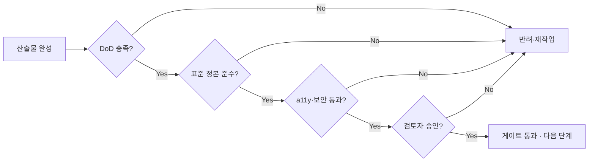

# 전사 품질 기준 (Quality Standard · DoD · Gates)

> 모든 산출물에 적용되는 전사 공통 품질 기준, 완료 정의(Definition of Done), 단계별 품질 게이트를 정의한다. 단계별 세부 체크리스트는 [번호형 29](../../GoldWiki/29_QUALITY_CHECKLIST.md)와 연계된다.

## 목적

"무엇이 충분히 좋은가"를 조직 차원에서 단일 기준으로 못 박아, 산출물 품질의 변동성을 제거하고 클라이언트 제출 가능한 일관된 결과를 보장한다. 5대 품질 기준, 산출물 유형별 완료 정의(DoD), 그리고 단계 진행을 통제하는 품질 게이트를 정의한다.

## 언제 사용하는가

- 산출물을 "완료" 선언하기 직전 (DoD 충족 확인)
- 단계 게이트 통과 여부를 판정할 때
- 코드/디자인 리뷰·레드팀 검토의 기준이 필요할 때
- 신규 산출물 유형의 품질 기준을 정의할 때
- 품질 미달로 인한 재작업·반려 사유를 명확히 해야 할 때

## 입력 정보

| 입력 | 출처 |
| --- | --- |
| 산출물과 그 유형 | 작업 결과물 |
| 적용 표준(정본) | 해당 토픽 폴더 정본 |
| 단계·게이트 정의 | [RFP 프레임워크 03](../../GoldWiki/03_RFP_FRAMEWORK.md) |
| 클라이언트 수용 기준 | RFP 요구사항·계약 |
| 접근성/보안 기준 | [16](../../GoldWiki/16_ACCESSIBILITY.md), [24](../../GoldWiki/24_SECURITY_GUIDE.md) |

## 처리 방식

### 5대 품질 기준 (모든 산출물 공통)

| 기준 | 의미 | 검증 방법 |
| --- | --- | --- |
| **경영진 수준(Executive-grade)** | 구조·근거·표현이 의사결정자에게 바로 통한다 | 요약·근거·시각화 존재 |
| **클라이언트 제출 가능(Client-ready)** | 오탈자·미완성·플레이스홀더 없음 | 교정·완결성 검토 |
| **구현 가능(Implementable)** | 실제로 만들 수 있을 만큼 구체적 | 기술 검토·실현성 확인 |
| **재사용 가능(Reusable)** | 템플릿/패턴으로 다시 쓸 수 있다 | 일반화·템플릿화 가능성 |
| **근거 기반(Evidence-based)** | 추측이 아닌 표준·데이터에 기반 | 출처·정본 인용 |

### 완료 정의(DoD) — 산출물 유형별

| 유형 | 완료 정의 |
| --- | --- |
| 문서/제안서 | 8섹션 구조 충족, 정본 링크, 오탈자 0, 검토자 승인 |
| UX/디자인 | 정본 토큰 사용, 접근성 2.2 AA, 핸드오프 명세 완비 |
| 코드 | 테스트 통과, 표준 준수, 리뷰 승인, 보안 점검 통과 |
| API | OpenAPI 명세, 에러 규약 준수, 예시 요청/응답 포함 |
| ADR | 대안 비교·결과 기술, 영향 문서 갱신 |

### 품질 게이트 (단계 통제)

게이트는 다음 단계 진행 전 반드시 통과해야 하는 관문이다.



| 게이트 | 위치 | 통과 기준 |
| --- | --- | --- |
| G-제안 | 제출 전 | 레드팀 검토 통과, 컴플라이언스 매트릭스 100% |
| G-설계 | 구현 착수 전 | IA/플로우/토큰 정본 일치, a11y 베이스라인 |
| G-구현 | 배포 전 | 테스트 통과율 기준 충족, 보안 점검 통과 |
| G-납품 | 이관 전 | DoD 전 항목, 회고·메모리 환류 완료 |

## 출력 산출물

- 게이트 통과/반려 판정과 사유
- 미충족 항목의 재작업 지시
- 갱신된 품질 게이트 기록(ProjectMemory)

## 품질 기준

| 기준 | 충족 조건 |
| --- | --- |
| 객관성 | 판정이 체크리스트·정본 기준으로 재현 가능 |
| 추적성 | 통과/반려 사유가 기록된다 |
| 일관성 | 동일 유형은 동일 DoD로 판정된다 |
| 환류 | 반려 패턴이 [공통 오류 39](../../GoldWiki/39_COMMON_ERRORS.md)로 누적된다 |

## 체크리스트

- [ ] 5대 품질 기준을 모두 충족하는가
- [ ] 해당 유형의 DoD 전 항목을 충족하는가
- [ ] 적용 표준 정본을 인용·준수했는가
- [ ] 접근성(2.2 AA)·보안 기준을 통과했는가
- [ ] 검토자/레드팀 승인을 받았는가
- [ ] 플레이스홀더·미완성·오탈자가 0인가
- [ ] 반려 시 사유와 재작업 항목을 기록했는가

## 예시 프롬프트

```
당신은 qa-lead 에이전트다. proposal-lead가 제출한 제안서를 G-제안 게이트로
판정하라. QualityStandard의 5대 기준과 제안서 DoD, 컴플라이언스 매트릭스
100% 충족 여부를 항목별로 점검하고, 미충족 항목을 표로 반려 사유와 함께
제시하라. 반복되는 결함 유형은 39_COMMON_ERRORS.md에 환류하라.
```

---

## 관련 골드위키 문서
- [번호형 29 · 품질 체크리스트](../../GoldWiki/29_QUALITY_CHECKLIST.md)
- [번호형 30 · 테스트 전략](../../GoldWiki/30_TEST_STRATEGY.md)
- [운영 원칙](OperatingPrinciples.md) — 품질 기준 원칙
- [의사결정 기록](DecisionLog.md), [프로젝트 메모리](ProjectMemory.md)
- [번호형 16 · 접근성](../../GoldWiki/16_ACCESSIBILITY.md), [번호형 24 · 보안](../../GoldWiki/24_SECURITY_GUIDE.md), [번호형 39 · 공통 오류](../../GoldWiki/39_COMMON_ERRORS.md)

> **거버넌스:** 본 문서의 모든 의사결정은 [의사결정 로그](DecisionLog.md), [프로젝트 메모리](ProjectMemory.md), [베스트 프랙티스](../../GoldWiki/37_BEST_PRACTICES.md), [레퍼런스 라이브러리](../../GoldWiki/36_REFERENCE_LIBRARY.md)를 갱신한다.
