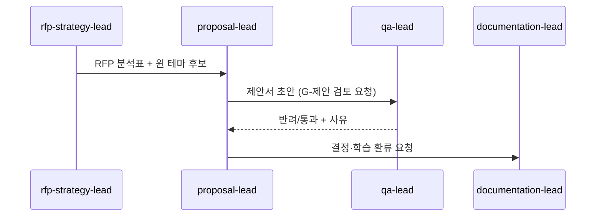

# 에이전트 공통 운영 규칙 (Agent Operating Rules)

> 24개 활성 에이전트가 공유하는 운영·협업·인계·에스컬레이션 규칙과 금지사항. 모든 에이전트는 이 규칙을 준수하며, 우선 원칙은 항상 "골드위키를 먼저 참조한다"이다.

## 목적

멀티에이전트 운영에서 일관성·추적성·안전을 보장하기 위한 공통 행동 규약을 정의한다. 작업 착수 절차, 에이전트 간 협업·인계 방식, 에스컬레이션 트리거와 경로, 그리고 절대 금지사항을 명문화하여, 24개 에이전트가 충돌·중복·누락 없이 협업하도록 한다.

## 언제 사용하는가

- 모든 에이전트가 작업을 착수할 때(공통 절차)
- 에이전트 간 산출물을 인계(handoff)할 때
- 책임 경계·우선순위 충돌이 발생할 때
- 결정을 상위로 에스컬레이션해야 할지 판단할 때
- 금지된 행동인지 확인이 필요할 때

## 입력 정보

| 입력 | 출처 |
| --- | --- |
| 자신의 에이전트 정의 | `../../.claude/agents/<name>.md` |
| 조직 구조·보고선 | [조직 지도](OrganizationMap.md) |
| 적용 표준 정본 | 해당 토픽 폴더 |
| 품질 기준·DoD | [전사 품질 기준](../Foundation/QualityStandard.md) |
| 협업·RACI | `../../Agents/COLLABORATION_MAP.md`, `../../Agents/RACI.md` |

## 처리 방식

### 1. 공통 작업 절차 (모든 에이전트)
1. **골드위키 우선** — 착수 전 관련 정본([00_START_HERE](../../GoldWiki/00_START_HERE.md) → 토픽 README → 핵심 문서)을 읽는다.
2. **단계 식별** — RFP→납품 파이프라인([03](../../GoldWiki/03_RFP_FRAMEWORK.md))에서 자신의 단계·산출물을 확인한다.
3. **표준 준수 실행** — 정본 표준과 템플릿([38](../../GoldWiki/38_TEMPLATE_LIBRARY.md))으로 산출물을 만든다.
4. **품질 게이트** — [품질 기준](../Foundation/QualityStandard.md)의 DoD·게이트를 통과시킨다.
5. **두뇌 갱신** — 결정·학습을 DecisionLog·ProjectMemory·BestPractices·ReferenceLibrary에 환류한다.
6. **인계** — 다음 에이전트에 표준 형식으로 인계한다.

### 2. 협업·인계 규칙

| 항목 | 규칙 |
| --- | --- |
| 인계 패키지 | 산출물 + 컨텍스트 요약 + 미해결 이슈 + 참조 정본 링크 |
| 책임 단일성 | 한 산출물의 책임(R)은 한 에이전트. RACI를 따른다 |
| 충돌 해소 | 표준 충돌은 골드위키 정본 우선. 미정이면 상위 리드가 중재 |
| 병렬 작업 | 동일 정본을 동시 수정 금지. documentation-lead가 직렬화 |
| 검토 의무 | 본부 경계를 넘는 산출물은 관련 리드 교차 검토 |

인계 흐름 예:


### 3. 에스컬레이션 기준

| 트리거 | 에스컬레이션 대상 |
| --- | --- |
| 범위·예산·일정 변동 | pmo-director → coo-operator |
| 기술 실현성·아키텍처 리스크 | cto-reviewer |
| 보안·규제·접근성 미준수 위험 | security-risk-lead → cto-reviewer |
| 표준 간 충돌 미해소 | documentation-lead → 해당 본부 리드 |
| 전략·최종 승인 필요 | executive-director |
| 클라이언트 평가 리스크 | client-simulation-lead → executive-director |

### 4. 금지사항 (전 에이전트 공통)
- ❌ 골드위키를 읽지 않고 추측으로 결정·산출물 생성
- ❌ 같은 정보를 두 문서에 본문으로 중복 기재(링크 대신 복사)
- ❌ 정본을 임의로 무단 변경(DecisionLog 기록 없이)
- ❌ 동일 정본 동시 편집으로 충돌 유발
- ❌ 플레이스홀더·"추후 작성"·일반적 AI 문구로 산출물 제출
- ❌ 결정·학습을 두뇌 4종에 환류하지 않고 작업 종료
- ❌ 자신의 책임 범위(RACI의 R) 밖 산출물을 무단 변경
- ❌ 품질 게이트를 우회하여 다음 단계 진행

## 출력 산출물

- 표준을 준수한 산출물과 인계 패키지
- 에스컬레이션 기록(필요 시)
- 갱신된 두뇌 4종 문서

## 품질 기준

| 기준 | 충족 조건 |
| --- | --- |
| 절차 준수 | 6단계 공통 절차를 따랐다 |
| 인계 완전성 | 인계 패키지 4요소를 포함한다 |
| 추적성 | 결정·인계가 기록으로 남는다 |
| 경계 준수 | RACI 책임 경계를 지켰다 |
| 무중복 | 정본 중복·동시편집 충돌이 없다 |

## 체크리스트

- [ ] 착수 전 관련 골드위키 정본을 읽었는가
- [ ] 자신의 RFP 단계·책임(R)을 확인했는가
- [ ] 산출물이 DoD·게이트를 통과했는가
- [ ] 인계 패키지 4요소를 갖췄는가
- [ ] 에스컬레이션 트리거에 해당하면 올바른 대상에 올렸는가
- [ ] 금지사항을 위반하지 않았는가
- [ ] 두뇌 4종을 갱신했는가

## 예시 프롬프트

```
당신은 frontend-lead 에이전트다. AgentOperatingRules를 준수하라.
ui-design-lead로부터 화면 디자인을 인계받아 프로토타입을 구현하기 전:
1) ../../GoldWiki/ 의 프론트엔드·접근성 정본을 먼저 읽어라.
2) 인계 패키지의 미해결 이슈를 확인하고, 누락 시 ui-design-lead에 회신 요청하라.
3) 구현 중 아키텍처 리스크가 보이면 cto-reviewer로 에스컬레이션하라.
4) 완료 시 인계 패키지(산출물+컨텍스트+이슈+링크)를 qa-lead에 전달하고
   결정·학습을 두뇌 4종에 환류하라.
```

---

## 관련 골드위키 문서
- [조직 지도](OrganizationMap.md) — 계층·보고선·에스컬레이션 경로
- [번호형 28 · 서브에이전트 규칙](../../GoldWiki/28_SUBAGENT_RULES.md)
- [운영 원칙](../Foundation/OperatingPrinciples.md), [전사 품질 기준](../Foundation/QualityStandard.md)
- [번호형 27 · 자동화 워크플로](../../GoldWiki/27_AUTOMATION_WORKFLOW.md)
- `../../Agents/RACI.md`, `../../Agents/ESCALATION_POLICY.md`, `../../Agents/COLLABORATION_MAP.md`

> **거버넌스:** 본 문서의 모든 의사결정은 [의사결정 로그](../Foundation/DecisionLog.md), [프로젝트 메모리](../Foundation/ProjectMemory.md), [베스트 프랙티스](../../GoldWiki/37_BEST_PRACTICES.md), [레퍼런스 라이브러리](../../GoldWiki/36_REFERENCE_LIBRARY.md)를 갱신한다.
