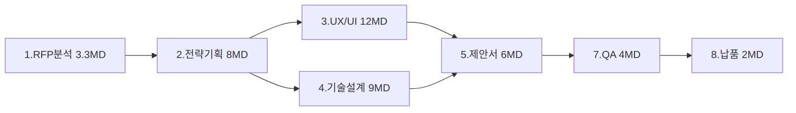

# WBS 작성 가이드 (Work Breakdown Structure Guide)

## 목적

ClubSchool AI OS 프로젝트의 **작업분해구조(WBS)** 를 일관된 원칙으로 작성하기 위한 정본 가이드다. RFP 분석부터 최종 납품까지 전 과업을 누락 없이 분해하고, 공수·의존성·일정을 현실적으로 산정해 `pmo-director`가 일정·리스크·자원을 통제할 수 있게 한다. 본 가이드는 GoldWiki SSOT의 일정 관리 기준이며, WBS 산출물은 [WBS 템플릿](../../Templates/WBS.md)으로 작성하고 [품질 검증 6단계](../QA/QualityReviewChecklist.md)로 검증한다.

> 모든 에이전트는 WBS 작성 전 GoldWiki를 먼저 참조한다. 일정·범위 변경은 [../DecisionLog/](../DecisionLog/)에 기록하고 [../35_PROJECT_MEMORY.md](../35_PROJECT_MEMORY.md)에 누적한다.

## 언제 사용하는가

- 프로젝트 착수 시 전체 과업을 분해해 기준선(baseline) 일정을 수립할 때.
- 제안서에 수행 일정·투입 계획·마일스톤을 제시할 때.
- 범위 변경(change request) 발생 시 영향 범위·재일정을 산정할 때.
- 단계 종료 게이트에서 진척·잔여 작업을 점검할 때.

## 입력 정보

| 입력 | 출처 | 비고 |
| --- | --- | --- |
| 과업 범위·요구사항 | [../RFP/](../RFP/), 요구사항 추적표 | 누락 분해 방지 기준 |
| 산출물 정의 | [../Delivery/FinalDeliveryChecklist.md](../Delivery/FinalDeliveryChecklist.md) | 산출물 기반 분해 |
| 가용 인력·역할 | [../Organization/](../Organization/), [../../Agents/](../../Agents/) | 공수 배정 근거 |
| 표준 단계 모델 | [../27_AUTOMATION_WORKFLOW.md](../27_AUTOMATION_WORKFLOW.md) | RFP→납품 단계 |
| 과거 공수 실적 | [../35_PROJECT_MEMORY.md](../35_PROJECT_MEMORY.md) | 산정 보정 |

## 처리 방식

### 1. 분해 원칙

- **산출물 지향(Deliverable-oriented):** 작업이 아닌 "완성된 산출물" 단위로 분해한다(예: "UX 리서치 보고서" → 산출물).
- **100% 규칙:** 상위 작업은 하위 작업의 합과 정확히 일치한다. 누락·중복 금지.
- **상호 배타(MECE):** 하위 작업 간 범위가 겹치지 않는다.
- **8/80 규칙:** 최하위 작업패키지(Work Package)는 8시간~80시간(1~10일) 분량으로 분해한다. 너무 크면 분해, 너무 작으면 통합.
- **단일 책임:** 작업패키지마다 단일 담당(owner)을 지정한다.
- **검증 가능:** 각 작업패키지는 완료정의(DoD)와 산출물로 완료를 판정할 수 있어야 한다.

### 2. 분해 레벨과 코드 체계

| 레벨 | 명칭 | 예시 | WBS 코드 |
| --- | --- | --- | --- |
| L1 | 단계(Phase) | RFP 분석 | 1 |
| L2 | 산출물군(Deliverable) | 요구사항 분석 보고서 | 1.2 |
| L3 | 작업패키지(Work Package) | 요구사항 추적표 작성 | 1.2.3 |
| L4 | 활동(Activity, 필요 시) | 기능요구 추출 | 1.2.3.1 |

WBS 코드는 점 표기(dot notation)로 부여해 상하위 관계를 명확히 한다.

### 3. 표준 단계(L1) 모델

ClubSchool AI OS의 RFP→납품 표준 단계를 기본 골격으로 사용한다.

| L1 | 단계 | 주요 산출물 | 담당 리드 |
| --- | --- | --- | --- |
| 1 | RFP 분석 | RFP 분석 보고서, 요구사항 추적표 | `rfp-strategy-lead` |
| 2 | 전략·기획 | 제안 전략, 비즈니스 분석 | `proposal-lead`, `business-analysis-lead` |
| 3 | UX/UI 설계 | IA, 플로우, 화면 설계, 디자인 시스템 | `ux-research-lead`, `ui-design-lead` |
| 4 | 기술 설계 | 아키텍처, API/DB 설계 | `cto-reviewer`, `backend-lead` |
| 5 | 제안서 작성 | 제안서, 경영 요약 | `proposal-lead` |
| 6 | 구현·개발 | 프론트/백엔드/AI 구현 | `frontend-lead`, `backend-lead` |
| 7 | QA·검증 | 품질 검증 보고서, 테스트 결과 | `qa-lead` |
| 8 | 납품·인수 | 최종 납품물, 인수확인서 | `pmo-director` |

### 4. 공수 산정

- **산정 기법:** 3점 산정(낙관 O / 최빈 M / 비관 P)을 기본으로 하고, 기대공수 E = (O + 4M + P) / 6 로 계산한다.
- **근거 명시:** 모든 공수에 산정 근거(유사 실적·전문가 판단·하향식 배분)를 기록한다.
- **버퍼:** 작업패키지 단위 버퍼 대신 단계·프로젝트 수준 통합 버퍼(15~20%)를 둔다.
- **단위:** 인일(man-day, MD)을 기본 단위로 한다.

공수 산정 예시:

| 작업패키지 | O(MD) | M(MD) | P(MD) | 기대공수 E |
| --- | --- | --- | --- | --- |
| 요구사항 추적표 작성 | 2 | 3 | 6 | 3.3 |
| IA 설계 | 4 | 6 | 11 | 6.5 |
| API 명세 작성 | 3 | 5 | 9 | 5.3 |

### 5. 의존성과 임계경로

- **의존 유형:** FS(완료-시작), SS(시작-시작), FF(완료-완료), SF(시작-완료). 기본은 FS.
- **임계경로(critical path):** 총 소요가 가장 긴 의존 경로를 식별하고, 해당 작업의 지연이 전체 일정을 지연시킴을 명시한다.
- **선행/병행:** 병행 가능 작업을 식별해 일정을 단축한다.



### 6. 일정화

- 기대공수·가용 인력·캘린더(휴일·병행도)를 반영해 시작·종료일을 산정한다.
- 마일스톤(M)과 품질 게이트(G)를 일정에 명시한다.
- 자원 평준화(resource leveling)로 과부하 인력을 조정한다.

### 7. WBS 예시 표

| WBS 코드 | 작업명 | 산출물 | 담당 | 기대공수(MD) | 선행 | 일정 |
| --- | --- | --- | --- | --- | --- | --- |
| 1 | RFP 분석 | RFP 분석 보고서 | rfp-strategy-lead | 3.3 | - | D1~D3 |
| 1.1 | 요구사항 추출 | 요구사항 목록 | rfp-strategy-lead | 1.5 | - | D1 |
| 1.2 | 요구사항 추적표 | 추적표 | rfp-strategy-lead | 1.8 | 1.1 | D2~D3 |
| 2 | 전략·기획 | 제안 전략서 | proposal-lead | 8.0 | 1 | D4~D8 |
| 3 | UX/UI 설계 | IA·화면 설계 | ux-research-lead | 12.0 | 2 | D9~D20 |
| 4 | 기술 설계 | 아키텍처 문서 | backend-lead | 9.0 | 2 | D9~D17 |
| 5 | 제안서 작성 | 제안서 | proposal-lead | 6.0 | 3,4 | D21~D26 |
| 7 | QA·검증 | 품질 검증 보고서 | qa-lead | 4.0 | 5 | D27~D29 |
| 8 | 납품·인수 | 최종 납품물 | pmo-director | 2.0 | 7 | D30 |

## 출력 산출물

- **WBS 표**: WBS 코드·작업·산출물·담당·공수·의존성·일정 ([../../Templates/WBS.md](../../Templates/WBS.md) 형식).
- **임계경로 다이어그램**: 의존 관계·임계경로 시각화.
- **마일스톤·게이트 일정**: 주요 시점과 품질 게이트.
- **자원 투입 계획**: 역할별 공수 배분표.

## 품질 기준

- 100% 규칙·MECE를 준수해 누락·중복이 없다.
- 모든 작업패키지가 8/80 규칙을 만족하고 단일 담당·DoD를 갖는다.
- 모든 공수에 산정 근거가 있다.
- 임계경로가 식별되고 버퍼가 명시되었다.
- WBS가 요구사항 추적표·산출물 정의와 정합한다.

## 체크리스트

- [ ] 산출물 지향으로 분해했다.
- [ ] 100% 규칙·MECE를 검증했다.
- [ ] 작업패키지가 8/80 범위 안에 있다.
- [ ] 공수를 3점 산정하고 근거를 기록했다.
- [ ] 의존성·임계경로를 식별했다.
- [ ] 마일스톤·게이트·버퍼를 일정에 반영했다.
- [ ] [품질 검증 6단계](../QA/QualityReviewChecklist.md)로 현실성을 검증했다.

## 예시 프롬프트

```text
당신은 pmo-director다. GoldWiki/PMO/WBSGuide.md 원칙에 따라 아래 프로젝트의 WBS를 작성하라.

입력: 과업 범위(요구사항 추적표), 가용 인력(역할·인원), 납기 D-30
요구:
1) L1~L3 분해(산출물 지향, 100% 규칙, 8/80 준수)
2) WBS 코드 부여, 작업패키지별 담당·DoD 지정
3) 3점 산정으로 공수 계산(근거 포함)
4) 의존성·임계경로 식별, 마일스톤·게이트·버퍼 반영
5) WBS 표와 임계경로 mermaid 다이어그램 출력

산출물은 Templates/WBS.md 형식을 따르고 모두 한국어로 작성한다.
```
