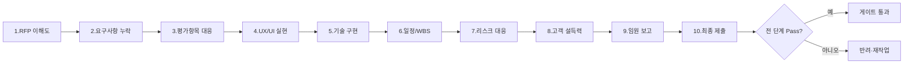

# 품질 검증 체크리스트 (Quality Review Checklist)

## 목적

ClubSchool AI OS의 모든 산출물이 클라이언트 제출·임원 보고·최종 납품 전에 통과해야 하는 **10단계 품질 검증 체계**를 정의한다. 본 문서는 GoldWiki SSOT의 품질 게이트 정본으로서, 모든 산출 에이전트가 자기 산출물을 자가 검증하고 `qa-lead`가 교차 검증하는 단일 기준을 제공한다. 마스터 품질 체크리스트([../29_QUALITY_CHECKLIST.md](../29_QUALITY_CHECKLIST.md))를 RFP→납품 전 과정에 맞춰 단계화·심화한 실행 도구다.

> 모든 에이전트는 검증 전 GoldWiki를 먼저 참조한다. 본 체크리스트의 판정 결과·반복 결함은 [../DecisionLog/](../DecisionLog/)와 [../39_COMMON_ERRORS.md](../39_COMMON_ERRORS.md)에 누적해 조직 학습으로 환원한다.

## 언제 사용하는가

- 제안서·RFP 분석·UX/UI 산출물·기술 설계·WBS 등 모든 주요 산출물의 **게이트 통과 직전**.
- `qa-lead`가 다른 에이전트의 산출물을 교차 검증할 때.
- `executive-director`의 최종 승인 직전, `pmo-director`의 단계 종료 판정 시.
- 클라이언트 제출본·임원 보고본·최종 납품본 확정 전 (3중 게이트).

## 입력 정보

| 입력 | 출처 | 비고 |
| --- | --- | --- |
| 검증 대상 산출물 | 각 산출 에이전트 | 버전·작성자 명시 필수 |
| 원본 RFP / 과업지시서 | [../RFP/](../RFP/) | 요구사항 추적표 포함 |
| 평가기준·배점표 | [../03_RFP_FRAMEWORK.md](../03_RFP_FRAMEWORK.md) | 정량/정성 배점 |
| 제안 전략·win theme | [../05_PROPOSAL_STRATEGY.md](../05_PROPOSAL_STRATEGY.md) | |
| 베스트프랙티스 근거 | [../37_BEST_PRACTICES.md](../37_BEST_PRACTICES.md), [../36_REFERENCE_LIBRARY.md](../36_REFERENCE_LIBRARY.md) | |
| 이전 결함 이력 | [../39_COMMON_ERRORS.md](../39_COMMON_ERRORS.md), [../35_PROJECT_MEMORY.md](../35_PROJECT_MEMORY.md) | 재발 방지 |

## 처리 방식

검증은 아래 **10단계**를 순차로 수행한다. 각 단계는 독립 게이트이며, 한 단계라도 **불합격(Fail)** 이면 산출물은 반려된다. 단계별 판정은 합격(Pass) / 조건부 합격(Conditional) / 불합격(Fail) 3등급으로 기록한다.



**판정 등급 공통 정의**

| 등급 | 기준 | 후속 조치 |
| --- | --- | --- |
| Pass | 해당 단계 체크 항목 100% 충족 | 다음 단계 진행 |
| Conditional | 경미 결함 1~2건, 치명 결함 없음 | 보완 후 재확인, 게이트 통과 보류 |
| Fail | 치명 결함 1건 이상 또는 체크 80% 미만 | 즉시 반려, 재작업 |

### 1. RFP 이해도 검증

발주처의 명시적 요구와 사업 배경·목적을 정확히 이해했는지 검증한다.

- [ ] 사업 목적·배경·기대효과를 한 문단으로 요약할 수 있다.
- [ ] 발주처의 조직·산업 맥락([../Industry/](../Industry/), [../34_CLIENT_KNOWLEDGE.md](../34_CLIENT_KNOWLEDGE.md))이 반영되었다.
- [ ] 과업 범위(In/Out of scope)가 명확히 구분되었다.
- [ ] 숨은 기대(미명시 동기·정치적 맥락)가 식별되었다.
- [ ] 모호·상충 조항이 가정(assumption)으로 문서화되었다.

**판정 기준:** 사업 목적·범위·숨은 기대 3요소 모두 문서화 시 Pass. 숨은 기대 미식별 시 Conditional, 사업 목적 오해 시 Fail.

### 2. 요구사항 누락 검증

RFP의 모든 요구사항이 산출물에 추적·반영되었는지 검증한다.

- [ ] 요구사항 추적표(traceability matrix)가 존재하고 100% 매핑된다.
- [ ] 기능/비기능 요구사항이 각각 누락 없이 대응된다.
- [ ] 의무(must)·선택(should)·우대(nice) 요구가 구분 표기되었다.
- [ ] 미대응 항목에 대해 사유·대안이 명시되었다.

**판정 기준:** 의무 요구 누락 0건이면 Pass. 선택 요구 누락 시 Conditional, 의무 요구 누락 시 Fail.

### 3. 평가항목 대응 검증

평가기준·배점에 산출물이 전략적으로 대응하는지 검증한다.

- [ ] 평가표의 모든 항목·배점에 대응 콘텐츠가 매핑되었다.
- [ ] 고배점 항목에 콘텐츠·근거가 집중 배치되었다.
- [ ] 정량 평가(가격·실적·인력)와 정성 평가(전략·창의)가 모두 커버된다.
- [ ] win theme이 평가위원 관점에서 명료하게 드러난다.

**판정 기준:** 전 평가항목 대응 + 고배점 집중 시 Pass. 고배점 항목 근거 부족 시 Conditional, 평가항목 미대응 시 Fail.

### 4. UX/UI 실현 가능성 검증

제안한 UX/UI가 사용자·범위·기술 제약 내에서 실현 가능한지 검증한다.

- [ ] IA·플로우가 사용자 멘탈 모델과 일치한다([../UX/](../UX/), [../07_UX_PRINCIPLES.md](../07_UX_PRINCIPLES.md)).
- [ ] 화면 목록·디자인이 과업 범위·기간 내 구현 가능하다.
- [ ] 접근성 기준(WCAG 2.1 AA)이 반영되었다([../16_ACCESSIBILITY.md](../16_ACCESSIBILITY.md)).
- [ ] 디자인 시스템·토큰과 일관된다([../DesignSystem/](../DesignSystem/)).

**판정 기준:** 범위 내 구현 가능 + 접근성 반영 시 Pass. 접근성 누락 시 Conditional, 범위 초과 설계 시 Fail.

### 5. 기술 구현 가능성 검증

아키텍처·기술 스택·통합 방안이 구현 가능하고 안전한지 검증한다.

- [ ] 아키텍처가 비기능 요구(성능·보안·확장성)를 충족한다([../Backend/](../Backend/), [../21_BACKEND_GUIDE.md](../21_BACKEND_GUIDE.md)).
- [ ] API·데이터 모델 표준을 준수한다([../22_API_STANDARD.md](../22_API_STANDARD.md), [../23_DATABASE_GUIDE.md](../23_DATABASE_GUIDE.md)).
- [ ] 보안·개인정보 요건(OWASP 등)이 반영되었다([../24_SECURITY_GUIDE.md](../24_SECURITY_GUIDE.md)).
- [ ] 외부 연동·레거시 마이그레이션 리스크가 평가되었다.

**판정 기준:** 비기능 충족 + 보안 반영 시 Pass. 통합 리스크 미평가 시 Conditional, 구현 불가 설계 시 Fail.

### 6. 일정/WBS 현실성 검증

WBS·일정·공수가 현실적이고 내적 일관성을 갖는지 검증한다.

- [ ] WBS가 [../PMO/WBSGuide.md](../PMO/WBSGuide.md) 분해 원칙을 준수한다.
- [ ] 공수 산정 근거가 명시되고 가용 인력과 일치한다.
- [ ] 의존성·임계경로(critical path)가 식별되었다.
- [ ] 버퍼·마일스톤·게이트가 일정에 반영되었다.

**판정 기준:** 임계경로 식별 + 공수 근거 명시 시 Pass. 버퍼 부재 시 Conditional, 일정-범위 불일치 시 Fail.

### 7. 리스크 대응 검증

주요 리스크가 식별·평가·대응되었는지 검증한다.

- [ ] 리스크 등록부(발생가능성×영향도)가 존재한다.
- [ ] 상위 리스크별 완화·우발 계획(mitigation/contingency)이 있다.
- [ ] 리스크 소유자(owner)와 트리거가 지정되었다.
- [ ] 보안·법규·일정 리스크가 별도 점검되었다([../24_SECURITY_GUIDE.md](../24_SECURITY_GUIDE.md)).

**판정 기준:** 상위 리스크 대응계획 + 소유자 지정 시 Pass. 트리거 미정의 시 Conditional, 치명 리스크 누락 시 Fail.

### 8. 고객 설득력 검증

산출물이 고객·평가위원을 설득할 수 있는 서사·근거를 갖는지 검증한다.

- [ ] 스토리라인이 고객 문제→해결→가치 순으로 논리적이다.
- [ ] 차별화 포인트가 경쟁사 대비 구체적으로 입증된다.
- [ ] 정량 효과(ROI·KPI)가 근거와 함께 제시되었다.
- [ ] `client-simulation-lead` 모의 평가를 통과했다.

**판정 기준:** 스토리라인 일관 + 차별화 입증 시 Pass. 정량 효과 근거 부족 시 Conditional, 설득 서사 부재 시 Fail.

### 9. 임원 보고 적합성 검증

임원·의사결정자에게 보고 가능한 압축성·명료성을 갖는지 검증한다.

- [ ] 경영 요약이 1~2페이지로 핵심을 압축한다([../../Templates/Executive_Summary.md](../../Templates/Executive_Summary.md)).
- [ ] 의사결정 요청 사항·옵션·권고가 명확하다.
- [ ] 리스크·비용·기대효과가 한눈에 보인다(표/차트).
- [ ] 전문용어가 임원 눈높이로 풀이되었다.

**판정 기준:** 요약 1~2p + 의사결정 포인트 명확 시 Pass. 권고 모호 시 Conditional, 핵심 누락 시 Fail.

### 10. 최종 제출 적합성 검증

제출 형식·완결성·법적/행정 요건을 최종 확인한다.

- [ ] 제출 형식·분량·파일 규격이 RFP 지침과 일치한다.
- [ ] 목차·페이지·서식·로고 등 행정 요건이 충족된다.
- [ ] 오탈자·수치 오류·링크 깨짐이 없다(전수 교정).
- [ ] [../Delivery/FinalDeliveryChecklist.md](../Delivery/FinalDeliveryChecklist.md) 납품 게이트와 정합한다.
- [ ] 모든 내용이 자연스러운 한국어로 작성되었다.

**판정 기준:** 형식·완결성·교정 모두 충족 시 Pass. 경미 오탈자 시 Conditional, 형식 위반·핵심 누락 시 Fail.

## 출력 산출물

- **품질 검증 보고서**: 10단계별 판정 등급·결함 목록·보완 요구사항.
- **게이트 판정서**: 통과/반려 결정 및 사유.
- **결함 등록 항목**: 반복 결함을 [../39_COMMON_ERRORS.md](../39_COMMON_ERRORS.md)에 누적.
- **DecisionLog 항목**: 중대 판정·예외 승인을 [../DecisionLog/](../DecisionLog/)에 기록.

## 품질 기준

- 10단계 전 단계가 Pass여야 게이트 통과(Conditional은 보완 후 재검).
- 모든 판정에 근거·증빙이 첨부된다(주관 판정 금지).
- 검증자는 산출 작성자와 분리된다(자가 검증 후 `qa-lead` 교차 검증).
- 판정 결과는 추적 가능하게 버전·일시·검증자와 함께 기록된다.

## 체크리스트

- [ ] 10단계 검증을 모두 수행했다.
- [ ] 각 단계 판정 등급(Pass/Conditional/Fail)을 기록했다.
- [ ] Fail·Conditional 항목의 보완 요구를 명시했다.
- [ ] 반복 결함을 공통 오류 문서에 누적했다.
- [ ] 게이트 판정서를 작성하고 승인 라인에 인계했다.

## 예시 프롬프트

```text
당신은 qa-lead다. GoldWiki/QA/QualityReviewChecklist.md의 10단계 품질 검증 체계로
아래 제안서 초안을 교차 검증하라.

대상: {제안서 v0.3}
참조: 원본 RFP, 평가배점표, 제안 전략(05), 베스트프랙티스(37)

각 단계(1~10)별로 다음을 출력하라:
- 판정 등급(Pass/Conditional/Fail)
- 충족/미충족 체크 항목
- 결함과 보완 요구사항(우선순위 포함)

마지막에 게이트 통과 여부와 사유, DecisionLog에 기록할 항목을 요약하라.
모든 출력은 한국어로 작성한다.
```
