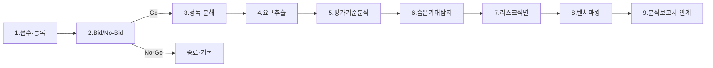

# RFP 분석 프레임워크

> 이 문서는 ClubSchool AI OS의 RFP 대응 21단계 파이프라인 중 **1~9단계(접수~제안 전략 인계)**를 표준화한다. 모든 에이전트는 RFP 작업 전 본 프레임워크와 [GoldWiki SSOT](../00_START_HERE.md)를 먼저 참조한다.

| 항목 | 내용 |
| --- | --- |
| **담당(Owner) 에이전트** | rfp-strategy-lead |
| **협업 에이전트** | business-analysis-lead, proposal-lead, industry-research-lead, pmo-director, cto-reviewer |
| **정본 상위 문서** | [03 RFP 대응 프레임워크](../03_RFP_FRAMEWORK.md), [04 RFP 심층 분석](../04_RFP_ANALYSIS.md) |
| **연계 토픽** | [RequirementExtraction](RequirementExtraction.md), [EvaluationCriteriaAnalysis](EvaluationCriteriaAnalysis.md), [Proposal 전략](../Proposal/ProposalStrategy.md) |
| **최종 수정** | 2026-06-26 |

---

## 목적

RFP(제안요청서)를 접수한 순간부터 윈 전략과 비즈니스 분석으로 인계하기까지의 절차를 단계화·게이트화하여, **누락 없이·추적 가능하게·점수를 만드는 방향으로** RFP를 분해한다. 본 프레임워크는 21단계 파이프라인([27 자동화 워크플로우](../27_AUTOMATION_WORKFLOW.md))의 전반부(1~9단계)를 책임진다.

---

## 언제 사용하는가

- 신규 RFP·제안요청서·사업계획서·기획요청을 접수했을 때
- 입찰 참여 여부(Bid/No-Bid)를 의사결정해야 할 때
- 요구사항·평가기준·제약을 구조화하여 제안 전략의 입력을 만들 때
- 기존 분석을 재검토(레드팀)하여 누락·상충을 찾을 때

---

## 입력 정보

| 입력 | 출처 | 비고 |
| --- | --- | --- |
| RFP 원문(본문·붙임·과업지시서) | 발주처 | PDF/HWP/문서 |
| 사전규격·질의응답·정정공고 | 조달 공고 | 변경 추적 필수 |
| 발주처 배경·정책 동인 | [01 회사 컨텍스트](../01_COMPANY_CONTEXT.md), [Industry](../Industry/) | 숨은 기대 해석용 |
| 과거 유사 사업·레퍼런스 | [36 레퍼런스 라이브러리](../36_REFERENCE_LIBRARY.md) | 벤치마킹 |
| 자사 역량·자산 현황 | [Company](../Company/), [38 템플릿 라이브러리](../38_TEMPLATE_LIBRARY.md) | 강점 매핑 |

---

## 처리 방식 — 1~9단계



### 단계별 상세

| 단계 | 명칭 | 핵심 활동 | 산출물 | 담당 |
| --- | --- | --- | --- | --- |
| 1 | 접수·등록 | RFP를 SSOT에 등록, 추적 ID 부여, 마감·예산·배점 메타 기록 | RFP 등록 카드 | rfp-strategy-lead |
| 2 | Bid/No-Bid 판단 | 적합도·승산·수익성·리스크 4축 채점, 게이트 G1 | Bid/No-Bid 결정서 | executive-director |
| 3 | 정독·분해 | 문단 번호 부여(R-001…), 요구/평가/제약/의도 4렌즈 태깅 | 태깅된 RFP | rfp-strategy-lead |
| 4 | 요구사항 추출 | 기능·비기능·제약·컴플라이언스 추출, 추적 ID | 요구사항 매트릭스 | business-analysis-lead |
| 5 | 평가기준 분석 | 배점표↔요구 매핑, 점수 기여도 산정 | 평가-요구 매핑표 | rfp-strategy-lead |
| 6 | 숨은 기대 탐지 | 반복 키워드·정책 동인·실패 언급 신호 해석 | 인텐트 노트 | industry-research-lead |
| 7 | 리스크 식별 | 기술·일정·규제·보안 리스크 레지스터화 | 리스크 레지스터 | pmo-director, security-risk-lead |
| 8 | 경쟁·벤치마킹 | 경쟁사 식별, 포지셔닝 2×2, 베스트프랙티스 수집 | 경쟁 분석 노트 | proposal-lead |
| 9 | 분석 보고서·인계 | 통합 RFP 분석 보고서 작성, 게이트 G2, 전략 인계 | RFP 분석 보고서 | rfp-strategy-lead |

### 4렌즈 동시 독해

| 렌즈 | 핵심 질문 | 산출 |
| --- | --- | --- |
| 요구(Requirements) | 무엇을 만들어야 하는가 | 기능/비기능 목록 |
| 평가(Evaluation) | 어떻게 채점되는가 | 배점-요구 매핑 |
| 제약(Constraints) | 예산·기간·기술·규정 한계는 | 제약 목록 |
| 의도(Intent) | 발주처가 진짜 원하는 성과는 | 숨은 기대·동인 |

---

## 출력 산출물

1. **RFP 등록 카드** — 사업명, 발주처, 예산, 기간, 마감, 기술/가격 배점, 추적 ID.
2. **Bid/No-Bid 결정서** — 4축 점수, 결정, 근거([32 의사결정 로그](../32_DECISION_LOG.md) 기록).
3. **요구사항 매트릭스** — [RequirementExtraction](RequirementExtraction.md) 템플릿 적용.
4. **평가-요구 매핑표** — [EvaluationCriteriaAnalysis](EvaluationCriteriaAnalysis.md) 적용.
5. **리스크 레지스터** — 등급·대응·담당 포함.
6. **RFP 분석 보고서** — 위 산출물을 통합한 단일 문서, 제안 전략의 입력.

---

## 분류 체계

RFP는 다음 축으로 분류하여 대응 전략과 자원 배분을 결정한다.

| 분류 축 | 값 | 영향 |
| --- | --- | --- |
| 발주 유형 | 공공 / 민간 / 준정부 | 평가·계약 방식 상이 |
| 사업 성격 | 신규 구축 / 고도화 / 운영 / 컨설팅 | 방법론·공수 |
| 배점 구조 | 기술 우위(70:30) / 가격 우위(60:40 등) | 윈 전략 방향 |
| 규모 | 소(<3억) / 중(3~10억) / 대(>10억) | 조직·게이트 강도 |
| 난이도 | 표준 / 복합 / 고난도 | 리스크 버퍼 |

---

## 품질 기준 / 게이트

| 게이트 | 위치 | 통과 조건 |
| --- | --- | --- |
| **G1 — Bid/No-Bid** | 2단계 후 | 4축 적합도 평균 60% 이상, 승산·수익성 양호 |
| **G2 — 분석 완결성** | 9단계 후 | 요구 추적성 100%, 컴플라이언스 항목 누락 0, 자체 채점 80% 이상 |

- 모든 강제 표현("필수/하여야 한다/shall/must")은 컴플라이언스 항목으로 승격되었는가
- 모든 요구가 추적 ID로 평가 배점에 연결되었는가
- 모호·상충 항목이 Q&A 후보로 분류되었는가
- 고위험(High) 리스크가 [32 의사결정 로그](../32_DECISION_LOG.md)에 기록되었는가

---

## 체크리스트

- [ ] RFP 원문·붙임·정정공고를 모두 확보했다
- [ ] 추적 ID 체계(R-NNN)를 부여했다
- [ ] 4렌즈 태깅을 완료했다
- [ ] Bid/No-Bid 게이트(G1)를 통과·기록했다
- [ ] 요구사항 매트릭스를 [RequirementExtraction](RequirementExtraction.md) 형식으로 작성했다
- [ ] 평가-요구 매핑을 [EvaluationCriteriaAnalysis](EvaluationCriteriaAnalysis.md) 형식으로 작성했다
- [ ] 숨은 기대·리스크·경쟁 분석을 보고서에 포함했다
- [ ] G2 게이트를 통과하고 [Proposal 전략](../Proposal/ProposalStrategy.md)으로 인계했다

---

## 예시 프롬프트

```
당신은 rfp-strategy-lead 에이전트다. 첨부된 RFP를 본 프레임워크의 1~9단계로 분석하라.
1) RFP 등록 카드 작성(예산·기간·배점·마감)
2) Bid/No-Bid 4축 채점과 결정(G1)
3) 문단 번호 부여 후 요구/평가/제약/의도 4렌즈 태깅
4) 요구사항 매트릭스(RequirementExtraction 형식)
5) 평가-요구 매핑표(EvaluationCriteriaAnalysis 형식)
6) 숨은 기대·리스크 레지스터·경쟁 포지셔닝
7) G2 게이트 자체 채점과 통합 RFP 분석 보고서
모든 고위험 결정은 32_DECISION_LOG에 기록할 항목으로 명시하라.
```

---

## 관련 골드위키 문서
- [03 RFP 대응 프레임워크](../03_RFP_FRAMEWORK.md) — 정본 상위 프레임워크.
- [04 RFP 심층 분석](../04_RFP_ANALYSIS.md) — 분석 플레이북.
- [RequirementExtraction](RequirementExtraction.md) — 요구사항 추출 방법.
- [EvaluationCriteriaAnalysis](EvaluationCriteriaAnalysis.md) — 평가기준 분석.
- [Proposal 전략](../Proposal/ProposalStrategy.md) — 9단계 인계 대상.
- [27 자동화 워크플로우](../27_AUTOMATION_WORKFLOW.md) — 21단계 파이프라인 정본.

> **거버넌스:** 본 문서에서 발생한 모든 의사결정은 [32 의사결정 로그](../32_DECISION_LOG.md), [35 프로젝트 메모리](../35_PROJECT_MEMORY.md), [37 베스트 프랙티스](../37_BEST_PRACTICES.md), [36 레퍼런스 라이브러리](../36_REFERENCE_LIBRARY.md)를 갱신한다.
