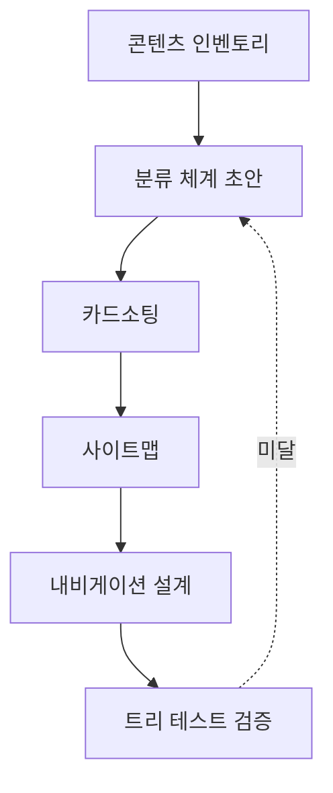

# 정보 구조(IA) 가이드 (Information Architecture Guide)

Goldwiki Digital(골드위키 디지털)의 정보 구조 설계 표준. **콘텐츠 인벤토리 → 분류 → 카드소팅 → 사이트맵/내비게이션**의 흐름을 정의하여, 사용자가 원하는 정보를 최소 비용으로 찾도록 한다.

> 이 가이드를 쓰는 에이전트는 [07_UX_PRINCIPLES](../07_UX_PRINCIPLES.md)와 [11_INFORMATION_ARCHITECTURE](../11_INFORMATION_ARCHITECTURE.md)를 먼저 참조한다. IA는 UX 전략([UXStrategyFramework](UXStrategyFramework.md))에서 도출된 멘탈 모델을 구조로 옮긴 결과다.

---

## 목적

- 콘텐츠/기능을 사용자 멘탈 모델에 맞게 조직화하는 표준 절차를 제공한다.
- 분류 체계(taxonomy)·라벨링·내비게이션·검색 전략을 일관되게 설계한다.
- IA 결과를 사이트맵·화면목록([../UI/UIGuidelines](../UI/UIGuidelines.md))·유저플로우([UserFlowGuide](UserFlowGuide.md))로 연결한다.

## 언제 사용하는가

| 시점 | 사용 목적 |
| --- | --- |
| 신규 서비스 설계 | 0→1 구조 정의 |
| 리뉴얼/통합 | 기존 인벤토리 정비, 중복 제거 |
| 검색·내비게이션 개선 | 라벨·계층 재설계 |
| 다국어/멀티브랜드 | 공통 분류 체계 정의 |

## 입력 정보

- UX 전략·페르소나·JTBD: [UXStrategyFramework](UXStrategyFramework.md)
- 기존 콘텐츠/페이지 목록, CMS 구조
- 검색 로그(검색어, 무결과율), 내비 클릭 데이터
- 비즈니스 우선순위: [02_BUSINESS_GOALS](../02_BUSINESS_GOALS.md)
- 업종 관례: [../Industry/README](../Industry/README.md)

## 처리 방식

### 1. 콘텐츠 인벤토리
모든 페이지/콘텐츠를 표로 수집·평가한다(ROT: Redundant/Outdated/Trivial 식별).

| ID | 제목 | URL | 유형 | 소유 | 상태(유지/병합/삭제) |
| --- | --- | --- | --- | --- | --- |
| C-001 | 요금 안내 | /pricing | 마케팅 | 영업 | 유지 |
| C-002 | 구 요금표 | /price-old | 마케팅 | 영업 | 삭제(ROT) |

### 2. 분류 (Taxonomy)
- 조직화 체계 선택: 주제별 / 작업별 / 사용자유형별 / 시간순
- 라벨링 원칙: 사용자 용어 우선, 내부 용어 금지, 일관 대소문자/조사

### 3. 카드소팅
- 개방형(사용자가 그룹명 생성) → 멘탈 모델 발견
- 폐쇄형(주어진 카테고리에 배치) → 검증
- 표본 15~30명 권장, 유사도 매트릭스로 군집 분석



### 4. 사이트맵 & 내비게이션
- 깊이 ≤ 3 권장(중요 콘텐츠는 클릭 3회 이내)
- 글로벌/로컬/유틸리티/푸터 내비 역할 분리
- 트리 테스트로 탐색 성공률 검증(목표 ≥ 80%)

#### 사이트맵 예시
```
Home
├─ 서비스 (작업별)
│  ├─ 컨설팅
│  └─ 구축
├─ 사례
│  ├─ 업종별
│  └─ 규모별
├─ 가격
└─ 회사
   ├─ 소개
   └─ 채용
```

## 출력 산출물

| 산출물 | 형식 |
| --- | --- |
| 콘텐츠 인벤토리 시트 | 표 |
| 분류 체계/라벨 사전 | 문서 |
| 카드소팅 분석 리포트 | 문서 + 유사도 매트릭스 |
| 사이트맵 | 다이어그램([Templates/IA_Sitemap](../../Templates/IA_Sitemap.md)) |
| 내비게이션 사양 | 표 |
| 트리 테스트 결과 | 리포트 |

## 품질 기준

- [ ] 라벨이 사용자 용어 기반이며 카드소팅으로 검증되었다.
- [ ] 중요 콘텐츠 도달 깊이가 3 이하다.
- [ ] 트리 테스트 탐색 성공률이 80% 이상이다.
- [ ] ROT 콘텐츠가 식별·처리되었다.
- [ ] 사이트맵이 유저플로우·화면목록과 정합한다.

## 체크리스트

- [ ] 인벤토리에 모든 페이지가 포함되었는가
- [ ] 분류 기준이 단일하고 일관적인가
- [ ] 카드소팅 표본이 충분한가
- [ ] 내비게이션 역할(글로벌/로컬/유틸)이 구분되는가
- [ ] 검색 전략(파셋·자동완성·무결과 처리)이 있는가
- [ ] 결과를 [11_INFORMATION_ARCHITECTURE](../11_INFORMATION_ARCHITECTURE.md)에 반영했는가

## 예시 프롬프트

```
역할: information-architecture-lead. GoldWiki/UX/InformationArchitectureGuide.md를 따른다.
입력: 기존 페이지 120개 목록, 검색 로그(무결과율 18%), 페르소나 3종.
작업: 콘텐츠 인벤토리(ROT 평가)→분류 체계→폐쇄형 카드소팅 설계→사이트맵(깊이≤3) 작성.
출력: 인벤토리 표, 라벨 사전, mermaid 사이트맵, 트리 테스트 시나리오.
```
