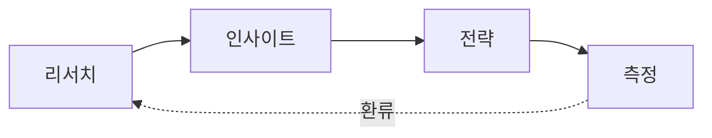

# UX 전략 프레임워크 (UX Strategy Framework)

Goldwiki Digital(골드위키 디지털)의 UX 전략 수립 표준. **리서치 → 인사이트 → 전략 → 측정**의 4단계 폐루프를 정의하여, 모든 프로젝트가 근거 기반으로 경험을 설계하고 효과를 검증하도록 한다.

> 이 문서를 사용하는 모든 에이전트는 산출 전에 [GoldWiki/00_START_HERE](../00_START_HERE.md)와 [07_UX_PRINCIPLES](../07_UX_PRINCIPLES.md)를 먼저 참조한다. UX 전략은 단일 진실 공급원(SSOT)에 정렬되어야 한다.

---

## 목적

- 프로젝트 비즈니스 목표를 사용자 경험 목표로 번역하는 표준 절차를 제공한다.
- 리서치 데이터에서 실행 가능한 인사이트와 설계 원칙을 도출하는 방법을 표준화한다.
- 경험 품질을 정량·정성 지표로 측정하고 다음 사이클에 환류하는 체계를 마련한다.
- RFP 분석([04_RFP_ANALYSIS](../04_RFP_ANALYSIS.md))과 제안 전략([05_PROPOSAL_STRATEGY](../05_PROPOSAL_STRATEGY.md))에 UX 근거를 공급한다.

## 언제 사용하는가

| 시점 | 사용 목적 |
| --- | --- |
| RFP 수령 직후 | 요구사항 이면의 사용자 니즈·기회를 정의하고 제안 차별화의 근거 마련 |
| 프로젝트 킥오프 | 경험 목표(Experience Goal)와 성공 지표(KPI/UX Metric) 합의 |
| 설계 착수 전 | 페르소나·핵심 시나리오·설계 원칙 확정 |
| 출시 후 | 측정 데이터로 가설 검증 및 개선 백로그 도출 |

## 입력 정보

- 비즈니스 목표·KPI: [02_BUSINESS_GOALS](../02_BUSINESS_GOALS.md)
- RFP 요구사항 및 숨은 기대: [04_RFP_ANALYSIS](../04_RFP_ANALYSIS.md)
- 업종 컨텍스트: [../Industry/README](../Industry/README.md)
- 기존 사용자 데이터: 인터뷰, 설문, 행동 로그(GA4 등), CS 문의, 리뷰
- 경쟁/벤치마크: [36_REFERENCE_LIBRARY](../36_REFERENCE_LIBRARY.md)
- 제약 조건: 일정, 예산, 기술 스택, 규제

## 처리 방식

### 1단계 · 리서치 (Discover)
- 리서치 질문 정의 → 방법 선택(정성/정량 혼합)
- 데스크 리서치 → 1차 데이터 수집(인터뷰 5~8명, 설문 n≥100 권장)
- 행동 데이터(퍼널, 이탈, 히트맵) 수집

| 방법 | 적합한 질문 | 산출 |
| --- | --- | --- |
| 심층 인터뷰 | "왜" 동기·맥락 | 인용문, 니즈 |
| 사용성 테스트 | "어디서" 막히는가 | 태스크 성공률, 마찰점 |
| 설문 | "얼마나" 보편적인가 | 정량 분포 |
| 행동 분석 | "무엇이" 실제 발생 | 퍼널 전환율 |

### 2단계 · 인사이트 (Define)
- 친화도 다이어그램(Affinity)으로 데이터 군집화
- 페르소나 2~4개 + 핵심 JTBD(Jobs To Be Done) 도출
- 기회 영역(Opportunity)과 우선순위(Impact × Confidence × Ease)
- 산출은 [13_USER_JOURNEY](../13_USER_JOURNEY.md)와 [11_INFORMATION_ARCHITECTURE](../11_INFORMATION_ARCHITECTURE.md)로 연결

### 3단계 · 전략 (Decide)
- 경험 원칙(Experience Principle) 3~5개 선언
- 경험 비전 문장(Experience Vision Statement) 정의
- 설계 가설(Design Hypothesis): "[사용자]가 [상황]에서 [해결책]을 쓰면 [지표]가 개선될 것"
- 로드맵 우선순위화 → [12_USER_FLOW](../12_USER_FLOW.md), [UI 가이드라인](../UI/UIGuidelines.md)으로 전달

### 4단계 · 측정 (Deliver & Measure)
- HEART 프레임워크로 지표 매핑

| HEART | 의미 | 예시 지표 |
| --- | --- | --- |
| Happiness | 만족 | NPS, CSAT, SUS |
| Engagement | 참여 | 세션당 행동수, 재방문율 |
| Adoption | 도입 | 신규 기능 사용률 |
| Retention | 유지 | 7/30일 잔존율 |
| Task success | 과업 성공 | 완료율, 소요시간, 오류율 |

- 측정 결과를 [35_PROJECT_MEMORY](../35_PROJECT_MEMORY.md)·[32_DECISION_LOG](../32_DECISION_LOG.md)에 환류



## 출력 산출물

| 산출물 | 형식 | 저장 위치 |
| --- | --- | --- |
| UX 전략서 | 문서 | 프로젝트 폴더 / [../Templates/UXStrategy 참조](../38_TEMPLATE_LIBRARY.md) |
| 페르소나·JTBD | 문서/슬라이드 | UX 폴더 |
| 경험 원칙 선언문 | 1페이지 | 제안서 첨부 |
| 측정 대시보드 정의 | 표/스펙 | [Data 토픽](../Data/README.md) 연계 |
| 설계 가설 백로그 | 표 | PMO 백로그 |

## 품질 기준

- [ ] 모든 인사이트가 원천 데이터(인용/수치)로 추적 가능하다.
- [ ] 경험 원칙이 비즈니스 목표와 1:1로 연결된다.
- [ ] 각 설계 가설에 측정 가능한 지표와 목표치가 있다.
- [ ] 페르소나가 실제 인터뷰 근거에 기반한다(가공 인물 금지).
- [ ] 측정 계획이 출시 전에 수립되어 있다.

## 체크리스트

- [ ] 리서치 질문이 비즈니스 질문에서 도출되었는가
- [ ] 표본 수·방법이 신뢰 수준에 충분한가
- [ ] 인사이트 우선순위가 정량 근거로 정렬되었는가
- [ ] 전략이 IA·플로우·UI로 실행 경로를 갖는가
- [ ] 측정 지표·기준선·목표치가 정의되었는가
- [ ] 결과를 GoldWiki에 환류했는가

## 예시 프롬프트

```
역할: ux-research-lead. GoldWiki/UX/UXStrategyFramework.md를 따른다.
입력: 첨부 RFP, 02_BUSINESS_GOALS, GA4 퍼널 데이터.
작업: 리서치→인사이트→전략→측정 4단계로 UX 전략서를 작성하라.
요구: 페르소나 3개, 경험 원칙 4개, HEART 지표 매핑, 설계 가설 5개(각 목표치 포함).
출력: 마크다운 표·mermaid 포함. 모든 인사이트에 근거 표기.
```
