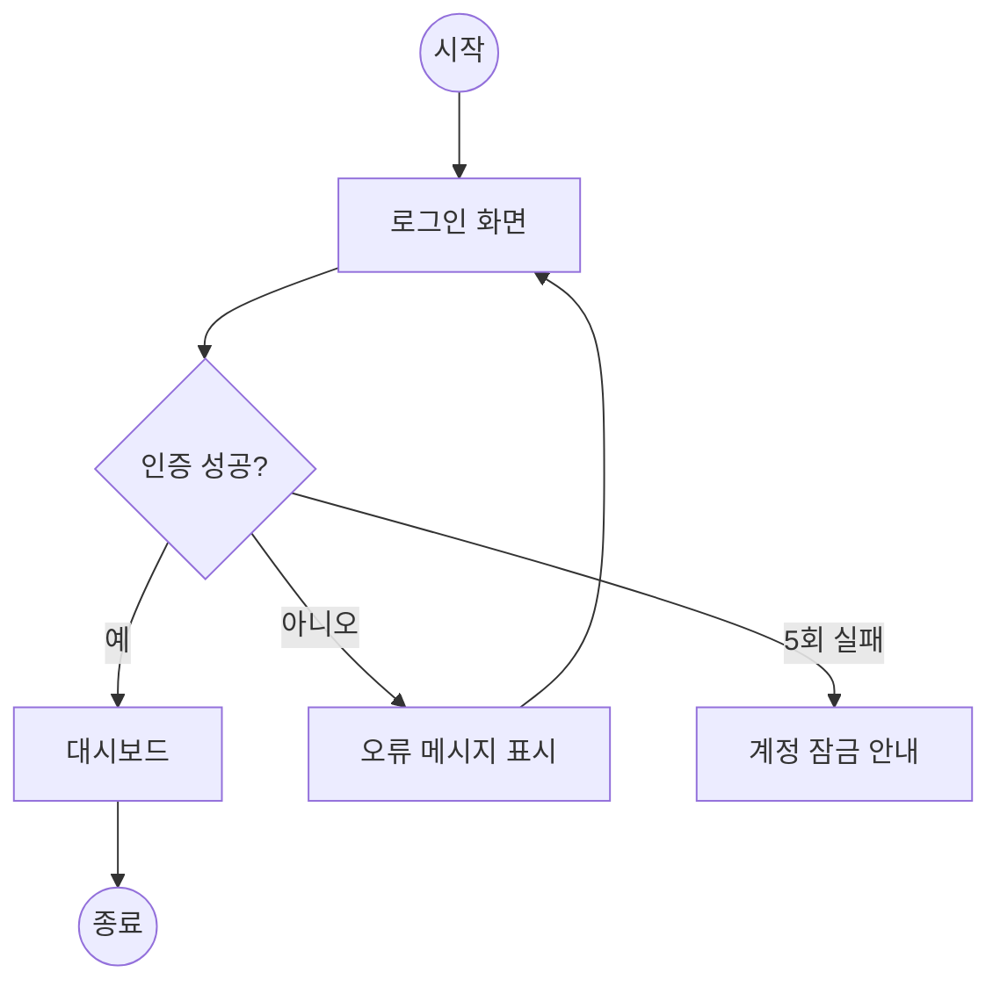
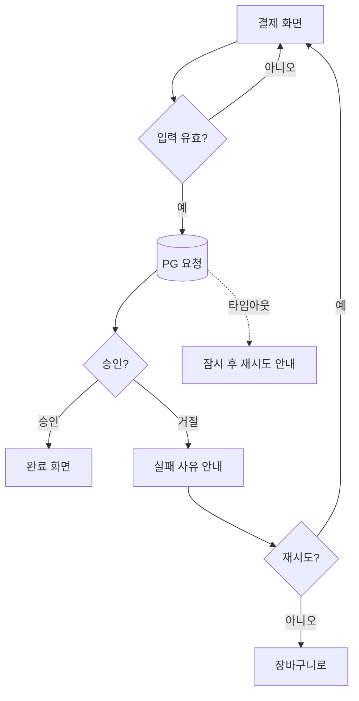

# 유저 플로우 가이드 (User Flow Guide)

Goldwiki Digital(골드위키 디지털)의 유저 플로우 설계 표준. 표기법·플로우 유형·에러/예외 경로·검증 방법을 정의하여, 화면 전환과 의사결정을 명확하게 문서화한다.

> 이 가이드를 쓰는 에이전트는 [12_USER_FLOW](../12_USER_FLOW.md)와 [InformationArchitectureGuide](InformationArchitectureGuide.md)를 먼저 참조한다. 플로우는 IA 구조 위에서 사용자의 실제 경로를 그린다.

---

## 목적

- 사용자 과업 완수 경로를 표준 표기법으로 시각화한다.
- 정상 경로(happy path)뿐 아니라 에러·예외·엣지 케이스를 빠짐없이 설계한다.
- 플로우를 화면목록·인터랙션·QA 시나리오([../QA/README](../QA/README.md))로 연결한다.

## 언제 사용하는가

| 시점 | 사용 목적 |
| --- | --- |
| 핵심 과업 설계 | 가입/결제/예약 등 전환 경로 정의 |
| IA 확정 후 | 화면 간 이동·분기 명세 |
| 와이어프레임 전 | 화면 단위 도출 근거 |
| QA 시나리오 작성 | 테스트 케이스의 출처 |

## 입력 정보

- 사이트맵·화면 목록: [InformationArchitectureGuide](InformationArchitectureGuide.md)
- 페르소나·핵심 시나리오: [UXStrategyFramework](UXStrategyFramework.md)
- 비즈니스 규칙·검증 조건(필수값, 권한, 결제 정책)
- 시스템 제약: 외부 API, 인증 방식 — [../Backend/README](../Backend/README.md)

## 처리 방식

### 표기법(Notation)
| 기호 | 의미 |
| --- | --- |
| ▭ 사각형 | 화면/페이지 |
| ◇ 마름모 | 분기(의사결정) |
| ⬭ 둥근 사각 | 시작/종료 |
| ▱ 평행사변형 | 입력/출력 데이터 |
| → 화살표 | 흐름 방향 |
| ⟂ 점선 | 시스템 처리/백그라운드 |

원칙: 한 화면 = 한 노드, 분기는 반드시 두 개 이상 출구, 모든 에러에 복구 경로.

### 플로우 유형
1. **태스크 플로우(Task Flow)**: 단일 경로, 분기 없음 — 최단 경험 점검
2. **유저 플로우(User Flow)**: 분기·조건 포함 — 표준
3. **와이어플로우(Wireflow)**: 플로우 + 와이어프레임 결합
4. **화면 플로우(Screen Flow)**: 실제 화면 썸네일 연결

### 에러·예외 경로 설계
- 입력 검증 실패(빈값/형식/중복)
- 권한 부족·세션 만료
- 네트워크/서버 오류(타임아웃, 5xx)
- 결제 실패·재시도
- 빈 상태(Empty State)·로딩·부분 실패

각 예외에 (1) 사용자 메시지 (2) 복구 행동 (3) 시스템 처리를 명시한다.

### 정상 경로 예시 (mermaid)


### 에러 경로 예시 (결제)


## 출력 산출물

| 산출물 | 형식 |
| --- | --- |
| 유저 플로우 다이어그램 | mermaid/Figma ([Templates/User_Flow](../../Templates/User_Flow.md)) |
| 화면 목록 도출 | 표 ([Templates/Screen_List](../../Templates/Screen_List.md)) |
| 분기/예외 명세 | 표 |
| QA 시나리오 시드 | 표 → [../QA/README](../QA/README.md) |

## 품질 기준

- [ ] 모든 핵심 과업에 happy path와 에러 경로가 함께 있다.
- [ ] 모든 분기가 두 개 이상 출구를 가진다(데드엔드 없음).
- [ ] 모든 에러에 사용자 메시지+복구 경로가 정의되었다.
- [ ] 플로우의 모든 화면이 화면 목록과 1:1 매칭된다.
- [ ] 빈 상태/로딩/권한 예외가 누락 없이 포함되었다.

## 체크리스트

- [ ] 표기법이 일관되게 적용되었는가
- [ ] 진입점·종료점이 명확한가
- [ ] 백그라운드 시스템 처리가 표시되었는가
- [ ] 세션 만료·권한·네트워크 예외가 포함되었는가
- [ ] 화면 목록·QA 시나리오로 연결되는가
- [ ] [12_USER_FLOW](../12_USER_FLOW.md)에 반영했는가

## 예시 프롬프트

```
역할: ux-research-lead/service-planning-lead. GoldWiki/UX/UserFlowGuide.md를 따른다.
입력: 사이트맵, 결제 비즈니스 규칙, PG 연동 사양.
작업: '구독 결제' 유저 플로우를 happy path + 에러 경로(검증/거절/타임아웃/세션만료)로 작성.
출력: mermaid 다이어그램 2개 이상, 화면 목록 표, 분기/예외 명세 표.
요구: 모든 분기 2출구, 모든 에러에 메시지+복구.
```
