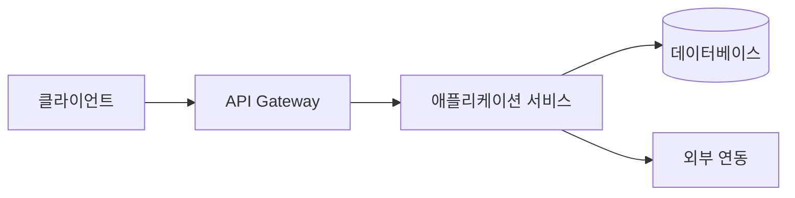
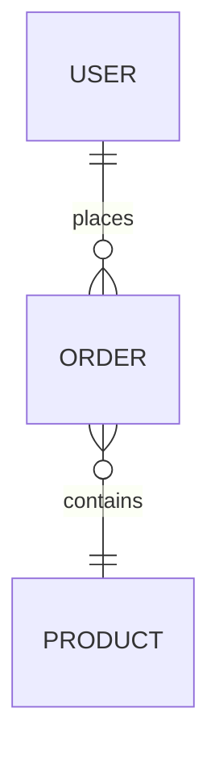

# 백엔드 계획 템플릿 (Backend Plan Template)

> **용도**: 백엔드 아키텍처·API·데이터 모델·보안·성능·배포를 정의해 서버 구현의 설계도로 삼는다.
> **사용 에이전트**: backend-lead(주), data-analytics-lead, security-risk-lead, frontend-lead.
> **선행 산출물**: [`RFP_Analysis_Template.md`](RFP_Analysis_Template.md) · [`Frontend_Plan_Template.md`](Frontend_Plan_Template.md)
> **후속 산출물**: [`QA_Checklist_Template.md`](QA_Checklist_Template.md)
> **관련 GoldWiki**: [21 백엔드 가이드](../GoldWiki/21_BACKEND_GUIDE.md) · [22 API 표준](../GoldWiki/22_API_STANDARD.md) · [23 데이터베이스 가이드](../GoldWiki/23_DATABASE_GUIDE.md) · [24 보안 가이드](../GoldWiki/24_SECURITY_GUIDE.md)

### 사용 안내
- API·데이터 모델을 **요구ID**에 매핑해 추적성을 유지한다.
- REST 표준·에러 규약·인증/인가를 먼저 고정한다.
- 보안(OWASP)·성능 비기능 요구를 명시한다.

---

## 1. 개요

| 항목 | 내용 |
|------|------|
| 사업명 | {} |
| 언어/프레임워크 | {} |
| 데이터베이스 | {} |
| 인증 방식 | {예: JWT / OAuth2} |
| 배포 환경 | {} |
| 작성자 / 작성일 | {이름} / {YYYY-MM-DD} |

---

## 2. 아키텍처

| 구성요소 | 책임 |
|----------|------|
| Gateway | {라우팅/인증} |
| 서비스 | {도메인 로직} |
| DB | {영속} |

---

## 3. API 명세 (추적)

| API ID | 메서드 | 경로 | 설명 | 대응 요구ID | 대응 화면ID | 인증 | TC-ID |
|--------|--------|------|------|-------------|-------------|------|-------|
| API-001 | GET | /products | 목록 | REQ-005 | SCR-010 | 선택 | TC-005 |
| API-002 | GET | /products/{id} | 상세 | REQ-005 | SCR-011 | 선택 | TC-005 |
| API-003 | POST | /orders | 주문 | REQ-006 | SCR-012 | 필수 | TC-006 |

### REST 규약
- 상태코드: 200/201/400/401/403/404/409/500 표준 사용.
- 오류 응답: `{ code, message, details }`.
- 페이지네이션/정렬/필터 쿼리 규약: {}

---

## 4. 데이터 모델

| 엔티티 | 주요 필드 | 관계 | 대응 요구ID |
|--------|-----------|------|-------------|
| User | id, email, role | 1:N Order | REQ-008 |
| Product | id, name, price, stock | - | REQ-005 |
| Order | id, userId, items, status | N:1 User | REQ-006 |

---

## 5. 보안

| 항목 | 정책 |
|------|------|
| 인증/인가 | {역할 기반(RBAC)} |
| 입력 검증 | {서버측 필수} |
| 민감정보 | {암호화/마스킹} |
| OWASP Top 10 | {대응 요약} |
| 감사 로그 | {} |

---

## 6. 성능 & 신뢰성

| 지표 | 목표 |
|------|------|
| 응답시간(P95) | {< N ms} |
| 동시 사용자 | {N} |
| 가용성 | {99.9%} |
| 캐시 전략 | {} |

---

## 7. 배포 & 운영

| 항목 | 내용 |
|------|------|
| 환경 | dev / staging / prod |
| CI/CD | {} |
| 모니터링 | {} |
| 백업/복구 | {} |

---

## 8. 검증 체크리스트

- [ ] 모든 API가 요구ID·화면ID에 매핑됐다.
- [ ] REST 표준/에러 규약을 따른다.
- [ ] 인증/인가·입력 검증이 정의됐다.
- [ ] 성능·가용성 목표가 측정 가능하다.
- [ ] OWASP 대응이 문서화됐다.

---

| 작성자 | {이름} | 버전 | v{1.0} | 작성일 | {YYYY-MM-DD} |
|--------|--------|------|--------|--------|---------------|
