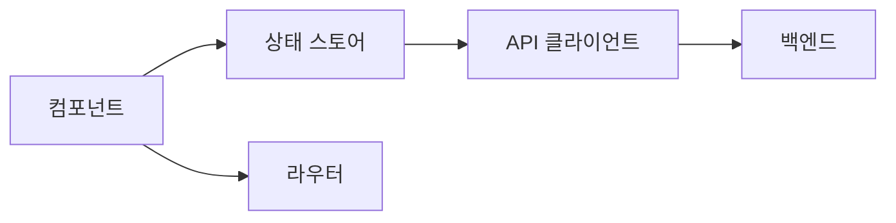

# 프론트엔드 계획 템플릿 (Frontend Plan Template)

> **용도**: 프론트엔드 아키텍처·상태관리·라우팅·컴포넌트·API 연동·성능 기준을 정의해 구현의 설계도로 삼는다.
> **사용 에이전트**: frontend-lead(주), publishing-lead, backend-lead, ui-design-lead.
> **선행 산출물**: [`Publishing_Plan_Template.md`](Publishing_Plan_Template.md) · [`DesignSystem_Template.md`](DesignSystem_Template.md)
> **후속 산출물**: [`QA_Checklist_Template.md`](QA_Checklist_Template.md)
> **관련 GoldWiki**: [프론트엔드 가이드](../GoldWiki/Frontend/FrontendGuide.md) · [19 JS 가이드](../GoldWiki/19_JS_GUIDE.md) · [20 프론트엔드 가이드](../GoldWiki/20_FRONTEND_GUIDE.md) · [22 API 표준](../GoldWiki/22_API_STANDARD.md)

### 사용 안내
- 화면ID·요구ID를 컴포넌트·API에 매핑해 추적성을 유지한다.
- 상태/라우팅/에러 처리 전략을 먼저 고정한다.
- 성능·접근성을 비기능 요구로 명시한다.

---

## 1. 개요

| 항목 | 내용 |
|------|------|
| 사업명 | {} |
| 프레임워크/언어 | {예: React + TypeScript} |
| 빌드/번들러 | {} |
| 상태관리 | {} |
| 라우팅 | {} |
| 작성자 / 작성일 | {이름} / {YYYY-MM-DD} |

---

## 2. 아키텍처

| 레이어 | 책임 | 비고 |
|--------|------|------|
| 컴포넌트 | UI 렌더 | 디자인 시스템 사용 |
| 상태 | 도메인 상태 | {} |
| API 클라이언트 | 통신/캐시 | {} |

---

## 3. 화면-컴포넌트-API 매핑 (추적)

| 화면ID | 대응 요구ID | 주요 컴포넌트 | 연동 API | 상태 |
|--------|-------------|----------------|----------|------|
| SCR-010 | REQ-005 | ProductList, Filter | GET /products | 대기 |
| SCR-011 | REQ-005 | ProductDetail | GET /products/:id | 대기 |
| SCR-012 | REQ-006 | Checkout | POST /orders | 대기 |

---

## 4. 상태 & 데이터 정책

| 항목 | 정책 |
|------|------|
| 서버 상태 캐싱 | {예: 5분 stale} |
| 폼 상태 | {} |
| 전역 상태 | {인증, 장바구니} |
| 낙관적 업데이트 | {사용 여부} |

---

## 5. 에러 & 로딩 처리

| 상황 | 처리 |
|------|------|
| API 4xx | {사용자 메시지} |
| API 5xx | {재시도/폴백} |
| 로딩 | {스켈레톤} |
| 오프라인 | {} |

---

## 6. 성능 & 품질 기준

| 지표 | 목표 |
|------|------|
| 초기 번들 | {< N KB} |
| LCP / CLS / INP | {<2.5s / <0.1 / <200ms} |
| 코드 스플리팅 | {라우트 단위} |
| 접근성 | WCAG AA |

---

## 7. 테스트 전략

| 레벨 | 도구 | 범위 |
|------|------|------|
| 단위 | {} | 컴포넌트/유틸 |
| 통합 | {} | 화면 단위 |
| E2E | {} | 핵심 FLOW-ID |

> 테스트케이스는 [`QA_Checklist_Template.md`](QA_Checklist_Template.md)의 TC-ID와 연결한다.

---

## 8. 검증 체크리스트

- [ ] 모든 화면ID가 컴포넌트·API에 매핑됐다.
- [ ] 에러/로딩/빈 상태가 구현된다.
- [ ] 성능 목표가 정의·측정된다.
- [ ] 디자인 토큰/컴포넌트를 재사용한다.

---

| 작성자 | {이름} | 버전 | v{1.0} | 작성일 | {YYYY-MM-DD} |
|--------|--------|------|--------|--------|---------------|
