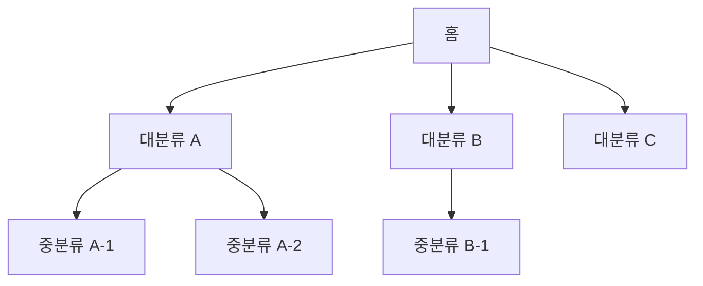

# 정보구조·사이트맵 템플릿 (IA / Sitemap)

> **용도**: 서비스의 정보 구조(메뉴 체계·페이지 계층·콘텐츠 분류)와 사이트맵, 내비게이션 규칙, URL/딥스 정책을 정의하는 설계 문서.
> **사용 에이전트**: Service Planner(주), Product Owner, UX Researcher.
> **후속 산출물**: [`User_Flow.md`](User_Flow.md), [`Screen_List.md`](Screen_List.md).
> **관련 GoldWiki**: [11 정보구조](../GoldWiki/11_INFORMATION_ARCHITECTURE.md) · [12 유저 플로우](../GoldWiki/12_USER_FLOW.md)

### 작성 팁
- **사용자 멘탈 모델 우선**: 조직도가 아니라 사용자가 찾는 방식으로 분류한다.
- **깊이는 얕게(3-click)**: 핵심 콘텐츠는 3뎁스 이내 도달을 목표로 한다.
- **분류는 MECE하게**: 메뉴는 상호 배타적·전체 포괄적으로 구성한다.
- **레이블은 사용자 언어로**: 내부 용어 대신 사용자가 이해하는 단어를 쓴다.
- 화면 목록·플로우와 ID를 일치시켜 추적성을 유지한다.

---

## 1. 개요

| 항목 | 내용 |
|------|------|
| 서비스명 | {서비스명} |
| 대상 채널 | {웹 / 모바일웹 / 앱 / 반응형} |
| 주요 사용자 | {핵심 페르소나} |
| 최대 뎁스 | {3뎁스 등} |
| 작성자 | {이름} |
| 작성일 | {YYYY-MM-DD} |

---

## 2. 사이트맵 (계층 트리)

```
홈 (1뎁스)
├─ {대분류 A} (2뎁스)
│  ├─ {중분류 A-1} (3뎁스)
│  │  └─ {상세 A-1-1} (4뎁스)
│  └─ {중분류 A-2}
├─ {대분류 B}
│  ├─ {중분류 B-1}
│  └─ {중분류 B-2}
├─ {대분류 C}
└─ {마이페이지 / 인증 영역}
   ├─ 로그인 / 회원가입
   └─ 내 정보
```

> 트리는 mermaid로도 표현 가능하다.



---

## 3. 정보구조 정의 표

> 사이트맵의 각 노드를 표로 정규화한다. 화면 목록의 화면ID와 매핑한다.

| IA ID | 뎁스 | 메뉴/페이지명 | 상위 ID | URL(경로) | 콘텐츠 설명 | 접근 권한 | 화면ID |
|-------|------|----------------|---------|-----------|-------------|-----------|--------|
| IA-001 | 1 | 홈 | - | `/` | {메인 콘텐츠} | 전체 | SCR-001 |
| IA-002 | 2 | {대분류 A} | IA-001 | `/a` | {} | 전체 | SCR-010 |
| IA-003 | 3 | {중분류 A-1} | IA-002 | `/a/a1` | {} | {로그인} | SCR-011 |
| IA-004 | 2 | 마이페이지 | IA-001 | `/my` | {} | 로그인 | SCR-050 |

---

## 4. 내비게이션 정책

| 내비게이션 | 위치 | 포함 항목 | 동작 규칙 |
|------------|------|-----------|-----------|
| 글로벌 내비(GNB) | 상단 | {대분류 A/B/C} | {호버/클릭 시 펼침} |
| 로컬 내비(LNB) | 좌측/상단 | {현재 대분류의 하위} | {현재 위치 강조} |
| 푸터 내비 | 하단 | {약관/고객센터/SNS} | {} |
| 유틸리티 | 우상단 | {검색/로그인/언어} | {} |
| 브레드크럼 | 본문 상단 | {경로 표시} | {3뎁스 이상 노출} |

---

## 5. URL 및 콘텐츠 정책

- **URL 규칙**: {소문자·하이픈 구분·의미 기반 슬러그 등}
- **다국어/지역화**: {`/ko`, `/en` 등 정책}
- **404/리다이렉트**: {정책}
- **검색/필터**: {전역 검색 범위, 파라미터 규칙}

---

## 6. 검토 체크리스트

- [ ] 핵심 콘텐츠가 3뎁스 이내에 있다
- [ ] 메뉴 분류가 MECE하다 (중복·누락 없음)
- [ ] 레이블이 사용자 언어로 작성됐다
- [ ] 모든 IA 노드가 화면ID와 매핑됐다
- [ ] 접근 권한이 정의됐다
- [ ] 모바일 내비 구조가 별도로 검토됐다

---

| 작성자 | {이름} | 검토자 | {이름} | 버전 | v{1.0} | 작성일 | {YYYY-MM-DD} |
|--------|--------|--------|--------|------|--------|--------|---------------|
