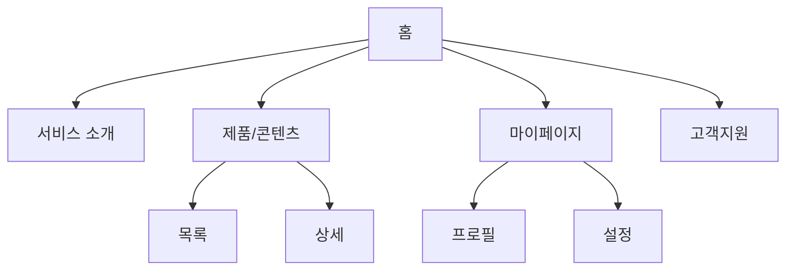

# 정보구조 템플릿 (Information Architecture Template)

> **용도**: 서비스의 정보 구조·메뉴 체계·사이트맵·내비게이션을 정의한다. 화면 목록과 유저 플로우의 토대가 된다.
> **사용 에이전트**: information-architecture-lead(주), ux-research-lead, service-planning-lead.
> **선행 산출물**: [`RFP_Analysis_Template.md`](RFP_Analysis_Template.md)
> **후속 산출물**: [`ScreenList_Template.md`](ScreenList_Template.md) · [`UserFlow_Template.md`](UserFlow_Template.md)
> **관련 GoldWiki**: [정보구조 가이드](../GoldWiki/UX/InformationArchitectureGuide.md) · [11 정보구조](../GoldWiki/11_INFORMATION_ARCHITECTURE.md)

### 사용 안내
- 메뉴 노드마다 **IA-ID**를 부여하고 대응 **화면ID**·**요구ID**를 연결한다.
- 깊이는 3뎁스 이내를 권장. 사용자 멘탈 모델과 일치시킨다.
- 명명은 사용자 언어로(내부 용어 금지).

---

## 1. 개요

| 항목 | 내용 |
|------|------|
| 서비스명 | {} |
| 대상 사용자 | {주요 페르소나} |
| 최대 깊이 | {3뎁스} |
| 작성자 / 작성일 | {이름} / {YYYY-MM-DD} |

---

## 2. 사이트맵

---

## 3. 메뉴 구조 표 (추적)

| IA-ID | 1뎁스 | 2뎁스 | 3뎁스 | 대응 화면ID | 대응 요구ID | 접근 권한 |
|-------|-------|-------|-------|-------------|-------------|-----------|
| IA-01 | 홈 | - | - | SCR-001 | REQ-001 | 전체 |
| IA-02 | 제품 | 목록 | - | SCR-010 | REQ-005 | 전체 |
| IA-03 | 제품 | 상세 | - | SCR-011 | REQ-005 | 전체 |
| IA-04 | 마이 | 프로필 | - | SCR-020 | REQ-008 | 로그인 |

---

## 4. 내비게이션 정책

| 구분 | 정책 |
|------|------|
| GNB(전역) | {노출 항목·고정 여부} |
| LNB(지역) | {} |
| 푸터 | {} |
| 브레드크럼 | {사용 여부/규칙} |
| 모바일 | {햄버거/탭바} |

---

## 5. 분류 체계 (Taxonomy)

| 분류축 | 값 예시 | 용도 |
|--------|---------|------|
| {카테고리} | {} | {필터/내비} |
| {태그} | {} | {검색} |

---

## 6. 라벨링 규칙

| 메뉴 후보 | 채택 라벨 | 사유 |
|-----------|-----------|------|
| {} | {} | {사용자 친숙도} |

---

## 7. 검증 체크리스트

- [ ] 모든 메뉴가 요구ID에 매핑되었다.
- [ ] 깊이 3뎁스 이내다.
- [ ] 고아 페이지(어디서도 못 가는 화면)가 없다.
- [ ] 라벨이 사용자 언어다.
- [ ] 권한별 노출이 정의되었다.

---

| 작성자 | {이름} | 버전 | v{1.0} | 작성일 | {YYYY-MM-DD} |
|--------|--------|------|--------|--------|---------------|
